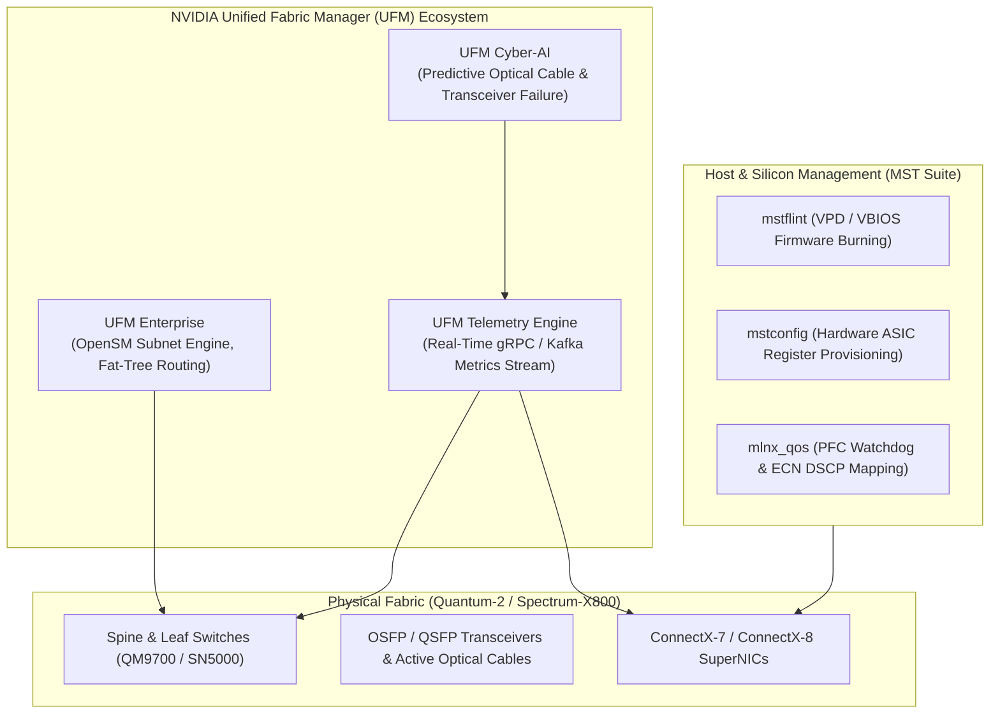

# Volume 30: Advanced Fabric Management: UFM Cyber-AI, MST & RoCE Diagnostics

```
====================================================================================================
MODULE 07: NVIDIA HARDWARE, SILICON INTERLINKS & LOW-LEVEL SYSTEMS ENGINEERING
VOLUME 30: ADVANCED FABRIC MANAGEMENT, UFM CYBER-AI, MELLANOX SOFTWARE TOOLS & ROCE
====================================================================================================
```

---

## 1. Executive Architectural Overview & Scaffolding

In hyperscale AI clusters interconnecting tens of thousands of GPUs across Quantum InfiniBand or Spectrum-X Ethernet fabrics, network degradation introduces catastrophic straggler penalties:
* **The "Slow Link" Poison**: A single optical transceiver dropping $0.01\%$ of packets due to laser diode degradation causes collective AllReduce rings to stall across all nodes. The entire cluster slows down to match the speed of the single degraded cable!
* **Silent Cable Micro-Bending & Transceiver Aging**: In high-density racks (such as GB200 NVL72 with 5,000+ twinax copper cables and thousands of optical transceivers), thermal cycles and mechanical strain degrade signal integrity long before a hard link failure triggers.
* **Firmware Configuration Drift**: Un-synchronized HCA configurations across ConnectX-7/8/9 SuperNICs (e.g., mismatched PCIe Max Read Request Size, conflicting DSCP-to-PFC mappings, or disabled PFC watchdogs) lead to silent buffer deadlocks.

The **NVIDIA Unified Fabric Manager (UFM)** suite and **Mellanox Software Tools (MST)** provide centralized subnet orchestration, predictive telemetry, and low-level ASIC hardware manipulation.



---

## 2. NVIDIA Unified Fabric Manager (UFM) Suite

### 2.1 UFM Enterprise & Subnet Management
UFM Enterprise serves as the central control plane for InfiniBand networks, orchestrating the **OpenSM (Open Subnet Manager)** engine:
* **Subnet Discovery**: Periodically scans the fabric using Subnet Management Packets (SMPs), constructing a full graph of all switches, Host Channel Adapters (HCAs), and physical cables.
* **Non-Blocking Fat-Tree Routing (`ftree`)**: Programs the Forwarding Tables (LFTs) of all switches using the `ftree` algorithm, ensuring balanced path allocation and preventing credit loops.
* **Dynamic Congestion Management (Congestion Control Agent - CCA)**: Dynamically injects Congestion Notification Packets (CNPs) to throttle offending flows before switch buffers saturate.

---

### 2.2 UFM Telemetry & Real-Time Streaming
Traditional network polling via SNMP introduces minutes of latency, completely missing microsecond AI traffic bursts.
* **UFM Telemetry**: Scrapes hardware performance counters directly from switch ASICs and HCAs at millisecond intervals via hardware registers.
* **gRPC / Prometheus Integration**: Streams metrics (`PortXmitData`, `PortXmitWait`, `PortRcvErrors`, `SymbolErrors`, buffer watermarks) into Prometheus or Kafka at up to $100\text{ Hz}$.

---

### 2.3 UFM Cyber-AI: Predictive Optical Failure
Optical transceivers do not fail instantaneously; they exhibit progressive physical degradation:
1. Laser bias current increases as the semiconductor diode ages.
2. Receiver optical power drops below the minimum sensitivity threshold ($P_{\text{rx}} < -10 \text{ dBm}$).
3. SerDes receiver symbol errors and Forward Error Correction (FEC) corrected blocks begin to rise.
4. Uncorrected frame drops trigger TCP retransmissions or InfiniBand credit stalls.

**UFM Cyber-AI** applies unsupervised machine learning algorithms to continuous telemetry streams:
* Compares optical transmission metrics ($P_{\text{tx}}, P_{\text{rx}}$, Temperature, Bias Current) against physical baseline models.
* Flags "marginal cables" and **predicts transceiver failure 48 to 72 hours before hard link drop**, allowing SREs to schedule hot-swaps during maintenance windows.

```text
PREDICTIVE OPTICAL CABLE FAILURE TIMELINE (UFM CYBER-AI):
Healthy State ────────> Laser Degradation ────────> BER Spikes ────────> HARD LINK DROP
[BER < 1e-15]           [Rx Power Drops 3dB]        [Symbol Errors > 1e-12]  [Link Flapping / XID 92]
                        ▲
                        └── UFM Cyber-AI Predictive Alert: "Replace Cable at Port 12"
```

---

## 3. Mellanox Software Tools (MST) & Hardware Provisioning

The **Mellanox Software Tools (MST)** package provides low-level PCI register manipulation, firmware burning, and diagnostic access to NVIDIA ConnectX and BlueField ASICs.

### 3.1 `mstflint` (Firmware Burning & Verification)
* Connects directly to the HCA's onboard flash memory over the PCIe bus.
* Queries hardware PSID (Parameter-Set Identification) and burns authenticated `.bin` firmware images:
  ```bash
  # Query device firmware and PSID
  mstflint -d 0000:08:00.0 q
  
  # Flash firmware image without rebooting host
  mstflint -d 0000:08:00.0 -i fw-ConnectX7.bin burn
  ```

### 3.2 `mstconfig` (Hardware Register Configuration)
Programs non-volatile EEPROM registers governing HCA hardware initialization:
* **Switching Link Protocol**: Toggles physical ports between InfiniBand and Ethernet:
  ```bash
  mstconfig -d 0000:08:00.0 set LINK_TYPE_P1=1  # 1 = InfiniBand, 2 = Ethernet
  ```
* **PCIe Performance Tuning**: Enforces optimal PCIe Max Read Request Size (4096 bytes) and SR-IOV enablement:
  ```bash
  mstconfig -d 0000:08:00.0 set SRIOV_EN=1 NUM_OF_VFS=8 MAX_READ_REQ_SZ=4096
  ```

---

## 4. RoCEv2 Quality of Service (QoS) & Deadlock Elimination

Running Remote Direct Memory Access over Converged Ethernet (RoCEv2) requires strict QoS configuration to guarantee lossless transmission without triggering **PFC Deadlocks**.

### 4.1 Priority Flow Control (PFC) & The Pause Deadlock
PFC operates at Layer 2 (802.1Qbb), sending Pause frames per priority level (typically Priority 3 for RDMA traffic) when ingress switch buffers reach a high-water mark:
* **The PFC Deadlock Hazard**: In cyclic network traffic patterns, switch $A$ pauses switch $B$, which pauses switch $C$, which pauses switch $A$. All buffers freeze, and the entire fabric deadlocks!
* **PFC Watchdog Timer (`pfc_wd_interval`)**: Hardware watchdog implemented on ConnectX ASICs and Spectrum switches. If a priority queue remains paused for longer than a configured threshold (e.g., $100\text{ ms}$), the ASIC temporarily drops incoming packets on that queue to break the deadlock and resets the link:
  ```bash
  # Configure PFC Watchdog with 100ms detection and 1000ms recovery
  mlnx_qos -i eth2 --pfc_wd 1 --pfc_wd_interval 100 --pfc_wd_recovery 1000
  ```

### 4.2 Explicit Congestion Notification (ECN) & DCQCN
To prevent PFC pause frames from ever being sent, modern AI fabrics use **Data Center Quantized Congestion Notification (DCQCN)**:
* Switches mark packets with ECN bits (CE = `11`) when queue depth exceeds a minimum threshold $K_{\min}$.
* The destination SuperNIC detects CE marks and sends a Congestion Notification Packet (CNP) back to the sender.
* The sender's hardware RoCE rate-limiter immediately throttles transmission speed.

```text
SWITCH ECN PROBABILISTIC MARKING FUNCTION:
Marking Prob P
  1.0 |                                 /------------------ (Always Mark / Send PFC)
      |                                /
P_max |                        /-------
      |                       /
  0.0 +----------------------/
      0                    K_min      K_max                Buffer Queue Depth (KB)
```

---

## 5. First-Principles Mathematics: Optical Power Loss & ECN Thresholds

### 5.1 Optical Transceiver Power Loss & Bit Error Rate
The optical link budget $\Delta P_{\text{budget}}$ in decibels (dB) is:
$$\Delta P_{\text{budget}} = P_{\text{tx}} - P_{\text{rx\_sensitivity}} \quad [\text{dB}]$$
The physical Bit Error Rate (BER) of a PAM4 optical link degrades exponentially as received power drops:
$$\text{BER} \approx \frac{1}{2} \text{erfc}\left( \frac{\text{SNR}}{2\sqrt{2}} \right)$$
For every $1\text{ dB}$ of optical attenuation caused by dirty connectors or fiber micro-bending, the Signal-to-Noise Ratio ($\text{SNR}$) drops, increasing the symbol error rate by **up to two orders of magnitude**!

### 5.2 DCQCN ECN Threshold Sizing Formula
To prevent Priority Flow Control (PFC) pause frames from ever firing while maintaining line-rate throughput, the switch ECN thresholds ($K_{\min}, K_{\max}$) must be sized relative to the Round-Trip Time (RTT) and line speed $C$:
$$K_{\min} \ge \frac{C \times \text{RTT}}{2}$$
$$K_{\max} \ge 3 \times K_{\min}$$
$$\text{PFC High-Water Mark} > K_{\max} + C \times \text{RTT}$$
This guarantees that sender throttling takes effect before switch buffers cross the PFC generation threshold.

---

## 6. Concrete Production Lab: Automated Transceiver Audit & MST Tuning

### 6.1 Transceiver Laser Health & UFM Metric Analyzer
Save this script as `transceiver_laser_auditor.py`:

```python
#!/usr/bin/env python3
"""
Optical Transceiver Laser Health & Predictive SRE Auditor
Analyzes optical power levels, bias currents, and predicts link degradation.
"""

from dataclasses import dataclass
from typing import List, Dict, Any

@dataclass
class OpticalTransceiverSpec:
    port: str
    tx_power_dbm: float
    rx_power_dbm: float
    laser_bias_ma: float
    temperature_c: float
    symbol_errors: int

# Optical Thresholds for 400G / 800G OSFP Transceivers
RX_POWER_CRIT_DBM = -10.0 # Under -10 dBm indicates severe fiber degradation
RX_POWER_WARN_DBM = -7.0
TEMP_CRIT_C = 70.0

SAMPLE_OPTICS = [
    OpticalTransceiverSpec("OSFP_Port_01", -0.5, -2.1, 45.0, 48.2, 0),
    OpticalTransceiverSpec("OSFP_Port_02", -0.6, -6.8, 52.0, 55.4, 120),
    OpticalTransceiverSpec("OSFP_Port_03", -0.4, -11.2, 78.0, 72.1, 450_000), # Failing!
]

def audit_transceiver(spec: OpticalTransceiverSpec) -> Dict[str, Any]:
    """Audit single optical transceiver against physical degradation thresholds."""
    status = "HEALTHY"
    recommendations = []
    
    if spec.rx_power_dbm <= RX_POWER_CRIT_DBM:
        status = "CRITICAL"
        recommendations.append("Severe optical attenuation! Clean fiber endface or replace transceiver.")
    elif spec.rx_power_dbm <= RX_POWER_WARN_DBM:
        status = "WARNING"
        recommendations.append("Elevated optical loss. Inspect fiber bend radius.")
        
    if spec.temperature_c >= TEMP_CRIT_C:
        status = "CRITICAL"
        recommendations.append(f"Thermal emergency ({spec.temperature_c}°C)! Check rack air flow / CDU cooling.")
        
    if spec.symbol_errors > 50_000:
        status = "CRITICAL"
        recommendations.append(f"Excessive symbol errors ({spec.symbol_errors}). SerDes receiver eye is closing.")
        
    return {
        "port": spec.port,
        "status": status,
        "rx_power_dbm": spec.rx_power_dbm,
        "laser_bias_ma": spec.laser_bias_ma,
        "temperature_c": spec.temperature_c,
        "symbol_errors": spec.symbol_errors,
        "recommendations": recommendations
    }

if __name__ == "__main__":
    print("=" * 85)
    print("OPTICAL TRANSCEIVER LASER HEALTH & PREDICTIVE SRE AUDIT")
    print("=" * 85)
    
    for optic in SAMPLE_OPTICS:
        res = audit_transceiver(optic)
        icon = "🟢" if res["status"] == "HEALTHY" else ("🟡" if res["status"] == "WARNING" else "🔴")
        print(f"\n{icon} Port: {res['port']} | Status: {res['status']}")
        print(f" • Optical Rx Power  : {res['rx_power_dbm']} dBm")
        print(f" • Laser Bias Current: {res['laser_bias_ma']} mA")
        print(f" • Operating Temp    : {res['temperature_c']} °C")
        print(f" • Symbol Errors     : {res['symbol_errors']:,}")
        if res["recommendations"]:
            print(" ⚠️ Action Plan:")
            for rec in res["recommendations"]:
                print(f"    [-] {rec}")
```

---

## 7. Multi-Dimensional Correlation & Troubleshooting

```text
┌─────────────────────────────┬───────────────────────────────┬─────────────────────────────────────────────────────────┐
│ Failure Signature           │ Root Cause Layer              │ Diagnostic Triage & SRE Remediation Command             │
├─────────────────────────────┼───────────────────────────────┼─────────────────────────────────────────────────────────┤
│ Distributed training stalls │ RoCE PFC Deadlock occurring   │ Inspect PFC pause frame counters and watchdog trips:    │
│ with zero network traffic   │ across cyclic buffer queues   │ $ ethtool -S <eth> | grep -E "prio_pause|watchdog"      │
│                             │                               │ Enable watchdog: $ mlnx_qos -i <eth> --pfc_wd 1         │
├─────────────────────────────┼───────────────────────────────┼─────────────────────────────────────────────────────────┤
│ High Symbol Error Counter   │ Dirty optical fiber connector │ Query physical layer eye diagnostics:                   │
│ on InfiniBand switch port   │ or failing laser diode        │ $ perfquery -C mlx5_0 -p 1 -r                           │
│                             │                               │ Clean connector endface with one-click MPO cleaner.     │
├─────────────────────────────┼───────────────────────────────┼─────────────────────────────────────────────────────────┤
│ ConnectX-7 SuperNIC         │ Mismatched max read request   │ Inspect and enforce 4096-byte PCIe read requests:       │
│ throughput capped at 250Gb/s│ or PCIe Gen 4 fallback        │ $ lspci -vvv -s <pci_id> | grep -i MaxReadReq           │
│                             │                               │ Tune via mstconfig: $ mstconfig -d <pci> set ...        │
├─────────────────────────────┼───────────────────────────────┼─────────────────────────────────────────────────────────┤
│ UFM reports credit loop     │ Invalid topology cabling or   │ Run UFM topology validation:                            │
│ on fat-tree spine switches  │ desynchronized LFT tables     │ $ ibdiagnet -r --fat_tree                               │
│                             │                               │ Re-route subnet: $ systemctl restart opensm             │
└─────────────────────────────┴───────────────────────────────┴─────────────────────────────────────────────────────────┘
```

---

## 8. Summary & Technical Takeaways

1. **Centralized Fabric Visibility**: NVIDIA UFM Enterprise and UFM Telemetry transform black-box InfiniBand fabrics into transparent, streaming-telemetry networks capable of line-rate anomaly detection.
2. **Predictive Failure Detection with Cyber-AI**: Monitoring optical power budgets, bias currents, and symbol error trends enables predicting transceiver failures days before an abrupt link drop disrupts training.
3. **Hardware-Level Provisioning with MST**: `mstflint` and `mstconfig` configure low-level ASIC registers, PCIe parameters, and protocol personalities directly in non-volatile flash.
4. **Deadlock-Free Lossless Ethernet**: Robust RoCEv2 deployments balance **DCQCN ECN marking** to throttle senders before buffers saturate, backed by **PFC Watchdog timers** to break catastrophic cyclic buffer deadlocks.
