# NVIDIA Hardware, Silicon Interlinks & Low-Level Systems Engineering Curriculum

Welcome to the **NVIDIA Hardware, Silicon Interlinks & Low-Level Systems Engineering Curriculum** engineered for hardware architects, high-performance computing (HPC) practitioners, and large-scale AI infrastructure engineers operating modern accelerated platforms (from DGX H100 to Grace Blackwell GB10, GB200 NVL72, and Vera Rubin).

This curriculum bridges the critical gap between high-level AI frameworks and physical silicon, analyzing how transistors, coherent buses, kernel modules, firmware, and network switches physically interlink to execute distributed workloads at exascale.

---

## 🗺️ Master Curriculum Architecture

```mermaid
graph TD
    subgraph Part1["Part I: Silicon Microarchitectures & Heterogeneous Compute (01–05)"]
        N01["01. Silicon Packaging, CoWoS-L & NV-HBI Interconnect"]
        N02["02. SM Microarchitecture, Warp Schedulers & Tensor Cores"]
        N03["03. Memory Subsystem: TMA, Cache Crossbars & HBM3e/HBM4"]
        N04["04. Micro-Precision Math & Transformer Engines (FP4/FP8)"]
        N05["05. Host Processors & NVLink-C2C Heterogeneous Superchips"]
    end

    subgraph Part2["Part II: Linux Kernel Drivers, Firmware & Memory Subsystems (06–10)"]
        N06["06. Open GPU Kernel Drivers (nvidia.ko) & GSP Firmware"]
        N07["07. Unified Virtual Memory (UVM), ATS & Hardware Page Faults"]
        N08["08. CUDA Driver API vs Runtime API Execution Lifecycles"]
        N09["09. Low-Level System Telemetry with nvidia-smi & NVML"]
        N10["10. Hardware Slicing: MIG, vGPU & Multi-Tenant Isolation"]
    end

    subgraph Part3["Part III: CUDA Toolchain, Code Generation & Microprofiling (11–15)"]
        N11["11. CUDA Toolchain: nvcc, PTX Virtual ISA & SASS Disassembly"]
        N12["12. Dynamic Memory Debugging with compute-sanitizer"]
        N13["13. System-Wide Timeline Tracing with Nsight Systems (nsys)"]
        N14["14. SM Microarchitectural Profiling with Nsight Compute (ncu)"]
        N15["15. High-Performance GEMM Engines: CUTLASS 3.x & cuBLASLt"]
    end

    subgraph Part4["Part IV: Scale-Up & Scale-Out Interconnect Fabrics (16–20)"]
        N16["16. NVLink Signaling (PAM4) & NVSwitch Silicon Generations"]
        N17["17. NVSwitch Fabric Manager & Rack Topologies (NVL72 Spine)"]
        N18["18. Scale-Out Networks: Quantum InfiniBand vs Spectrum-X RoCE"]
        N19["19. Direct Memory Pipelines: GPUDirect RDMA, Storage & P2P"]
        N20["20. NCCL Collectives (Ring, Tree, NVLS) & nccl-tests Tuning"]
    end

    subgraph Part5["Part V: Datacenter Engineering, SRE & Diagnostic Forensics (21–25)"]
        N21["21. DPUs & SmartNICs: BlueField-3/4 Architecture & DOCA SDK"]
        N22["22. Datacenter Infrastructure: 54V Busbars & Direct Liquid Cooling"]
        N23["23. Data Center GPU Manager (DCGM) & Production Monitoring"]
        N24["24. Hardware Diagnostics (NVVS) & Kernel XID Error Forensics"]
        N25["25. Fabric Diagnostics (ibdiagnet, perfquery) & Cluster Playbook"]
    end

    subgraph Part6["Part VI: Inference Engines, Distributed Training & Orchestration (26–30)"]
        N26["26. Inference Engines: TensorRT, TensorRT-LLM & RAPIDS Suite"]
        N27["27. Distributed Training: Megatron-Core 3D Parallelisms & NeMo"]
        N28["28. Serving Microservices: Triton Architecture & NVIDIA NIM"]
        N29["29. Cloud-Native Orchestration: GPU Operator, Network Op & BCM"]
        N30["30. Advanced Fabric Management: UFM Cyber-AI, MST & RoCE"]
    end

    Part1 --> Part2
    Part2 --> Part3
    Part3 --> Part4
    Part4 --> Part5
    Part5 --> Part6
```



---

## 🔬 Multi-Dimensional Architecture Correlation Matrix

Operating and debugging NVIDIA AI infrastructure requires correlating telemetry and state across four distinct dimensions simultaneously. When an application stalls or a node fails, the root cause rarely exists in one isolated layer:

```text
+-------------------------------------------------------------------------------------------------------------+
|                                4-DIMENSIONAL SYSTEM CORRELATION MATRIX                                      |
+---------------------+-----------------------+-------------------------+-------------------------------------+
| 1. Compute & SASS   | 2. Interconnects      | 3. Electrical & Thermal | 4. Kernel, Memory & OS              |
+---------------------+-----------------------+-------------------------+-------------------------------------+
| • FP4 / FP8 GEMM    | • NV-HBI (10 TB/s)    | • 415V 3-Phase AC Feed  | • nvidia.ko IOCTL Command Buffers   |
| • Warp Schedulers   | • NVLink-C2C (900GB/s)| • 54V DC Solid Busbar   | • nvidia-uvm.ko Page Fault Engine   |
| • Register Spills   | • NVLink 5 (1.8 TB/s) | • PoL Direct VRMs       | • ATS / PASID Hardware Coherency    |
| • TMA Async Copies  | • NVSwitch 4 Crossbar | • Micro-Throttling (di/dt)|• nvidia-peermem.ko RDMA Verbs     |
| • SMem Bank Conflict| • NDR/XDR InfiniBand  | • Direct Cold Plates    | • GSP RISC-V Firmware Loop          |
| • SOL Roofline Cap  | • RoCEv2 (ECN/PFC)    | • In-Rack CDU (PG25)    | • Fabric Manager Routing Daemons    |
+---------------------+-----------------------+-------------------------+-------------------------------------+
```

### Cross-Layer Failure Signatures & Multi-Dimensional Root Causes:
1. **The Sudden Di/Dt Step-Load Failure**:
   * *Compute Layer*: A large dense FP4 matrix multiplication kernel launches across all SMs simultaneously.
   * *Electrical Layer*: Current demand spikes from 150 Amps to 1,200 Amps in nanoseconds. PoL voltage regulators experience transient ripple; voltage drops below minimum operating threshold ($V_{\min}$).
   * *Kernel Layer*: The GPU falls off the bus; the host kernel emits **XID 79** (`GPU has fallen off the bus`).
   * *Diagnostic Confirmation*: `dmesg -T` logs XID 79; DCGM power metrics show sudden drop; BMC shows power rail under-voltage trip.

2. **The Distributed AllReduce Bubble**:
   * *Software Layer*: Distributed training stalls with `NCCL WARN: Call to connect returned Connection timed out`.
   * *Fabric Layer*: An optical transceiver in an inter-switch trunk experiences thermal degradation, introducing SerDes bit errors and packet drops.
   * *Protocol Layer*: RoCEv2 Priority Flow Control (PFC) generates a continuous stream of Pause Frames upstream to prevent loss, creating a **PFC Pause Storm** that deadlocks the entire network rail.
   * *Diagnostic Confirmation*: `perfquery` shows spiking `PortXmitWait` and `PortRcvErrors`; `mlnx_qos` reports pause duration saturation; `nsys` profile reveals long empty bubbles preceding collective calls.

3. **UVM Thrashing & Page Fault Latency**:
   * *Software Layer*: CUDA kernel execution time degrades by $20\times$ unexpectedly.
   * *Memory Layer*: Tensors exceed local HBM; memory access hits pages allocated in Grace CPU LPDDR5X.
   * *Kernel Layer*: `nvidia-uvm.ko` handles thousands of hardware page faults per millisecond over NVLink-C2C, context-switching the kernel and causing page table lock contention.
   * *Diagnostic Confirmation*: `dcgmi profile` shows near-zero SM compute throughput with massive NVLink-C2C read bandwidth; `compute-sanitizer` highlights un-prefetched shared pointers.

---

## 📚 Complete 30-Volume Curriculum Index

Every volume strictly satisfies the **8-Layer Pedagogical Masterclass Standard**: Target Audience & Scaffolding, Zero-to-One Foundational Intuition, Evolutionary Lineage, First-Principles Mathematics, Comparative Trade-Off Matrices, Concrete Production Labs, Hardware Grounding, and Hands-On Exercises with Solutions.

### Part I: Silicon Microarchitectures & Heterogeneous Compute (Volumes 01–05)
- [**Volume 01: Silicon Packaging, CoWoS-L & NV-HBI Interconnect**](01-silicon-fabrication-packaging-and-cross-die-interlinking.md) — TSMC 4N/4NP/3nm lithography, 814 mm² reticle limits, CoWoS-L packaging, silicon interposer bridges, and 10 TB/s cross-die NV-HBI.
- [**Volume 02: SM Microarchitecture, Warp Schedulers & Tensor Cores**](02-sm-microarchitecture-warp-schedulers-and-tensor-cores.md) — SM sub-core partitions, warp scheduling mechanics, register file banking, 4th/5th Gen Tensor Cores, and DPX dynamic programming instructions.
- [**Volume 03: Memory Subsystem: TMA, Cache Crossbars & HBM3e/HBM4**](03-memory-subsystem-tma-cache-crossbars-and-hbm.md) — Tensor Memory Accelerator (TMA) 1D–5D async pipelines, configurable L1/Shared Memory (228 KB), 50 MB L2 crossbar, and 5120-bit/8192-bit HBM subsystems.
- [**Volume 04: Micro-Precision Math & Transformer Engines (FP4/FP8)**](04-micro-precision-math-and-transformer-engines.md) — NVFP4 (E2M1 micro-blocks), FP8 (E4M3/E5M2), dynamic format switching, delayed scaling amax history, and Blackwell compute ceilings.
- [**Volume 05: Host Processors & NVLink-C2C Heterogeneous Superchips**](05-host-processors-and-nvlink-c2c-superchips.md) — Grace CPU (72 ARM Neoverse V2 cores, SVE2, SCF fabric), Vera CPU, and NVLink-C2C 900 GB/s cache-coherent unified physical memory space.

### Part II: Linux Kernel Drivers, Firmware & Memory Subsystems (Volumes 06–10)
- [**Volume 06: Open GPU Kernel Drivers (nvidia.ko) & GSP Firmware**](06-open-gpu-kernel-drivers-and-gsp-firmware.md) — Kernel modules (`nvidia.ko`, `nvidia-modeset.ko`), IOCTL interfaces, and GSP RISC-V firmware execution loops.
- [**Volume 07: Unified Virtual Memory (UVM), ATS & Hardware Page Faults**](07-unified-virtual-memory-uvm-and-page-faults.md) — `nvidia-uvm.ko` page table management, PCIe ATS/PASID, HMM (Heterogeneous Memory Management), and page eviction/prefetch engines.
- [**Volume 08: CUDA Driver API vs Runtime API Execution Lifecycles**](08-cuda-driver-api-vs-runtime-api-execution-lifecycles.md) — `libcuda.so.1` vs `libcudart.so`, context initialization, module loading, virtual memory management, and container isolation boundaries.
- [**Volume 09: Low-Level System Telemetry with nvidia-smi & NVML**](09-low-level-system-telemetry-nvidia-smi-and-nvml.md) — XML system dumps (`-q -x`), GPU query formatting, power capping (`-pl`), application clock locking (`-lgc`), and Python NVML C-bindings.
- [**Volume 10: Hardware Slicing: MIG, vGPU & Multi-Tenant Isolation**](10-hardware-slicing-mig-vgpu-and-multi-tenancy.md) — Multi-Instance GPU (MIG) hardware partitioning (SMs, memory controllers, crossbar paths), GPU instances (GI), compute instances (CI), and Run:ai scheduling.

### Part III: CUDA Toolchain, Code Generation & Microprofiling (Volumes 11–15)
- [**Volume 11: CUDA Toolchain: nvcc, PTX Virtual ISA & SASS Disassembly**](11-cuda-compilation-pipeline-nvcc-ptx-and-sass.md) — Host/device split compilation, PTX virtual intermediate representation, SASS native machine code disassembly with `cuobjdump` and `nvdisasm`.
- [**Volume 12: Dynamic Memory Debugging with compute-sanitizer**](12-dynamic-memory-debugging-with-compute-sanitizer.md) — Detecting out-of-bounds accesses (`memcheck`), shared memory race hazards (`racecheck`), barrier synchronization faults (`synccheck`), and uninitialized memory (`initcheck`).
- [**Volume 13: System-Wide Timeline Tracing with Nsight Systems (nsys)**](13-system-wide-timeline-tracing-with-nsight-systems.md) — Multi-threaded host/device timeline tracing, CUDA stream scheduling, memory transfer overlaps, and NCCL communication bubble analysis.
- [**Volume 14: SM Microarchitectural Profiling with Nsight Compute (ncu)**](14-sm-microarchitectural-profiling-with-nsight-compute.md) — Roofline model (Speed-of-Light), warp stall taxonomy (`stall_memory_throttle`, `stall_barrier`), register pressure, and shared memory bank conflicts.
- [**Volume 15: High-Performance GEMM Engines: CUTLASS 3.x & cuBLASLt**](15-high-performance-gemm-engines-cutlass-and-cublaslt.md) — CUTLASS 3.x C++ template primitives, warp-specialized persistent kernels, asynchronous TMA copy pipelines, and epilogue fusion (SwiGLU, GELU).

### Part IV: Scale-Up & Scale-Out Interconnect Fabrics (Volumes 16–20)
- [**Volume 16: NVLink Signaling (PAM4) & NVSwitch Silicon Generations**](16-nvlink-signaling-and-nvswitch-silicon-generations.md) — Differential SerDes signaling (112G/224G PAM4), NVSwitch 3/4/6 silicon crossbars, and SHARP in-network hardware reduction offload.
- [**Volume 17: NVSwitch Fabric Manager & Rack Topologies (NVL72 Spine)**](17-nvswitch-fabric-manager-and-rack-topologies.md) — `nvidia-fabricmanager` daemon topology discovery, HGX 8-GPU baseboard meshes, and GB200 NVL72 blind-mate copper backplane spines.
- [**Volume 18: Scale-Out Networks: Quantum InfiniBand vs Spectrum-X RoCE**](18-scale-out-networks-quantum-infiniband-vs-spectrum-x.md) — Quantum-2/X800 credit-based flow control vs Spectrum-4/X800 RoCEv2 (Dynamic Packet Spraying, PFC, ECN, DCQCN, and packet reordering buffers).
- [**Volume 19: Direct Memory Pipelines: GPUDirect RDMA, Storage & P2P**](19-direct-memory-pipelines-gpudirect-rdma-storage-p2p.md) — `nvidia-peermem.ko` driver translation, PCIe/NVLink P2P bus transfers, and GPUDirect Storage (GDS) with `cuFile` kernel-bypass I/O.
- [**Volume 20: NCCL Collectives (Ring, Tree, NVLS) & nccl-tests Tuning**](20-nccl-collectives-and-nccl-tests-tuning.md) — AllReduce/AllGather algorithm selection (Ring vs Tree vs NVLink SHARP), environment variable tuning (`NCCL_BUFFSIZE`, `NCCL_NET_GDR_LEVEL`), and `nccl-tests` benchmarking.

### Part V: Datacenter Engineering, SRE & Diagnostic Forensics (Volumes 21–25)
- [**Volume 21: DPUs & SmartNICs: BlueField-3/4 Architecture & DOCA SDK**](21-dpus-and-smartnics-bluefield-and-doca-sdk.md) — BlueField-3/4 compute/networking subsystems, DOCA Flow match-action acceleration, DOCA GPUNetIO, and virtual NVMe-oF SNAP target emulation.
- [**Volume 22: Datacenter Infrastructure: 54V Busbars & Direct Liquid Cooling**](22-datacenter-infrastructure-54v-busbars-and-liquid-cooling.md) — Facility 415V/480V 3-phase AC distribution, 54V DC solid copper busbars, Point-of-Load VRMs, transient micro-throttling, direct-to-chip cold plates, and CDUs.
- [**Volume 23: Data Center GPU Manager (DCGM) & Production Monitoring**](23-data-center-gpu-manager-dcgm-and-monitoring.md) — Background `nv-hostengine` daemon, `dcgmi` client commands, policy alerts, and Prometheus `dcgm-exporter` integration with Grafana.
- [**Volume 24: Hardware Diagnostics (NVVS) & Kernel XID Error Forensics**](24-hardware-diagnostics-nvvs-and-kernel-xid-forensics.md) — NVIDIA Validation Suite (NVVS) levels 1 to 4 burn-in, forensic root-cause analysis for XID 31, 43, 45, 62, 79, and 92, and silent data corruption (SDC) memory scrubbing.
- [**Volume 25: Fabric Diagnostics (ibdiagnet, perfquery) & Cluster Playbook**](25-fabric-diagnostics-and-cluster-recovery-playbook.md) — InfiniBand diagnostic toolkit (`ibstat`, `ibdiagnet -r`, `perfquery`), RoCE inspection (`ethtool`, `mlnx_qos`), and automated node drain/cordon remediation runbooks.

### Part VI: Inference Engines, Distributed Training & Orchestration (Volumes 26–30)
- [**Volume 26: Inference Engines: TensorRT, TensorRT-LLM & RAPIDS Suite**](26-inference-engines-tensorrt-and-tensorrt-llm.md) — AOT/JIT graph fusion, TensorRT-LLM In-Flight Batching, PagedAttention KV-cache management, W4A4 NVFP4 micro-block scaling, Medusa/Eagle speculative decoding, and RAPIDS cuDF/cuGraph.
- [**Volume 27: Distributed Training: Megatron-Core 3D Parallelisms & NeMo**](27-distributed-training-megatron-core-and-parallelisms.md) — 5D Parallelism hierarchy (TP, PP 1F1B bubble mechanics, ZeRO-1/2/3 state sharding, Sequence/Context Ring Attention, MoE Expert Parallelism), and Selective Activation Checkpointing.
- [**Volume 28: Serving Microservices: Triton Architecture & NVIDIA NIM**](28-serving-microservices-triton-and-nvidia-nim.md) — Triton multi-backend C++ architecture, Dynamic Batching priority queues (`max_queue_delay`), Business Logic Scripting (BLS), and NVIDIA NIM OCI container runtime architecture.
- [**Volume 29: Cloud-Native Orchestration: GPU Operator, Network Op & BCM**](29-cloud-native-orchestration-gpu-network-operators-and-bcm.md) — Kubernetes GPU Operator, Container Device Interface (CDI), Network Operator (MOFED, SR-IOV, Multus secondary RDMA), and Base Command Manager (BCM) bare-metal PXE and Slurm topology orchestration.
- [**Volume 30: Advanced Fabric Management: UFM Cyber-AI, MST & RoCE**](30-advanced-fabric-management-ufm-cyber-ai-and-mst.md) — NVIDIA UFM Enterprise fat-tree subnet routing, UFM Cyber-AI predictive optical cable degradation, Mellanox Software Tools (`mstflint`, `mstconfig`), and RoCEv2 DCQCN ECN marking and PFC watchdog deadlocks.

---

## 🛠️ Low-Level Hands-On Diagnostic Command Matrix

| Domain | CLI Tool / Binary | Key Flags & Syntaxes | Diagnostic Purpose & Signature |
| :--- | :--- | :--- | :--- |
| **Kernel & Hardware** | `nvidia-smi` | `nvidia-smi -q -x`<br>`nvidia-smi -pm 1 -pl <watts>`<br>`nvidia-smi -lgc <mhz>` | Complete XML machine dump, enforce persistence daemon, cap TDP power limits, lock application clocks to eliminate dynamic clock throttling. |
| **Driver & Modules** | `lsmod`, `modinfo` | `lsmod \| grep -E "nvidia\|nv_peer"`<br>`modinfo nvidia` | Verify active kernel modules (`nvidia.ko`, `nvidia-uvm.ko`, `nvidia-peermem.ko`) and confirm Open vs Proprietary driver version. |
| **System Event Log** | `dmesg` | `dmesg -T \| grep -E "NVRM: Xid\|page fault"` | Identify hardware trips, kernel page faults, uncorrectable SRAM errors, and GPU bus dropouts with millisecond timestamps. |
| **Assembly & Code** | `cuobjdump` | `cuobjdump -ptx <binary>`<br>`cuobjdump -sass <binary>` | Extract intermediate PTX virtual instructions and disassemble native SASS hardware instructions to verify register allocation and instruction choice. |
| **Memory Bounds** | `compute-sanitizer` | `compute-sanitizer --tool memcheck <bin>`<br>`--tool racecheck` | Dynamic instrumentation catching out-of-bounds reads/writes, misaligned pointers, and shared memory race hazards. |
| **System Profiler** | `nsys` | `nsys profile --trace=cuda,nvtx,osrt -o out <cmd>` | Capture full host-device CPU/GPU timeline, CUDA streams, memory transfers, and NCCL communication bubbles. |
| **SM Microprofiler**| `ncu` | `ncu --set full --target-processes all -o out <cmd>` | Microarchitectural SM profiling: compute/memory roofline, warp stall reasons, register spills, and SMem bank conflicts. |
| **Fabric Daemon** | `systemctl` | `systemctl status nvidia-fabricmanager` | Verify NVSwitch routing table daemon. If inactive on multi-GPU HGX/NVL nodes, cross-GPU NVLink transfers fail. |
| **NVLink Status** | `nvidia-smi nvlink` | `nvidia-smi nvlink -s`<br>`nvidia-smi nvlink -e` | Inspect physical NVLink port connection speeds and hardware CRC error / replay counters per link. |
| **Cluster Telemetry**| `dcgmi` | `dcgmi health -c`<br>`dcgmi diag -r 1\|2\|3\|4` | Run background health checks and execute Level 1 (sanity) through Level 4 (extended thermal/memory stress) NVVS burn-in tests. |
| **InfiniBand Port** | `ibstat`, `perfquery` | `ibstat`<br>`perfquery -C <hca> -p <port> -r` | Inspect physical HCA link status (NDR/XDR link speeds) and query/clear hardware error counters (`PortXmitWait`, `PortRcvErrors`). |
| **Fabric Health** | `ibdiagnet` | `ibdiagnet -r` | Fabric-wide network scan: generates `ibdiagnet2.net_dump` and `ibdiagnet2.log` mapping credit loops, symbol errors, and link flaps. |
| **AI Ethernet RoCE**| `mlnx_qos`, `ethtool` | `mlnx_qos -i <interface>`<br>`ethtool -S <interface> \| grep -E "prio\|drop"` | Inspect DSCP-to-PFC queue mappings and query hardware SerDes line-rate frame drops and pause frame duration counters. |
| **Collectives Test** | `nccl-tests` | `NCCL_DEBUG=INFO ./all_reduce_perf -b 1G -e 8G -g 8` | Measure actual collective bus bandwidth ($GB/s$), verify GPUDirect RDMA engagement, and detect multi-node stragglers. |

---

## ⚡ Master Troubleshooting & Failure Recovery Matrix

```text
 ┌───────────────────────┬──────────────────────────────┬────────────────────────────────────────────────────────┐
 │ Error / Metric        │ Probable Root Cause          │ Low-Level Forensic Triage & Remediation Command        │
 ├───────────────────────┼──────────────────────────────┼────────────────────────────────────────────────────────┤
 │ XID 31 (Page Fault)   │ Invalid pointer dereference  │ Run under dynamic instrumentation:                     │
 │                       │ or out-of-bounds array read  │ $ compute-sanitizer --tool memcheck ./app             │
 ├───────────────────────┼──────────────────────────────┼────────────────────────────────────────────────────────┤
 │ XID 62 (Internal SRAM)│ Uncorrectable double-bit     │ Inspect ECC uncorrectable error counters:              │
 │                       │ hardware parity error        │ $ nvidia-smi -q -d ECC                                 │
 │                       │                              │ Run Level 3 validation: $ dcgmi diag -r 3 (Replace GPU)│
 ├───────────────────────┼──────────────────────────────┼────────────────────────────────────────────────────────┤
 │ XID 79 (Fell Off Bus) │ Transient voltage drop on    │ Inspect PCIe link status and power telemetry:          │
 │                       │ 54V rail or thermal trip     │ $ lspci -vvv -s <pci_id>                               │
 │                       │                              │ $ ipmitool sensor \| grep -E "GPU\|54V"                │
 ├───────────────────────┼──────────────────────────────┼────────────────────────────────────────────────────────┤
 │ XID 92 (NVLink Error) │ SerDes bit error rate spike  │ Check NVLink hardware replay and error counters:       │
 │                       │ or lose SerDes lock          │ $ nvidia-smi nvlink -e                                 │
 │                       │                              │ Restart fabric manager: $ systemctl restart nvidia-fm  │
 ├───────────────────────┼──────────────────────────────┼────────────────────────────────────────────────────────┤
 │ RoCE PFC Pause Storm  │ Packet drop on congested link│ Query priority pause frame saturation:                 │
 │                       │ triggering upstream deadlock │ $ ethtool -S <interface> \| grep rx_prio_pause         │
 │                       │                              │ Check buffer thresholds: $ mlnx_qos -i <interface>     │
 ├───────────────────────┼──────────────────────────────┼────────────────────────────────────────────────────────┤
 │ UVM Thrashing Stall   │ Tensors exceeding local HBM, │ Profile page faults across NVLink-C2C:                 │
 │                       │ causing CPU page migration   │ $ dcgmi profile -e 100,101 -s 1000                     │
 │                       │                              │ Enforce explicit prefetch: cudaMemPrefetchAsync()      │
 └───────────────────────┴──────────────────────────────┴────────────────────────────────────────────────────────┘
```

---

## 🔬 Hands-On SRE Diagnostic Tooling Suite

Inside this directory (`07-Nvidia/`), three production-grade, executable diagnostic utilities are provided to validate hardware, simulate cluster failure modes, and analyze kernel logs:

1. **`nvidia_systems_mastery_harness.py`**:
   * **Purpose**: Automated 25-volume verification harness validating first-principles physics, mathematical equations (NV-HBI 10 TB/s, HBM3e roofline, FP8 decoding, NVLink-C2C bandwidth, 54V resistive losses, Ring AllReduce bus factor \(2(N-1)/N\)).
   * **Execution**:
     ```bash
     python3 "07-Nvidia/nvidia_systems_mastery_harness.py"
     # Output: 30/30 PASSED (100% SUCCESS)
     ```

2. **`cluster_xid_forensic_analyzer.py`**:
   * **Purpose**: Automated kernel event triager that scans `dmesg` or syslog text, classifies NVIDIA NVRM XID errors (31, 43, 45, 62, 79, 92), maps them to the 4-Dimensional correlation matrix, and prescribes exact remediation commands.
   * **Execution**:
     ```bash
     python3 "07-Nvidia/cluster_xid_forensic_analyzer.py" --demo
     # Or run against live host kernel dmesg:
     dmesg -T | python3 "07-Nvidia/cluster_xid_forensic_analyzer.py" --file -
     ```

3. **`infiniband_fabric_health_auditor.py`**:
   * **Purpose**: Real-time InfiniBand (`perfquery`) and RoCEv2 (`ethtool`/`mlnx_qos`) fabric telemetry auditor. Computes SerDes Bit Error Rates (BER), PortXmitWait credit stall ratios, detects dirty MPO optical transceivers, and isolates distributed AllReduce stragglers.
   * **Execution**:
     ```bash
     python3 "07-Nvidia/infiniband_fabric_health_auditor.py" --demo
     ```

---

## 🗺️ 1:1 Specification Traceability Matrix (`00-NVDIA HARDWARE and SOFTWARE STACK.txt`)

This matrix cross-references every topic from `00-NVDIA HARDWARE and SOFTWARE STACK.txt` directly to its authoritative curriculum volume, section, and diagnostic scripts:

| Stack Specification Section | Technology / Component | Authoritative Volume & Tools | Key Topics Covered |
| :--- | :--- | :--- | :--- |
| **Track 1, §1** | Hopper, Blackwell, Vera Rubin | [Volume 01](01-silicon-fabrication-packaging-and-cross-die-interlinking.md)<br>[Volume 02](02-sm-microarchitecture-warp-schedulers-and-tensor-cores.md)<br>[Volume 03](03-memory-subsystem-tma-cache-crossbars-and-hbm.md)<br>[Volume 04](04-micro-precision-math-and-transformer-engines.md) | TSMC 4N/4NP/3nm, CoWoS-L, NV-HBI 10 TB/s, SM sub-cores, TMA 1D–5D, 50MB L2 crossbar, HBM3/3e/4, NVFP4/FP8. |
| **Track 1, §2** | Grace, Vera & NVLink-C2C | [Volume 05](05-host-processors-and-nvlink-c2c-superchips.md) | Neoverse V2, SCF 3.2 TB/s, NVLink-C2C 900 GB/s coherent memory space, GH200, GB200, Rubin NVL. |
| **Track 1, §3** | BlueField-3/4 & ConnectX-7/8/9 | [Volume 21](21-dpus-and-smartnics-bluefield-and-doca-sdk.md)<br>[Volume 18](18-scale-out-networks-quantum-infiniband-vs-spectrum-x.md) | ARM A78 compute cores, dual-port 400G/800G/1.6T, RoCEv2 engines, In-NIC nanosecond queue telemetry, DOCA SNAP. |
| **Track 1, §4** | Scale-Up NVLink & NVSwitch | [Volume 16](16-nvlink-signaling-and-nvswitch-silicon-generations.md)<br>[Volume 17](17-nvswitch-fabric-manager-and-rack-topologies.md) | 112G/224G PAM4 SerDes, NVSwitch 3/4/6 crossbars, SHARP v3/v4 hardware reduction, HGX 8-GPU, NVL72 copper spine. |
| **Track 1, §5** | Scale-Out Fabrics & GPUDirect | [Volume 18](18-scale-out-networks-quantum-infiniband-vs-spectrum-x.md)<br>[Volume 19](19-direct-memory-pipelines-gpudirect-rdma-storage-p2p.md) | Quantum-2/X800 InfiniBand credit flow, Spectrum-X RoCE (Packet Spraying, ECN/PFC), GPUDirect RDMA, GDS `cuFile`. |
| **Track 1, §6** | HGX, DGX, MGX & Hyperscale NVL | [Volume 17](17-nvswitch-fabric-manager-and-rack-topologies.md)<br>[Volume 22](22-datacenter-infrastructure-54v-busbars-and-liquid-cooling.md) | HGX H100/H200/B200 baseboards, DGX turnkey systems, MGX modular chassis, GB200 NVL72 54U liquid-cooled racks. |
| **Track 1, §7** | Power Delivery & Thermal Plants | [Volume 22](22-datacenter-infrastructure-54v-busbars-and-liquid-cooling.md) | 415V/480V 3-phase AC, 54V DC solid busbars, Point-of-Load VRMs, micro-throttling, DLC cold plates, In-rack CDUs, QDs. |
| **Track 2, §1** | Linux Drivers, GSP & Memory | [Volume 06](06-open-gpu-kernel-drivers-and-gsp-firmware.md)<br>[Volume 07](07-unified-virtual-memory-uvm-and-page-faults.md)<br>[Volume 08](08-cuda-driver-api-vs-runtime-api-execution-lifecycles.md) | `nvidia.ko`, `nvidia-uvm.ko`, GSP RISC-V firmware, CUDA Driver vs Runtime API, UVM page fault engine, ATS/PASID. |
| **Track 2, §2** | CUDA Toolchain & Primitives | [Volume 11](11-cuda-compilation-pipeline-nvcc-ptx-and-sass.md)<br>[Volume 12](12-dynamic-memory-debugging-with-compute-sanitizer.md)<br>[Volume 13](13-system-wide-timeline-tracing-with-nsight-systems.md)<br>[Volume 14](14-sm-microarchitectural-profiling-with-nsight-compute.md)<br>[Volume 15](15-high-performance-gemm-engines-cutlass-and-cublaslt.md) | `nvcc`, PTX intermediate ISA, SASS disassembly, `compute-sanitizer`, Nsight Systems (`nsys`), Nsight Compute (`ncu`), CUTLASS 3.x, cuBLASLt. |
| **Track 2, §3** | NCCL, NVSHMEM & UCX | [Volume 20](20-nccl-collectives-and-nccl-tests-tuning.md) | Ring, Tree, and NVLS AllReduce algorithms, tuning flags (`NCCL_BUFFSIZE`, `NCCL_NET_GDR_LEVEL`), `nccl-tests`. |
| **Track 2, §4** | Inference Engines & Compilers | [Volume 26](26-inference-engines-tensorrt-and-tensorrt-llm.md)<br>[Volume 04](04-micro-precision-math-and-transformer-engines.md)<br>[Volume 15](15-high-performance-gemm-engines-cutlass-and-cublaslt.md) | TensorRT graph fusion, TensorRT-LLM continuous batching, PagedAttention, KV-cache paging, W4A4 NVFP4, Medusa/Eagle, RAPIDS cuDF/cuGraph. |
| **Track 2, §5** | Distributed Training & Serving | [Volume 27](27-distributed-training-megatron-core-and-parallelisms.md)<br>[Volume 28](28-serving-microservices-triton-and-nvidia-nim.md)<br>[Volume 20](20-nccl-collectives-and-nccl-tests-tuning.md) | Megatron-Core 3D Parallelism (TP/PP/DP), Context/Expert Parallelism, NeMo, Triton Inference Server dynamic batching/BLS, NIM OCI microservices. |
| **Track 2, §6** | DPU Programming & DOCA | [Volume 21](21-dpus-and-smartnics-bluefield-and-doca-sdk.md) | DOCA Flow match-action pipeline, DOCA Telemetry, DOCA SNAP virtual NVMe-oF target emulator, `bfb-install`, `mlxprivhost`. |
| **Track 2, §7** | Cluster Orchestration, SRE & Fabric Tools | [Volume 09](09-low-level-system-telemetry-nvidia-smi-and-nvml.md)<br>[Volume 10](10-hardware-slicing-mig-vgpu-and-multi-tenancy.md)<br>[Volume 23](23-data-center-gpu-manager-dcgm-and-monitoring.md)<br>[Volume 24](24-hardware-diagnostics-nvvs-and-kernel-xid-forensics.md)<br>[Volume 25](25-fabric-diagnostics-and-cluster-recovery-playbook.md)<br>[Volume 29](29-cloud-native-orchestration-gpu-network-operators-and-bcm.md)<br>[Volume 30](30-advanced-fabric-management-ufm-cyber-ai-and-mst.md)<br>`cluster_xid_forensic_analyzer.py`<br>`infiniband_fabric_health_auditor.py` | MIG physical slicing, `nvidia-smi`, NVML Python bindings, DCGM daemon & exporter, NVVS Level 1–4, XID forensics, GPU/Network Operators, BCM, Slurm, UFM Cyber-AI, `mstflint`, `perfquery`, `mlnx_qos`. |


