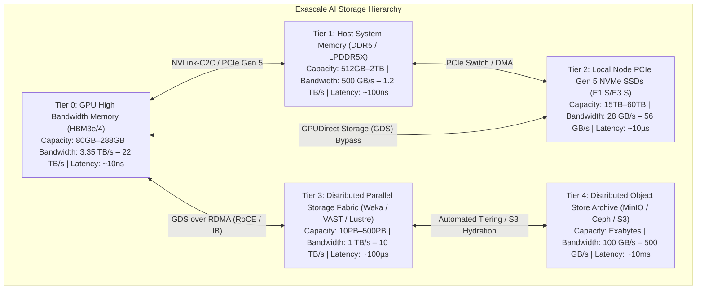

# Volume 01: The Storage Wall in Exascale AI & Ingestion Bandwidth Mathematics

```
====================================================================================================
MODULE 08: HIGH-PERFORMANCE STORAGE & DISTRIBUTED DATA FABRICS FOR AI
VOLUME 01: THE STORAGE WALL IN EXASCALE AI & INGESTION BANDWIDTH MATHEMATICS
====================================================================================================
```

---

## 1. Executive Architectural Overview & Scaffolding

In frontier artificial intelligence infrastructure, scaling raw computational FLOPs has far outpaced the evolution of enterprise storage subsystems. As modern accelerator nodes (such as NVIDIA HGX H100, B200, and GB200 NVL72) achieve tens of petaflops per rack, clusters face a catastrophic bottleneck: **The Storage Wall**.

```
THE ACCELERATING COMPUTE-STORAGE GAP:
Compute Growth (GPU TFLOPS):     ~1,000x over 8 years (Pascal -> Hopper -> Blackwell)
Interconnect Growth (NVLink):    ~10x over 8 years (160 GB/s -> 1,800 GB/s)
Storage Ingestion Growth (POSIX): ~3x over 8 years (Legacy NFS / POSIX SSD Arrays)
```

When multi-node distributed training pipelines cannot ingest training tokens or multi-modal tensor batches at line rate, GPUs stall in high-overhead waiting states. Model FLOPs Utilization (MFU)—the percentage of theoretical peak hardware throughput actually achieved—collapses from an optimal $55\%\text{--}60\%$ down to $15\%\text{--}25\%$. Compute resources costing tens of millions of dollars sit idle, waiting for bytes to traverse operating system kernel buffers and storage fabrics.



---

## 2. The Anatomy of GPU Starvation

### 2.1 The Training Loop Step Mechanics
In distributed deep learning, a training step alternates between computation and data ingestion:
$$\text{Step Duration } T_{\text{step}} = \max(T_{\text{compute}}, T_{\text{data\_load}}) + T_{\text{sync}}$$

1. **Optimal Overlap ($T_{\text{data\_load}} \le T_{\text{compute}}$)**:
   The PyTorch `DataLoader` pre-fetches the subsequent batch in background worker threads while the current batch is actively computed across Tensor Cores. Data loading latency is completely hidden behind GEMM execution.
2. **GPU Starvation ($T_{\text{data\_load}} > T_{\text{compute}}$)**:
   Because Blackwell and Hopper Tensor Cores execute FP8/FP4 matrix math at extreme speeds, $T_{\text{compute}}$ for modern transformer layers has shrunk to milliseconds. If the storage subsystem cannot deliver batch $k+1$ before batch $k$ completes its backward pass, the GPU enters an idle wait state (`cudaStreamSynchronize` stall).

```text
HEALTHY PIPELINE (100% Compute Saturation):
GPU Compute:   [ Forward + Backward Batch 1 ][ Forward + Backward Batch 2 ][ Forward + Backward Batch 3 ]
Storage Read:  [ Load Batch 2 (Background)  ][ Load Batch 3 (Background)  ][ Load Batch 4 (Background)  ]

STARVED PIPELINE (Storage Wall Bottleneck):
GPU Compute:   [ Batch 1 ]...... IDLE STALL ......[ Batch 2 ]...... IDLE STALL ......[ Batch 3 ]
Storage Read:  [========== Load Batch 2 ==========][========== Load Batch 3 ==========]
                          |<--- GPU Starvation --->|
```

---

## 3. First-Principles Mathematics: Ingestion Bandwidth Modeling

### 3.1 LLM Pre-Training Ingestion Bandwidth Equation
To prevent GPU starvation across a distributed cluster of $N_{\text{gpus}}$ accelerators, the storage subsystem must satisfy a minimum sustained aggregate throughput $B_{\text{ingest}}$:

$$B_{\text{ingest}} = \frac{N_{\text{gpus}} \times B_{\text{micro}} \times S_{\text{seq}} \times D_{\text{token}}}{T_{\text{step}}} \quad [\text{bytes/sec}]$$

Where:
* $N_{\text{gpus}}$: Total active GPUs in the training job.
* $B_{\text{micro}}$: Per-GPU micro-batch size (sequences per forward pass).
* $S_{\text{seq}}$: Sequence length in tokens (e.g., $4,096$, $8,192$, or $32,768$).
* $D_{\text{token}}$: Data bytes per token. In standard integer-tokenized text datasets, token IDs are stored as `int32` ($4\text{ bytes}$) or `int16` ($2\text{ bytes}$).
* $T_{\text{step}}$: Wall-clock duration of a single training step (seconds).

#### Concrete Numerical Example:
Consider a cluster of $512\text{ H100 GPUs}$ training a $70\text{B}$ parameter model:
* $B_{\text{micro}} = 2$ sequences per GPU.
* $S_{\text{seq}} = 8,192$ tokens.
* $D_{\text{token}} = 4$ bytes (`int32` token ID + attention mask + position ID overhead $\approx 4\text{ bytes}$).
* $T_{\text{step}} = 0.45\text{ seconds}$ (typical step time on H100 with FlashAttention-3 and FP8).

Total tokens consumed per step across the cluster:
$$\text{Tokens}_{\text{cluster}} = 512 \times 2 \times 8,192 = 8,388,608 \text{ tokens/step}$$
Total raw data bytes required per step:
$$\text{Data}_{\text{step}} = 8,388,608 \times 4 \text{ bytes} = 33,554,432 \text{ bytes} \approx 33.55 \text{ MB}$$
Required sustained storage ingestion bandwidth:
$$B_{\text{ingest}} = \frac{33.55 \text{ MB}}{0.45 \text{ sec}} \approx 74.56 \text{ MB/s}$$

> **Architectural Insight**: For text-only LLM pre-training, raw ingestion bandwidth is modest ($<100\text{ MB/s}$). The true killer of storage in text LLMs is **checkpointing bursts** and **small-file metadata indexing**, not continuous streaming.

---

### 3.2 Vision & Multi-Modal Ingestion Bandwidth Equation (The Real Beast)
In contrast to tokenized text, **multi-modal foundation models** (e.g., Qwen2-VL, Chameleon, Sora-class video models) ingest uncompressed or compressed raw media:

$$B_{\text{multimodal}} = \frac{N_{\text{gpus}} \times B_{\text{micro}} \times (C \times H \times W \times \text{bytes}_{\text{pixel}} \times F)}{T_{\text{step}}}$$

Where:
* $C, H, W$: Channels, Height, and Width of image/video frames.
* $F$: Frames per sample ($F = 1$ for images, $F = 64\text{--}256$ for video clips).
* $\text{bytes}_{\text{pixel}}$: Typically $3\text{ bytes}$ for raw RGB.

#### Concrete Numerical Example:
A cluster of $512\text{ H100 GPUs}$ training a video generation model:
* $B_{\text{micro}} = 1$ video clip per GPU.
* $F = 128$ frames @ $512 \times 512$ resolution.
* Uncompressed frame size $= 3 \times 512 \times 512 = 786,432\text{ bytes} \approx 0.786\text{ MB}$.
* Video clip raw footprint $= 128 \times 0.786\text{ MB} \approx 100.66\text{ MB}$.
* $T_{\text{step}} = 0.8\text{ seconds}$.

Total cluster ingestion required per second:
$$B_{\text{multimodal}} = \frac{512 \times 100.66 \text{ MB}}{0.8 \text{ sec}} \approx \mathbf{64,422 \text{ MB/s}} = \mathbf{64.42 \text{ GB/s Sustained!}}$$

> Standard network-attached storage (NFS) or single-server appliances collapse instantly under $64.4\text{ GB/s}$ sustained sequential reads. This workload demands a **multi-chassis parallel storage fabric (WekaFS / VAST)** connected over **GPUDirect Storage (GDS)**.

---

## 4. Random vs. Sequential Access Profiles

Understanding dataset access patterns is fundamental to selecting storage media and parallel file systems:

| Workload Phase | Access Pattern | I/O Size Profile | Primary Storage Bottleneck | Optimal Storage Architecture |
| :--- | :--- | :--- | :--- | :--- |
| **LLM Pre-Training** | Sequential Streaming | Large ($1\text{MB}\text{--}64\text{MB}$ chunks) | Checkpoint Write Bursts | Parallel FS (Weka/Lustre/VAST) |
| **Vision / Multimodal** | Random Read Shuffling | Medium ($100\text{KB}\text{--}5\text{MB}$) | Read IOPS & Metadata Rates | Local NVMe + NVMe-oF RDMA |
| **Fine-Tuning / RLHF** | Frequent Iterations | Small ($4\text{KB}\text{--}64\text{KB}$) | Linux VFS Inode Contention | Memory-Mapped (`mmap`) / RAM-disk |
| **Checkpointing** | Synchronous Bulk Burst | Massive ($10\text{GB}\text{--}10\text{TB}$) | Storage Fabric Write Throughput | GPUDirect Storage + Async Flush |

### The "Small-File Poison" in Computer Vision
When training on ImageNet or LAION datasets composed of individual JPEG files:
* Each file is $50\text{ KB}\text{--}200\text{ KB}$.
* To read $1\text{ GB}$ of data, the OS must issue $10,000$ distinct `open()`, `stat()`, `read()`, and `close()` syscalls.
* The Linux VFS dentry cache and metadata servers spend $85\%$ of their clock cycles updating file locks and access times (`atime`), delivering less than $10\%$ of actual flash drive read bandwidth!

---

## 5. Comparative Storage Media Economics & Latency Rooflines

```text
STORAGE MEDIA LATENCY & BANDWIDTH SPECTRUM:
Media Tier           Latency        Peak Bandwidth/Device   Cost / Terabyte
─────────────────────────────────────────────────────────────────────────────
GPU HBM3e/4          ~10 ns         3,350 - 22,000 GB/s     ~$20,000 / TB
Host DDR5            ~100 ns        500 - 1,200 GB/s        ~$3,000 / TB
SCM (Optane/CXL)     ~1 µs          32 - 64 GB/s            ~$1,500 / TB
PCIe Gen 5 NVMe      ~10 µs         14 GB/s                 ~$150 / TB
Enterprise QLC SSD   ~80 µs         7 GB/s                  ~$80 / TB
High-Density HDD     ~10 ms         0.25 GB/s               ~$15 / TB
```

---

## 6. Concrete Production Lab: Ingestion Bandwidth & Starvation Simulator

Save this script as `ai_storage_ingestion_calculator.py`:

```python
#!/usr/bin/env python3
"""
AI Storage Ingestion Bandwidth & Starvation Calculator
Calculates sustained storage requirements across LLM, Multimodal, and Checkpointing workloads.
"""

from dataclasses import dataclass
from typing import Dict, Any

@dataclass
class TrainingJobProfile:
    job_name: str
    num_gpus: int
    micro_batch_size: int
    seq_or_frames: int
    bytes_per_unit: int
    step_time_sec: float
    checkpoint_size_gb_per_gpu: float
    checkpoint_interval_steps: int

PROFILES = {
    "Llama-3-70B-Text": TrainingJobProfile(
        job_name="Llama-3-70B (512x H100)",
        num_gpus=512,
        micro_batch_size=2,
        seq_or_frames=8192,
        bytes_per_unit=4, # 4 bytes per token ID
        step_time_sec=0.45,
        checkpoint_size_gb_per_gpu=22.0,
        checkpoint_interval_steps=1000
    ),
    "Video-Diffusion-405B": TrainingJobProfile(
        job_name="Video-Gen-405B (1024x B200)",
        num_gpus=1024,
        micro_batch_size=1,
        seq_or_frames=128, # 128 frames
        bytes_per_unit=512 * 512 * 3, # 512x512 RGB raw frame
        step_time_sec=0.85,
        checkpoint_size_gb_per_gpu=60.0,
        checkpoint_interval_steps=500
    )
}

def analyze_storage_requirements(profile: TrainingJobProfile) -> Dict[str, Any]:
    """Calculate sustained ingestion throughput and checkpointing write bandwidth."""
    # Data ingestion calculation
    bytes_per_step = profile.num_gpus * profile.micro_batch_size * profile.seq_or_frames * profile.bytes_per_unit
    ingest_throughput_mb_s = (bytes_per_step / (1024**2)) / profile.step_time_sec
    ingest_throughput_gb_s = ingest_throughput_mb_s / 1024.0
    
    # Checkpointing calculation
    total_checkpoint_tb = (profile.num_gpus * profile.checkpoint_size_gb_per_gpu) / 1024.0
    
    # Target maximum acceptable checkpointing stall duration = 10.0 seconds
    target_flush_sec = 10.0
    required_checkpoint_write_gb_s = (profile.num_gpus * profile.checkpoint_size_gb_per_gpu) / target_flush_sec
    
    return {
        "job": profile.job_name,
        "tokens_or_samples_per_sec": (profile.num_gpus * profile.micro_batch_size * profile.seq_or_frames) / profile.step_time_sec,
        "sustained_ingest_mb_s": ingest_throughput_mb_s,
        "sustained_ingest_gb_s": ingest_throughput_gb_s,
        "total_checkpoint_tb": total_checkpoint_tb,
        "burst_checkpoint_write_gb_s": required_checkpoint_write_gb_s
    }

if __name__ == "__main__":
    print("=" * 90)
    print("EXASCALE AI STORAGE INGESTION & CHECKPOINTING WALL ANALYSIS")
    print("=" * 90)
    
    for key, prof in PROFILES.items():
        res = analyze_storage_requirements(prof)
        print(f"\nWorkload Profile: {res['job']}")
        print(f" • Data Processing Rate       : {res['tokens_or_samples_per_sec']:,.0f} units/sec")
        print(f" • Sustained Ingestion Read    : {res['sustained_ingest_mb_s']:.2f} MB/s ({res['sustained_ingest_gb_s']:.2f} GB/s)")
        print(f" • Cluster Checkpoint Volume   : {res['total_checkpoint_tb']:.2f} TB per snapshot")
        print(f" • Required Checkpoint Flush   : {res['burst_checkpoint_write_gb_s']:.2f} GB/s (for 10s target flush)")
```

---

## 7. Multi-Dimensional Correlation & Troubleshooting

```text
┌─────────────────────────────┬───────────────────────────────┬─────────────────────────────────────────────────────────┐
│ Failure Signature           │ Root Cause Layer              │ SRE Triage & Diagnostic Remediation                     │
├─────────────────────────────┼───────────────────────────────┼─────────────────────────────────────────────────────────┤
│ GPU MFU drops under 25%;    │ Storage Ingestion Starvation; │ Inspect DataLoader worker utilization:                  │
│ cudaStreamSynchronize stalls│ storage cannot feed tensors   │ In PyTorch set pin_memory=True, num_workers=8.          │
│                             │                               │ Re-shard into WebDataset .tar or memory-map .bin files. │
├─────────────────────────────┼───────────────────────────────┼─────────────────────────────────────────────────────────┤
│ Checkpointing freezes the   │ Checkpoint write bandwidth    │ Measure filesystem burst write speed:                   │
│ cluster for > 10 minutes    │ saturating storage fabric     │ $ fio --name=ckpt --rw=write --bs=32M --direct=1 ...    │
│                             │                               │ Deploy Asynchronous Non-Blocking Checkpointing (DCP).   │
├─────────────────────────────┼───────────────────────────────┼─────────────────────────────────────────────────────────┤
│ Millions of small files     │ Linux VFS Inode / dentry lock │ Run eBPF filesystem latency tracer:                     │
│ cause extreme latency       │ contention on metadata server │ $ xfsdist 1 or ext4dist 1                               │
│                             │                               │ Eliminate individual files; pack into Megatron idx/bin. │
└─────────────────────────────┴───────────────────────────────┴─────────────────────────────────────────────────────────┘
```

---

## 8. Summary & Technical Takeaways

1. **The Modern Bottleneck Shift**: While text LLM pre-training places low demand on continuous read bandwidth, multi-modal workloads demand tens of gigabytes per second of sustained throughput.
2. **The Checkpoint Burst Challenge**: Foundation model checkpoints generate multi-terabyte bursts ($6\text{--}10\text{ TB}$) that saturate traditional storage networks, demanding dedicated storage fabrics capable of hundreds of gigabytes per second.
3. **Elimination of the Small-File Pattern**: Storing individual image or text files devastates filesystem metadata servers. Production AI pipelines must aggregate training data into sequential binary containers (WebDataset, Megatron `.bin`).
4. **Hierarchical Storage Offload**: Modern AI infrastructure bridges high-cost GPU HBM to low-cost object storage through a carefully tuned hierarchy of local NVMe SSDs and RDMA-accelerated parallel file systems.
