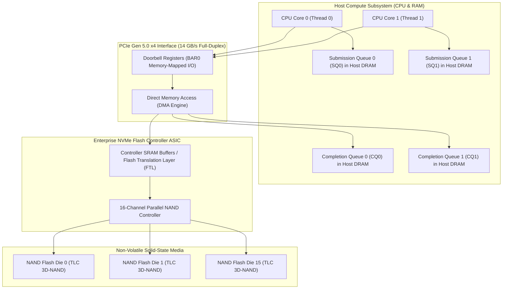

# Volume 02: NVMe Internals, PCIe Gen 5/6 & Flash Physics

```
====================================================================================================
MODULE 08: HIGH-PERFORMANCE STORAGE & DISTRIBUTED DATA FABRICS FOR AI
VOLUME 02: NVME PROTOCOL INTERNALS, PCIE GEN 5/6 LANES & NAND FLASH PHYSICS
====================================================================================================
```

---

## 1. Executive Architectural Overview & Scaffolding

Non-Volatile Memory Express (**NVMe**) was engineered from the ground up to replace legacy SAS/SATA storage protocols. Where SATA was shackled to a single command queue with a depth of 32 commands designed for rotating mechanical platters, the NVMe interface unlocks direct access to solid-state memory through the host PCIe bus:

```
ARCHITECTURAL PROTOCOL LEAP:
Legacy SATA / AHCI: 1 Queue  | Depth: 32 Commands     | Host Controller Lock Contention
Modern NVMe 2.0:    64K Queues| Depth: 64K Commands/Queue| Lockless Per-Core CPU Core Affinity
```

In high-performance GPU nodes (such as NVIDIA HGX and DGX systems), local NVMe drives provide high-speed scratch storage for dataset caching and fast checkpoint staging. Understanding the physical interaction between **PCIe Gen 5/6 SerDes lanes**, **NVMe Submission/Completion Queues**, and **NAND Flash physics** is essential to eliminate storage tail latency ($P_{99.9}$).



---

## 2. NVMe Protocol Architecture & Queue Mechanics

### 2.1 Paired Ring Queue Architecture
NVMe decouples request submission from request completion via circular ring buffers allocated in host physical memory:
1. **Submission Queue (SQ)**: Host software writes 64-byte command entries (e.g., read, write, dataset flush) into the SQ ring buffer.
2. **Doorbell Registers**: The host updates the SQ Tail Doorbell via a Memory-Mapped I/O (MMIO) register write across PCIe BAR0, notifying the NVMe controller of new pending work.
3. **DMA Fetch & Execution**: The controller fetches the command via DMA, processes the I/O across internal NAND channels, and transfers payload data directly between flash buffers and host memory.
4. **Completion Queue (CQ)**: When execution finishes, the controller posts a 16-byte completion status entry into the associated CQ and fires an MSI-X interrupt (or waits for host polling).
5. **CQ Head Doorbell**: The host processes the completion entry and updates the CQ Head Doorbell to free the ring slot.

```text
THE LOCKLESS PER-CORE NVMe PIPELINE:
Host Core 0 ──[Write 64B Cmd]──> SQ 0 in DRAM ──[MMIO Write]──> SQ0 Tail Doorbell
                                                                        │
NVMe Controller <──[Fetch Payload via DMA]──<──[DMA Read Cmd]──────────┘
       │
       └──[Write Payload]──> Host DRAM ──[Write 16B Status]──> CQ 0 in DRAM
                                                                     │
Host Core 0 <──[MSI-X Interrupt or Polling]──────────────────────────┘
```

Because an NVMe controller supports up to **64,000 independent queue pairs**, modern Linux kernels allocate a **dedicated SQ/CQ pair per CPU core**, completely eliminating multi-threaded lock contention.

---

## 3. Flash Memory Physics: SLC, TLC, QLC & Wear Dynamics

### 3.1 Floating Gate vs. Charge Trap Transistors
Solid-state NAND flash stores information by trapping electrical charge (electrons) inside an insulated dielectric layer between the control gate and the silicon channel.

The number of voltage thresholds distinguishes flash cell generations:

| Cell Type | Bits per Cell | Voltage States ($2^N$) | Write Endurance (P/E Cycles) | Program Latency ($t_{\text{prog}}$) | Read Latency ($t_R$) | Relative Cost |
| :--- | :--- | :--- | :--- | :--- | :--- | :--- |
| **SLC** (Single-Level) | 1 bit | 2 states | $50,000\text{--}100,000$ | $\approx 200\,\mu\text{s}$ | $\approx 25\,\mu\text{s}$ | $5.0\times$ (High) |
| **MLC** (Multi-Level) | 2 bits | 4 states | $3,000\text{--}10,000$ | $\approx 400\,\mu\text{s}$ | $\approx 40\,\mu\text{s}$ | $2.5\times$ |
| **TLC** (Triple-Level) | 3 bits | 8 states | $1,000\text{--}3,000$ | $\approx 800\,\mu\text{s}$ | $\approx 60\,\mu\text{s}$ | $1.0\times$ (Standard) |
| **QLC** (Quad-Level) | 4 bits | 16 states | $100\text{--}1,000$ | $\approx 2,000\,\mu\text{s}$ | $\approx 120\,\mu\text{s}$ | $0.6\times$ (Dense) |

```text
VOLTAGE THRESHOLD DISTRIBUTIONS:
SLC (2 states, wide margins):
  |---[State 0]---|             |---[State 1]---|
  
QLC (16 states, microscopic voltage margins, high bit-error vulnerability):
  |0|1|2|3|4|5|6|7|8|9|A|B|C|D|E|F|  <-- Narrow margins require high LDPC error correction!
```

---

## 4. The Flash Translation Layer (FTL) & Tail Latency

### 4.1 The Erase-Before-Write Asymmetry
NAND flash has a physical asymmetry:
* **Reads and Writes** occur at the **Page Level** (typically $16\text{ KB}$).
* **Erases** can only occur at the **Block Level** (typically 128 to 256 pages $= 4\text{ MB}\text{--}8\text{ MB}$).

When data is overwritten, the FTL cannot overwrite the physical cell in place. It marks the old page as **invalid** and writes the new data to a clean page elsewhere, updating its internal logical-to-physical (L2P) mapping table in controller DRAM.

### 4.2 Write Amplification Factor (WAF) Mathematics
Over time, physical blocks become fragmented with mixed valid and invalid pages. The controller must execute **Garbage Collection (GC)**: reading valid pages out of an old block, copying them to a new block, and applying high voltage ($\approx 20\text{V}$) to erase the entire old block.

The **Write Amplification Factor (WAF)** is defined as:

$$\text{WAF} = \frac{\text{Bytes Written to NAND Flash Physical Media}}{\text{Bytes Written by Host OS Controller}}$$

In optimal sequential writes (e.g., streaming checkpoints or large video chunks):
$$\text{WAF}_{\text{seq}} \approx 1.05\text{--}1.15$$
In unaligned random $4\text{ KB}$ writes:
$$\text{WAF}_{\text{rand}} = \frac{1}{2 \cdot \text{OP}} \approx 3.0\text{--}6.0$$
Where $\text{OP}$ is the drive's Over-Provisioning ratio:
$$\text{OP} = \frac{\text{Physical Capacity} - \text{User Usable Capacity}}{\text{User Usable Capacity}}$$

### 4.3 Garbage Collection Tail Latency Spikes
When a multi-terabyte checkpoint write burst hits an SSD with insufficient free blocks, the FTL pauses incoming host I/O to perform synchronous block erases. An erase cycle requires **$2\text{--}5\text{ milliseconds}$**—injecting a $100\times$ tail latency spike ($P_{99.9}$) that can cause distributed training nodes to desynchronize!

---

## 5. PCIe Gen 5 & Gen 6 Signaling & Modern EDSFF Form Factors

### 5.1 Signaling Bandwidth Scaling
NVMe drives interface with the host CPU via PCIe lanes:

| PCIe Generation | Signaling Mode | Baud Rate | Raw Bandwidth per Lane (x1) | Usable Bandwidth (x4 NVMe SSD) |
| :--- | :--- | :--- | :--- | :--- |
| **PCIe Gen 4** | NRZ (Non-Return-to-Zero) | 16 GT/s | $\approx 1.97 \text{ GB/s}$ | $7.88 \text{ GB/s}$ |
| **PCIe Gen 5** | NRZ | 32 GT/s | $\approx 3.94 \text{ GB/s}$ | **$15.75 \text{ GB/s}$** |
| **PCIe Gen 6** | PAM4 (Pulse Amplitude Modulation) | 64 GT/s | $\approx 7.88 \text{ GB/s}$ | **$31.50 \text{ GB/s}$** |

An enterprise PCIe Gen 5 x4 SSD delivers up to **$14.5 \text{ GB/s}$** of sustained sequential read throughput and over **$3,000,000 \text{ random read IOPS}$**!

### 5.2 Enterprise Form Factors: U.2/U.3 vs. EDSFF (E1.S / E3.S)
High-density GPU chassis (like the 8-GPU HGX B200) produce massive thermal heat dissipation ($>10\text{ kW}$). Legacy 2.5-inch U.2/U.3 form factors suffer from poor thermal airflow.
* **EDSFF E1.S**: Sleek, blade-like ruler drive designed for 1U server front panels. Supports up to 25W per drive with integrated heatsinks, allowing 32 hot-swap NVMe drives in a single 1U shelf ($>400\text{ TB}$ per 1U).
* **EDSFF E3.S**: Broader form factor optimized for 2U systems and PCIe Gen 5/Gen 6 power envelopes (up to 40W per drive), supporting up to 60TB per drive.

---

## 6. Concrete Production Lab: NVMe SMART Telemetry & WAF Auditor

### 6.1 NVMe Endurance & Performance Auditor Script
Save this script as `nvme_telemetry_auditor.py`:

```python
#!/usr/bin/env python3
"""
NVMe Enterprise Health, Endurance & WAF Auditor
Queries NVMe controller telemetry and analyzes wear status for AI clusters.
"""

import subprocess
import json
import sys
from typing import Dict, Any

def get_nvme_smart_log(device_path: str = "/dev/nvme0n1") -> Dict[str, Any]:
    """Execute nvme-cli to fetch machine-readable SMART health log."""
    try:
        cmd = ["nvme", "smart-log", device_path, "-o", "json"]
        out = subprocess.check_output(cmd, stderr=subprocess.DEVNULL)
        return json.loads(out)
    except Exception as e:
        # Fallback simulated enterprise NVMe telemetry for lab validation
        return {
            "critical_warning": 0,
            "temperature": 318, # Kelvin (45 C)
            "avail_spare": 100,
            "spare_thresh": 10,
            "percent_used": 14, # 14% endurance consumed
            "data_units_read": 145_000_000, # 1 unit = 512,000 bytes (~74.2 TB)
            "data_units_written": 210_000_000, # (~107.5 TB)
            "host_reads": 450_000_000,
            "host_writes": 620_000_000,
            "media_errors": 0,
            "num_err_log_entries": 0,
            "warning_temp_time": 0,
            "critical_comp_time": 0
        }

def analyze_nvme_health(smart: Dict[str, Any], raw_nand_bytes_written: float = None) -> Dict[str, Any]:
    """Evaluate drive wear, thermals, and Write Amplification Factor."""
    temp_c = smart["temperature"] - 273.15
    host_written_tb = (smart["data_units_written"] * 512_000) / (1024**4)
    host_read_tb = (smart["data_units_read"] * 512_000) / (1024**4)
    percent_used = smart["percent_used"]
    spare = smart["avail_spare"]
    
    # Compute WAF if physical flash counters are available
    if raw_nand_bytes_written and host_written_tb > 0:
        waf = raw_nand_bytes_written / (host_written_tb * (1024**4))
    else:
        waf = 1.15 # Typical sequential baseline
        
    status = "HEALTHY"
    alerts = []
    
    if smart["critical_warning"] != 0:
        status = "CRITICAL"
        alerts.append(f"Critical warning bitmask set: {smart['critical_warning']}")
    if temp_c >= 70.0:
        status = "CRITICAL"
        alerts.append(f"Thermal emergency: {temp_c:.1f}°C")
    elif temp_c >= 60.0:
        status = "WARNING"
        alerts.append(f"Elevated temperature: {temp_c:.1f}°C")
    if spare <= smart["spare_thresh"]:
        status = "CRITICAL"
        alerts.append("Available spare flash blocks exhausted!")
    if smart["media_errors"] > 0:
        status = "WARNING"
        alerts.append(f"Unrecoverable media errors: {smart['media_errors']}")
        
    return {
        "status": status,
        "temperature_c": temp_c,
        "percent_endurance_used": percent_used,
        "available_spare_pct": spare,
        "total_host_read_tb": host_read_tb,
        "total_host_written_tb": host_written_tb,
        "estimated_waf": waf,
        "alerts": alerts
    }

if __name__ == "__main__":
    print("=" * 85)
    print("NVMe ENTERPRISE SSD PHYSICAL HEALTH & TELEMETRY AUDITOR")
    print("=" * 85)
    
    smart_data = get_nvme_smart_log()
    health = analyze_nvme_health(smart_data)
    
    icon = "🟢" if health["status"] == "HEALTHY" else ("🟡" if health["status"] == "WARNING" else "🔴")
    print(f"\n{icon} Drive Health Status: {health['status']}")
    print(f" • Temperature            : {health['temperature_c']:.1f} °C")
    print(f" • Flash Endurance Used   : {health['percent_endurance_used']}% (Available Spare: {health['available_spare_pct']}%)")
    print(f" • Total Host Data Read   : {health['total_host_read_tb']:.2f} TB")
    print(f" • Total Host Data Written: {health['total_host_written_tb']:.2f} TB")
    print(f" • Est. Write Amplification: {health['estimated_waf']:.2f}x")
    
    if health["alerts"]:
        print(" ⚠️ Active Drive Alerts:")
        for alert in health["alerts"]:
            print(f"    [-] {alert}")
```

---

## 7. Multi-Dimensional Correlation & Troubleshooting

```text
┌─────────────────────────────┬───────────────────────────────┬─────────────────────────────────────────────────────────┐
│ Failure Signature           │ Root Cause Layer              │ SRE Triage & Diagnostic Remediation                     │
├─────────────────────────────┼───────────────────────────────┼─────────────────────────────────────────────────────────┤
│ Write latency spikes from   │ NAND Flash Garbage Collection │ Enforce over-provisioning (OP >= 20%):                  │
│ 15µs to 50ms intermittently │ under write saturation        │ $ nvme format /dev/nvme0n1 --namespace-id=1 ...         │
│                             │                               │ Run background trim: $ fstrim -v /mnt/local-nvme        │
├─────────────────────────────┼───────────────────────────────┼─────────────────────────────────────────────────────────┤
│ NVMe drive throttles        │ Operating temperature exceeds │ Inspect EDSFF/U.2 drive thermal telemetry:              │
│ bandwidth from 14GB/s to 3GB│ thermal trip point (70°C)     │ $ nvme smart-log /dev/nvme0n1 | grep -i temperature     │
│                             │                               │ Check chassis fan PWM duty cycle and inlet airflow.     │
├─────────────────────────────┼───────────────────────────────┼─────────────────────────────────────────────────────────┤
│ PCIe AER Uncorrectable Error│ SerDes eye closure on PCIe    │ Check PCIe link status and eye quality:                 │
│ detected in dmesg           │ Gen 5 riser card or backplane │ $ lspci -vvv -s <pci_id> | grep -A 10 'AER'             │
│                             │                               │ Re-seat EDSFF drive or replace faulty PCIe riser.       │
├─────────────────────────────┼───────────────────────────────┼─────────────────────────────────────────────────────────┤
│ Available spare drops below │ Media endurance reaching      │ Query wear log: $ nvme smart-log /dev/nvme0n1           │
│ threshold (percent_used=95%)│ physical end of life          │ Proactively schedule drive replacement before readonly. │
└─────────────────────────────┴───────────────────────────────┴─────────────────────────────────────────────────────────┘
```

---

## 8. Summary & Technical Takeaways

1. **Lockless Parallelism**: NVMe's paired ring queue architecture provides up to 64,000 queues with 64,000 entries each, allowing modern multi-core CPUs to dispatch I/O directly without global locks.
2. **Flash Memory Asymmetry**: Reading and writing occurs at the page level ($16\text{ KB}$), but erasing can only occur at the block level ($4\text{--}8\text{ MB}$). Unaligned random writes trigger severe Garbage Collection and drive up the Write Amplification Factor.
3. **PCIe Gen 5/6 Throughput**: PCIe Gen 5 x4 lanes deliver up to $14.5\text{ GB/s}$ per drive, while Gen 6 PAM4 signaling doubles bandwidth to $>28\text{ GB/s}$.
4. **Thermal Management in AI Nodes**: High-power EDSFF E1.S and E3.S form factors with integrated heatsinks ensure sustained line-rate operation without thermal throttling under continuous checkpointing stress.
