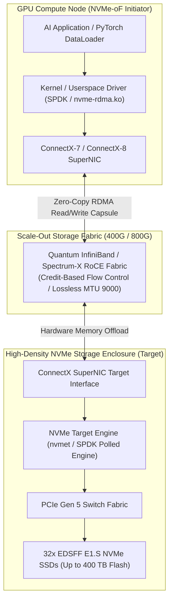

# Volume 03: NVMe-oF: RDMA vs. TCP Transport Mechanics

```
====================================================================================================
MODULE 08: HIGH-PERFORMANCE STORAGE & DISTRIBUTED DATA FABRICS FOR AI
VOLUME 03: NVME OVER FABRICS (NVME-OF): RDMA VS. TCP TRANSPORT MECHANICS
====================================================================================================
```

---

## 1. Executive Architectural Overview & Scaffolding

Traditional networked storage protocols (such as iSCSI over TCP or standard NFS v3/v4) incur severe latency and CPU processing penalties that choke high-throughput AI workloads:
* Every storage block must be copied through the operating system's network socket buffers (`sk_buff`), traversed through the TCP/IP stack, and context-switched between user space and kernel space.
* Processing $20\text{ GB/s}$ of storage traffic over standard TCP can consume **16 to 32 dedicated host CPU cores** purely handling network interrupts and packet reassembly!

The **NVMe over Fabrics (NVMe-oF)** specification extends the local NVMe paired-queue architecture across scale-out networks (InfiniBand, RoCEv2 Ethernet, and TCP). By encapsulating NVMe commands directly into network packets, NVMe-oF achieves **microsecond-level latency** ($<10\,\mu\text{s}$ over RDMA), matching local PCIe SSD performance across external storage racks.



---

## 2. NVMe-oF Capsule Architecture & Protocol Transports

### 2.1 The Capsule Exchange Model
In local NVMe, the host writes a 64-byte command to host DRAM and rings a PCIe doorbell. In NVMe-oF, memory access is replaced by **Capsules**:
* **Command Capsule**: The Initiator sends a Capsule containing the standard 64-byte NVMe submission command along with a **Scatter-Gather List (SGL)** specifying remote memory addresses. If the write payload is small ($\le 8\text{ KB}$), the data is inlined directly inside the Command Capsule.
* **Response Capsule**: The Target returns a 16-byte NVMe completion entry indicating success or failure.

```text
LOCAL NVME VS. NVME-OF CAPSULE MAPPING:
Local PCIe:    [ Host Ring Buffer ] ──(PCIe Doorbell)──> [ NVMe Controller ] ──(DMA)──> [ Host DRAM ]
NVMe-oF RDMA:  [ NVMe-oF Capsule ] ──(RDMA Send)─────> [ Target Controller] ──(RDMA Read)──> [ Initiator HBM/DRAM ]
```

---

## 3. NVMe/RDMA vs. NVMe/TCP: Deep Transport Comparison

The NVMe-oF standard defines multiple transport bindings. In AI infrastructure, the primary battle is between **NVMe/RDMA** and **NVMe/TCP**:

```text
+---------------------------------------------------------------------------------------------------------------+
|                                     NVMe/RDMA VS. NVMe/TCP PROTOCOL STACK                                     |
+-------------------------------------------------------+-------------------------------------------------------+
| NVMe over RDMA (InfiniBand / RoCEv2)                  | NVMe over TCP (Standard AI Ethernet)                 |
+-------------------------------------------------------+-------------------------------------------------------+
| [ NVMe Application Layer (cuFile / POSIX / SPDK) ]    | [ NVMe Application Layer (POSIX / SPDK) ]             |
|                          │                            |                          │                            |
| [ NVMe-oF RDMA Transport Driver (nvme-rdma.ko) ]      | [ NVMe-oF TCP Transport Driver (nvme-tcp.ko) ]        |
|                          │                            |                          │                            |
| [ IB Verbs Layer / Direct Hardware Queue Pair ]       | [ Linux Kernel Sockets & TCP/IP Network Stack ]       |
|                          │                            |                          │                            |
| [ ConnectX SuperNIC Hardware RDMA Engine (Offloaded)] | [ Software Packetization, TCP Checksum, sk_buffs ]    |
|                          │                            |                          │                            |
| [ ZERO-COPY KERNEL BYPASS: Latency: ~8-12 µs ]        | [ CPU COPY OVERHEAD: Latency: ~35-70 µs ]             |
+-------------------------------------------------------+-------------------------------------------------------+
```

### 3.1 Architectural & Performance Comparison

| Metric / Dimension | NVMe over RDMA (RoCEv2 / IB) | NVMe over TCP |
| :--- | :--- | :--- |
| **Data Path Mechanism** | Zero-copy direct DMA via HCA hardware | Double-buffered via Linux socket buffer (`sk_buff`) |
| **Kernel CPU Utilization** | Near Zero ($<2\%$ CPU per $100\text{ Gbps}$) | High ($15\%\text{--}35\%$ CPU per $100\text{ Gbps}$) |
| **One-Way Transport Latency** | **$8\text{--}12\,\mu\text{s}$** | **$35\text{--}75\,\mu\text{s}$** |
| **GPUDirect Storage (GDS)** | **Native Line-Rate Support** | Limited / Experimental (Requires kernel bounce-buffers) |
| **Network Fabric Requirements** | Lossless Ethernet (PFC + ECN) or InfiniBand | Standard Lossy or Lossless IP Network |
| **Hardware Prerequisite** | RDMA-capable NICs (ConnectX, BlueField) | Standard Commodity NICs |
| **Optimal Use Case** | LLM Training, Multi-Modal Ingestion, GDS | Disaggregated Disks, Inference Worker Pods |

---

## 4. Kernel Drivers vs. SPDK (Userspace Polled Drivers)

Managing NVMe-oF endpoints can occur via two radically different execution models:

### 4.1 The Linux Kernel NVMe-oF Stack
* Initiator utilizes `nvme-fabrics.ko` and `nvme-rdma.ko`.
* Exposes remote targets as standard block devices (`/dev/nvmeXnY`).
* Relies on Linux interrupts (MSI-X) to notify CPU cores of I/O completion.
* *Limitation*: Under extreme IOPS loads ($>5,000,000\text{ IOPS}$), interrupt processing context-switches cause CPU core saturation.

### 4.2 Storage Performance Development Kit (SPDK)
* **Userspace Driver**: Runs entirely in user memory space, completely bypassing the Linux kernel and filesystem layers.
* **Polled-Mode Driver (PMD)**: Dedicated CPU worker threads poll completion queues continuously rather than waiting for hardware interrupts.
* **Lockless Architecture**: Every thread maintains an isolated, lock-free queue pair with the remote NVMe-oF target.
* *Advantage*: Delivers up to **$6\times\text{--}10\times$ higher IOPS per CPU core** than the Linux kernel stack, driving modern parallel file systems like WekaFS and VAST Data.

---

## 5. First-Principles Mathematics: Queue Depth, BDP & CPU Core Consumption

### 5.1 Bandwidth-Delay Product (BDP) & Queue Depth Sizing
To saturate a high-speed network link of bandwidth $C$ (bytes/sec) over round-trip latency $\text{RTT}$ (seconds), the amount of in-flight data (Bandwidth-Delay Product) is:

$$\text{BDP} = C \times \text{RTT} \quad [\text{bytes}]$$

For an NVMe-oF connection with block size $S_{\text{block}}$, the **minimum queue depth** $QD_{\min}$ required to keep the storage pipeline completely saturated without stalling is:

$$QD_{\min} = \left\lceil \frac{C \times \text{RTT}}{S_{\text{block}}} \right\rceil$$

#### Numerical Example:
* Link Speed $C = 400\text{ Gbps} = 50\text{ GB/s} = 50 \times 10^9\text{ bytes/s}$.
* Network RTT $= 10\,\mu\text{s} = 10 \times 10^{-6}\text{ s}$.
* Block Size $S_{\text{block}} = 4\text{ KB} = 4,096\text{ bytes}$.

$$\text{BDP} = 50 \times 10^9 \times 10 \times 10^{-6} = 500,000 \text{ bytes} \approx 488.28 \text{ KB}$$
$$QD_{\min} = \left\lceil \frac{500,000}{4,096} \right\rceil = \lceil 122.07 \rceil = \mathbf{123 \text{ in-flight commands}}$$

If the NVMe-oF queue depth is configured below 123 (e.g., standard default $QD=32$), the link will sit idle waiting for completion acknowledgments, delivering less than **$26\%$ of available line-rate bandwidth**!

### 5.2 CPU Overhead Comparison Formula
Let $H$ be the storage throughput in $\text{GB/s}$. The number of host CPU cores $K_{\text{cores}}$ consumed solely by storage network processing is modeled as:
$$K_{\text{cores, TCP}} \approx \frac{H}{2.5 \text{ GB/s per core}}$$
$$K_{\text{cores, RDMA}} \approx \frac{H}{35.0 \text{ GB/s per core}}$$

For an exascale storage ingest of $70\text{ GB/s}$:
$$K_{\text{cores, TCP}} = \frac{70}{2.5} = \mathbf{28 \text{ CPU Cores Consumed!}}$$
$$K_{\text{cores, RDMA}} = \frac{70}{35} = \mathbf{2 \text{ CPU Cores Consumed!}}$$

---

## 6. Concrete Production Lab: NVMe-oF Target & Initiator Deployment

### 6.1 NVMe-oF RDMA Target Setup (`nvmetcli`)
On the Storage Server (Target), configure an exported NVMe subsystem over RoCEv2:

```bash
#!/usr/bin/env bash
# Configure Linux Kernel NVMe-oF RDMA Target Subsystem
set -euo pipefail

# 1. Load required kernel modules
modprobe nvmet
modprobe nvmet-rdma

# 2. Create NVMe-oF Subsystem
mkdir -p /sys/kernel/config/nvmet/subsystems/nqn.2026-09.com.dgx:nvme-storage-pool01
cd /sys/kernel/config/nvmet/subsystems/nqn.2026-09.com.dgx:nvme-storage-pool01

# Allow any initiator to connect (or restrict by Initiator NQN)
echo 1 > attr_allow_any_host

# 3. Attach local NVMe namespace (e.g. /dev/nvme0n1)
mkdir -p namespaces/1
cd namespaces/1
echo -n "/dev/nvme0n1" > device_path
echo 1 > enable

# 4. Create and bind RDMA network port on mlx5_0
mkdir -p /sys/kernel/config/nvmet/ports/1
cd /sys/kernel/config/nvmet/ports/1
echo "192.168.100.10" > addr_traddr       # Target IP on Storage Rail
echo "rdma"            > addr_trtype       # Transport: RDMA
echo "4420"            > addr_trsvcid      # Standard NVMe-oF Port
echo "ipv4"            > addr_adrfam       # IPv4

# Bind subsystem to port
ln -s /sys/kernel/config/nvmet/subsystems/nqn.2026-09.com.dgx:nvme-storage-pool01 \
      /sys/kernel/config/nvmet/ports/1/subsystems/nqn.2026-09.com.dgx:nvme-storage-pool01

echo "NVMe-oF RDMA Target export active on 192.168.100.10:4420."
```

### 6.2 NVMe-oF Initiator Connect & Discovery
On the Compute / GPU Node (Initiator):

```bash
#!/usr/bin/env bash
# Discover and connect to remote NVMe-oF RDMA target
set -euo pipefail

modprobe nvme-rdma

# Discover available subsystems
nvme discover -t rdma -a 192.168.100.10 -s 4420

# Connect to target subsystem with tuned queue depth
nvme connect -t rdma \
             -a 192.168.100.10 \
             -s 4420 \
             -n nqn.2026-09.com.dgx:nvme-storage-pool01 \
             -i 128 \
             -q 128

# Verify connected device
nvme list
# The remote flash appears as a local /dev/nvmeXn1 block device with native performance!
```

---

## 7. Multi-Dimensional Correlation & Troubleshooting

```text
┌─────────────────────────────┬───────────────────────────────┬─────────────────────────────────────────────────────────┐
│ Failure Signature           │ Root Cause Layer              │ SRE Triage & Diagnostic Remediation                     │
├─────────────────────────────┼───────────────────────────────┼─────────────────────────────────────────────────────────┤
│ nvme connect fails with:    │ RDMA link down or mismatched  │ Inspect RDMA link state on storage interface:           │
│ "Connection refused / timed"│ IP subnet on storage rail     │ $ ibstatus or rdma link                                 │
│                             │                               │ Verify port 4420 is listening: $ ss -tulpn | grep 4420  │
├─────────────────────────────┼───────────────────────────────┼─────────────────────────────────────────────────────────┤
│ High NVMe-oF latency spikes │ PFC pause storm on RoCEv2     │ Check priority pause counters on storage NIC:           │
│ under heavy checkpointing   │ storage VLAN switches         │ $ ethtool -S <eth> | grep -E "prio3|pause"              │
│                             │                               │ Verify ECN thresholds on leaf switch storage ports.     │
├─────────────────────────────┼───────────────────────────────┼─────────────────────────────────────────────────────────┤
│ Throughput capped at 25% of │ Initiator Queue Depth (QD)    │ Increase queue depth on initiator connection:           │
│ 400G link bandwidth         │ sized below Bandwidth-Delay   │ Reconnect with flags: -i 256 -q 256.                    │
│                             │ Product threshold             │ Verify host memory locked limits (ulimit -l unlimited). │
└─────────────────────────────┴───────────────────────────────┴─────────────────────────────────────────────────────────┘
```

---

## 8. Summary & Technical Takeaways

1. **Elimination of TCP Overhead**: NVMe over RDMA replaces legacy socket buffer copies with direct hardware memory transfers, cutting latency from $50\,\mu\text{s}$ down to under $10\,\mu\text{s}$.
2. **CPU Core Preservation**: While NVMe/TCP consumes up to 28 CPU cores at line rate ($70\text{ GB/s}$), NVMe/RDMA offloads the entire transport to the SuperNIC, liberating host compute for AI data preparation.
3. **Queue Sizing Mandate**: In high-speed 400G/800G networks, the minimum queue depth must equal or exceed the Bandwidth-Delay Product ($\text{BDP} / S_{\text{block}}$) to prevent pipeline stalls.
4. **SPDK Polled Performance**: Userspace polled drivers (SPDK) eliminate kernel context switches, delivering millions of IOPS per core to power enterprise AI parallel file systems.
