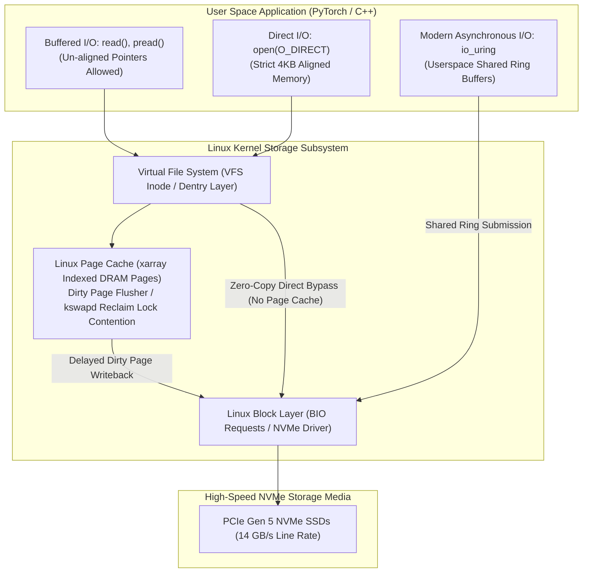

# Volume 05: Linux VFS, Page Cache & Direct I/O (O_DIRECT) Mechanics

```
====================================================================================================
MODULE 08: HIGH-PERFORMANCE STORAGE & DISTRIBUTED DATA FABRICS FOR AI
VOLUME 05: LINUX VIRTUAL FILE SYSTEM (VFS), PAGE CACHE LOCKS & DIRECT I/O (O_DIRECT)
====================================================================================================
```

---

## 1. Executive Architectural Overview & Scaffolding

The Linux storage subsystem abstracts heterogeneous physical media through the **Virtual File System (VFS)** layer. At the center of VFS sits the **Linux Page Cache**, designed to accelerate interactive desktop and server workloads by caching recently accessed disk blocks in host DRAM:
* **The Classical Assumption**: Storage is mechanical and slow ($10\text{ ms}$ latency); system RAM is fast ($100\text{ ns}$ latency). Therefore, caching as much data as possible in RAM improves application performance.
* **The Exascale AI Reality Inversion**: Modern NVMe SSDs deliver tens of gigabytes per second with microsecond latencies. When an AI training job running on a 2TB RAM host streams terabytes of dataset samples through the standard Page Cache, the cache becomes an **active liability**.

```
THE PAGE CACHE TRAP IN DEEP LEARNING:
1. Terabytes of training data flood Host DRAM Page Cache.
2. RAM fills to 100%; kswapd and direct memory reclaim activate.
3. Linux kernel locks memory pages, context-switching CPU worker threads.
4. Latency spikes from 15 µs to 120 milliseconds!
5. GPUs starve while CPU cores burn cycles reclaiming cached pages.
```

Mastering the mechanics of **Direct I/O (`O_DIRECT`)**, memory alignment, and modern **`io_uring`** ring queues allows storage architects to bypass kernel caching traps, achieving deterministic line-rate data ingestion.



---

## 2. Linux VFS Internals: Inodes, Dentries & The Page Cache

The Linux Virtual File System provides a standardized object-oriented abstraction:
* **Superblock**: Describes the global filesystem properties (block size, total inodes, mount status).
* **Inode**: Represents a specific file or directory on storage, storing file metadata (permissions, file size, timestamps, data block pointers).
* **Dentry (Directory Entry)**: Maps human-readable directory paths (`/mnt/data/shard_01.tar`) to their underlying inode numbers.
* **Page Cache (`struct address_space`)**: An in-memory cache indexing $4\text{ KB}$ physical memory pages using a lockless **XArray** (formerly Radix Tree).

### 2.1 The Dirty Page Writeback Mechanism
When an application writes data using standard buffered I/O:
1. The bytes are copied into host RAM pages inside the Page Cache and marked as **dirty**.
2. The `write()` syscall returns **immediately**, giving the illusion of sub-microsecond disk writes.
3. Background kernel threads (`kworker/flush`) wake up periodically to flush dirty pages to physical media based on kernel tunable parameters in `/proc/sys/vm/`:
   * `dirty_background_ratio`: Percentage of system memory containing dirty pages that triggers background flusher threads (default: $10\%$).
   * `dirty_ratio`: Maximum percentage of dirty memory. If crossed, all incoming application write syscalls are **blocked synchronously** until dirty pages drop below the threshold (default: $20\%$).

---

## 3. The Page Cache Double-Buffering Trap in AI Workloads

In high-memory multi-GPU nodes (e.g., dual-socket AMD EPYC or Intel Xeon servers with $2\text{ TB}$ of DDR5 RAM):
$$2 \text{ TB RAM} \times 20\% \text{ dirty\_ratio} = \mathbf{400 \text{ GB of dirty pages in RAM!}}$$

### 3.1 The Dirty Page Flush Catastrophe
When a distributed training job dumps a $300\text{ GB}$ checkpoint using standard buffered I/O:
* The host RAM absorbs the $300\text{ GB}$ in seconds.
* But as dirty pages approach $400\text{ GB}$, the kernel trips `dirty_ratio`.
* **The Entire Host Freezes**: Every CPU thread attempting to write is halted. The kernel initiates emergency synchronous flush operations across the storage bus, causing massive latency spikes and triggering NCCL collective timeouts across the cluster!

### 3.2 The Memory Reclaim & kswapd Stall
During continuous dataset reading:
* The Page Cache grows until it occupies $98\%$ of host RAM.
* When PyTorch dynamically allocates memory for tensor operations (`torch.cuda.FloatTensor`), the kernel finds zero free pages.
* The kernel launches **Direct Reclaim**: scanning millions of XArray entries to evict clean pages.
* On a 2TB host, direct memory reclaim can stall CPU worker threads for **hundreds of milliseconds**, starving the GPU data pipeline!

---

## 4. Direct I/O (`O_DIRECT`): Bypassing the Kernel Page Cache

The solution to the Page Cache trap is **Direct I/O**, activated by passing the `O_DIRECT` flag to the `open()` or `openat()` syscall.

```text
BUFFERED I/O (Two Memory Copies):
NVMe Flash ──(DMA)──> Kernel Page Cache ──(CPU Copy)──> User Process Buffer

DIRECT I/O (Zero Kernel Copies):
NVMe Flash ────────────────────(DMA Direct)────────────────────> User Process Buffer
```

### 4.1 Strict Alignment Rules for `O_DIRECT`
Because `O_DIRECT` bypasses kernel intermediate buffers, the storage controller's DMA engine communicates directly with user-space virtual addresses. This imposes strict hardware alignment constraints:
1. **User Buffer Address Alignment**: The destination memory buffer in user space must be aligned to a multiple of the filesystem/block device sector size (typically $4,096\text{ bytes}$).
2. **File Offset Alignment**: The starting file offset for reads and writes must be an exact multiple of $4,096\text{ bytes}$.
3. **Payload Length Alignment**: The total bytes transferred must be an exact multiple of $4,096\text{ bytes}$.

Violating any of these three alignment rules causes the `read()` or `write()` syscall to fail immediately with **`EINVAL` (Invalid argument)**!

---

## 5. Asynchronous I/O Evolution: `io_uring` vs. `libaio`

Executing high-throughput I/O requires concurrency without launching thousands of operating system threads:

```text
CHRONOLOGICAL EVOLUTION OF LINUX I/O APIS:
1. Synchronous I/O: read(), write() ────────> Blocks CPU thread during flash access.
2. POSIX AIO: aio_read(), aio_write() ──────> Implemented via slow userspace threads (glibc).
3. Linux libaio: io_submit(), io_getevents() -> Kernel AIO, but blocks on metadata updates and buffered I/O.
4. io_uring (Modern Standard): ─────────────> Shared ring buffers, true async, zero syscall overhead.
```

### 5.1 The `io_uring` Shared Ring Architecture
Introduced in Linux 5.1, **`io_uring`** provides two circular ring buffers mapped into both user and kernel memory:
* **Submission Queue (SQ)**: The application writes I/O requests into the SQ ring buffer.
* **Completion Queue (CQ)**: The kernel writes completed I/O results into the CQ ring buffer.

```text
IO_URING ZERO-SYSCALL OPERATION:
User Application ──[Write SQE]──> Submission Ring in Shared Memory
                                         │
Kernel Worker (io_uring) <──[Poll Ring]──┘
       │
       └──[Execute NVMe DMA]──> Flash Media
                                      │
Kernel Worker ──[Write CQE]──> Completion Ring in Shared Memory
                                         │
User Application <──[Poll Ring]──────────┘ (ZERO SYSCALLS IN POLLED MODE!)
```

In polled mode (`IORING_SETUP_IOPOLL`), the application checks completion entries without issuing any syscalls (`enter()`), delivering **tens of millions of IOPS per core** with sub-10-microsecond latency.

---

## 6. Concrete Production Lab: `O_DIRECT` vs. Buffered I/O Benchmark

Save this C program as `direct_io_benchmark.c`:

```c
/**
 * High-Performance Direct I/O (O_DIRECT) vs Buffered I/O Benchmark
 * Validates 4KB memory alignment and measures raw storage throughput.
 * Compilation: gcc -O3 -D_GNU_SOURCE direct_io_benchmark.c -o direct_io_benchmark
 */

#include <stdio.h>
#include <stdlib.h>
#include <fcntl.h>
#include <unistd.h>
#include <time.h>
#include <string.h>
#include <errno.h>

#define ALIGNMENT 4096       // 4KB Sector Alignment
#define BLOCK_SIZE (1024 * 1024) // 1MB I/O Chunk Size
#define TOTAL_BYTES (1024ULL * 1024ULL * 512ULL) // 512MB Total Transfer

double get_time_sec() {
    struct timespec ts;
    clock_gettime(CLOCK_MONOTONIC, &ts);
    return ts.tv_sec + (ts.tv_nsec * 1e-9);
}

void run_test(const char* filepath, int use_direct_io) {
    int flags = O_WRONLY | O_CREAT | O_TRUNC;
    if (use_direct_io) {
        flags |= O_DIRECT;
    }

    int fd = open(filepath, flags, 0644);
    if (fd < 0) {
        fprintf(stderr, "Error opening %s: %s\n", filepath, strerror(errno));
        exit(1);
    }

    // Allocate memory buffer with strict 4KB alignment
    void* buffer = NULL;
    int ret = posix_memalign(&buffer, ALIGNMENT, BLOCK_SIZE);
    if (ret != 0) {
        fprintf(stderr, "Error allocating aligned memory!\n");
        close(fd);
        exit(1);
    }

    memset(buffer, 0xAB, BLOCK_SIZE);

    size_t iterations = TOTAL_BYTES / BLOCK_SIZE;
    double start = get_time_sec();

    for (size_t i = 0; i < iterations; i++) {
        ssize_t written = write(fd, buffer, BLOCK_SIZE);
        if (written != BLOCK_SIZE) {
            fprintf(stderr, "Write error at iteration %zu: %s\n", i, strerror(errno));
            free(buffer);
            close(fd);
            exit(1);
        }
    }

    // If buffered, force sync to disk to measure true media write time
    if (!use_direct_io) {
        fsync(fd);
    }

    double duration = get_time_sec() - start;
    double throughput_mb_s = (TOTAL_BYTES / (1024.0 * 1024.0)) / duration;

    printf("Mode: %-15s | Time: %6.3f sec | Throughput: %8.2f MB/s\n",
           use_direct_io ? "DIRECT (O_DIRECT)" : "BUFFERED (PageCache)",
           duration, throughput_mb_s);

    free(buffer);
    close(fd);
    unlink(filepath); // Clean up test file
}

int main() {
    printf("=================================================================\n");
    printf("LINUX VFS: DIRECT I/O (O_DIRECT) VS. BUFFERED I/O BENCHMARK\n");
    printf("=================================================================\n");
    printf("Total Test Size: %llu MB | Block Size: %d KB\n\n",
           TOTAL_BYTES / (1024 * 1024), BLOCK_SIZE / 1024);

    run_test("/tmp/bench_buffered.tmp", 0);
    run_test("/tmp/bench_direct.tmp", 1);

    return 0;
}
```

---

## 7. Multi-Dimensional Correlation & Troubleshooting

```text
┌─────────────────────────────┬───────────────────────────────┬─────────────────────────────────────────────────────────┐
│ Failure Signature           │ Root Cause Layer              │ SRE Triage & Diagnostic Remediation                     │
├─────────────────────────────┼───────────────────────────────┼─────────────────────────────────────────────────────────┤
│ open(O_DIRECT) returns      │ Buffer address, file offset,  │ Ensure memory is allocated via posix_memalign():        │
│ EINVAL (Invalid argument)   │ or length violates 4KB sector │ posix_memalign(&buf, 4096, size).                       │
│                             │ alignment constraints         │ Ensure file offset and I/O chunks are multiples of 4KB. │
├─────────────────────────────┼───────────────────────────────┼─────────────────────────────────────────────────────────┤
│ Server freezes during bulk  │ Dirty Page Cache exceeds      │ Lower dirty page flushing thresholds:                   │
│ checkpoint writeout         │ dirty_ratio, halting CPU I/O  │ $ sysctl -w vm.dirty_background_ratio=5                 │
│                             │                               │ $ sysctl -w vm.dirty_ratio=10                           │
├─────────────────────────────┼───────────────────────────────┼─────────────────────────────────────────────────────────┤
│ PyTorch DataLoader workers  │ Direct memory reclaim stalls  │ Set memory zone reclaim mode to disabled:               │
│ hang in D-state (uninterrupt) due to Page Cache saturation │ $ sysctl -w vm.zone_reclaim_mode=0                      │
│                             │                               │ Flush cache before training: echo 3 > /proc/sys/vm/drop_caches │
├─────────────────────────────┼───────────────────────────────┼─────────────────────────────────────────────────────────┤
│ High CPU overhead during    │ Asynchronous I/O context-     │ Migrate high-throughput I/O pipelines from legacy       │
│ file reading                │ switching in kernel           │ libaio / pread to io_uring in polled mode.              │
└─────────────────────────────┴───────────────────────────────┴─────────────────────────────────────────────────────────┘
```

---

## 8. Summary & Technical Takeaways

1. **The Page Cache Liability**: While beneficial for legacy interactive apps, the Linux Page Cache introduces memory bloat, dirty page writeback stalls, and lock contention on multi-terabyte AI compute nodes.
2. **Direct I/O Determinism**: `O_DIRECT` bypasses kernel memory completely, streaming data directly between user space and NVMe storage controllers with zero CPU cache pollution.
3. **Hardware Sector Alignment**: Direct I/O enforces strict $4\text{ KB}$ alignment across memory buffer pointers, starting file offsets, and I/O payload lengths.
4. **`io_uring` Asynchronous Standard**: Modern AI storage pipelines leverage `io_uring` shared-memory ring buffers to dispatch millions of asynchronous I/O requests per second with near-zero syscall overhead.
