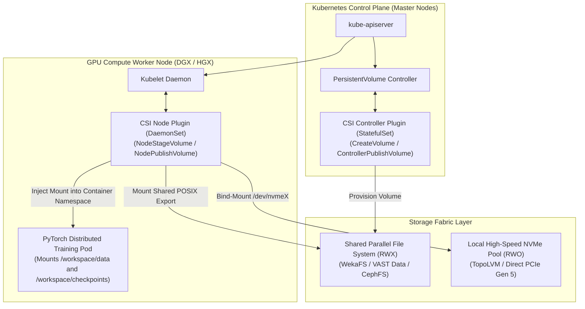

# Volume 13: Kubernetes Cloud-Native Storage (CSI) for AI Workloads

```
====================================================================================================
MODULE 08: HIGH-PERFORMANCE STORAGE & DISTRIBUTED DATA FABRICS FOR AI
VOLUME 13: KUBERNETES CONTAINER STORAGE INTERFACE (CSI), RWX FABRICS & LOCAL NVME
====================================================================================================
```

---

## 1. Executive Architectural Overview & Scaffolding

Deploying distributed deep learning workloads on Kubernetes introduces a major storage dilemma:
* Containers are inherently **ephemeral**: when a training pod crashes, completes, or is rescheduled by Kubelet, its internal writable filesystem layer is destroyed.
* Foundation model training is inherently **stateful**: training jobs require persistent access to multi-terabyte datasets and must flush multi-gigabyte checkpoints every few hundred steps.

The **Container Storage Interface (CSI)** specification standardizes how third-party storage platforms (Weka, VAST, Ceph, Lustre, and local NVMe pools) expose storage volumes directly into container namespaces.



---

## 2. The CSI Specification & gRPC RPC Lifecycle

The Container Storage Interface defines a rigorous gRPC protocol executed between Kubelet, the Kubernetes control plane, and vendor storage drivers:

```text
THE COMPLETE KUBERNETES CSI PROVISIONING & MOUNT LIFECYCLE:
1. User creates PersistentVolumeClaim (PVC).
2. CSI Controller: CreateVolume() ──────────────────> Provisions volume on storage backend.
3. Kube-Scheduler schedules Pod onto GPU Worker Node.
4. CSI Controller: ControllerPublishVolume() ───────> Attaches volume to target node (SAN/NVMe-oF).
5. CSI Node Plugin: NodeStageVolume() ──────────────> Formats device (ext4/xfs) & mounts to global staging.
6. CSI Node Plugin: NodePublishVolume() ────────────> Bind-mounts staging dir into Pod's container namespace!
```

When the training pod terminates:
1. `NodeUnpublishVolume()` unbinds the volume from the container namespace.
2. `NodeUnstageVolume()` unmounts the global staging directory.
3. `ControllerUnpublishVolume()` detaches the volume from the host node.

---

## 3. Storage Access Modes: `ReadWriteOnce` vs. `ReadWriteMany`

Selecting the correct access mode is foundational for AI job scheduling:

```text
+-----------------------------------------------------------------------------------------------+
|                                    CSI ACCESS MODES FOR AI                                    |
+-----------------------------------+-----------------------------------------------------------+
| ReadWriteOnce (RWO)               | ReadWriteMany (RWX)                                       |
+-----------------------------------+-----------------------------------------------------------+
| • Mounted by a SINGLE node only.  | • Mounted concurrently by HUNDREDS of nodes.              |
| • Backed by local NVMe or SAN LUN.| • Backed by shared parallel file systems (Weka/VAST/Ceph).|
| • Maximum IOPS & raw bandwidth.   | • Global namespace consistency across all workers.        |
| • Optimal for: Fast local scratch,| • Optimal for: Master training datasets, synchronized     |
|   DataLoader local caching.       |   model checkpoints, multi-node model loading.            |
+-----------------------------------+-----------------------------------------------------------+
```

---

## 4. Topology-Aware Scheduling (`WaitForFirstConsumer`)

In high-performance clusters equipped with local PCIe Gen 5 NVMe drives, storage is physically tied to a specific chassis.

If a `StorageClass` uses the default `volumeBindingMode: Immediate`:
1. Kubernetes provisions the volume on an arbitrary node before the pod is scheduled.
2. The scheduler then attempts to bind the pod to a GPU node, but discovers the storage volume is pinned to a node on the other side of the datacenter!
3. The pod enters an indefinite **`CrashLoopBackOff`** or **`FailedScheduling`** state.

**The Production Solution**: Always set `volumeBindingMode: WaitForFirstConsumer`:
```yaml
apiVersion: storage.k8s.io/v1
kind: StorageClass
metadata:
  name: local-nvme-sc
provisioner: topolvm.io
volumeBindingMode: WaitForFirstConsumer # Delays volume creation until Pod is placed on a GPU node!
```

---

## 5. Concrete Production Lab: RWX Parallel StorageClass & Multi-Node Training Pod

### 5.1 StorageClass & PVC for Shared Parallel Storage
Save this manifest as `ai_storage_fabric.yaml`:

```yaml
apiVersion: storage.k8s.io/v1
kind: StorageClass
metadata:
  name: vast-ai-storage
provisioner: csi.vastdata.com
parameters:
  vipPool: "storage-vips"
  viewPolicy: "ai-cluster-policy"
reclaimPolicy: Retain
volumeBindingMode: Immediate
mountOptions:
  - proto=rdma
  - port=20049
  - nconnect=16
  - rsize=1048576
  - wsize=1048576
  - noatime
---
apiVersion: v1
kind: PersistentVolumeClaim
metadata:
  name: pretrain-dataset-pvc
  namespace: ai-training
spec:
  accessModes:
    - ReadWriteMany # RWX allows all distributed ranks to read concurrently
  resources:
    requests:
      storage: 50Ti
  storageClassName: vast-ai-storage
```

### 5.2 Multi-Node PyTorch Distributed Training Pod Manifest
Save this manifest as `pytorch_training_pod.yaml`:

```yaml
apiVersion: v1
kind: Pod
metadata:
  name: torch-train-rank0
  namespace: ai-training
  labels:
    app: llama3-pretrain
spec:
  restartPolicy: Never
  containers:
    - name: pytorch-worker
      image: nvcr.io/nvidia/pytorch:24.04-py3
      command: ["torchrun", "--nproc_per_node=8", "train.py"]
      resources:
        limits:
          nvidia.com/gpu: 8
          memory: "512Gi"
          cpu: "64"
      volumeMounts:
        # 1. Mount Shared Parallel File System for Datasets & Checkpoints
        - name: shared-data-vol
          mountPath: /workspace/datasets
        # 2. Mount Local High-Speed NVMe for Fast Scratch / Temporary Files
        - name: local-scratch-vol
          mountPath: /tmp/scratch
  volumes:
    - name: shared-data-vol
      persistentVolumeClaim:
        claimName: pretrain-dataset-pvc
    - name: local-scratch-vol
      emptyDir:
        medium: Memory # Or backed by local NVMe TopoLVM PVC
```

---

## 6. Multi-Dimensional Correlation & Troubleshooting

```text
┌─────────────────────────────┬───────────────────────────────┬─────────────────────────────────────────────────────────┐
│ Failure Signature           │ Root Cause Layer              │ SRE Triage & Diagnostic Remediation                     │
├─────────────────────────────┼───────────────────────────────┼─────────────────────────────────────────────────────────┤
│ Pod stuck in ContainerCreating;│ CSI Node plugin failed       │ Inspect Kubelet logs on worker node:                    │
│ "NodeStageVolume failed"    │ NodeStageVolume RPC           │ $ journalctl -u kubelet -n 100                          │
│                             │                               │ Check CSI daemonset logs: $ kubectl logs -n csi ...     │
├─────────────────────────────┼───────────────────────────────┼─────────────────────────────────────────────────────────┤
│ FailedScheduling:           │ Storage volume provisioned on │ Recreate StorageClass with:                             │
│ "node(s) had volume conflict"│ node lacking GPUs            │ volumeBindingMode: WaitForFirstConsumer                 │
│                             │                               │ Re-submit the training job.                             │
├─────────────────────────────┼───────────────────────────────┼─────────────────────────────────────────────────────────┤
│ Training throughput stalls  │ Missing mountOptions in       │ Update StorageClass mountOptions:                       │
│ across multi-node pods      │ StorageClass (e.g. nconnect=1)│ Add nconnect=16, proto=rdma, and noatime.               │
│                             │                               │ Check active pod mounts: $ mount | grep nfs             │
└─────────────────────────────┴───────────────────────────────┴─────────────────────────────────────────────────────────┘
```

---

## 7. Summary & Technical Takeaways

1. **Standardized Container Storage**: The CSI specification decouples Kubernetes orchestration from proprietary storage implementations through standardized gRPC interfaces.
2. **Access Mode Dichotomy**: Modern AI infrastructure blends **RWO Local NVMe** for ultra-fast node-local scratch buffers with **RWX Parallel Storage (Weka/VAST/Ceph)** for cluster-wide dataset sharing and checkpointing.
3. **Topology-Aware Binding**: `volumeBindingMode: WaitForFirstConsumer` ensures storage volumes are provisioned strictly on the physical nodes selected by Kube-Scheduler for GPU compute.
4. **Optimized Mount Options**: Specifying large block sizes (`rsize=1M`), RDMA transports, and multi-pathing (`nconnect=16`) in the StorageClass unlocks multi-gigabyte-per-second container ingestion.
