# High-Performance Storage & Distributed Data Fabrics for AI (25 Volumes)

Welcome to the **High-Performance Storage & Distributed Data Fabrics for AI Curriculum**, engineered for AI infrastructure architects, storage engineers, and high-performance computing (HPC) practitioners operating petascale and exascale GPU supercomputers.

This curriculum completes the foundational triad of modern AI systems:
$$\mathbf{Compute} \quad [07\text{ Nvidia}, 02\text{ Kubernetes}] \quad \times \quad \mathbf{Network} \quad [07\text{ Nvidia Fabrics}] \quad \times \quad \mathbf{Storage} \quad [08\text{ Storage}]$$

---

## 🗺️ Master Curriculum Architecture

```mermaid
graph TD
    subgraph Part1["Part I: Storage Architectures, NVMe-oF & Kernel Bypass (01–05)"]
        S01["01. The Storage Wall & Ingestion Bandwidth Math"]
        S02["02. NVMe Internals, PCIe Gen 5/6 & Flash Physics"]
        S03["03. NVMe-oF: RDMA vs TCP Transport Mechanics"]
        S04["04. GPUDirect Storage (GDS) & cuFile Low-Level APIs"]
        S05["05. Linux VFS, Page Cache & Direct I/O (O_DIRECT)"]
    end

    subgraph Part2["Part II: Modern AI Parallel File Systems (06–10)"]
        S06["06. WekaFS Architecture & Matrix Distributed Engine"]
        S07["07. VAST Data Universal Storage & DASE Architecture"]
        S08["08. Lustre File System at Exascale: MDS, OSS & LNet"]
        S09["09. IBM Spectrum Scale (GPFS) & Network Shared Disks"]
        S10["10. Comparative Benchmark: Weka vs VAST vs Lustre vs GPFS"]
    end

    subgraph Part3["Part III: Distributed Object Storage & Cloud-Native Fabrics (11–15)"]
        S11["11. High-Performance Object Storage: MinIO & SIMD"]
        S12["12. Ceph Distributed Storage: RADOS, BlueStore & CRUSH"]
        S13["13. Kubernetes Cloud-Native Storage (CSI) for AI"]
        S14["14. Data Caching: Alluxio, JuiceFS & GPU In-Memory Cache"]
        S15["15. Flash-Optimized Data Loaders: WebDataset & DALI"]
    end

    subgraph Part4["Part IV: Exascale Checkpointing & Fault Resilience (16–20)"]
        S16["16. The Checkpointing Wall in Foundation Model Training"]
        S17["17. Asynchronous & Non-Blocking Checkpointing Engine"]
        S18["18. TorchTitan & Megatron Distributed Checkpointing"]
        S19["19. Storage Fault Tolerance & Automated Auto-Recovery"]
        S20["20. Disaster Recovery, Snapshots & Multi-Region Sync"]
    end

    subgraph Part5["Part V: Production SRE, Performance Tuning & Forensics (21–25)"]
        S21["21. Storage Benchmarking Masterclass: fio, IOR & mdtest"]
        S22["22. Storage Network Tuning: RoCEv2, PFC, ECN & MTU 9000"]
        S23["23. Production Storage Telemetry: Prometheus & eBPF Tracing"]
        S24["24. Storage Forensics: Drive Flaps, Bit Rot & Split-Brain"]
        S25["25. Hands-On Storage Mastery Lab & Test Harness"]
    end

    Part1 --> Part2
    Part2 --> Part3
    Part3 --> Part4
    Part4 --> Part5
```



---

## 🔬 Multi-Dimensional Storage Correlation Matrix

Diagnosing storage bottlenecks and cluster starvation in high-performance GPU environments requires cross-layer correlation across four distinct physical and logical domains:

```text
+---------------------------------------------------------------------------------------------------------------+
|                                4-DIMENSIONAL STORAGE CORRELATION MATRIX                                       |
+----------------------+-----------------------+-------------------------+--------------------------------------+
| 1. Compute & HBM     | 2. Storage Network    | 3. Storage Media & NVMe | 4. Distributed File System & VFS     |
+----------------------+-----------------------+-------------------------+--------------------------------------+
| • GPU HBM Ingestion  | • RoCEv2 / InfiniBand | • PCIe Gen 5 x4 NVMe    | • WekaFS Matrix Distributed Hash     |
| • GDS cuFile DMA     | • NVMe/RDMA Capsules  | • NAND Flash TLC / QLC  | • VAST DASE SCM Write Buffer         |
| • DALI Decompression | • MTU 9000 Jumbo Frame| • Flash Controller Queues| • Lustre MDS / OST Striping          |
| • PyTorch DataLoader | • PFC Pause Storms    | • Write Amplification   | • Linux Page Cache / VFS Locks       |
| • Asynchronous Checkpoint| • DCQCN ECN Throttling| • Garbage Collection Spike|• io_uring / O_DIRECT Ring Buffers   |
+----------------------+-----------------------+-------------------------+--------------------------------------+
```

### Cross-Layer Failure Signatures & Multi-Dimensional Root Causes:
1. **The GPU Starvation Trap (Low MFU)**:
   * *Compute Layer*: GPU Model FLOPs Utilization (MFU) drops from $55\%$ to $18\%$. Nsight Systems shows kernels sitting idle in `cudaStreamSynchronize` waiting for data loaders.
   * *OS Layer*: Standard Python `torch.utils.data.DataLoader` reads millions of small image/text files sequentially. The Linux Page Cache experiences lock contention across 128 CPU worker threads.
   * *Storage Layer*: The parallel file system's Metadata Server (MDS) is overwhelmed by millions of `stat()` and `open()` IOPS, causing storage latency to spike from $200\,\mu\text{s}$ to $45\,\text{ms}$.
   * *Remediation*: Re-shard data into sequential **WebDataset** `.tar` archives or Megatron `.bin`/`.idx` memory-mapped files and enable **GPUDirect Storage (GDS)** with `cuFile`.

2. **The Checkpointing Wall Cluster Stall**:
   * *Compute Layer*: A 405-billion-parameter training run freezes across 1,024 GPUs every 1,000 steps for 14 minutes.
   * *Storage Layer*: All 1,024 ranks dump their sharded model states ($6.48\text{ TB}$ total) simultaneously, saturating the storage fabric's write bandwidth.
   * *Network Layer*: PFC Pause frames fire across storage network switches, backing up into compute switches and causing NCCL collective timeouts.
   * *Remediation*: Deploy **Asynchronous Non-Blocking Checkpointing** (`torch.distributed.checkpoint`), staging the checkpoint directly into host RAM in $<3$ seconds, then streaming to persistent parallel storage in the background while GPUs immediately resume compute.

3. **NVMe SSD Garbage Collection Tail Latency**:
   * *Physical Media Layer*: Heavy write amplification causes flash controller Garbage Collection (GC) blocks to erase in real time, injecting sporadic $50\,\text{ms}$ write spikes.
   * *Transport Layer*: NVMe-oF completion queues stall, exhausting initiator credits and propagating backpressure to the distributed file system.
   * *Remediation*: Enforce SSD over-provisioning ($20\%$), schedule background fstrim/discard jobs, and deploy VAST DASE Storage Class Memory (SCM) write buffers to absorb write spikes.

---

## 📚 Complete 25-Volume Curriculum Index

Every volume strictly satisfies the **8-Layer Pedagogical Masterclass Standard**: Target Audience & Scaffolding, Zero-to-One Foundational Intuition, Evolutionary Lineage, First-Principles Mathematics, Comparative Trade-Off Matrices, Concrete Production Labs, Hardware Grounding, and Hands-On Exercises with Solutions.

### Part I: Storage Architectures, NVMe-oF & Kernel Bypass (Volumes 01–05)
- [**Volume 01: The Storage Wall & Ingestion Bandwidth Math**](01-storage-wall-and-ingestion-bandwidth-math.md) — GPU starvation physics, dataset ingestion math ($B \times S \times \text{bytes} / \Delta t$), random vs sequential access profiles, and the exascale storage hierarchy.
- [**Volume 02: NVMe Internals, PCIe Gen 5/6 & Flash Physics**](02-nvme-internals-pcie-gen5-and-flash-physics.md) — NVMe SQ/CQ ring buffers, doorbell registers, NAND flash physics (SLC/TLC/QLC), Write Amplification Factor (WAF), and EDSFF E1.S/E3.S form factors.
- [**Volume 03: NVMe-oF: RDMA vs TCP Transport Mechanics**](03-nvme-of-rdma-vs-tcp-transport-mechanics.md) — NVMe over Fabrics protocol, capsule transport, NVMe/RDMA (RoCEv2/IB) zero-copy kernel bypass vs NVMe/TCP, SPDK polled-mode drivers.
- [**Volume 04: GPUDirect Storage (GDS) & cuFile Low-Level APIs**](04-gpudirect-storage-gds-and-cufile-architecture.md) — Direct DMA from NVMe to GPU HBM bypassing CPU DRAM, `nvidia-fs.ko` driver, `libcufile.so` APIs, and root complex PCIe switch topologies.
- [**Volume 05: Linux VFS, Page Cache & Direct I/O (O_DIRECT)**](05-linux-vfs-page-cache-and-direct-io-mechanics.md) — Inodes, dentries, Page Cache double-buffering trap, `flusher` threads, `io_uring` ring queues, and `O_DIRECT` 4KB alignment semantics.

### Part II: Modern AI Parallel File Systems (Volumes 06–10)
- [**Volume 06: WekaFS Architecture & Matrix Distributed Engine**](06-wekafs-architecture-and-matrix-distributed-engine.md) — User-space zero-copy microkernel, distributed hash table metadata without centralized MDS, Snap-to-Object S3 tiering, and Weka SR-IOV RDMA client.
- [**Volume 07: VAST Data Universal Storage & DASE Architecture**](07-vast-data-universal-storage-and-dase-architecture.md) — Disaggregated Shared Everything (DASE), stateless compute nodes + NVMe-oF JBOF enclosures, SCM write buffers, global similarity deduplication, and NFS over RDMA.
- [**Volume 08: Lustre File System at Exascale: MDS, OSS & LNet**](08-lustre-file-system-at-exascale-mds-oss-and-lnet.md) — Management Server (MGS), Metadata Server (MDS/MDT), Object Storage Servers (OSS/OST), LNet multi-rail routing, and `lfs setstripe` striping tuning.
- [**Volume 09: IBM Spectrum Scale (GPFS) & Network Shared Disks**](09-ibm-spectrum-scale-gpfs-and-network-shared-disks.md) — Cluster managers, quorum nodes, Network Shared Disks (NSD), token-based distributed locking, automated ILM policy tiering, and `verbs` RDMA transport.
- [**Volume 10: Comparative Benchmark: Weka vs VAST vs Lustre vs GPFS**](10-comparative-benchmark-weka-vast-lustre-gpfs.md) — 4-Dimensional benchmark evaluation (Small-file IOPS, sequential checkpoint bandwidth, metadata rate, flash endurance), I/O profiling tools (`ior`, `fio`, `mdtest`).

### Part III: Distributed Object Storage & Cloud-Native Fabrics (Volumes 11–15)
- [**Volume 11: High-Performance Object Storage: MinIO & SIMD**](11-high-performance-object-storage-minio-and-simd.md) — S3 RESTful semantics, Reed-Solomon $(M+N)$ erasure coding math, AVX-512/Neon SIMD acceleration ($100\text{ GB/s}+$ per node), and HighwayHash bit-rot protection.
- [**Volume 12: Ceph Distributed Storage: RADOS, BlueStore & CRUSH**](12-ceph-distributed-storage-rados-bluestore-crush.md) — RADOS clusters, CRUSH mathematical placement algorithm without centralized tables, BlueStore direct block engine, and CephFS vs RGW tuning.
- [**Volume 13: Kubernetes Cloud-Native Storage (CSI) for AI**](13-kubernetes-cloud-native-storage-csi-for-ai.md) — Container Storage Interface (CSI) lifecycle, `ReadWriteMany` (RWX) parallel CSI drivers vs `ReadWriteOnce` (RWO) local NVMe, and TopoLVM dynamic volume provisioning.
- [**Volume 14: Data Caching: Alluxio, JuiceFS & GPU In-Memory Cache**](14-data-caching-alluxio-juicefs-and-gpu-cache.md) — Solving remote cloud storage latency jitter, Alluxio tiered RAM/NVMe caching, JuiceFS metadata-data decoupled architecture, and host `tmpfs` staging.
- [**Volume 15: Flash-Optimized Data Loaders: WebDataset & DALI**](15-flash-optimized-data-loaders-webdataset-and-dali.md) — The Small-File Poison, WebDataset sequential `.tar` sharding, Megatron-LM `.bin`/`.idx` memory-mapped formats, and NVIDIA DALI in-GPU decoding.

### Part IV: Exascale Checkpointing & Fault Resilience (Volumes 16–20)
- [**Volume 16: The Checkpointing Wall in Foundation Model Training**](16-the-checkpointing-wall-in-foundation-model-training.md) — Model state footprint calculation ($16 \text{ bytes/param}$), cluster compute downtime, and the Young & Daly optimal checkpoint interval formula ($T_{\text{opt}} = \sqrt{2 \cdot \delta \cdot \text{MTBF}}$).
- [**Volume 17: Asynchronous & Non-Blocking Checkpointing Engine**](17-asynchronous-and-non-blocking-checkpointing-engine.md) — Staging state to host DRAM in milliseconds, background POSIX/io_uring streaming, double-buffering memory limits, and PyTorch Distributed Checkpoint (DCP).
- [**Volume 18: TorchTitan & Megatron Distributed Checkpointing**](18-torchtitan-and-megatron-distributed-checkpointing.md) — Tensor Parallel ($TP$) and Pipeline Parallel ($PP$) checkpoint sharding, dynamic re-sharding across different GPU topologies, and key-value metadata manifests.
- [**Volume 19: Storage Fault Tolerance & Automated Auto-Recovery**](19-storage-fault-tolerance-and-automated-recovery.md) — Checksum validation, atomic rename semantics (`renameat2`), preventing truncated checkpoint corruptions, and Slurm/Kubernetes auto-resume.
- [**Volume 20: Disaster Recovery, Snapshots & Multi-Region Sync**](20-disaster-recovery-snapshots-and-multi-region-sync.md) — Point-in-time Copy-on-Write (CoW) filesystem snapshots, cross-datacenter WAN replication pipelines, AES-256 XTS encryption, and HashiCorp Vault key rotation.

### Part V: Production SRE, Performance Tuning & Forensics (Volumes 21–25)
- [**Volume 21: Storage Benchmarking Masterclass: fio, IOR & mdtest**](21-storage-benchmarking-masterclass-fio-ior-mdtest.md) — `fio` synthetic profiling (IOPS, bandwidth, P99 latency percentiles), `ior` MPI-IO parallel checkpoint benchmarking, and `mdtest` metadata stress testing.
- [**Volume 22: Storage Network Tuning: RoCEv2, PFC, ECN & MTU 9000**](22-storage-network-tuning-rocev2-pfc-ecn-jumbo-frames.md) — Isolating storage traffic from compute fabrics (dual-rail topologies), MTU 9000 jumbo frames, storage PFC thresholds, and DCQCN ECN buffer limits.
- [**Volume 23: Production Storage Telemetry: Prometheus & eBPF Tracing**](23-production-storage-telemetry-prometheus-and-ebpf.md) — High-cardinality storage metrics, NVMe SMART health monitoring, and eBPF kernel I/O tracing (`biolatency`, `biosnoop`, `xfsdist`) for tail-latency detection.
- [**Volume 24: Storage Forensics: Drive Flaps, Bit Rot & Split-Brain**](24-storage-forensics-drive-flaps-bit-rot-split-brain.md) — NVMe drive failure triage, SMART attribute analysis, filesystem corruption recovery, D-state hung process forensics, and split-brain resolution.
- [**Volume 25: Hands-On Storage Mastery Lab & Test Harness**](25-hands-on-storage-mastery-lab-and-test-harness.md) — 25 Capstone production engineering challenges and automated test harness `storage_systems_mastery_harness.py` validating all storage equations with 100% test coverage.

---

## 🛠️ Low-Level Hands-On Storage Diagnostic Command Matrix

| Domain | CLI Tool / Binary | Key Flags & Syntaxes | Diagnostic Purpose & Signature |
| :--- | :--- | :--- | :--- |
| **NVMe Health** | `nvme` | `nvme smart-log /dev/nvme0n1`<br>`nvme list` | Inspect NVMe temperature, percentage used (endurance), media errors, and critical warnings. |
| **GDS Pipeline** | `gdscheck` | `gdscheck -p`<br>`gdscheck -v -f /mnt/weka/test.dat` | Verify GPUDirect Storage driver (`nvidia-fs.ko`), PCIe topology alignment, and direct DMA throughput. |
| **I/O Profiling** | `fio` | `fio --name=ai_bench --ioengine=libaio --direct=1 --bs=1M --rw=read --iodepth=32` | Measure sequential throughput, random IOPS, and P99 tail latency under configurable concurrency. |
| **VFS & Locks** | `vmstat`, `iostat` | `iostat -xz 1`<br>`vmstat -w 1` | Monitor disk utilization (`%util`), average queue size (`aqu-sz`), and D-state blocked processes (`b`). |
| **eBPF Tracing** | `biolatency` | `biolatency -D 10` | Output microsecond-granularity block device latency histograms to identify I/O tail latency outliers. |
| **Lustre Striping**| `lfs` | `lfs getstripe <file>`<br>`lfs setstripe -c -1 -s 32M <dir>` | Inspect and configure Lustre OST stripe counts and stripe sizes to optimize checkpointing bandwidth. |
| **Weka Health** | `weka` | `weka status`<br>`weka cluster alerts` | Monitor Weka cluster state, drive health, rebuilding progress, and IOPS across compute nodes. |
| **VAST Telemetry** | `vast` | `vast-cli show-nodes`<br>`vast-cli show-cnode-performance` | Query VAST DASE C-node throughput, SCM write buffer absorption rate, and global deduplication ratios. |
