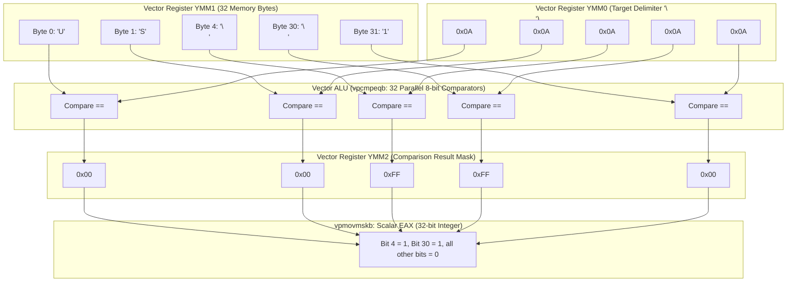

# Week 27: Hardware SIMD Vectorization & Foreign Function Interface (FFI) Mechanics

## Why This Week Matters for Your Career Transition

As a senior C# engineer, you have spent years mastering high-level architectural abstractions: the Common Language Runtime (CLR), garbage collection generations, asynchronous state machines (`async`/`await`), and concurrent pipelines built atop the .NET ThreadPool. In typical enterprise workloads, these abstractions provide immense productivity without unacceptable latency. However, when you enter the realm of systems engineering—building high-throughput network proxies, real-time telemetry engines, analytical columnar databases, or ultra-low-latency financial matching engines—you will collide violently with the physical throughput limits of a single CPU core. At this boundary, optimizing algorithmic complexity from $O(N)$ to $O(\log N)$ is no longer enough; you must optimize the constant factor by maximizing the work executed per CPU clock cycle.

This week demystifies the hardware execution engine underneath managed runtimes. You will understand how modern microprocessors execute parallel arithmetic at the silicon level using SIMD (Single Instruction, Multiple Data) execution units, and why accessing these units exposes radical philosophical divisions between C#, Go, and Rust. You will discover why C# (.NET 8+) offers first-class, JIT-intrinsic hardware vectorization that rivals C++, why Go deliberately refuses to provide SIMD intrinsics in the language standard library, and how Rust enables zero-cost vectorization and zero-overhead C interoperability. Crucially, you will examine the exact microarchitectural mechanics of Foreign Function Interfaces (FFI), quantifying why calling a native C function costs ~1 nanosecond in Rust, ~10 nanoseconds in modern C#, and a staggering 50–100 nanoseconds in Go due to goroutine stack transitions.

---

## 1. CPU Vector Hardware & Microarchitectural Foundations

To reason about vectorization across runtimes, you must first discard programming language abstractions and inspect the CPU's physical datapath.

```
       Flynn's Classical Computer Architecture Taxonomy
  ┌─────────────────────────────┬─────────────────────────────┐
  │  SISD (Single Inst, Single) │  SIMD (Single Inst, Multi)  │
  │  Standard Scalar ALU        │  AVX2, AVX-512, ARM NEON    │
  │  e.g., add eax, ebx         │  e.g., vpaddb ymm0, ymm1    │
  ├─────────────────────────────┼─────────────────────────────┐
  │  MISD (Multi Inst, Single)  │  MIMD (Multi Inst, Multi)   │
  │  Fault-Tolerant Systems     │  Multi-Core SMP, Clusters   │
  │  (Space Shuttle Flight Ctrl)│  Task Parallel Library      │
  └─────────────────────────────┴─────────────────────────────┘
```

Modern high-performance computation relies on two orthogonal dimensions of hardware parallelism:
1. **MIMD (Multiple Instruction, Multiple Data)**: Multiple independent CPU cores executing distinct instruction streams on distinct data caches (e.g., .NET `Parallel.ForEach`, Go goroutines, Rust OS threads).
2. **SIMD (Single Instruction, Multiple Data)**: A single execution core dispatching a single machine instruction that operates concurrently across an array of data lanes packed inside an ultra-wide hardware register.

### Execution Pipelines: The Execution Ports of Modern x86 Cores

A modern x86 core (such as Intel Golden Cove / Raptor Lake or AMD Zen 4) is an Out-of-Order (OoO) superscalar execution engine. Machine instructions are decoded into micro-operations ($\mu$ops), allocated to a Unified Reservation Station, and dispatched across parallel execution ports:

```
  Unified Reservation Station (Scheduler)
        │            │            │            │
      Port 0       Port 1       Port 5       Port 6
   ┌──────────┐ ┌──────────┐ ┌──────────┐ ┌──────────┐
   │Scalar ALU│ │Scalar ALU│ │Scalar ALU│ │Scalar ALU│
   │Vector ALU│ │Vector ALU│ │Vector ALU│ │Branch    │
   │(FMA/Vec) │ │(FMA/Vec) │ │(Perm/Shf)│ │          │
   └──────────┘ └──────────┘ └──────────┘ └──────────┘
```

Notice that vector execution units sit on specific ports (e.g., Ports 0, 1, and 5). 
- A simple byte equality check like `vpcmpeqb` has an execution latency of **1 clock cycle** and a reciprocal throughput of **0.5 cycles** on modern cores because it can be dispatched to both Port 0 and Port 1 simultaneously. The CPU can retire two 256-bit comparisons every single clock cycle, evaluating **64 bytes per clock cycle**.
- Scalar code using standard 64-bit integer registers can inspect at most 8 bytes per instruction, leaving the vector execution pipelines completely starved and unutilized.

### The Evolution of x86 Vector Registers

On x86-64 hardware, the vector execution pipeline has evolved across four distinct architectural generations, each doubling or quadrupling the register bit-width:

```
  MMX (1997):      [ 64 bits ] (Aliased to x87 FPU stack)
  SSE (1999):      [ 128 bits: XMM0 - XMM15 ]
  AVX/AVX2 (2013): [ 256 bits: YMM0 - YMM15 ]
  AVX-512 (2016):  [ 512 bits: ZMM0 - ZMM31 ] + Opmask Registers (k0 - k7)
```

1. **XMM (128-bit Registers)**: Introduced with Streaming SIMD Extensions (SSE). A 128-bit XMM register holds:
   - $16 \times \text{8-bit integers (bytes)}$
   - $8 \times \text{16-bit integers (shorts)}$
   - $4 \times \text{32-bit integers or single-precision floats}$
   - $2 \times \text{64-bit integers or double-precision floats}$
2. **YMM (256-bit Registers)**: Introduced with Advanced Vector Extensions (AVX) and AVX2. The lower 128 bits of a YMM register physically alias the corresponding XMM register. A 256-bit YMM register holds:
   - $32 \times \text{8-bit integers}$
   - $16 \times \text{16-bit integers}$
   - $8 \times \text{32-bit integers / floats}$
   - $4 \times \text{64-bit integers / doubles}$
3. **ZMM (512-bit Registers)**: Introduced with AVX-512. Doubles the register width again and expands the register file from 16 to 32 architectural registers (`zmm0`–`zmm31`), adding 8 dedicated mask registers (`k0`–`k7`) for conditional per-lane execution.

### Microarchitectural Anatomy: A 256-Bit AVX2 Vector Operation

Consider scanning a memory buffer to find occurrences of a specific ASCII delimiter (e.g., the newline character `\n`, byte value `0x0A`). In a scalar loop, the CPU loads 1 byte, compares it against `0x0A`, branches based on the flag register, and repeats this loop 32 times.

Under AVX2, the processor dispatches three vectorized instructions that evaluate all 32 bytes in parallel:

```
Step 1: Broadcast target byte (0x0A) across all 32 lanes of YMM0
YMM0: [ 0A | 0A | 0A | 0A | 0A | 0A | ... | 0A | 0A | 0A | 0A ] (32 x 8-bit lanes)

Step 2: Unaligned Vector Load from memory buffer into YMM1 via `vmovdqu`
YMM1: [ 'U'| 'S'| 'E'| 'R'| '\n'|'I'| ... | 'D'| ','| '\n'| '1' ]

Step 3: Parallel Byte Comparison via `vpcmpeqb ymm2, ymm1, ymm0`
Each lane compares YMM1[i] == YMM0[i]. If equal -> 0xFF; else -> 0x00.
YMM2: [ 00 | 00 | 00 | 00 | FF | 00 | ... | 00 | 00 | FF | 00 ]

Step 4: Bitmask Extraction via `vpmovmskb eax, ymm2`
Extract the most significant bit (bit 7) of each of the 32 bytes into 32-bit scalar register EAX.
EAX:  0b00000000_00000000_00000010_00010000 (Bits set exactly where '\n' matched!)
```



Once the mask is inside the general-purpose integer register `EAX`, the scalar core can count the matches instantly using the single-cycle `POPCNT` (Population Count) instruction, or extract individual match indices using `TZCNT` (Count Trailing Zeros) and `BLSR` (Reset Lowest Set Bit). A single core processes 32 bytes per cycle.

### The AVX-to-SSE Transition Penalty (`vzeroupper`)

When Intel introduced AVX, they preserved backward compatibility by mapping the lower 128 bits of the 256-bit YMM registers directly onto the existing 128-bit XMM registers. However, this created a microarchitectural hazard:
- Legacy SSE instructions (e.g., `movaps xmm0, xmm1`) modify only the lower 128 bits of the register and leave the upper 128 bits untouched.
- AVX instructions use VEX prefixes (e.g., `vmovaps ymm0, ymm1`) and zero-out the upper bits when writing to an XMM register.
- If a program executes an AVX instruction that leaves dirty state in the upper 128 bits of a YMM register, and subsequent code invokes a legacy SSE instruction, the CPU hardware enters a split-state condition. The CPU must save and restore internal register states using internal microcode assists, stalling execution for **up to 70 clock cycles per transition**.

To prevent this catastrophic penalty, compilers and assembly authors must emit the `vzeroupper` instruction before returning from an AVX-enabled function. `vzeroupper` clears the upper 128 bits of all YMM registers, resetting the CPU to clean SSE-compatible execution state. C# RyuJIT and Rust LLVM emit `vzeroupper` automatically; Go Plan 9 assembly authors must manually remember to write `VZEROUPPER` before `RET`.

### AVX2 vs. AVX-512: Architectural Nuance

While AVX-512 doubles throughput to 64 bytes per cycle, it introduces critical systems engineering trade-offs:
- **Frequency Throttling**: On Intel Skylake-X and early Xeon Scalable architectures, dispatching 512-bit wide instructions to Port 0 and Port 5 draws massive transient current ($dI/dt$). The CPU voltage regulator cannot supply this instantly without voltage sag, so the CPU automatically drops its core frequency license by 10% to 20% across all cores for several milliseconds. If your workload mixes sporadic AVX-512 instructions with scalar code, you can degrade total system throughput.
- **Microarchitectural Fixes**: Modern AMD Zen 4/5 and Intel Sapphire Rapids architectures use dual-pumped 256-bit execution units or dedicated power planes, virtually eliminating the AVX-512 downclocking penalty. However, AVX2 remains the universal baseline for cross-platform x86-64 deployments.

---

## 2. Auto-Vectorization vs. Explicit Hardware Intrinsics

Compilers attempt to optimize loops automatically through **auto-vectorization**. Understanding why auto-vectorization frequently fails reveals why systems engineers must write explicit hardware intrinsics.

### Memory Alignment Requirements & Cache Line Boundaries

CPUs transfer data between L1D cache and vector registers most efficiently when memory addresses are aligned to the vector width:
- 16-byte alignment for SSE (`_mm_load_si128`)
- 32-byte alignment for AVX2 (`_mm256_load_si256`)
- 64-byte alignment for AVX-512 (`_mm512_load_si512`)

```
       Aligned vs Unaligned Instruction Hazards
  Instruction:                 Memory Requirement:       Violation Consequence:
  ┌───────────────────────────┬─────────────────────────┬───────────────────────┐
  │ _mm256_load_si256 (vmovdqa)│ Exactly 32-byte aligned │ Hardware #GP Exception│
  │                           │ (addr & 31 == 0)        │ (Instant Process Crash)│
  ├───────────────────────────┼─────────────────────────┼───────────────────────┤
  │ _mm256_loadu_si256(vmovdqu│ Any arbitrary byte      │ Safe! Negligible      │
  │                           │ boundary                │ penalty on modern CPUs│
  └───────────────────────────┴─────────────────────────┴───────────────────────┘
```

Modern x86-64 processors support unaligned loads (`vmovdqu` / `_mm256_loadu_si256`) with near-zero latency penalty *provided the 32-byte chunk does not cross a 64-byte physical cache line boundary*. When an unaligned load straddles two cache lines:
1. The memory execution unit must issue two distinct L1 cache line reads.
2. The split load buffer reassembles the halves.
3. If the load straddles a 4KB virtual memory page boundary, the processor must perform two separate Translation Lookaside Buffer (TLB) lookups, causing microarchitectural pipeline stalls.

Compilers cannot assume user-supplied pointers are 32-byte aligned unless proven via type systems or explicit alignment attributes.

```
       64-Byte CPU Cache Line Boundary Hazard
  [ Cache Line 0 (64 Bytes)             ][ Cache Line 1 (64 Bytes)             ]
  ┌────────────────────────────────────┬────────────────────────────────────┐
  │ ... | Byte 48 | ... | Byte 63      │ Byte 64 | Byte 65 | ...            │
  └────────────────────────────────────┴────────────────────────────────────┘
                  ▲
                  │ 32-Byte AVX2 Unaligned Load (Bytes 48 to 79)
                  └───────── SPLIT ACROSS CACHE LINES! ─────────┘
                  Requires 2 L1 Cache Reads + Microcode Merge Buffer
```

### Non-Temporal Streaming Stores: Bypassing the Cache Hierarchy

When processing massive streaming datasets (e.g., generating gigabytes of encrypted or filtered data), standard vector stores follow the **Read-For-Ownership (RFO)** protocol:
1. The CPU loads the target cache line from main memory into L1D cache.
2. It modifies the bytes in cache.
3. It marks the cache line as modified (Dirty in MESI protocol).
4. Eventually, it writes it back to RAM.

This pollutes the CPU cache hierarchy with write-only data, evicting hot lookup tables and working memory. To prevent this, processors provide **Non-Temporal Stores** (`vmovntdq` / `_mm256_stream_si256`):
- Non-temporal stores write data directly to internal Write-Combining (WC) buffers, bypassing L1, L2, and L3 caches entirely.
- Once 64 bytes accumulate in the WC buffer, the CPU streams the entire cache line directly to DRAM across the memory bus.
- In C#, this is available via `Avx.StoreAlignedNonTemporal`; in Rust via `_mm256_stream_si256`; in Go, it is completely inaccessible without assembly.

### The Pointer Aliasing Impasse

The primary killer of auto-vectorization is **pointer aliasing**. Consider this simple vector addition:

```c
void add_buffers(float* a, float* b, float* c, size_t n) {
    for (size_t i = 0; i < n; i++) {
        c[i] = a[i] + b[i];
    }
}
```

Can the compiler vectorize this loop into 8-float AVX additions? 
In C and C++, the compiler must assume that pointer `c` could overlap with pointer `a` or `b` (e.g., `c = a + 1`). If `c` aliases `a`, writing `c[0]` modifies `a[1]`, creating a loop-carried data dependency. Vectorizing the loop would change the program's output, violating the language specification.

To allow vectorization, C99 introduced the `restrict` keyword (`float* restrict c`), promising the compiler that memory blocks do not overlap.

#### How Language Memory Models Handle Aliasing:
- **C#**: `Span<T>` and array references can legally alias. RyuJIT cannot infer non-overlapping memory without runtime alias checks (`if (c + n <= a || a + n <= c)`), which adds branch overhead and bloats code size.
- **Go**: Slices can point to overlapping regions of the same backing array. Go's compiler (`cmd/compile`) lacks sophisticated alias analysis and possesses no vectorization pipeline.
- **Rust**: **Rust solves the pointer aliasing problem by fundamental type theory.** Rust's borrow checker enforces the Aliasing XOR Mutability rule: you can have either many immutable references (`&T`) OR exactly one mutable reference (`&mut T`), never both simultaneously. Because `c: &mut [f32]` is guaranteed to be exclusive, LLVM has *mathematical proof* that `c` cannot alias `a` or `b`. As a direct consequence, Rust auto-vectorizes loops that fail to vectorize in C and C# without manual pragmas.

```
Pointer Aliasing Guarantee Across Languages:
┌──────────────┬────────────────────────────────┬───────────────────────────┐
│ Language     │ Aliasing Rule                  │ Auto-Vectorization Impact │
├──────────────┼────────────────────────────────┼───────────────────────────┤
│ C / C++      │ Pointers may alias by default  │ Blocked unless 'restrict' │
│ C# (.NET)    │ Spans/Arrays may alias         │ Blocked or requires runtime│
│              │                                │ versioning checks         │
│ Go           │ Slices may alias               │ Non-existent SIMD pass    │
│ Rust         │ &mut T is mathematically       │ LLVM vectorizes naturally │
│              │ guaranteed non-aliasing        │ without annotations       │
└──────────────┴────────────────────────────────┴───────────────────────────┘
```

---

## 3. Language SIMD Support: Architectural Philosophy

The three languages treat vector hardware with radically diverging engineering philosophies:

```
  ┌────────────────────────────────────────────────────────────────────────┐
  │ C# (.NET 8): Hardware Intrinsics via RyuJIT pattern matching          │
  │ System.Runtime.Intrinsics.X86.Avx2 -> 1:1 hardware instruction mapping │
  ├────────────────────────────────────────────────────────────────────────┤
  │ Go: Zero intrinsic support in standard compiler; forced into Plan 9   │
  │ assembly files (.s) or third-party code generators (avo)               │
  ├────────────────────────────────────────────────────────────────────────┤
  │ Rust: Dual-tier architecture (core::arch intrinsics + portable SIMD)  │
  │ zero-cost LLVM code generation with compile-time feature gating        │
  └────────────────────────────────────────────────────────────────────────┘
```

### C# (.NET): The RyuJIT Hardware Intrinsics Revolution

Historically, .NET provided `System.Numerics.Vector<T>`, a generic abstraction where the vector width was determined by the runtime (128-bit on older runtimes, 256-bit on newer systems). While portable, it prevented engineers from using architecture-specific instructions like `Avx2.MoveMask` or `Pclmulqdq` (carry-less multiplication for hashing/crypto).

With .NET Core 3.0 and refined through .NET 8, Microsoft introduced `System.Runtime.Intrinsics` (`System.Runtime.Intrinsics.X86` and `Arm`). These types are not high-level wrappers; they are **JIT compiler intrinsics**:
1. When RyuJIT encounters `Avx2.CompareEqual(vecA, vecB)`, it does not emit a managed call instruction or marshal parameters.
2. It compiles the method call directly into the machine instruction `vpcmpeqb ymm0, ymm1, ymm2`.
3. Hardware capability checks like `if (Avx2.IsSupported)` are treated as JIT compile-time constants. During Tier-1 JIT compilation, if the host processor supports AVX2, RyuJIT folds the conditional branch to `true` and completely strips the dead fallback branch from machine code.
4. Structs like `Vector256<byte>` are zero-cost stack-allocated value types. RyuJIT maps them directly to physical YMM registers with zero GC heap allocation.

### Go: The Assembly Wall and SWAR Fallbacks

Go’s absence of SIMD intrinsics is a deliberate architectural choice made by the Go authors (Rob Pike, Ken Thompson, Russ Cox):
- **Compiler Simplicity**: Go’s compiler (`cmd/compile`) was written to prioritize ultra-fast compilation times over maximum code optimization. Integrating vectorization passes or managing wide vector register allocation across SSA graphs would dramatically increase compiler complexity and build durations.
- **Portability Dogma**: Go favors identical semantic behavior across architectures over hardware-specific optimization paths.

Because pure Go cannot express vector instructions, Go engineers requiring SIMD have three paths:
1. **Plan 9 Assembly (`.s` files)**: Write assembly code manually using Go's idiosyncratic Plan 9 assembly syntax. The Go compiler cannot inline Plan 9 assembly functions. Every call to an assembly routine incurs standard function prologue/epilogue overhead and prevents caller-side compiler optimizations.
2. **Assembly Generators (`avo`)**: Use Go tools like `avo` to write vector algorithms in Go syntax, generating `.s` assembly files at compile time:

```go
// Example avo code generator snippet in Go
package main
import . "github.com/mmcloughlin/avo/build"

func main() {
    TEXT("CountByteAVX2", NOSPLIT, "func(data []byte, target byte) uint64")
    Doc("CountByteAVX2 counts target byte occurrences using AVX2")
    ptr := Load(Param("data").Base(), GP64())
    len := Load(Param("data").Len(), GP64())
    // Constructs YMM vector registers, emits VMOVDQU, VPCMPEQB, VPMOVMSKB...
    Generate()
}
```

3. **SWAR (SIMD Within A Register)**: When writing pure Go without assembly, engineers use 64-bit integer bitwise arithmetic to process 8 bytes simultaneously inside standard GP registers. By XORing an 8-byte word with a repeated target byte (e.g., `0x0A0A0A0A0A0A0A0A`) and using subtraction tricks (`(v - 0x0101010101010101) & ~v & 0x8080808080808080`), Go code can detect delimiter presence across 8 bytes per iteration without hardware SIMD support. While faster than byte-by-byte loops, SWAR achieves only a fraction of true 32-byte AVX2 throughput.

### Rust: Zero-Cost Hardware Intrinsics and the Inlining Hazard

Rust bridges the gap between hardware specificity and type safety through LLVM:
1. **Explicit Intrinsics (`core::arch::x86_64`)**: Provides direct access to all Intel/AMD intrinsics (e.g., `_mm256_cmpeq_epi8`). These functions are marked `unsafe` because executing an AVX2 instruction on a CPU that lacks AVX2 support triggers an Invalid Opcode (`#UD`) hardware exception, crashing the process.
2. **Target Feature Isolation**: Rust uses `#[target_feature(enable = "avx2")]` to instruct LLVM to generate code for specific microarchitectural extensions. Rust allows dynamic runtime feature dispatch via the macro `is_x86_feature_detected!("avx2")`.

#### The Senior C# Developer Trap: Target Feature Inlining
In C#, RyuJIT freely inlines functions containing `Avx2` calls if the outer method executes on an AVX2-capable host.
In Rust, **a function marked `#[target_feature(enable = "avx2")]` CANNOT be inlined into a function that lacks that attribute!**
If function `process_chunk()` has the attribute, but `main()` does not, the Rust compiler is strictly forbidden from inlining `process_chunk()` into `main()`. Why? Because `main()` is compiled under the default target architecture; inlining AVX2 instructions into a non-AVX2 baseline could cause illegal instructions if invoked on non-AVX2 hardware. 

To achieve maximum throughput in Rust, you must wrap your entire vector pipeline inside an outer function decorated with `#[target_feature(enable = "avx2")]` so LLVM can inline all subroutines into a single unified vector loop.

3. **Portable SIMD (`std::simd`)**: An evolving standard library API that provides ergonomic vector types (e.g., `Simd<u8, 32>`) that compile down to AVX2, AVX-512, or ARM NEON instructions depending on the compile target, without manual instruction selection.

### Cross-Architecture Portability: ARM64 NEON vs x86-64 AVX2

With the dominance of Apple Silicon (M1–M4) on developer machines and AWS Graviton (3/4) in cloud infrastructure, systems code must often target ARM64:
- **Hardware Differences**: ARM NEON registers are strictly 128-bit wide (`v0`–`v31`), holding 16 bytes. ARM lacks a 256-bit vector register file in standard architectures (SVE/SVE2 exists but adopts variable vector lengths from 128 to 2048 bits).
- **C# Handling**: .NET provides `System.Runtime.Intrinsics.Arm.AdvSimd`. Additionally, the higher-level `Vector128<T>` struct compiles to AVX/SSE on x86-64 and maps directly to ARM NEON instructions on ARM64 with zero code changes.
- **Rust Handling**: `core::arch::aarch64` provides direct NEON intrinsics (e.g., `vceqq_u8` for byte comparison). Alternatively, `std::simd` compiles to NEON automatically.
- **Go Handling**: A developer who wrote Plan 9 x86 assembly (`asm_amd64.s`) must rewrite a separate assembly implementation from scratch in ARM64 Plan 9 syntax (`asm_arm64.s`). Pure Go SWAR code, however, runs unchanged on ARM64.

---

## 4. FFI Mechanics & Runtime Costs: The Microsecond vs. Nanosecond Boundary

Every non-trivial systems project inevitably integrates native C libraries: cryptographic libraries (OpenSSL), storage engines (RocksDB/LMDB), compression algorithms (zstd), or machine learning runtimes. The microarchitectural mechanics of crossing the managed-to-native boundary dictate whether your application scales linearly or stalls waiting for runtime stack conversions.

```
       Runtime Transition Cost per Single Native FFI Call
  Rust (extern "C"):        | 0.5 - 1.5 ns  (Single machine CALL instruction)
  C# [LibraryImport] fast:  | 1.5 - 3.0 ns  (With [SuppressGCTransition])
  C# [LibraryImport] std:   | 10 - 15 ns    (With GC Safepoint transition)
  Go (cgo):                 | 50 - 100 ns   (Goroutine-to-pthread stack switch!)
```

### C# (.NET): From P/Invoke to `[LibraryImport]` and `[SuppressGCTransition]`

Historically, C# developers used `[DllImport]`. At runtime, the CLR generated dynamic Intermediate Language (IL) stubs to marshal data, inspect parameter annotations, and transition thread state.

In .NET 7 and .NET 8, Microsoft introduced source-generated P/Invoke via `[LibraryImport]`:
1. **Compile-Time Marshaling**: The C# Roslyn compiler inspects signatures at build time and generates pure, strongly-typed unmanaged marshaling code directly in C#. There is zero runtime IL generation or runtime stub compilation.
2. **Blittable Types and GC Pinning**: Types that have identical in-memory representations in managed memory and native C (e.g., `byte`, `int`, `float`, and structs composed solely of blittable types without reference fields) require zero memory copy. To pass a managed array or buffer across the native boundary, the GC must be instructed not to relocate the object during heap compaction. This is accomplished using `fixed (byte* p = data)` or `GCHandle.Alloc(data, GCHandleType.Pinned)`, preventing GC fragmentation.
3. **The GC Safepoint Dilemma**: By default, when managed code calls an unmanaged C function, the runtime must transition the calling managed thread from `Cooperative` mode to `Preemptive` mode:
   - In `Cooperative` mode, the .NET Garbage Collector cannot pause the thread; the thread must reach a known GC Safepoint (e.g., loop backedge, function call) before a GC collection can proceed.
   - When calling native C code, the thread could execute indefinitely or block on I/O. Therefore, the CLR marks the thread as `Preemptive`, informing the GC: *"Proceed with memory collections without waiting for this thread; this thread promises not to touch the managed heap until it returns."*
   - This state transition requires atomic memory fences and updates to the internal CLR thread structure, costing roughly **10 to 15 nanoseconds** per invocation.
4. **The Zero-Overhead Optimization: `[SuppressGCTransition]`**:
   If you are calling an ultra-fast C function (e.g., a SIMD-accelerated math primitive or hash function executing in < 1 microsecond) that never allocates managed memory or blocks on OS primitives, you can annotate the declaration with `[SuppressGCTransition]`:
   - RyuJIT completely eliminates the Cooperative-to-Preemptive thread state transition.
   - The generated assembly degrades to a simple argument register setup followed by an indirect `call [target]` instruction.
   - Call overhead drops to **~1.5 nanoseconds**, rivaling pure C.

> [!WARNING]
> If a native C function marked with `[SuppressGCTransition]` blocks (e.g., performs synchronous disk I/O, acquires a locked POSIX mutex, or enters an infinite loop), **the entire .NET Garbage Collector will freeze** if a GC cycle is triggered on any other thread. Every other managed thread attempting to allocate memory will stall waiting for the blocked native thread to yield.

### Rust: The Zero-Cost Standard C ABI

Rust operates with no runtime scheduler and no garbage collector. Its function call ABI can be configured to match the target operating system's standard C ABI (System V AMD64 ABI on Linux/macOS; Microsoft x64 ABI on Windows):

```rust
extern "C" {
    fn c_fast_hash(ptr: *const u8, len: usize) -> u64;
}
```

When Rust calls `c_fast_hash`:
1. Rust places `ptr` in `RDI` and `len` in `RSI` (following System V conventions).
2. It executes a single `call` instruction.
3. There is no stack switching, no thread tracking, and no register preservation overhead beyond standard ABI caller-saved register conventions.
4. Total overhead: **0.0 nanoseconds** beyond the baseline hardware cost of an indirect function jump.

### Go: The Architectural Catastrophe of `cgo`

Go's concurrency design is predicated on **Goroutines**—lightweight green threads managed by the Go runtime scheduler (`m:n` scheduling, multiplexing $M$ goroutines onto $N$ OS pthreads). This architecture creates an irreconcilable conflict with native C code:

```mermaid
sequenceDiagram
    autonumber
    actor App as Go Goroutine (G)
    participant Sched as Go Runtime Scheduler (M/P)
    participant OS as OS Thread Stack (g0)
    participant C as Native C Function (libc)

    App->>Sched: Invoke C.c_function() via cgo
    Note over Sched: 1. Save Go PC, SP, and callee-saved registers
    Sched->>OS: 2. Switch stack pointer (SP) from 2KB Go stack to pthread g0 stack
    Note over Sched: 3. entersyscall(): Disassociate logical P from OS thread M
    Note over Sched: 4. Mark M as blocked in unmanaged C execution
    OS->>C: 5. Invoke C function according to System V ABI
    Note over C: Native Execution (C stack: 1MB-8MB)
    C->>OS: 6. Return result to OS stack
    OS->>Sched: 7. exitsyscall(): Re-acquire a logical processor P
    Note over Sched: 8. If all P's busy: thread M must sleep; Goroutine rescheduled
    Sched->>App: 9. Switch SP back to 2KB Go Goroutine stack, restore state
```

Let's dissect the exact mechanics occurring during every single `cgo` call:
1. **Stack Mismatch**: A Go goroutine begins life with a tiny, dynamically resizable stack (typically 2KB). Native C compilers (GCC/Clang), however, generate code that assumes standard OS thread stacks (typically 1MB to 8MB) with no stack-overflow checks. If a C function attempted to run on a 2KB goroutine stack, any moderate stack frame allocation or deep call graph would instantly corrupt adjacent memory.
2. **The Stack Switch to `g0`**: To avoid memory corruption, `cgo` must switch the stack pointer (`RSP`) from the Goroutine stack to the operating system pthread's system stack (known in Go runtime internals as `g0`).
3. **Scheduler Unbinding (`entersyscall`)**: The Go scheduler cannot track what C code does. If the C function executes a blocking syscall or locks a mutex, the OS thread ($M$) is blocked. To prevent starvation of other goroutines, the Go runtime must detach the Logical Processor context ($P$) from the OS thread ($M$). The processor $P$ is yielded to another thread to continue executing runnable Go goroutines.
4. **Re-acquisition (`exitsyscall`)**: When the C function returns, the thread must re-enter the Go runtime. It must call `exitsyscall()`, attempt to re-acquire an idle Logical Processor $P$, switch the stack pointer back from `g0` to the Goroutine stack, verify whether a GC phase was triggered while it was executing C code, and resume the goroutine. If no $P$ is idle, the calling OS thread is forced to sleep, and the goroutine is placed on a global run queue.
5. **Runtime Pointer Checks (`cgocheck`)**: By default, Go runtime executes dynamic verification on pointers passed to C. If Go passes a pointer to memory that contains a Go pointer, it throws a fatal runtime panic (`runtime error: cgo argument has Go pointer to Go pointer`). This prevents the Go GC from moving memory out from under C while maintaining safe pointer tracking.

This complex orchestration costs between **50 and 100 nanoseconds per invocation**. If your native C function completes in 5 nanoseconds, executing it via `cgo` is **10 to 20 times slower than running it in pure, un-optimized scalar Go!**

---

## 5. Common Misconceptions to Unlearn

### Misconception 1: "C# is a managed language, so its SIMD support is slower than C++ or Rust."
**The Reality**: RyuJIT's `System.Runtime.Intrinsics` emits the exact same machine opcodes (`vmovdqu`, `vpcmpeqb`, `vpmovmskb`) with the exact same register allocations as GCC, Clang, or Rustc. In tight, memory-bound or compute-bound vector loops, C# .NET 8 matches native C++ and Rust performance within 1% to 3%, running circles around pure Go.

### Misconception 2: "Go is great for wrapping legacy C libraries because it has `cgo` built-in."
**The Reality**: `cgo` is an escape hatch of last resort, not a high-performance integration path. Wrapping fine-grained C functions (e.g., calling SQLite row-by-row or invoking OpenSSL for individual small cipher blocks) destroys Go application throughput. Experienced Go systems engineers will often rewrite complex C libraries in pure Go from scratch rather than pay the continuous 75ns `cgo` tax on millions of calls.

### Misconception 3: "Modern compilers will always auto-vectorize simple loops, so writing manual intrinsics is premature optimization."
**The Reality**: Auto-vectorization is notoriously fragile. A single hidden data dependency, a potential pointer aliasing hazard, a complex condition, or a loop trip count that cannot be proven at compile time causes LLVM and RyuJIT to silently fall back to scalar code. In mission-critical systems, explicit intrinsics guarantee deterministic vectorization across all compiler updates and build flags.

### Misconception 4: "SIMD vectorization and multi-threading are equivalent ways to make code fast."
**The Reality**: SIMD and multi-threading operate at entirely different levels of the architecture. SIMD exploits intra-core data parallelism within a single thread without context switching, synchronization primitives, or thread-safety hazards. Multi-threading exploits inter-core parallelism. The highest performing systems combine both: 16 OS worker threads each running an AVX2 vector kernel processing 32 bytes per cycle.

### Misconception 5: "Unaligned memory loads always cause severe hardware penalties."
**The Reality**: On pre-Nehalem architectures (prior to 2008), unaligned loads (`movdqu`) were brutally slow compared to aligned loads (`movdqa`). On all modern Intel and AMD processors, unaligned loads have identical latency to aligned loads as long as they stay within a 64-byte cache line. The old habit of padding and aligning every struct for SIMD is often unnecessary unless crossing cache line boundaries.

---

## 6. Comprehensive Architectural Comparison

| Dimension | C# (.NET 8+) | Go (1.21+) | Rust (1.75+) |
| :--- | :--- | :--- | :--- |
| **Auto-Vectorization Engine** | RyuJIT (Good on simple loops, conservative on aliasing) | None / Rudimentary (Compiler lacks SIMD SSA pass) | LLVM (State-of-the-art; leverages borrow checker aliasing proof) |
| **Manual Vector Intrinsics** | `System.Runtime.Intrinsics.X86` / `Arm` (First-class, JIT-emitted) | None (Requires Plan 9 Assembly `.s` or `avo` generator) | `core::arch::x86_64` / `aarch64` (Direct 1:1 hardware access) |
| **Portable SIMD API** | `Vector64<T>`, `Vector128<T>`, `Vector256<T>`, `Vector512<T>` | None (Must use SWAR 64-bit integer bit tricks) | `std::simd` (Nightly / Portable SIMD project) |
| **FFI Invocation Syntax** | `[LibraryImport]` (Roslyn Source Generator) | `import "C"` (`cgo`) | `extern "C"` |
| **FFI Calling Overhead** | Standard: ~10ns; With `[SuppressGCTransition]`: ~1.5ns | 50ns – 100ns (Massive green-thread context switch) | 0.0ns beyond machine `call` instruction (~0.8ns) |
| **FFI Stack Behavior** | Runs on existing OS thread stack (1MB managed thread) | Switches from 2KB Goroutine stack to `g0` system pthread stack | Runs directly on existing OS thread stack |
| **GC Safepoint Overhead during FFI** | Preemptive mode switch by default; completely bypassed via attribute | Must dissociate and re-associate logical processor `P` | Zero (No GC exists) |
| **Hardware Feature Detection** | Runtime compile-time constants (e.g., `Avx2.IsSupported`) | Must inspect `internal/cpu` or execute CPUID in assembly | Macros: `is_x86_feature_detected!("avx2")` |
| **Pointer Aliasing Guarantees** | Runtime checks required for `Span<T>` disjointness | Overlapping slices allowed; no compiler guarantees | Compile-time exclusivity guaranteed by `&mut T` borrow rules |
| **Assembly Dialect & Tooling** | Direct JIT emission; no raw assembly required | Plan 9 Assembly syntax (`cmd/internal/obj`) or `avo` tool | Inline assembly (`core::arch::asm!`) or LLVM intrinsics |
| **Streaming Stores** | `Avx.StoreAlignedNonTemporal` | None without assembly | `_mm256_stream_si256` |
| **Pointer Passing Verification** | Managed pinning (`fixed`, `GCHandle`) | Dynamic pointer safety checks (`cgocheck`) | Static type checking and `unsafe` contract |
| **ARM64 NEON Support** | `AdvSimd` and portable `Vector128<T>` | Separate `asm_arm64.s` rewrite required | `core::arch::aarch64` and portable `std::simd` |

---

## What's Next

In **02_CODE_COMPARISON_ROSETTA.md**, we will move from theoretical architecture to concrete, compilable code. We will build an industrial-grade byte-scanner that sweeps across a 100MB memory buffer searching for delimiter tokens. We will benchmark:
1. AVX2 intrinsics in C# using `Vector256<byte>`, `Avx2.CompareEqual`, and `BitOperations.PopCount`.
2. Pure scalar Go vs. a 64-bit SWAR (SIMD Within A Register) chunking engine vs. an AVX2 kernel via `cgo`.
3. Rust's `core::arch::x86_64` intrinsics utilizing `_mm256_loadu_si256` and bitmask extraction.
4. An empirical FFI micro-benchmark dispatching 10,000,000 native calls across all three runtimes to physically measure the `cgo` penalty and the power of C#'s `[SuppressGCTransition]`.
