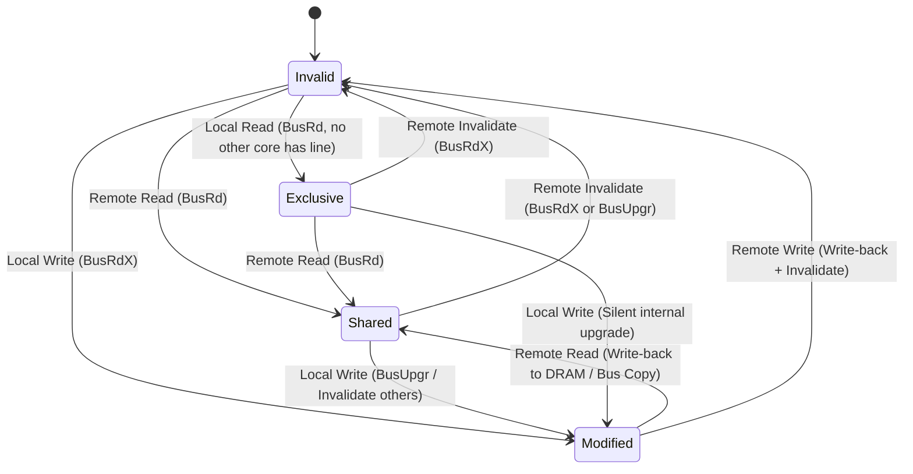
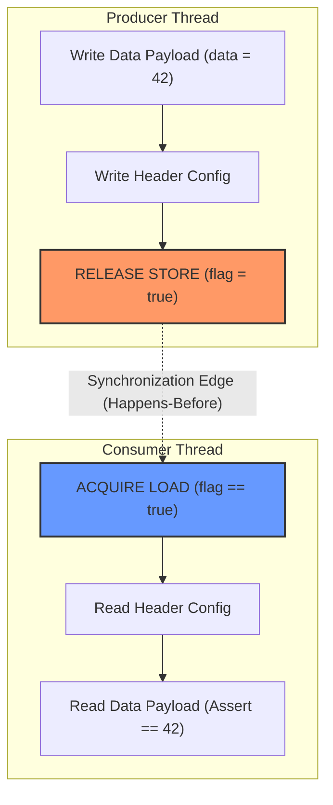

# Week 28 · Lock-Free Systems and Hardware Memory Models
### Pillar 4: Advanced Systems Engineering & Performance

> **Reading time:** ~65 minutes  
> **Prerequisites:** Systems-level understanding of thread synchronization, CPU cache hierarchy (L1/L2/L3), and basic assembly.  
> **The Core Problem:** Your concurrent code works flawlessly on your Intel/AMD developer workstation, passing every unit test with 100% reliability. When deployed to AWS Graviton3 or Ampere Altra (ARM64) production clusters, it experiences intermittent, un-reproducible data corruption and state tearing under peak loads. Why?

---

## Why This Week Matters for Your Career Transition

As a senior C# (.NET) engineer, you have spent your career operating under the protective umbrella of the Common Language Runtime (CLR) and the x86-64 hardware architecture. When concurrency issues arose, you relied on `lock(syncRoot)`, `Monitor.Enter`, or `SemaphoreSlim`. When you reached for high-throughput concurrency, you utilized `ConcurrentQueue<T>` or `Interlocked.Increment`, trusting that the runtime and the processor would execute your instructions in the order you wrote them. 

Here is the uncomfortable truth: **your mental model of sequential execution on modern multi-core hardware is an illusion**. The physical silicon does not execute your code in program order. It aggressively reorders memory reads and writes, buffers stores in private hardware queues, delays invalidation broadcasts, and executes instructions speculatively across hundreds of pipeline stages. 

The reason your C# lock-free algorithms appeared to work for over a decade is largely an accident of hardware: x86-64 enforces **Total Store Order (TSO)**, a strongly ordered memory model that masks nearly all missing memory barriers. However, cloud infrastructure has fundamentally shifted toward ARM64 (AWS Graviton, Google Axion, Apple Silicon, Microsoft Cobalt). ARM64 is a **weakly ordered** architecture. On ARM64, the CPU reorders independent reads and writes aggressively. Lock-free algorithms written with casual assumptions about memory visibility crash catastrophically in these environments.

Furthermore, C# abstracts memory orderings into a blunt binary choice: either unconstrained access or full-fence sequential consistency via `Interlocked`. Go takes a similarly conservative stance, forcing all `sync/atomic` operations into Sequential Consistency to prevent developer error. Only Rust exposes the raw silicon: fine-grained memory orderings (`Relaxed`, `Acquire`, `Release`, `AcqRel`, `SeqCst`) that map directly to underlying CPU microarchitectures. 

By the end of this week, you will understand the physical hardware mechanisms (store buffers, invalidate queues, MESI cache line states) that govern memory visibility. You will dissect why Sequential Consistency can degrade throughput by 10x to 50x compared to Acquire-Release semantics, and you will master the engineering discipline required to design verified, zero-allocation lock-free data structures across C#, Go, and Rust.

---

## Part 1: Hardware Memory Architecture: The Physical Reality of Silicon

To write correct lock-free data structures, you must abandon the Von Neumann model of computing. A modern multi-core processor is not a single execution engine connected to a uniform bank of memory; it is a distributed system on a single piece of silicon.

```
+---------------------------------------------------------------------------------------+
|                                    MAIN MEMORY (DRAM)                                 |
+---------------------------------------------------------------------------------------+
                                           ^
                                           | Memory Bus / Memory Controller (~60-100ns)
                                           v
+---------------------------------------------------------------------------------------+
|                               SHARED LAST-LEVEL CACHE (L3)                            |
|                               (Shared across cores, ~15-25ns)                         |
+---------------------------------------------------------------------------------------+
              ^                                                         ^
              | Interconnect / Ring Bus / 2D Mesh                       |
              v                                                         v
+-------------------------------+                     +-------------------------------+
|         CORE 0                |                     |         CORE 1                |
|  +-------------------------+  |                     |  +-------------------------+  |
|  |     Private L2 Cache    |  |                     |  |     Private L2 Cache    |  |
|  |     (~3-5ns latency)    |  |                     |  |     (~3-5ns latency)    |  |
|  +-------------------------+  |                     |  +-------------------------+  |
|              ^                |                     |              ^                |
|              v                |                     |              v                |
|  +-------------------------+  |                     |  +-------------------------+  |
|  |   Private L1 D-Cache    |  |                     |  |   Private L1 D-Cache    |  |
|  |   (~1-1.5ns latency)    |  |                     |  |   (~1-1.5ns latency)    |  |
|  +-------------------------+  |                     |  +-------------------------+  |
|         ^            ^        |                     |         ^            ^        |
|         |            |        |                     |         |            |        |
|   +-----------+  +----------+ |                     |   +-----------+  +----------+ |
|   |   Store   |  |Invalidate| |                     |   |   Store   |  |Invalidate| |
|   |   Buffer  |  |  Queue   | |                     |   |   Buffer  |  |  Queue   | |
|   +-----------+  +----------+ |                     |   +-----------+  +----------+ |
|         ^            |        |                     |         ^            |        |
|    Write|        Read|        |                     |    Write|        Read|        |
|         |            v        |                     |         |            v        |
|  +-------------------------+  |                     |  +-------------------------+  |
|  |  Out-of-Order Engine    |  |                     |  |  Out-of-Order Engine    |  |
|  |  - Reorder Buffer (ROB) |  |                     |  |  - Reorder Buffer (ROB) |  |
|  |  - Reservation Stations |  |                     |  |  - Reservation Stations |  |
|  |  - Execution Units(ALU) |  |                     |  |  - Execution Units(ALU) |  |
|  +-------------------------+  |                     |  +-------------------------+  |
+-------------------------------+                     +-------------------------------+
```

### The Memory Wall and Latency Discrepancy
Modern execution units operate at frequencies between 3.0 GHz and 5.0 GHz. A single clock cycle takes roughly 0.2 to 0.3 nanoseconds. In contrast, accessing main DRAM requires approximately 50 to 100 nanoseconds—equivalent to 200 to 400 CPU cycles. If an execution core were forced to wait for DRAM on every load and store, the pipeline would sit idle 99% of the time. 

To bridge this "Memory Wall", hardware engineers introduced hierarchical caches (L1, L2, L3) and asynchronous buffering hardware. However, these performance optimizations break the sequential memory model.

### Superscalar Out-of-Order Execution: The Reorder Buffer (ROB)
In modern processors, execution proceeds through distinct stages:
1. **Instruction Fetch & Decode:** Instructions are fetched in program order from the L1 Instruction Cache and decoded into micro-operations ($\mu\text{ops}$).
2. **Register Renaming:** Architectural registers (`rax`, `x0`) are dynamically mapped onto a larger pool of physical registers, eliminating false register dependencies (Write-After-Read and Write-After-Write hazards).
3. **Dispatch to Reservation Stations:** Instructions sit in execution queues (Reservation Stations) waiting for their input operands to become available.
4. **Out-of-Order Execution:** As soon as an arithmetic unit or memory port is free and the operands are ready, the instruction executes—regardless of original program order!
5. **Retirement via the Reorder Buffer (ROB):** Instructions are committed back to architectural state in strict program order.

While instruction *retirement* is in-order, memory *access* (loads and stores hitting the bus) is decidedly out-of-order unless constrained by barriers.

### Store Buffers and Store-to-Load Forwarding
When a CPU core executes a store instruction (e.g., `MOV [rax], rbx`), waiting for the data to be written into the L1 cache is still too slow. The L1 cache must verify that it owns the target cache line in an exclusive or modified state under the cache coherence protocol. If the cache line is shared or invalid, the core must issue a request across the bus and wait for responses from other cores.

To prevent the execution pipeline from stalling, hardware designers placed a **Store Buffer** (also known as a Write Buffer) between the core and the L1 data cache:
1. When a store instruction executes, the core places the target physical address and data into its private FIFO Store Buffer.
2. The store instruction is marked as retired in the ROB. The execution pipeline continues executing subsequent instructions without waiting for the cache.
3. In the background, the Store Buffer asynchronously drains its entries into the L1 cache as the cache coherence protocol permits.

**Store-to-Load Forwarding:** What happens if the same core immediately reads from the address it just wrote? To maintain single-threaded program correctness, the core checks its private Store Buffer before querying the L1 cache. If an entry exists for that address, the value is forwarded directly to the load instruction. 

**The Concurrency Cost:** Core 0's Store Buffer is strictly private. Core 1 cannot inspect Core 0's Store Buffer until Core 0 drains that write into the globally visible L1 cache. Consequently, Core 0 can write to variable $X$, immediately read $X$, and see the new value—while Core 1 reads $X$ and observes the stale value.

### Invalidate Queues
When Core 0 wants to write to a cache line that Core 1 currently holds in a `Shared` state, Core 0 must broadcast an **Invalidate** message across the interconnect bus. Under a basic coherence protocol, Core 0 cannot drain its Store Buffer until every core sharing that line sends back an **Invalidate Acknowledge** message.

If Core 1's cache controller is busy servicing high-priority L1 memory loads, processing the invalidation immediately would stall Core 1's execution pipeline. To prevent this:
1. When an Invalidate message arrives at Core 1, Core 1 places the message into an **Invalidate Queue**.
2. Core 1 immediately sends an Invalidate Acknowledge back to Core 0, allowing Core 0 to complete its store.
3. Core 1 defers the actual eviction/invalidation of the cache line until its cache controller has idle cycles.

**The Concurrency Cost:** Because Core 1 has acknowledged the invalidation without actually applying it to its L1 cache, Core 1's local cache line still contains stale data. Core 1 will continue to read this obsolete data from its L1 cache until the entry in its Invalidate Queue is drained.

### Cache Coherence Protocols: MESI and MOESI
Cache coherence ensures that all CPU cores agree on the state of a specific memory address across their private caches. A cache line is typically 64 bytes (128 bytes on Apple M-series chips). The standard baseline protocol is **MESI**:

1. **Modified (M):** The cache line is present only in the current core's cache and is dirty (its contents differ from main memory). The current core has exclusive write permissions.
2. **Exclusive (E):** The cache line is present only in the current core's cache, is clean (matches main memory), and can be transitioned to Modified without a bus broadcast.
3. **Shared (S):** The cache line may be present in multiple cores' caches. It is read-only. Any core wishing to write must invalidate all other copies.
4. **Invalid (I):** The cache line does not contain valid data. Reading from it causes a cache miss.



In enhanced architectures (AMD Zen, ARM64), the **MOESI** protocol adds an **Owner (O)** state. The Owner state allows a dirty cache line to be shared among multiple cores without writing it back to DRAM first. The Owner core is responsible for eventually writing the dirty data back to main memory when the line is evicted.

#### Cache Line Bouncing and Invalidation Storms
When two threads running on different cores repeatedly write to the same cache line (or different variables located within the same 64-byte chunk of memory—a defect known as **False Sharing**):
1. Core 0 issues a `BusRdX` (Read Invalidate) bus broadcast, requesting exclusive ownership. Core 1's copy is transitioned to `Invalid`.
2. Core 0 updates its cache line to `Modified`.
3. Core 1 now attempts to write to its variable. It detects state `Invalid`, issues a `BusRdX`, forcing Core 0 to flush its dirty line to the interconnect and invalidate its own cache line.
4. This cycle repeats millions of times per second. The coherence interconnect saturates, execution pipelines stall waiting for bus arbitration, and system throughput collapses by up to 98%.

---

## Part 2: Memory Orderings Dissected

In high-performance concurrent computing, we cannot afford to place full hardware fences around every memory operation. Instead, modern languages and hardware define formal **Memory Orderings** that specify exactly which reorderings are permitted and which are prohibited.

We define memory visibility using Leslie Lamport's **Happens-Before** relationship ($\prec$). If operation $A$ happens-before operation $B$ ($A \prec B$), then the memory effects of $A$ are guaranteed to be visible to the thread executing $B$ prior to $B$ executing.

### Compiler Barriers vs. Hardware Barriers
It is critical to distinguish between two distinct layers of reordering:
1. **Compiler Optimization Barriers:** Compilers (Roslyn/RyuJIT, `go build`, rustc/LLVM) perform Dead Code Elimination, Loop-Invariant Code Motion (LICM), and Instruction Scheduling. A compiler barrier tells the compiler: *Do not reorder code across this line during optimization*. However, a compiler barrier emits **zero** CPU fence instructions into the generated binary.
2. **Hardware Memory Barriers:** When the CPU decodes a hardware fence (`MFENCE`, `DMB ISH`, `LDAR`), the hardware execution units drain buffers, stall pipelines, or flush pending memory requests. 

Every valid hardware barrier inherently acts as a compiler barrier, but a pure compiler barrier (`std::sync::atomic::compiler_fence` in Rust, or `Thread.MemoryBarrier()` in older .NET runtimes) provides zero hardware-level ordering on weakly ordered CPUs.

### 1. Sequential Consistency (`SeqCst`)
Defined by Leslie Lamport in 1979, **Sequential Consistency** requires that:
1. The result of any execution is the same as if the operations of all processors were executed in some sequential order.
2. The operations of each individual processor appear in this sequence in the order specified by its program.

Under `SeqCst`, all threads observe all memory writes across the entire system in the exact same global order. It creates the illusion of a single, centralized clock ticking for the entire computer.

```
Thread 1:  [Store X=1] ----------> [Store Y=1]
                    \                  /
                     \                /
Global Memory Clock:  --[X=1]------[Y=1]----------------> (All cores observe identical order)
                     /                \
                    /                  \
Thread 2:  [Load Y (reads 1)] ---> [Load X (MUST read 1)]
```

**The Cost:** Achieving `SeqCst` on modern hardware requires draining the Store Buffer completely and halting the execution pipeline until all pending writes have been committed to globally coherent cache levels (`MFENCE` on x86, `DMB ISH` on ARM64). This disables out-of-order execution, stalling the core for 30 to 100 cycles per atomic operation.

### 2. Acquire-Release Semantics
Acquire-Release is the fundamental building block of high-performance lock-free systems. It establishes a one-way synchronization edge between a producer thread and a consumer thread without imposing a global total order across all cores.

#### The Release Barrier (Stores)
A **Release store** ensures that:
- All memory loads and stores (both regular and atomic) preceding the Release operation in program order **cannot be reordered after** the Release store.
- Writes buffered prior to the Release are flushed to cache such that any thread acquiring the same synchronization variable will observe them.
- *Downwards migration allowed:* Operations following the Release in program order can potentially be hoisted before it.

#### The Acquire Barrier (Loads)
An **Acquire load** ensures that:
- All memory loads and stores following the Acquire operation in program order **cannot be reordered before** the Acquire load.
- It invalidates any speculative loads that may have read stale data ahead of time.
- *Upwards migration allowed:* Operations preceding the Acquire in program order can potentially sink below it.



#### Transitive Happens-Before Chains
A critical property of Acquire-Release synchronization is transitivity. If Thread 1 performs a Release store that synchronizes with an Acquire load in Thread 2, and Thread 2 subsequently performs a Release store that synchronizes with an Acquire load in Thread 3:
$$\text{Thread 1 Stores} \prec \text{Thread 2 Synchronization} \prec \text{Thread 3 Reads}$$
All memory writes executed by Thread 1 prior to its Release store become visible to Thread 3 after its Acquire load. This allows multi-stage pipelined architectures and ring buffers to pass ownership safely across thread boundaries without locks.

#### Acquire-Release Combined (`AcqRel`)
Used primarily on Read-Modify-Write (RMW) operations such as Compare-And-Swap (`CAS`) or `FetchAdd`. It acts as an Acquire barrier for subsequent operations and a Release barrier for preceding operations.

### 3. Relaxed Ordering (`Relaxed`)
A **Relaxed** operation guarantees only two things:
1. **Atomicity:** The operation will not suffer from word tearing (e.g., reading half of an 8-byte pointer written concurrently).
2. **Modification Order Consistency:** All writes to that *single specific atomic variable* are observed in a consistent order by all threads.

**What it does NOT guarantee:** It enforces **zero ordering constraints** relative to any other memory reads or writes. The compiler and the CPU are completely free to hoist Relaxed reads ahead of prior writes, sink Relaxed stores behind subsequent reads, or interleave them arbitrarily.

**Valid Use Cases:** Monotonic counters where only the total count matters (e.g., total HTTP requests served, telemetry counters, reference count increments that do not trigger drops).

---

## Part 3: Architecture Differences: x86-64 TSO vs. ARM64 Weak Ordering

One of the greatest sources of bugs for senior .NET engineers transitioning to systems engineering is failing to recognize how strongly x86 hardware masks concurrency flaws.

### Four Classic Concurrency Litmus Tests

| Test Name | Program Thread 1 | Program Thread 2 | Weakly Ordered Outcome | Allowed on x86-64? | Allowed on ARM64? |
| :--- | :--- | :--- | :--- | :--- | :--- |
| **Message Passing (MP)** | `data=42; flag=1;` | `r1=flag; r2=data;` | $r1=1 \land r2=0$ (Stale data) | **No** (Stores in-order) | **Yes** (Requires Acq/Rel) |
| **Store Buffering (SB)** | `x=1; r1=y;` | `y=1; r2=x;` | $r1=0 \land r2=0$ | **Yes** (Store Buffer lag) | **Yes** |
| **Load Buffering (LB)** | `r1=x; y=1;` | `r2=y; x=1;` | $r1=1 \land r2=1$ | **No** (Speculation barrier)| **Yes** (Aggressive spec) |
| **IRIW** | Core 0: `x=1` | Core 1: `y=1` | Core 2 & 3 see $x,y$ in opposite orders | **No** (Global store order)| **Yes** (Independent buses) |

### x86-64: Total Store Order (TSO)
Under x86 TSO, the hardware provides the following guarantees at the silicon level for standard (non-SSE/AVX non-temporal) `MOV` instructions:
- **Loads are not reordered with other loads** (No Load-Load reordering).
- **Stores are not reordered with other stores** (No Store-Store reordering; stores enter the Store Buffer in FIFO order).
- **Stores are not reordered with older loads** (No Load-Store reordering).
- **Only one reordering is permitted:** Store-Load (an earlier store delayed in the store buffer can allow a later load from a different address to execute first).

Because x86 guarantees that stores never pass older stores and loads never pass older loads, **every standard load on x86 already possesses Acquire semantics, and every standard store already possesses Release semantics for free in hardware**. No fence instructions are emitted!

### ARM64 / Apple Silicon: Weak Memory Ordering
In stark contrast, ARM64 is a weakly ordered RISC architecture. The CPU execution units are decoupled from memory ordering constraints. ARM64 processors permit:
- **Load-Load reordering:** The CPU may speculatively issue a later read before an earlier read completes.
- **Load-Store reordering:** A write can be issued before an earlier read has resolved.
- **Store-Store reordering:** Writes to different addresses can drain from store buffers in any arbitrary order.
- **Store-Load reordering:** Stores can be delayed past subsequent loads.

#### ARMv8.1 Large System Extensions (LSE)
On early ARMv8.0 cores, atomic read-modify-write operations required Load-Linked / Store-Conditional loops (`LDXR` and `STXR`). If another core touched the same cache reservation granuled between the load and the store, the `STXR` failed, requiring a software retry loop. 

Under ARMv8.1-A (and in Apple Silicon, AWS Graviton2/3/4), ARM introduced single-instruction atomic memory operations: `LDADD`, `SWP`, and `CAS`. These instructions execute directly at the L2 cache or memory controller, eliminating LL/SC livelocks and dramatically boosting multi-core scalability.

### Why x86 is a "Trap" for C# Developers
Because x86 loads and stores inherently enforce Acquire and Release semantics in silicon, a C# engineer can write an incorrect lock-free data structure—completely omitting required memory barriers or volatile declarations—and test it on an Intel i9 or AMD Ryzen with billions of operations without encountering a single race condition.

When that same application is compiled and run on AWS Graviton3 (ARM64), the out-of-order execution engine exploits the absence of barriers. Independent memory operations cross paths, the consumer reads uninitialized payload data before the producer's initialization store is published, and the application crashes with memory corruption.

---

## Part 4: Language Atomic APIs: C# vs. Go vs. Rust

How do our three languages expose these hardware mechanics to the systems engineer?

### 1. C# (.NET): The Legacy of `volatile` and Coarse `Interlocked`
In the .NET runtime, the memory model is divided between the C# Language Specification, the ECMA-335 standard, and the actual implementation within the RyuJIT compiler.

#### The `volatile` Keyword
In C#, marking a field with the `volatile` keyword tells RyuJIT:
- Reads from the field have **Acquire semantics** (loads cannot be reordered before the read).
- Writes to the field have **Release semantics** (stores cannot be reordered after the write).
- Disables compiler optimizations that would cache the field value in a CPU register across loop iterations.

However, `volatile` in C# has severe limitations:
- It does **not** make compound operations atomic. `volatileCount++` is still a non-atomic read-modify-write that will lose updates under concurrency.
- It cannot be applied to local variables, array elements, or custom struct instances.

#### `Volatile.Read` and `Volatile.Write`
Introduced in .NET 4.5 to provide programmatic half-barriers without modifying class definitions. `Volatile.Write(ref x, val)` emits a compiler barrier and, on weakly ordered architectures like ARM64, inserts the necessary store barrier (`DMB ISHLD` / `STLR`).

#### `Interlocked` Operations
Methods on `System.Threading.Interlocked` (`Increment`, `Exchange`, `CompareExchange`) are **always sequentially consistent**. 
- On x86-64, RyuJIT emits instructions with the `LOCK` prefix (e.g., `lock cmpxchg`, `lock xadd`). The `LOCK` prefix asserts exclusive ownership of the cache line and acts as a **full hardware memory barrier**, serializing memory access.
- On ARM64, RyuJIT emits load-linked/store-conditional loops (`LDXR`/`STXR`) or LSE atomics surrounded by full inner-shareable data memory barriers (`DMB ISH`).

**The C# Deficiency:** C# provides **no fine-grained Acquire/Release control for arithmetic or CAS operations**. If you need an atomic increment or a compare-and-swap, you are forced to pay the performance penalty of a full `SeqCst` fence, even when Acquire or Release ordering would be mathematically sufficient.

### 2. Go: The Pragmatic `sync/atomic` Abstraction
Go’s approach to memory ordering is deeply tied to its philosophical heritage. Designed by Rob Pike, Ken Thompson, and Robert Griesemer, Go was architected to make concurrency accessible through Communicating Sequential Processes (CSP): *"Do not communicate by sharing memory; instead, share memory by communicating."*

Because channel communication was intended to be the primary synchronization primitive, the low-level `sync/atomic` package was intentionally kept minimal.

#### Sequential Consistency by Default
In Go's public API:
```go
atomic.LoadUint64(&addr)
atomic.StoreUint64(&addr, val)
atomic.CompareAndSwapUint64(&addr, old, new)
```
Every operation in Go's `sync/atomic` package enforces **Sequential Consistency**. Go does not expose `Acquire`, `Release`, or `Relaxed` orderings in its public API. 

**Why Go Did This:** The Go authors concluded that the cognitive overhead of fine-grained memory orderings leads to catastrophic, undetectable concurrency bugs for average engineers. By mandating `SeqCst` across all atomic primitives, Go ensures that if an algorithm is mathematically correct under sequential reasoning, it will not fail due to hardware memory reordering on ARM64 or RISC-V.

**The Go Runtime Internal Reality:** Internally, inside `runtime/internal/atomic`, the Go compiler and runtime utilize raw assembly tailored to each architecture. In runtime scheduling and garbage collection code, Go utilizes specific acquire and release operations. However, this power is deliberately hidden from standard application code.

### 3. Rust: Direct, Zero-Cost Hardware Mapping
Rust treats memory models with the same zero-cost, explicit philosophy that governs the rest of the language. In Rust, atomic primitives reside in `std::sync::atomic`, and **every single atomic operation requires the developer to explicitly specify an `Ordering` parameter**:

```rust
use std::sync::atomic::{AtomicUsize, Ordering};

let counter = AtomicUsize::new(0);

// Developer must explicitly declare the required guarantee:
counter.store(1, Ordering::Release);
let val = counter.load(Ordering::Acquire);
```

The available orderings in Rust map directly to the LLVM atomic model and C++20 memory model:
- `Ordering::Relaxed`
- `Ordering::Acquire`
- `Ordering::Release`
- `Ordering::AcqRel`
- `Ordering::SeqCst`

#### Zero-Cost Hardware Lowering: Assembly Dissection
Because Rust compiles through LLVM, its atomic orderings translate into optimal machine instructions for the target CPU architecture.

| Rust Code | x86-64 Machine Code | ARM64 Machine Code |
| :--- | :--- | :--- |
| `val.load(Ordering::Relaxed)` | `mov rax, qword ptr [rdi]` | `ldr x0, [x1]` |
| `val.load(Ordering::Acquire)` | `mov rax, qword ptr [rdi]` *(Free)* | `ldar x0, [x1]` *(Hardware Barrier)* |
| `val.load(Ordering::SeqCst)` | `mov rax, qword ptr [rdi]` *(Free)* | `ldar x0, [x1]` |
| `val.store(x, Ordering::Relaxed)`| `mov qword ptr [rdi], rax` | `str x0, [x1]` |
| `val.store(x, Ordering::Release)`| `mov qword ptr [rdi], rax` *(Free)* | `stlr x0, [x1]` *(Hardware Barrier)* |
| `val.store(x, Ordering::SeqCst)` | `xchg qword ptr [rdi], rax` | `stlr x0, [x1]; dmb ish` |
| `val.fetch_add(1, Relaxed)` | `lock xadd qword ptr [rdi], rax` | `ldxr x0, [x1]; add; stxr` |
| `val.compare_exchange(..., AcqRel)`| `lock cmpxchg qword ptr [rdi], rsi` | `ldaxr ... stlxr` loop |

Notice the critical insight: on x86-64, an `Acquire` load and a `Release` store compile down to standard, non-prefixed `MOV` instructions! The compiler merely applies an internal compiler barrier to prevent instruction scheduling across the boundary. On ARM64, they lower to single-instruction dedicated barriers (`LDAR`/`STLR`), avoiding the expensive full pipeline flush of a `DMB ISH`.

---

## Part 5: The Cost of Memory Fences: Silicon Stalls and Cache Bouncing

Why do systems engineers fight so intensely to replace `SeqCst` with `Acquire-Release` or `Relaxed`? The answer lies in the hardware cost of pipeline stalls and cache line transfers.

### The Mechanics of `MFENCE` and `LOCK`
When a processor encounters a full memory barrier (such as `MFENCE` on x86, or an instruction with a `LOCK` prefix):
1. **Pipeline Serialization:** The core's execution pipeline is stalled from committing subsequent instructions.
2. **Store Buffer Drain:** The core must wait until every single pending entry in its Store Buffer is written into the L1 cache.
3. **Interconnect Acknowledgment:** The core must ensure that all invalidation requests sent to other cores have received global acknowledgments.
4. **Invalidate Queue Processing:** The core must drain its own Invalidate Queue, ensuring it cannot execute subsequent reads against stale data.

This process transforms an asynchronous, superscalar execution pipeline capable of processing 4 to 6 instructions per cycle into a synchronous, waiting processor.

### Interconnect Topologies and NUMA Latency
In modern server chips (AMD EPYC, Intel Xeon, AWS Graviton), execution cores are arranged in chiplets or 2D mesh networks connected via coherent interconnects (e.g., Intel UPI, AMD Infinity Fabric, ARM CMN). When a core executes a `SeqCst` store, the invalidation broadcast must travel across cross-die links.

If Core 0 (Socket 0) issues an atomic write to a cache line that is currently held by Core 64 (Socket 1):
1. The request travels through local L2, L3, onto the inter-socket fabric (~40-80ns round trip).
2. Socket 1's cache controller invalidates the line and returns an acknowledgment across the fabric.
3. Socket 0 completes the write.

Under high concurrency, this creates a **NUMA coherence storm**, saturating fabric links and degrading application throughput by over 90%.

### Quantifying the Throughput Collapse
Consider a high-contention benchmark where 8 CPU cores attempt to update a shared state:

```
Operation Type                    x86-64 Throughput (Ops/sec)   ARM64 Graviton3 (Ops/sec)
-----------------------------------------------------------------------------------------
Unsynchronized Local Register      ~3,500,000,000                ~3,200,000,000
Relaxed Atomic Counter             ~1,200,000,000                ~1,100,000,000
Acquire-Release SPSC Ring Buffer     ~180,000,000                  ~165,000,000
Full SeqCst Atomic Exchange           ~14,000,000                   ~12,000,000
Mutex Contention (OS Syscall)            ~450,000                      ~400,000
```

Notice the order of magnitude difference: **A full Sequential Consistency barrier or `LOCK` prefix can reduce multi-core execution throughput by 10x to 50x compared to an Acquire-Release algorithm.** 

When multiple cores contend for the same atomic variable using `SeqCst`, they do not just execute slow instructions; they initiate an interconnect storm. The cache line bounces between cores, repeatedly switching between `Invalid` and `Modified` states in the MESI protocol, forcing each core to stall waiting for cache line ownership.

### The ABA Problem and Monotonic Sequence Counters
In dynamic node-based lock-free data structures (such as the classic Treiber stack or Michael-Scott queue), lock-free algorithms frequently suffer from the **ABA problem**:
1. Thread 1 reads pointer $A$ from the top of the stack.
2. Thread 1 is preempted by the OS scheduler.
3. Thread 2 pops $A$, frees it, pops $B$, and pushes a newly allocated node that happens to be placed at the exact same memory address $A$.
4. Thread 1 wakes up, executes `CAS(&top, A, A.next)`, succeeds because the pointer address matches $A$, but corrupts the internal queue pointers because the contents of $A$ and the stack structure have completely changed.

In bounded array-based ring buffers, we eliminate the ABA problem entirely by utilizing **monotonically increasing 64-bit integer indices** (`head` and `tail`) rather than cyclic array offsets. Even if a system processes 10 billion messages per second:
$$\frac{2^{64} \text{ states}}{10 \times 10^9 \text{ ops/sec}} \approx 1.84 \times 10^9 \text{ seconds} \approx 58.4 \text{ years}$$
A 64-bit counter will not wrap around within any operational lifespan, completely immunizing the ring buffer against ABA hazards.

---

## Part 6: Common Misconceptions to Unlearn

### Misconception 1: "Because x86 is strongly ordered, I don't need memory barriers in my code."
**Reality:** Even if the physical x86 CPU does not reorder stores past stores or loads past loads, **the compiler does**. During optimization, the Roslyn/RyuJIT compiler (in C#), the Go compiler, and LLVM (in Rust) will aggressively reorder instructions, eliminate redundant reads, or hoist loads out of loops unless explicit memory barriers or atomic primitives instruct them not to. Memory barriers act as **both** compiler optimization barriers and hardware instruction fences.

### Misconception 2: "Marking a variable `volatile` in C# makes operations on it thread-safe."
**Reality:** `volatile` guarantees only visibility and ordering (Acquire on read, Release on write). It provides absolutely no atomicity for compound operations. `volatile int count; count++` compiles down to three distinct operations: read, increment, write. Two threads executing `count++` concurrently will suffer from standard race conditions and lost updates.

### Misconception 3: "Lock-free means wait-free; my code will never block or stall."
**Reality:** Lock-free guarantees only that *at least one thread in the entire system makes progress* in a finite number of steps. It does not guarantee that *your* thread makes progress. A thread attempting a Compare-And-Swap (`CAS`) loop in a lock-free queue can experience extreme livelock and starvation under high contention, spinning millions of times while other threads succeed in completing updates.

### Misconception 4: "Go channels are implemented using lock-free ring buffers."
**Reality:** Many Go developers assume channels are pure lock-free magic. In reality, Go channels (`chan T`) are implemented in the runtime as a struct (`hchan`) that contains a standard lock (`mutex`). Sending or receiving from a channel acquires this lock! While highly optimized, channel operations are synchronized using classic runtime mutual exclusion, not lock-free memory primitives.

### Misconception 5: "Acquire-Release requires expensive CPU fence instructions on x86."
**Reality:** On x86-64, Acquire and Release semantics are built directly into standard hardware `MOV` instructions. A Rust `store(val, Ordering::Release)` or `load(Ordering::Acquire)` compiles to a plain `MOV` with zero hardware fence overhead. The barrier exists purely inside the compiler to prevent instruction reordering during optimization.

### Misconception 6: "64-byte padding always prevents False Sharing on modern systems."
**Reality:** While 64 bytes is the standard cache line width for Intel and AMD x86-64 chips, Apple Silicon (M1/M2/M3/M4) and certain ARM Neoverse enterprise server processors use **128-byte cache lines**. If your struct pads fields with 64 bytes on Apple Silicon, two independent variables will still reside on the same 128-byte cache line, causing unexpected false sharing. High-performance systems code targeting cross-platform deployments must use 128-byte alignment for cache isolation.

---

## Part 7: Architectural Comparison Matrix

| Architectural Dimension | C# (.NET 8) | Go (1.22+) | Rust (2021 Edition) |
| :--- | :--- | :--- | :--- |
| **Hardware Mapping Philosophy** | Abstracted through runtime; platform-independent IL | Minimalist API; safe-by-default CSP concurrency | Zero-cost abstraction; direct mapping to LLVM / CPU |
| **Default Atomic Ordering** | `SeqCst` on `Interlocked` | `SeqCst` on all `sync/atomic` | No default; developer must pass `Ordering` |
| **Fine-Grained Acquire/Release**| Limited to `Volatile.Read` / `Volatile.Write` | Not supported in public API | Fully supported (`Acquire`, `Release`, `AcqRel`) |
| **Relaxed Memory Ordering** | Not exposed in standard library | Not exposed in standard library | Fully supported (`Ordering::Relaxed`) |
| **Cache Line Padding Mechanism** | `[StructLayout(LayoutKind.Explicit)]` | Manual byte arrays (`[64]byte`) | `#[repr(align(64))]` or `crossbeam::CachePadded` |
| **Compiler Fence Primitives** | `Thread.MemoryBarrier()` (Hardware + Compiler) | Runtime internal only | `atomic::compiler_fence` (Pure compiler barrier) |
| **Concurrency Sanitization** | External profilers, Concurrency Visualizer | Built-in ThreadSanitizer (`go test -race`) | Miri (`cargo miri test`), Loom, ThreadSanitizer |
| **x86 Instruction for Acquire Load**| `mov` (JIT compiler barrier) | `mov` | `mov` |
| **ARM64 Instruction for Acquire Load**| `ldar` / `dmb ishld` | `ldar` / `dmb ishld` | `ldar` |
| **Unsafe Escape Hatch** | `fixed`, pointers, `Unsafe.As` | `unsafe.Pointer`, `reflect.SliceHeader` | `*const T`, `*mut T`, `UnsafeCell<T>` |

---

## Summary & Bridge to the Rosetta Stone

Hardware memory models represent the boundary where high-level software abstractions dissolve into electrical engineering. To achieve maximum throughput on modern multi-core systems, you cannot treat memory as a passive storage locker. You must orchestrate synchronization edges using the least restrictive memory ordering that satisfies mathematical correctness.

In the next document, [02_CODE_COMPARISON_ROSETTA.md](file:///home/sundarjadhav/ProsPano-Development/Hub/technical-depth/20%20C%23%20GO%20RUST/Week-28-Lock-Free-Memory-Models/02_CODE_COMPARISON_ROSETTA.md), we put this theory into practice. We will build a production-grade, Single-Producer Single-Consumer (SPSC) lock-free bounded ring buffer from scratch in C#, Go, and Rust. You will examine the precise memory barriers, cache padding techniques, and multi-threaded test harnesses necessary to transfer tens of millions of messages per second across dedicated CPU cores.
