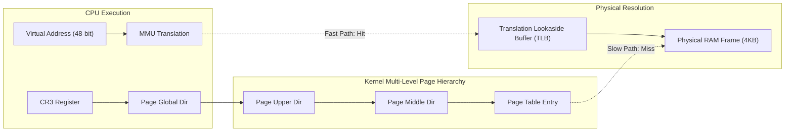
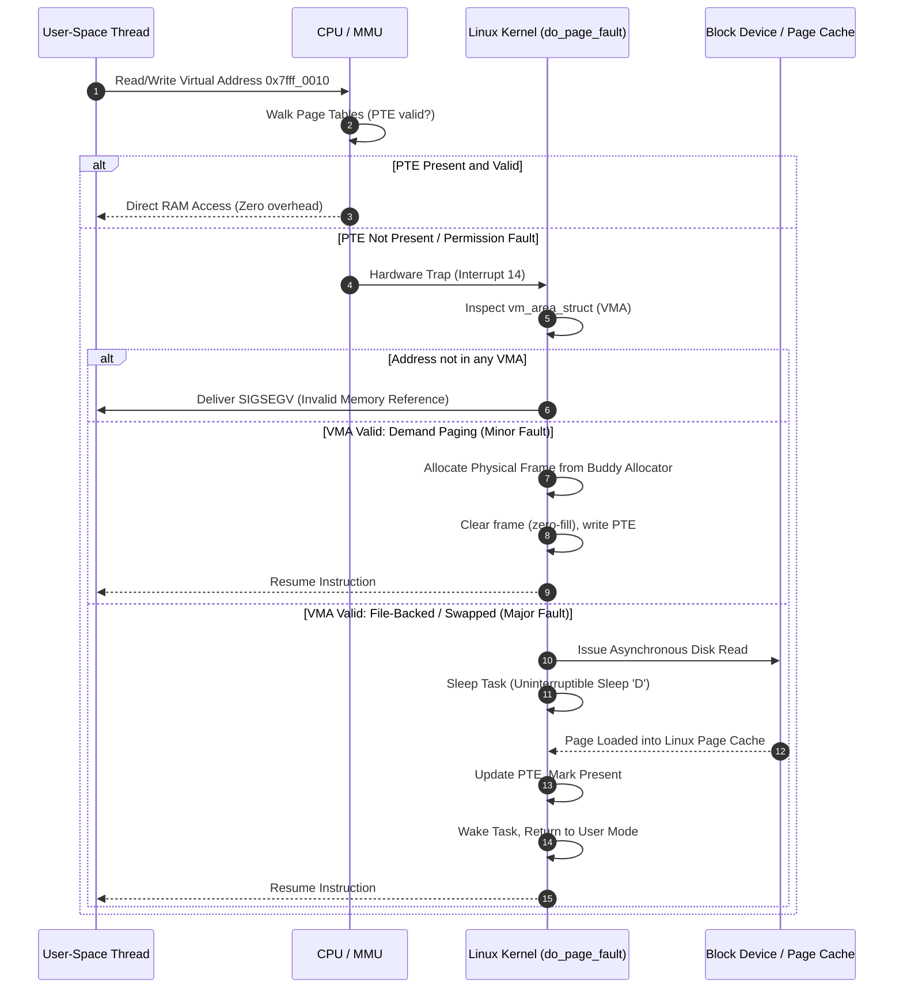
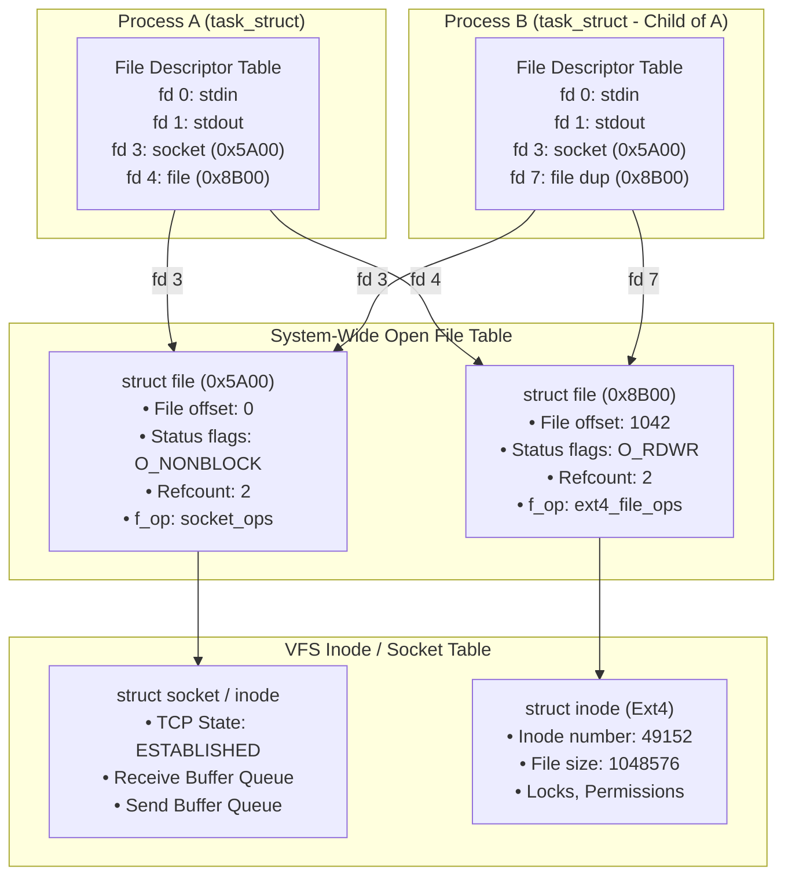
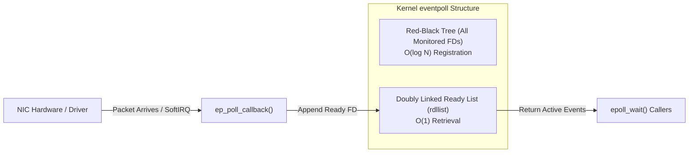
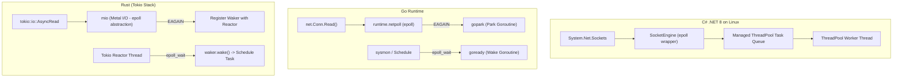
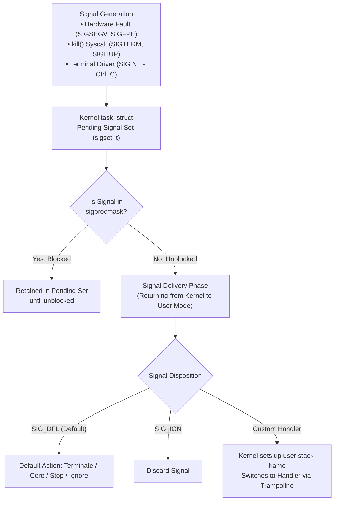

# Week 29: Linux Systems, Signals & Process Lifecycles

## Why This Week Matters for Your Career Transition

As a senior .NET engineer, you have likely spent years operating under the protective umbrella of the Common Language Runtime (CLR) and the Windows operating system abstractions. In the .NET ecosystem, process lifecycles are mediated through `IHostLifetime`, thread management is abstracted by the managed `ThreadPool`, asynchronous socket I/O is routed through Windows I/O Completion Ports (IOCP) or the managed `SocketEngine`, and virtual memory is partitioned into generation-based managed heaps without requiring direct interrogation of the Linux kernel's page tables. When services move to cloud-native Linux container environments, this abstraction layer can obscure root-cause behaviors. In Go and Rust, there is no virtual machine insulating your binary from the operating system: your binary *is* the Linux process. 

Transitioning to high-performance systems engineering in Go and Rust requires you to stop viewing a process as an application container and begin viewing it through the lens of the Linux kernel. By the end of this week, you will thoroughly understand:
1. How the hardware Memory Management Unit (MMU) and multi-level page tables translate virtual addresses, how minor and major page faults drive lazy allocation, and why the Go runtime scavenger's use of `madvise(MADV_DONTNEED)` versus `madvise(MADV_FREE)` created high-profile production incidents in Kubernetes clusters.
2. How the Linux Virtual File System (VFS) structures file descriptors across process boundaries, how edge-triggered (`EPOLLET`) versus level-triggered `epoll` dictates runtime network poller architecture, and why Go's `netpoller` and Rust's `mio`/`tokio` achieve massive I/O concurrency without thread exhaustion.
3. How POSIX signals are generated, masked, and delivered by the kernel, the strict requirements of async-signal safety, and the exact architectural trampolines Go and Rust employ to translate hardware/software interrupts into safe concurrency primitives.
4. How Linux process creation via `fork()` and `execve()` relies on Copy-on-Write (COW), how Linux cgroups v2 enforce hard memory limits leading to uncatchable OOM kills (exit code 137), and why running as PID 1 inside Docker containers creates insidious zombie process leaks if your binary fails to reap child processes.

---

## 1. Linux Kernel Memory Management Mechanics

### 1.1 Virtual Memory, Page Tables, and the MMU

In modern 64-bit Linux running on x86_64 or ARM64 architectures, processes never interact directly with physical Random Access Memory (RAM). Every memory address manipulated by your code is a virtual memory address within an isolated 48-bit (or 57-bit with 5-level paging) virtual address space. The translation between virtual addresses and physical memory frames is performed at hardware speed by the **Memory Management Unit (MMU)** assisted by **Page Tables** maintained by the Linux kernel.

On x86_64 architectures using standard 4-level paging, the 48-bit virtual address is partitioned into hierarchical offsets:

```
+-----------------------------------------------------------------------------------+
| 16 Bits Sign Extension | 9 Bits PGD | 9 Bits P4D | 9 Bits PUD | 9 Bits PMD | 9 Bits PTE | 12 Bits Page Offset |
+-----------------------------------------------------------------------------------+
```

1. **PGD (Page Global Directory):** Points to the base of the top-level table, located via the CPU's `CR3` control register.
2. **P4D (Page Level 4 Directory):** Folded on 4-level paging architectures; active in 5-level paging.
3. **PUD (Page Upper Directory):** Resolves addresses within a 512GB range.
4. **PMD (Page Middle Directory):** Resolves addresses within a 1GB range (used directly for 2MB Huge Pages).
5. **PTE (Page Table Entry):** Resolves the base physical address of a standard 4KB physical page frame.
6. **Offset (12 bits):** Indexes into the specific byte within the $2^{12} = 4096$ byte physical page.



Because walking four levels of pointers in main memory for *every single instruction fetch and memory dereference* would decimate CPU performance, the MMU caches recent translations in hardware called the **Translation Lookaside Buffer (TLB)**. When a context switch occurs between processes with different virtual address spaces, the kernel must reload the `CR3` register. Historically, this invalidated the entire TLB, introducing substantial translation penalties until hot pages were re-cached. Modern x86_64 processors mitigate this via **Process-Context Identifiers (PCID)**, allowing the TLB to tag entries with an address space identifier, preventing cross-process cache flushes during context switches.

### 1.2 Kernel Memory Tracking: `mm_struct`, VMAs, and `/proc/$PID/smaps`

Inside the Linux kernel, every process's virtual address space is described by a `struct mm_struct` attached to its `task_struct`. Memory mappings within this space are represented by Virtual Memory Areas: `struct vm_area_struct` (VMA).

Each VMA represents a contiguous, page-aligned interval of virtual addresses sharing identical permissions (`PROT_READ`, `PROT_WRITE`, `PROT_EXEC`) and backing characteristics (anonymous or file-backed). The kernel organizes these VMAs using two concurrent data structures:
1. **A Doubly Linked List:** Ordered by starting virtual address, allowing linear traversal of the address space.
2. **A Red-Black Tree (`mm->mm_rb`):** Allows the kernel to locate the VMA containing any arbitrary virtual address in $O(\log N)$ time during a page fault.

You can inspect these mappings in user space by querying the proc filesystem:
- `/proc/$PID/maps`: Lists address ranges, permissions, offsets, and backing file paths.
- `/proc/$PID/smaps`: Provides an authoritative, granular breakdown of physical memory utilization for every mapped range:
  - **Size:** Virtual memory span of the mapping.
  - **Rss (Resident Set Size):** Physical RAM currently occupied by this mapping.
  - **Pss (Proportional Set Size):** Physical RAM divided evenly among all processes sharing the mapping (e.g., shared libraries or shared memory files).
  - **Shared_Clean / Shared_Dirty:** Memory shared with other processes, classified by whether it has been written to since disk synchronization.
  - **Private_Clean / Private_Dirty:** Memory exclusively private to this process. Private dirty pages represent allocated heap and stack pages that have been modified and cannot be dropped without swapping.
  - **Anonymous:** Pages not backed by any file (heap allocations, stack memory, anonymous `mmap`).

### 1.3 Page Faults: Minor, Major, and Copy-on-Write

When a thread dereferences a virtual address whose PTE is absent, invalid, or violates protection flags, the CPU raises an architectural interrupt: an **x86 Page Fault (Interrupt 14)**. The CPU pushes an error code onto the stack and switches to the kernel's page fault handler (`do_page_fault`).



Page faults fall into three distinct operational categories:

1. **Minor Page Fault (Soft Fault):** The requested page is already mapped in a valid Virtual Memory Area (`vm_area_struct` or VMA), but the physical page frame has not yet been linked into the process's page table. This occurs under **demand paging**: when you allocate memory via `mmap` or when Go/Rust heaps request memory from the OS, the kernel does not allocate physical RAM immediately. It only creates a VMA descriptor. When the application writes to the memory for the first time, a minor page fault fires, the kernel grabs a zeroed physical frame from its buddy allocator, populates the PTE, and resumes user-space execution. Minor page faults involve no disk I/O and resolve in hundreds of nanoseconds.
2. **Major Page Fault (Hard Fault):** The requested page is backed by an executable binary, a file-backed `mmap`, or has been swapped out to secondary storage. The kernel must suspend the faulting thread, place it in an uninterruptible sleep state (`TASK_UNINTERRUPTIBLE` or state 'D' in `ps`), and issue an asynchronous block I/O request to disk. Once the disk controller transfers the page into the kernel's **Page Cache**, the kernel updates the process's PTE, marks the thread runnable, and resumes execution. Major page faults take milliseconds and are fatal to low-latency systems.
3. **Copy-on-Write (COW) Fault:** When a process executes `fork()`, the kernel duplicates the parent's page tables rather than copying its physical memory. Both parent and child share the identical physical frames, but the kernel marks all PTEs as read-only. When either process attempts to write to a shared page, the MMU traps with a write-protection fault. The kernel intercepts this, allocates a new physical frame, copies the 4KB contents of the original page into the new frame, updates the faulting process's PTE with read-write permissions, and resumes execution.

### 1.4 Memory System Calls: `mmap`, `munmap`, `mprotect`, and `madvise`

High-performance runtimes bypass the ancient `brk()` / `sbrk()` heap pointer primitives and interact with the kernel memory subsystem via memory mappings:

```c
void *mmap(void *addr, size_t length, int prot, int flags, int fd, off_t offset);
int munmap(void *addr, size_t length);
int mprotect(void *addr, size_t length, int prot);
int madvise(void *addr, size_t length, int advice);
```

- **`mmap` Modes:**
  - `MAP_PRIVATE | MAP_ANONYMOUS`: Allocates zero-initialized virtual memory unbacked by any file. This is the foundation of modern user-space allocators (Go's runtime allocator, Rust's `jemalloc` or `mimalloc`, and .NET's Server GC).
  - `MAP_SHARED`: Modifications to the mapped memory range are written through to the underlying file descriptor or shared with other processes mapping the same backing store (used for high-speed IPC).
  - `MAP_POPULATE`: Forces the kernel to pre-fault all page tables at map time, transforming runtime minor page faults into upfront allocation latency.
- **`mprotect`:** Dynamically alters page permissions (`PROT_READ`, `PROT_WRITE`, `PROT_EXEC`). Go and .NET use this to place guard pages at the edges of goroutine/thread stacks: touching a guard page triggers an unhandled `SIGSEGV`, preventing silent stack overflow corruption.
- **`madvise` and Huge Pages:**
  Linux supports Transparent Huge Pages (THP, 2MB on x86_64). Allocating 2MB huge pages reduces TLB misses by a factor of 512. However, when the kernel background daemon `khugepaged` collapses 4KB pages into 2MB huge pages, it can cause severe latency spikes due to memory compaction. Systems code can selectively disable or enable THP via `madvise(addr, len, MADV_NOHUGEPAGE)` or `madvise(addr, len, MADV_HUGEPAGE)`.
- **`madvise` and the Go Scavenger Incident:**
  The `madvise` system call informs the kernel how an application plans to access specific memory ranges, or relinquishes physical frames back to the OS:
  - `MADV_DONTNEED`: Instructs the kernel that the process no longer requires the data in the specified range. The kernel immediately unmaps the physical frames from the process's page tables and decrements the process's **Resident Set Size (RSS)**. The virtual address range remains valid; dereferencing it later yields a newly zeroed page via a minor fault.
  - `MADV_FREE`: Introduced in Linux 4.5, this informs the kernel that the process is done with the pages, but the kernel does *not* immediately tear down the PTEs or drop the physical frames. Instead, the kernel marks the pages as clean and reclaims them *only if the entire host undergoes memory pressure*. If the process accesses the page before the kernel reclaims it, the operation succeeds with zero page-fault overhead.

> [!WARNING] The Go 1.12 to 1.16 `MADV_FREE` Production Outage Saga
> In Go 1.12, the Go team altered the runtime memory scavenger to use `madvise(MADV_FREE)` instead of `MADV_DONTNEED` to reduce CPU overhead from frequent page faults. In containerized environments (Kubernetes/Docker), this caused catastrophic failures. Kubernetes enforces memory limits using Linux **cgroups**. Under cgroups v1, `memory.usage_in_bytes` counted pages marked `MADV_FREE` as active usage because the kernel had not physically released them. While the Go runtime believed it had surrendered unused heap memory, the container runtime observed the process's RSS continuously climbing until it breached the container's `limits.memory`. The Linux OOM killer subsequently executed `SIGKILL` (exit code 137) on production pods. Because Prometheus dashboards showed memory usage that never dropped, SRE teams panicked. Due to the widespread friction with cgroup accounting, the Go team reverted the default scavenger syscall back to `MADV_DONTNEED` in Go 1.16 (`GODEBUG=madvdontneed=1`).

---

## 2. File Descriptors & Kernel I/O: The Linux VFS & Epoll Architecture

### 2.1 The Linux Virtual File System (VFS) Triad

In Linux, "everything is a file" is not a metaphor; it is an architectural contract implemented by the **Virtual File System (VFS)**. Every open file, socket, pipe, eventfd, or block device is represented through three interconnected kernel structures:



1. **Process File Descriptor Table:** Contained within `current->files->fdt`. This is a simple array indexed by the integer file descriptor (`fd`). Each entry contains a pointer to a `struct file` and a bitmask of descriptor flags (such as `FD_CLOEXEC`).
2. **System-Wide Open File Table:** Contains `struct file` instances. This structure records the current byte offset (`f_pos`), file status flags (`f_flags`, such as `O_NONBLOCK`, `O_APPEND`), access mode, reference count, and a table of function pointers (`f_op`, such as `.read`, `.write`) pointing to the concrete filesystem or networking driver.
3. **VFS Inode Table:** Represents the underlying entity (`struct inode`). For disk files, it encapsulates metadata (permissions, disk block pointers, file size). For sockets, it encapsulates the `struct socket` containing the TCP transmission and reception ring buffers.

> [!IMPORTANT] Descriptor Leakage and `FD_CLOEXEC`
> When you invoke `dup(fd)` or execute `fork()`, the child process inherits all open file descriptors from the parent. If your application forks a child process to run an external tool (e.g., `git`, `ffmpeg`, or a diagnostic shell), any open sockets or database connections remain held open by the child! In multi-threaded systems, this creates severe security and operational vulnerabilities. Always ensure descriptors are opened with `O_CLOEXEC` (or `epoll_create1(EPOLL_CLOEXEC)`), guaranteeing the kernel automatically closes the descriptor when `execve()` executes.

### 2.2 Non-Blocking I/O and Ready-State Polling

Standard synchronous POSIX I/O blocks the calling OS thread if data is unavailable in the socket receive buffer: the kernel puts the thread into `TASK_INTERRUPTIBLE` sleep until hardware packets arrive and the network card's driver triggers a softirq (`NET_RX_SOFTIRQ`).

Setting a file descriptor to non-blocking mode alters this contract:
```c
int flags = fcntl(fd, F_GETFL, 0);
fcntl(fd, F_SETFL, flags | O_NONBLOCK);
```
Under `O_NONBLOCK`, if a `read()` or `recv()` call finds the socket buffer empty, the kernel does not suspend the thread; it returns immediately with `-1` and sets `errno` to `EAGAIN` or `EWOULDBLOCK`. In user space, managing thousands of connections by spinning on `read()` calls would burn 100% CPU. High-performance systems require the kernel to notify the application *only when a descriptor is ready for I/O*.

### 2.3 Epoll Deep Dive: Level-Triggered vs Edge-Triggered

The `epoll` subsystem solves the scalability limitations of `select()` (bounded by `FD_SETSIZE` 1024, requiring $O(N)$ linear scans of bitmasks) and `poll()` (requiring the kernel to iterate over arrays of `pollfd` structs on every call).

Internally, an epoll instance (`epoll_create1(EPOLL_CLOEXEC)`) allocates an `eventpoll` struct in kernel space consisting of two core data structures:
1. **A Red-Black Tree (`struct rb_root rbr`):** Stores all file descriptors being monitored. Adding (`EPOLL_CTL_ADD`), modifying (`EPOLL_CTL_MOD`), or removing (`EPOLL_CTL_DEL`) an FD operates in $O(\log N)$ time.
2. **A Ready List (`struct list_head rdllist`):** A doubly linked list containing only those descriptors that have received I/O events. When a network packet arrives, the network driver's interrupt handler invokes a callback (`ep_poll_callback`) registered by epoll, which appends the ready file descriptor directly to `rdllist` and wakes any threads sleeping in `epoll_wait()`.

Thus, `epoll_wait()` is an $O(1)$ operation relative to the total number of monitored connections: it only processes descriptors that have actual data ready.



#### Level-Triggered (LT) vs Edge-Triggered (ET)
- **Level-Triggered (Default):** `epoll_wait()` returns a file descriptor *as long as* the underlying buffer has data to be read (or space to write). If 4096 bytes arrive, and you read only 1024 bytes, the next call to `epoll_wait()` will immediately return the descriptor again. LT is forgiving but introduces redundant kernel notifications.
- **Edge-Triggered (`EPOLLET`):** `epoll_wait()` notifies the application *only when a state transition occurs* (e.g., from zero bytes available to $>0$ bytes available). If you read only 1024 bytes of a 4096-byte payload, epoll will *not* report the descriptor on subsequent `epoll_wait()` calls until new packets arrive on the wire.

To prevent the classic "thundering herd" problem where multiple worker threads wake simultaneously on a single listening socket event, Linux 4.5 introduced `EPOLLEXCLUSIVE`. When set on an `EPOLL_CTL_ADD` call, the kernel wakes only one waiting thread in `epoll_wait()`, distributing incoming connections evenly across workers.

> [!CAUTION] The Edge-Triggered Golden Rule
> When programming against edge-triggered epoll (`EPOLLET`), you **must** use non-blocking file descriptors and drain the socket in a loop until `read()` returns `-1` with `errno == EAGAIN` or `EWOULDBLOCK`. Failing to read until `EAGAIN` results in hung sockets, as the descriptor will never trigger another notification until new external data arrives.

### 2.4 How Runtimes Integrate Epoll: C# vs Go vs Rust



- **C# (.NET on Linux):** Historically grounded in Windows IOCP (a completion-based proactor model where the OS fills your buffer and signals completion), .NET on Linux bridges this mismatch via `SocketEngine`. The CLR runs internal epoll event loops. When an async socket operation starts (`await socket.ReceiveAsync(...)`), the CLR registers the socket with epoll. When epoll signals readiness, a native CLR callback schedules an execution item onto the managed `ThreadPool`, which resumes the `ValueTask` state machine.
- **Go (`netpoller`):** Go implements a synchronous programming facade over edge-triggered epoll. When your goroutine invokes `conn.Read(buf)`, the runtime executes a non-blocking `read()` syscall. If it returns `EAGAIN`, the runtime does not block the OS thread (`M`). Instead, it associates the current goroutine (`G`) with the file descriptor's `pollDesc`, calls `gopark()`, and puts the goroutine to sleep. The OS thread `M` immediately picks up another runnable goroutine. In the background, the Go runtime scheduler and `sysmon` thread periodically invoke `netpoll()` (`epoll_wait`). When the descriptor fires, the runtime calls `goready(gp)`, placing the goroutine back into a processor's (`P`) local run queue.
- **Rust (Tokio / `mio`):** Rust has no runtime scheduler built into the language. Tokio utilizes `mio` to wrap Linux `epoll` directly. When you invoke `stream.read(&mut buf).await`, the future is polled by a worker thread. If the socket returns `WouldBlock` (`EAGAIN`), the future registers its `Waker` with the Tokio reactor's epoll interest list and returns `Poll::Pending`. The worker thread immediately moves on to execute other tasks. When Tokio's dedicated reactor thread observes readiness via `epoll_wait`, it invokes `waker.wake()`, pushing the task back onto the task queue for execution.

---

## 3. POSIX Signals Deep Dive & Runtime Trampoline Engineering

### 3.1 Signal Generation, Delivery, and Dispositions

POSIX signals are asynchronous software interrupts generated by the Linux kernel, another process via `kill(2)`, or the hardware itself (e.g., executing an illegal instruction or dereferencing unmapped memory).



The signal delivery sequence follows strict kernel mechanics:
1. **Generation:** An event sets a bit in the target thread's or process's pending signal set (`task_struct->pending.signal`).
2. **Masking:** Each thread possesses a signal mask (`sigset_t`) manipulated via `pthread_sigmask` or `sigprocmask`. If a signal is generated while its bit is active in the mask, it remains pending and will not be delivered until unmasked.
3. **Delivery:** When the thread transitions from kernel mode back to user mode (e.g., returning from a syscall or timer tick), the kernel checks if unmasked signals are pending. If an unmasked signal is detected, the kernel manipulates the thread's execution context:
   - It saves the user-space registers onto the user stack (or a dedicated alternate signal stack registered via `sigaltstack`).
   - It alters the Instruction Pointer (`RIP` on x86_64) to jump directly into the registered signal handler.
   - It sets the return address to a "trampoline" (`__restore_rt` in glibc) which will execute the `sigreturn()` system call, restoring original register states once the signal handler concludes.

### 3.2 Standard Signals vs Real-Time Signals

Linux distinguishes between two classes of signals:
- **Standard Signals (Signals 1 to 31):** Represent historical POSIX signals (`SIGINT`, `SIGTERM`, `SIGHUP`, `SIGKILL`). Standard signals **do not queue**. If a process receives five identical `SIGHUP` signals while `SIGHUP` is blocked, only a single bit is flipped in `pending.signal`. When unblocked, the handler runs exactly once; the other four are silently lost.
- **Real-Time Signals (Signals 32 to 64, `SIGRTMIN` to `SIGRTMAX`):** Real-time signals support queuing and accompanying data payloads (`sigqueue`). If multiple real-time signals arrive while blocked, they are appended to a kernel queue and delivered in strict FIFO order without coalescing.

### 3.3 Uncatchable Signals vs Hardware Traps

POSIX defines signals with rigid behavioral constraints:
- **`SIGKILL` (9) and `SIGSTOP` (19):** Cannot be caught, blocked, or ignored. When `SIGKILL` is delivered, the kernel immediately terminates the process in `do_group_exit()`. The process's user-space code never executes another instruction. Destructors, `finally` blocks, Go `defer` statements, and Rust `Drop` implementations **never run**.
- **Synchronous Traps (`SIGSEGV`, `SIGBUS`, `SIGFPE`, `SIGILL`):** Generated synchronously by the CPU's execution unit due to hardware violations (null pointer dereferences, unaligned memory access, division by zero). If a thread blocks these signals or ignores them without terminating or fixing the faulting state, re-executing the faulting instruction instantly causes another trap, locking the thread in an infinite crash loop.

### 3.4 The Tyranny of Async-Signal Safety

When a signal arrives, the kernel interrupts the user thread at an arbitrary instruction boundary. The thread might currently be executing inside `malloc()`, holding the internal glibc heap arena mutex. 

If your signal handler also calls `malloc()`, `printf()`, or acquires a standard user-space mutex, the signal handler will attempt to acquire the lock *already held by the interrupted thread on the same call stack*. The result is an instantaneous, unrecoverable **deadlock**. 

POSIX strictly specifies a minimal set of **async-signal-safe** functions that may be called from a raw signal handler (e.g., `write()`, `_exit()`, `sigaction()`). Dynamic allocation, thread synchronization, and standard formatting routines are strictly forbidden.

### 3.5 Runtime Signal Architectures

How do complex modern runtimes bridge the gap between raw, restrictive kernel signal handlers and high-level async abstractions?

#### The Go Signal Trampoline (`sigtrampgo`)
The Go runtime cannot execute standard Go code inside a kernel signal handler because a goroutine requires a Go execution context: a Goroutine descriptor (`g`), an OS Machine (`m`), and a Logical Processor (`p`). Furthermore, the default thread stack may be too small or in an uncooperative GC state.

1. When Go initializes, it uses `sigaltstack` to register an independent alternate stack for every OS thread.
2. It installs low-level signal handlers written in assembly (`runtime.sigtramp`).
3. When a signal arrives, `sigtramp` switches to the thread's `g0` stack (the runtime scheduler stack) and calls `runtime.sigtrampgo`.
4. If the signal is a synchronous fault (`SIGSEGV`) caused by a nil pointer dereference inside managed Go code, the runtime inspects the faulting PC, synthesizes a Go panic, and rewrites the return frame so that user code unwinds via `panic()`.
5. If the signal is an asynchronous OS signal (`SIGTERM`, `SIGHUP`), the handler writes the signal number into a lock-free queue and wakes the dedicated runtime signal handler goroutine (`ensureSigM`). This goroutine translates the raw signal into a message delivered to user-space channels registered via `signal.Notify()`.

#### Rust: The Self-Pipe Trick and `signal-hook`
Rust eschews hidden runtime threads. If you install a signal handler with `libc::sigaction`, you are restricted to async-signal-safe calls. To bridge this into modern asynchronous ecosystems like Tokio without blocking or deadlocking, Rust utilizes the **Self-Pipe Trick** (or the Linux-specific `signalfd` syscall):

1. The application creates a non-blocking UNIX domain socket pair or anonymous pipe: `pipe2(fds, O_NONBLOCK | O_CLOEXEC)`.
2. The read end of the pipe is registered with Tokio's epoll reactor.
3. The raw POSIX signal handler does exactly one thing: it calls the async-signal-safe system call `write(pipe_write_fd, &sig_byte, 1)`.
4. The write instantly transitions the pipe descriptor to ready, waking Tokio's reactor via `epoll_wait`.
5. Tokio's async task reads the byte from the pipe safely within normal user-space execution context, resolving the `tokio::signal::unix::Signal` future without violating async-signal safety.

#### C# .NET: `PosixSignalRegistration`
In .NET Core 6 through .NET 8, the CLR introduces `System.Runtime.InteropServices.PosixSignalRegistration`. Under the hood on Linux, the CoreCLR Platform Abstraction Layer (PAL) registers signal handlers using `sigaction`. When a signal arrives:
1. The PAL handler intercepts the signal. If it is internal to the CLR (such as `SIGSEGV` used for null reference detection or thread suspension for GC), the CLR handles it internally.
2. For handled signals (`SIGTERM`, `SIGINT`, `SIGHUP`), the native handler records the signal event and posts a work item to the CLR thread pool.
3. The thread pool thread invokes the registered managed delegate (`Action<PosixSignalContext>`), allowing safe execution of managed C# code with full garbage collection and allocation support.

---

## 4. Process Lifecycle, Namespaces, Cgroups v2 & Docker Containers

### 4.1 Process Creation: `fork()` vs `execve()` and Copy-on-Write

In Linux, process creation is split into two distinct primitives:
1. `pid_t fork(void)`: Clones the calling process, creating an exact replica child. The child receives an identical copy of the parent's virtual address space, file descriptor table, and credentials, but gets a unique Process ID (PID). Through Copy-on-Write (COW), this operation does not duplicate physical memory; it only duplicates page table entries marked read-only.
2. `int execve(const char *pathname, char *const argv[], char *const envp[])`: Replaces the current process image with a new executable. It unmaps the existing virtual address space, tears down old VMAs, resets signal dispositions to default, loads the ELF binary headers, maps new code and data segments, and initializes the execution stack and registers.

Behind the scenes, both `fork()` and `pthread_create()` call the underlying Linux `clone()` system call:
```c
int clone(int (*fn)(void *), void *stack, int flags, void *arg, ...);
```
The flags parameter dictates what resources are shared between the calling task and the new task:
- In `fork()`: `flags = SIGCHLD` (nothing is shared; address space and FDs are duplicated via COW).
- In `pthread_create()`: `flags = CLONE_VM | CLONE_FS | CLONE_FILES | CLONE_SIGHAND | CLONE_THREAD | CLONE_SYSVSEM`. The new thread is technically a full Linux `task_struct`, but it shares the parent's page tables (`CLONE_VM`), open file descriptors (`CLONE_FILES`), and signal dispositions (`CLONE_SIGHAND`).

### 4.2 The Zombie Process Problem and PID 1 Reaping

When a process terminates via `exit(status)`, it does not instantly disappear from the kernel. The kernel releases its memory pages, closes its file descriptors, and tears down its address space. However, the process's entry in the kernel's process table—including its PID, termination status code, and resource usage statistics (`task_struct`)—is retained in the `EXIT_ZOMBIE` (or `TASK_DEAD`) state.

The process remains a **zombie** until its parent collects its exit status by invoking the `waitpid()` or `wait()` system call. Once the parent reaps the child, the kernel frees the `task_struct` and recycles the PID.

```mermaid
sequenceDiagram
    autonumber
    participant Parent as Parent Process
    participant Child as Child Process
    participant Kernel as Linux Kernel
    participant Init as Init Process (PID 1)

    Parent->>Kernel: fork()
    Kernel-->>Child: Spawned Child Process
    Child->>Child: Execute Work
    Child->>Kernel: exit(0)
    Kernel->>Kernel: Free RAM & FDs; Retain task_struct
    Note over Child,Kernel: Process enters EXIT_ZOMBIE state

    alt Parent Reaps Child
        Parent->>Kernel: waitpid(child_pid)
        Kernel-->>Parent: Return Exit Code
        Kernel->>Kernel: Free task_struct & recycle PID
    else Parent Exits Without Reaping (Orphan)
        Parent->>Kernel: exit(0)
        Kernel->>Init: Reparent Zombie Child to PID 1
        Init->>Kernel: waitpid() Loop (Automatic Reaping)
        Kernel->>Kernel: Free task_struct & recycle PID
    end
```

#### Why Containers Leak Zombies
In standard Linux systems, the init system (systemd) runs as **PID 1**. One of systemd's primary loops is catching `SIGCHLD` and reaping orphaned zombie processes whose parents died before them.

When running inside a Docker or Kubernetes container, your application binary is typically the container's entrypoint, meaning **your Go, Rust, or C# binary runs as PID 1**. 
- If your application spawns subprocesses (such as invoking shell commands, monitoring daemons, or database tools), and those subprocesses fork background children and die, those grandchildren are reparented to PID 1 (your process).
- If your application does not explicitly handle `SIGCHLD` and loop on `waitpid(-1, &status, WNOHANG)`, those dead processes remain zombies indefinitely.
- The Linux kernel has a fixed maximum PID limit (`/proc/sys/kernel/pid_max`, typically 32,768 or 4,194,304). Once zombie processes exhaust the PID table, any subsequent `fork()` on the host or inside the container fails with `EAGAIN` ("Resource temporarily unavailable"), bringing down the entire node.

> [!TIP] Container Best Practice
> When running Go, Rust, or .NET binaries in containers, use a lightweight init process like `tini` or `dumb-init` as the entrypoint (`ENTRYPOINT ["/tini", "--", "/app/mybinary"]`) or set `init: true` in Docker Compose. Tini registers itself as a subreaper (`prctl(PR_SET_CHILD_SUBREAPER)`), handles PID 1 signal forwarding, and reaps zombies automatically.

### 4.3 Linux Namespaces and Cgroups v2

A Linux container is not a virtual machine. It is a standard Linux host process constrained by two kernel mechanisms:

#### Linux Namespaces (Isolation)
Namespaces restrict what a process can *see*:
1. **PID Namespace:** Virtualizes process IDs. A process can be PID 1 inside its container while being PID 38491 on the host.
2. **Mount Namespace (`mnt`):** Isolates filesystem mount points, providing a private root filesystem (`/`).
3. **Network Namespace (`net`):** Isolates IP addresses, routing tables, and port bindings (allowing multiple containers to bind `:80` simultaneously).
4. **IPC Namespace:** Isolates System V IPC and POSIX message queues.
5. **UTS Namespace:** Isolates hostname and domain name.
6. **User Namespace:** Maps user and group IDs (e.g., container root UID 0 mapped to unprivileged UID 10001 on the host).
7. **Cgroup Namespace:** Virtualizes the view of `/proc/self/cgroup`.

#### Control Groups v2 (Resource Constraints)
Cgroups restrict what a process can *use*. Under **cgroups v2** (unified hierarchy at `/sys/fs/cgroup/`), resource controls are hierarchically inherited:
- **`memory.max`:** The hard memory limit. If the combined memory consumption of all processes in the cgroup exceeds this value, the kernel invokes the **Out-Of-Memory (OOM) Killer**.
- **`memory.high`:** The soft throttle limit. When breached, the kernel slows down allocations and aggressively invokes page reclamation, swapping anonymous pages or flushing the page cache without immediately terminating processes.
- **`memory.current`:** The actual memory consumption, which includes both anonymous memory (heap, stacks) and active page cache (file buffers).

### 4.4 The Out-Of-Memory (OOM) Killer and Exit Code 137

When a cgroup's `memory.max` is breached, and page reclamation fails to free enough memory, the kernel triggers `out_of_memory()`. The kernel calculates an `oom_score` for each process based on its memory footprint and an operator-assigned bias (`/proc/$PID/oom_score_adj`).

The kernel selects the process with the highest score and sends an instantaneous, uncatchable `SIGKILL`. 

When a process is terminated by a signal, Linux shells and container runtimes compute the exit code using the formula:
$$\text{Exit Code} = 128 + \text{Signal Number}$$
For `SIGKILL` (signal 9):
$$\text{Exit Code} = 128 + 9 = 137$$

When your container exits with code 137, you know with mathematical certainty that the Linux kernel terminated your process via `SIGKILL` due to an explicit cgroup memory ceiling violation.

---

## 5. Common Misconceptions to Unlearn

### Misconception 1: "Signals behave like C# event handlers or cancellation tokens"
In .NET, registering an event handler or checking a `CancellationToken` occurs within managed user-space execution. You can allocate memory, query thread state, and perform logging. In native systems programming, a signal is a low-level interrupt. If you attempt to log to a file, allocate heap memory, or acquire a mutex inside a raw POSIX signal handler, you introduce undefined behavior and deadlocks due to async-signal safety violations. Signals must always be routed through kernel notification primitives (such as the self-pipe trick or runtime channels).

### Misconception 2: "Virtual Memory Size (VSZ / VmSize) reflects RAM usage"
Coming from .NET, engineers often panic when inspecting `ps` or `top` and discovering a Go or Rust process with a 10GB `VSZ` while physical RAM is only 100MB. Virtual Memory Size represents the total address space reserved in page tables, including unmapped memory-mapped files and address reservations. The Go runtime eagerly reserves massive contiguous address spaces for its heap arena metadata. This costs zero physical RAM. The only metric that reflects physical memory consumption is **Resident Set Size (RSS)**, and more specifically, **RssAnon** (anonymous RAM allocated for heap and stack).

### Misconception 3: "Process termination always executes cleanup code"
In C#, developers rely on `try ... finally` blocks and `AppDomain.ProcessExit` to close database transactions, flush telemetry, and clean up disk state. In Linux, if your process receives `SIGKILL`, breaches a cgroup memory limit, or encounters a hardware fault that cannot be recovered, the kernel drops the execution context instantly. No `defer`, no `Drop`, and no `finally` will ever execute. Systems architectures must be engineered to be **crash-only**: recovery must be guaranteed on restart via write-ahead logging or idempotent state reconciliation.

### Misconception 4: "Threads are cheap; goroutines are just threads"
In .NET, every managed thread maps 1:1 to an underlying OS thread (`pthread`), each consuming a default 1MB-8MB stack reservation along with kernel task accounting structures (`task_struct`). Go multiplexes $N$ goroutines over $M$ OS threads using a 2KB initial contiguous stack that grows dynamically. Rust gives you the choice: bare OS threads via `std::thread`, or millions of lightweight cooperative futures executed on a work-stealing thread pool via Tokio. Understanding the boundary between kernel tasks and user-space green threads is critical to avoiding thread starvation.

---

## 6. Comprehensive Systems Architecture Comparison

| Architectural Dimension | C# (.NET 8 on Linux) | Go (1.21+) | Rust (Tokio Stack) |
| :--- | :--- | :--- | :--- |
| **Async Network Engine** | Epoll wrapped by `SocketEngine`; posts completion items to managed `ThreadPool`. | Edge-triggered epoll integrated into runtime (`netpoller`); parks/unparks Goroutines. | Epoll abstracted by `mio`; reactor invokes `Waker` to reschedule async Tasks. |
| **Signal Handling Mechanism** | CoreCLR PAL intercepts signals; routes to ThreadPool via `PosixSignalRegistration`. | Assembly trampoline (`sigtrampgo`) routes signals to `os/signal` buffered channel. | Self-pipe trick or `signalfd` routes signal bytes to Tokio epoll reactor. |
| **Heap Memory Reclamation** | Managed GC returns memory to OS lazily via `madvise(MADV_DONTNEED)`. | Background scavenger periodically releases idle spans via `madvise(MADV_DONTNEED)`. | Global allocator (`jemalloc`, `mimalloc`, or glibc `ptmalloc`) invokes `madvise`. |
| **Memory Mapping API** | High-level `MemoryMappedFile` abstraction wrapping Linux `mmap`. | Low-level syscalls via `golang.org/x/sys/unix.Mmap` returning `[]byte`. | Safe/unsafe wrappers via `memmap2::Mmap` requiring explicit `unsafe` blocks. |
| **Fatal Signal Behavior** | Hardware `SIGSEGV` converted to `NullReferenceException` where possible. | Converts `SIGSEGV` to recoverable `panic` if in Go code; crashes if in Cgo. | Aborts process instantly unless explicit low-level signal handler catches trap. |
| **Container PID 1 Behavior** | CLR does not reap child processes; requires external init (tini/dumb-init). | Go runtime does not reap orphans; requires explicit `waitpid` loop or tini. | Standard binaries do not reap; requires explicit `libc::waitpid` handler or tini. |
| **OOM Killer Exit Code** | `137` (SIGKILL received from kernel cgroup `memory.max` enforcement). | `137` (SIGKILL received from kernel cgroup `memory.max` enforcement). | `137` (SIGKILL received from kernel cgroup `memory.max` enforcement). |
