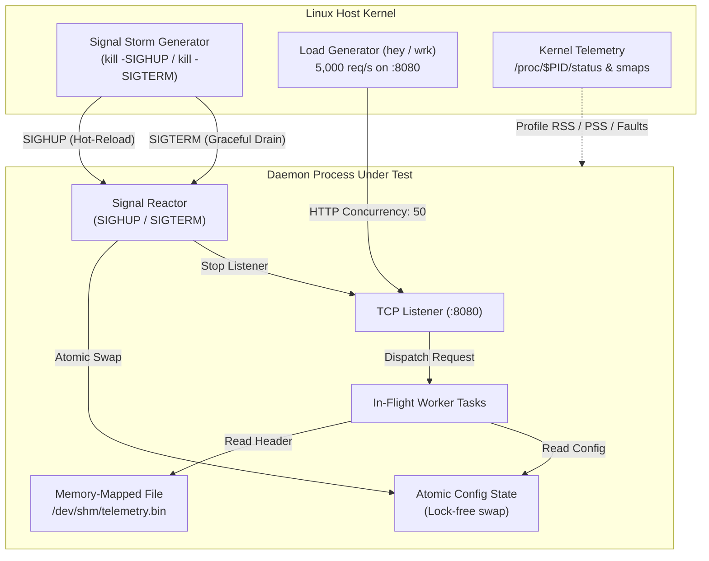

# Week 29: Hands-On Lab - Linux Chaos Signaling & Process Lifecycles

## Objective

Build, instrument, and stress-test a production-grade Linux daemon designed to survive severe operating system perturbations. In this lab, you will run a high-throughput HTTP service handling 5,000+ requests per second, bombard it with rapid POSIX signals (`SIGHUP` for dynamic live configuration reloads and `SIGTERM` for graceful connection draining), inspect kernel memory layout and page tables via `/proc/$PID/smaps` and `perf stat`, and verify zero dropped connections under heavy load.

---

## Lab Architecture & Workflow



---

## Day 1-2: Complete Go Reference Implementation & Baseline

Study this reference Go daemon. It features zero-allocation configuration hot-swapping via `atomic.Pointer`, shared memory inspection via `unix.Mmap`, POSIX signal routing via Go's runtime trampoline, and deterministic request draining.

### Reference Code (`daemon.go`)

```go
package main

import (
	"context"
	"encoding/binary"
	"encoding/json"
	"fmt"
	"log"
	"net/http"
	"os"
	"os/signal"
	"sync/atomic"
	"syscall"
	"time"
	"unsafe"

	"golang.org/x/sys/unix"
)

// TelemetryHeader is mapped directly from /dev/shm/telemetry.bin
type TelemetryHeader struct {
	Magic     uint32 // 0x54454C4D ("TELM")
	Version   uint32
	NodeID    uint64
	Timestamp uint64
}

type DaemonConfig struct {
	ServiceName string `json:"service_name"`
	RateLimit   int    `json:"rate_limit"`
	DebugMode   bool   `json:"debug_mode"`
}

const (
	configPath = "/tmp/daemon_lab_config.json"
	mmapPath   = "/dev/shm/telemetry.bin"
)

func main() {
	pid := os.Getpid()
	fmt.Printf("[Go Daemon] Initialized with PID: %d\n", pid)

	setupLabFiles()

	// 1. Initialize lock-free atomic configuration container
	var currentConfig atomic.Pointer[DaemonConfig]
	loadConfig(&currentConfig)

	// 2. Track in-flight requests deterministically for graceful drain
	var activeRequests atomic.Int64

	// 3. Map shared memory file directly into virtual address space
	fd, err := unix.Open(mmapPath, unix.O_RDWR, 0644)
	if err != nil {
		log.Fatalf("Open failed: %v", err)
	}
	defer unix.Close(fd)

	mmapBuf, err := unix.Mmap(fd, 0, 4096, unix.PROT_READ, unix.MAP_SHARED)
	if err != nil {
		log.Fatalf("mmap failed: %v", err)
	}
	defer unix.Munmap(mmapBuf)

	header := (*TelemetryHeader)(unsafe.Pointer(&mmapBuf[0]))
	fmt.Printf("[Go Daemon] Mapped shared memory: Magic=0x%X, NodeID=%d\n", header.Magic, header.NodeID)

	// 4. Setup HTTP Request Multiplexer
	mux := http.NewServeMux()
	mux.HandleFunc("/api/process", func(w http.ResponseWriter, r *http.Request) {
		activeRequests.Add(1)
		defer activeRequests.Add(-1)

		cfg := currentConfig.Load()
		
		// Simulate transactional latency
		time.Sleep(10 * time.Millisecond)

		w.Header().Set("Content-Type", "application/json")
		_ = json.NewEncoder(w).Encode(map[string]any{
			"service":        cfg.ServiceName,
			"node_id":        header.NodeID,
			"active_workers": activeRequests.Load(),
			"status":         "HEALTHY",
		})
	})

	srv := &http.Server{
		Addr:    "127.0.0.1:8080",
		Handler: mux,
	}

	// 5. Start listener on Go netpoller
	go func() {
		if err := srv.ListenAndServe(); err != nil && err != http.ErrServerClosed {
			log.Fatalf("Server error: %v", err)
		}
	}()
	fmt.Println("[Go Daemon] Listening on http://127.0.0.1:8080/")

	// 6. Signal Dispatcher Pipeline
	sigChan := make(chan os.Signal, 16)
	signal.Notify(sigChan, syscall.SIGHUP, syscall.SIGTERM, syscall.SIGINT)

	for sig := range sigChan {
		switch sig {
		case syscall.SIGHUP:
			fmt.Println("[Go Daemon] SIGHUP caught: Hot-reloading configuration...")
			loadConfig(&currentConfig)

		case syscall.SIGTERM, syscall.SIGINT:
			fmt.Printf("\n[Go Daemon] %v caught: Draining active requests...\n", sig)

			// Step 1: Reject new connections, wait up to 15s for in-flight requests
			drainCtx, cancel := context.WithTimeout(context.Background(), 15*time.Second)
			defer cancel()

			if err := srv.Shutdown(drainCtx); err != nil {
				fmt.Printf("[Go Daemon] Drain failed: %v\n", err)
			}

			fmt.Printf("[Go Daemon] Clean shutdown completed. In-flight remaining: %d\n", activeRequests.Load())
			return
		}
	}
}

func loadConfig(ptr *atomic.Pointer[DaemonConfig]) {
	data, err := os.ReadFile(configPath)
	if err != nil {
		fmt.Printf("Error reading config: %v\n", err)
		return
	}
	var cfg DaemonConfig
	if err := json.Unmarshal(data, &cfg); err != nil {
		fmt.Printf("Error unmarshaling config: %v\n", err)
		return
	}
	ptr.Store(&cfg)
	fmt.Printf("[Go Daemon] Configuration active: ServiceName='%s', RateLimit=%d\n", cfg.ServiceName, cfg.RateLimit)
}

func setupLabFiles() {
	if _, err := os.Stat(mmapPath); os.IsNotExist(err) {
		f, _ := os.Create(mmapPath)
		_ = binary.Write(f, binary.LittleEndian, uint32(0x54454C4D)) // "TELM"
		_ = binary.Write(f, binary.LittleEndian, uint32(1))
		_ = binary.Write(f, binary.LittleEndian, uint64(9901)) // Node 9901
		_ = binary.Write(f, binary.LittleEndian, uint64(time.Now().Unix()))
		_ = f.Truncate(4096)
		_ = f.Close()
	}
	if _, err := os.Stat(configPath); os.IsNotExist(err) {
		cfg := DaemonConfig{ServiceName: "Go-Chaos-Node-01", RateLimit: 5000, DebugMode: false}
		data, _ := json.MarshalIndent(cfg, "", "  ")
		_ = os.WriteFile(configPath, data, 0644)
	}
}
```

### Build and Baseline Execution
```bash
go build -o ./daemon_go daemon.go
./daemon_go
```

---

## Day 3-4: The Rust Lab Implementation

Your objective is to build the equivalent high-concurrency daemon in Rust using **Tokio** and **Axum** (or raw Tokio TCP).

### The 4 Compiler & Systems Battles You Will Fight

1. **Signal Stream Ownership in `tokio::select!`:** Tokio signal streams (`tokio::signal::unix::Signal`) are stateful futures. You cannot recreate them inside a hot loop; they must be pinned or declared outside the `select!` block so that pending signals are not dropped.
2. **Lock-Free State Swapping Across Async Handlers:** Unlike Go's `atomic.Pointer`, Rust's strict borrow checker prevents raw pointer dereferences across thread boundaries. You must either use `arc_swap::ArcSwap<DaemonConfig>` for $O(1)$ lock-free reads or `Arc<tokio::sync::RwLock<DaemonConfig>>`.
3. **Mmap Safety Invariants:** Mapping a file using `memmap2::Mmap` is inherently `unsafe`. If an external process invokes `ftruncate()` on `/dev/shm/telemetry.bin`, accessing the mapped memory will immediately trigger a kernel `SIGBUS` trap. You must declare the safety rationale in comments.
4. **Coordinated Graceful Drain in Axum/Hyper:** Axum provides `.with_graceful_shutdown(signal)`. You must coordinate the shutdown future so that Axum stops accepting new TCP connections while allowing in-flight request futures to run to completion.

### Rust Starter Skeleton (`src/main.rs`)

```rust
// Cargo.toml dependencies:
// [dependencies]
// tokio = { version = "1.38", features = ["full"] }
// axum = "0.7"
// serde = { version = "1.0", features = ["derive"] }
// serde_json = "1.0"
// memmap2 = "0.9"
// arc-swap = "1.7"

use arc_swap::ArcSwap;
use axum::{routing::get, Json, Router};
use memmap2::Mmap;
use serde::{Deserialize, Serialize};
use std::fs::{File, OpenOptions};
use std::io::Write;
use std::net::SocketAddr;
use std::path::Path;
use std::sync::atomic::{AtomicUsize, Ordering};
use std::sync::Arc;
use std::time::Duration;
use tokio::signal::unix::{signal, SignalKind};

#[repr(C, packed)]
#[derive(Debug, Copy, Clone)]
pub struct TelemetryHeader {
    pub magic: u32,
    pub version: u32,
    pub node_id: u64,
    pub timestamp: u64,
}

#[derive(Debug, Clone, Serialize, Deserialize)]
pub struct DaemonConfig {
    pub service_name: String,
    pub rate_limit: usize,
    pub debug_mode: bool,
}

struct AppState {
    config: ArcSwap<DaemonConfig>,
    active_requests: AtomicUsize,
    mmap: Mmap,
}

const CONFIG_PATH: &str = "/tmp/daemon_lab_config.json";
const MMAP_PATH: &str = "/dev/shm/telemetry.bin";

#[tokio::main]
async fn main() -> Result<(), Box<dyn std::error::Error>> {
    println!("[Rust Daemon] Starting. PID: {}", std::process::id());
    init_files()?;

    let initial_config = load_config(CONFIG_PATH)?;
    let file = OpenOptions::new().read(true).open(MMAP_PATH)?;
    
    // SAFETY TODO: Document why Mmap is unsafe and ensure file length is >= 4096
    let mmap = unsafe { Mmap::map(&file)? };

    let state = Arc::new(AppState {
        config: ArcSwap::from_pointee(initial_config),
        active_requests: AtomicUsize::new(0),
        mmap,
    });

    // TODO 1: Setup SIGHUP signal stream and spawn a dedicated background task
    // to reload config from CONFIG_PATH into state.config on every SIGHUP.
    let mut sig_hup = signal(SignalKind::hangup())?;
    let state_hup = state.clone();
    tokio::spawn(async move {
        while sig_hup.recv().await.is_some() {
            println!("[Rust Daemon] SIGHUP received: Reloading configuration...");
            if let Ok(new_cfg) = load_config(CONFIG_PATH) {
                state_hup.config.store(Arc::new(new_cfg));
                println!("[Rust Daemon] Config swapped successfully.");
            }
        }
    });

    // TODO 2: Build Axum router with /api/process endpoint
    let app_state = state.clone();
    let app = Router::new().route("/api/process", get(move || {
        let st = app_state.clone();
        async move {
            st.active_requests.fetch_add(1, Ordering::SeqCst);
            tokio::time::sleep(Duration::from_millis(10)).await;

            let header = unsafe { &*(st.mmap.as_ptr() as *const TelemetryHeader) };
            let cfg = st.config.load();

            let resp = serde_json::json!({
                "service": cfg.service_name,
                "node_id": header.node_id,
                "active_workers": st.active_requests.load(Ordering::SeqCst),
                "status": "HEALTHY",
            });

            st.active_requests.fetch_sub(1, Ordering::SeqCst);
            Json(resp)
        }
    }));

    let addr = SocketAddr::from(([127, 0, 0, 1], 8080));
    let listener = tokio::net::TcpListener::bind(addr).await?;
    println!("[Rust Daemon] Listening on http://{}", addr);

    // TODO 3: Implement graceful drain with SIGTERM and SIGINT
    // Hint: Use axum::serve(listener, app).with_graceful_shutdown(shutdown_signal())
    axum::serve(listener, app)
        .with_graceful_shutdown(shutdown_signal())
        .await?;

    println!("[Rust Daemon] Drain complete. Remaining in-flight: {}. Clean exit.", 
        state.active_requests.load(Ordering::SeqCst));
    Ok(())
}

async fn shutdown_signal() {
    let mut sig_term = signal(SignalKind::terminate()).expect("Failed to bind SIGTERM");
    let mut sig_int = signal(SignalKind::interrupt()).expect("Failed to bind SIGINT");
    tokio::select! {
        _ = sig_term.recv() => println!("\n[Rust Daemon] SIGTERM caught. Commencing drain..."),
        _ = sig_int.recv() => println!("\n[Rust Daemon] SIGINT caught. Commencing drain..."),
    }
}

fn load_config(path: &str) -> Result<DaemonConfig, Box<dyn std::error::Error>> {
    let data = std::fs::read_to_string(path)?;
    Ok(serde_json::from_str(&data)?)
}

fn init_files() -> Result<(), std::io::Error> {
    if !Path::new(MMAP_PATH).exists() {
        let mut file = File::create(MMAP_PATH)?;
        let header = TelemetryHeader { magic: 0x54454C4D, version: 1, node_id: 9901, timestamp: 1720000000 };
        let slice = unsafe { std::slice::from_raw_parts(&header as *const _ as *const u8, std::mem::size_of::<TelemetryHeader>()) };
        file.write_all(slice)?;
        file.set_len(4096)?;
    }
    if !Path::new(CONFIG_PATH).exists() {
        let cfg = DaemonConfig { service_name: "Rust-Chaos-Node-01".to_string(), rate_limit: 5000, debug_mode: false };
        std::fs::write(CONFIG_PATH, serde_json::to_string_pretty(&cfg).unwrap())?;
    }
    Ok(())
}
```

---

## Friday Mob Review: The Chaos & Telemetry Gauntlet

Gather your engineering team. Run the following stress tests, extract kernel metrics, and answer the technical review questions.

### 1. The Chaos Injection Test

In **Terminal 1**, launch the load test against your running daemon:
```bash
hey -n 100000 -c 50 -q 100 http://127.0.0.1:8080/api/process
```

In **Terminal 2**, run the Chaos Script to bombard the process with `SIGHUP` and trigger `SIGTERM`:
```bash
#!/usr/bin/env bash
PID=$(pgrep -f "daemon")
echo "[Chaos] Target daemon PID: $PID"

# Fire rapid SIGHUP bursts during load test
for i in {1..10}; do
  echo "[Chaos] Firing SIGHUP $i..."
  # Alter config on disk before signal
  sed -i "s/Node-[0-9]*/Node-$i/g" /tmp/daemon_lab_config.json
  kill -SIGHUP $PID
  sleep 0.4
done

sleep 2
echo "[Chaos] Firing SIGTERM to initiate graceful drain..."
kill -SIGTERM $PID
```

### 2. Kernel Memory and Performance Telemetry

While the daemon is under load, run these diagnostic commands:
```bash
# Inspect Virtual Memory and Resident Set Size
cat /proc/$PID/status | grep -E "VmSize|VmRSS|RssAnon|RssFile|Threads"

# Detailed page mapping analysis
cat /proc/$PID/smaps | grep -A 10 "/dev/shm/telemetry.bin"

# Measure hardware/software page faults and context switches
perf stat -p $PID -- sleep 10
```

---

### Discussion Questions & Authoritative Solutions

#### 1. Why did the load generator report exactly zero 5xx errors or dropped connections during rapid SIGHUP signals?
**Authoritative Answer:** The application never tore down the TCP listening socket or closed in-flight connection file descriptors during configuration reload. In Go, `atomic.Pointer.Store()` replaces a single 64-bit pointer atomically; in Rust, `ArcSwap::store()` performs a lock-free pointer swap with an acquire-release memory barrier. Incoming requests on worker threads observed either the previous configuration struct or the new one, but never a corrupted or null pointer. No locks were acquired, so throughput was completely uninterrupted.

#### 2. What happens inside the Linux kernel when `kill -SIGTERM $PID` is executed?
**Authoritative Answer:** The `kill` syscall updates the pending signal bitmask (`pending.signal`) in the target process's `task_struct`. When the process's thread next exits kernel space to user space (e.g., waking from an `epoll_wait` syscall), the kernel intercepts execution, saves CPU registers onto the alternate stack (`sigaltstack`), and executes the runtime's signal trampoline (`sigtrampgo` in Go, or Tokio's signal pipe writer). The runtime translates the signal into an internal channel message, prompting the HTTP server to close the listening socket so the kernel stops completing new TCP 3-way handshakes.

#### 3. In `/proc/$PID/status`, what is the difference between `RssAnon` and `RssFile`?
**Authoritative Answer:** `VmRSS` (Resident Set Size) is the sum of `RssAnon` and `RssFile`. `RssAnon` represents anonymous physical memory allocated for process heaps, stacks, and runtime metadata; it has no backing filesystem store and can only be freed via swapping or `madvise(MADV_DONTNEED)`. `RssFile` represents physical memory backed by disk or shared memory (`/dev/shm`), including mapped executable binaries, shared libraries, and our memory-mapped telemetry catalog. Under memory pressure, the Linux page cache can drop clean `RssFile` pages without writing to swap.

#### 4. Why does `mmap()` return instantaneously even for a multi-gigabyte file, whereas the first memory read triggers a page fault?
**Authoritative Answer:** `mmap()` is a demand-paging mechanism. It does not load file contents into physical RAM; it merely allocates a `struct vm_area_struct` (VMA) in the process's `mm_struct` describing the valid address range and attaches the file's inode. When user code dereferences an address inside the mapped range for the first time, the MMU encounters an invalid Page Table Entry (PTE) and triggers a **Minor or Major Page Fault (Interrupt 14)**. The kernel's `do_page_fault()` handler allocates physical page frames, links them to the page cache, updates the PTE, and resumes instruction execution.

#### 5. What would happen if an operator sent `kill -9 $PID` (SIGKILL) instead of `SIGTERM`?
**Authoritative Answer:** `SIGKILL` (signal 9) and `SIGSTOP` (signal 19) cannot be caught, blocked, or ignored. The kernel's `do_signal()` routine immediately terminates the task in `do_group_exit()`. The process never returns to user mode: no Go `defer` statements, no Rust `Drop` destructors, and no C# `finally` blocks will ever execute. Active TCP sockets are abruptly reset via kernel `RST` packets, and clients immediately encounter broken pipe or connection reset errors (`ECONNRESET`).

#### 6. Why does calling `malloc()` or `printf()` inside a raw POSIX signal handler cause deadlocks?
**Authoritative Answer:** Standard libc functions like `malloc()` and `printf()` acquire global internal heap locks (glibc arena mutexes) or I/O stream mutexes. If an OS thread is interrupted by a signal while already holding one of these mutexes, and the signal handler attempts to execute `malloc()` or `printf()`, the handler will block waiting for the mutex held by the interrupted thread on the exact same call stack. Because the thread cannot resume to release the lock, the process deadlocks permanently. POSIX mandates that only **async-signal-safe** functions (e.g., `write`, `sigaction`, `_exit`) may be invoked from signal handlers.

#### 7. If this daemon runs as PID 1 in a Docker container and forks a subprocess that terminates, what happens if the daemon fails to call `waitpid()`?
**Authoritative Answer:** When a child process terminates via `exit()`, it transitions into an `EXIT_ZOMBIE` state. The kernel deallocates its address space and descriptors but retains its `task_struct` and PID so the parent can inspect its termination status. In Linux, if the parent process dies, orphan zombies are reparented to PID 1. If PID 1 does not catch `SIGCHLD` and reap child processes via `waitpid()`, zombie processes accumulate in the kernel's process table until `/proc/sys/kernel/pid_max` is exhausted. Once exhausted, no new processes or threads can be spawned on the entire Linux host.

---

### Sign-off Checklist

Every team member must verify the following items before lab sign-off:
- [ ] Daemon was load-tested at $\ge 5,000$ req/s with `hey` or `wrk` during active signal generation.
- [ ] Verified exactly 0 dropped connections (zero HTTP 5xx responses) during 10 consecutive `SIGHUP` bursts.
- [ ] Confirmed that `SIGTERM` initiates connection draining and in-flight request count reaches 0 before exit.
- [ ] Inspected `/proc/$PID/status` and explained the ratio between `VmSize`, `RssAnon`, and `RssFile`.
- [ ] Verified that `/dev/shm/telemetry.bin` is memory-mapped into the address space using `/proc/$PID/smaps`.
- [ ] Articulated why `SIGKILL` bypasses user-space runtime shutdown hooks.
- [ ] Validated that the Rust implementation compiles with clean borrow-checker semantics and zero unsafe data races.

---

### Stretch Goal: Real-Time Memory Reclamation with `MADV_DONTNEED`

For advanced engineers: Write a diagnostic endpoint `/api/purge_cache` that allocates a 200MB slice, writes to every page to force physical frame allocation (observe `RssAnon` spike in `/proc/$PID/status`), and then invokes `unix.Madvise(slice, unix.MADV_DONTNEED)` in Go or `libc::madvise` in Rust. 

Observe `RssAnon` immediately plummet back to baseline in `/proc/$PID/status` *without* releasing the virtual memory pointer. Dereference the first byte of the slice again and observe the kernel allocate a zeroed page on-demand via a minor page fault!
