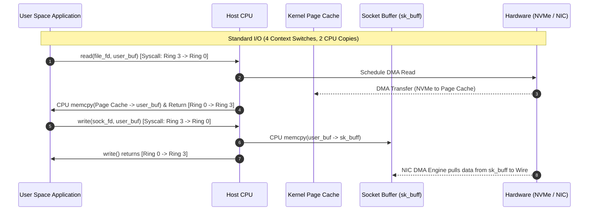

# Week 30: Zero-Copy Networking and Kernel Bypass (io_uring)

## Why This Week Matters for Your Career Transition

As a senior C# engineer, you are deeply accustomed to high-level asynchronous abstractions. In the .NET CLR ecosystem, streaming data from disk to a client is as idiomatic as writing `await fileStream.CopyToAsync(networkStream)`. The modern .NET runtime performs heroic optimizations behind the scenes: `System.IO.Pipelines` pools memory buffers, `Socket.SendFileAsync` calls into OS-specific zero-copy APIs where possible, and the Kestrel web server leverages pinned memory handles with `ReadOnlySequence<byte>`. However, managed runtimes intentionally obscure the physical hardware and operating system boundary. When you transition into senior infrastructure, systems, or platform engineering roles in Go or Rust, this abstraction veil is stripped away. You are no longer merely writing business logic that delegates to an optimized runtime; you are tasked with designing and debugging high-throughput distributed storage engines, database replication layers, L4/L7 load balancers, and low-latency financial gateways.

At high line rates—10Gbps, 40Gbps, 100Gbps, and beyond—traditional I/O paradigms hit an impenetrable architectural wall known as the **Syscall and Memory-Bus Bottleneck**. Moving gigabytes of data through conventional POSIX `read(2)` and `write(2)` loops consumes massive amounts of CPU cycles not in computing application state, but in copying bytes between CPU-managed virtual memory rings and incurring hardware-enforced context switches. By completing this week, you will master the physics of Linux kernel I/O: the precise mechanics of the "4-copy problem", how in-kernel transfer primitives like `sendfile(2)` and `splice(2)` eliminate memory copies, how page-pinning TCP `MSG_ZEROCOPY` functions, and how Jens Axboe's revolutionary `io_uring` architecture eradicates syscall overhead via lock-free shared memory ring buffers. You will learn to think not in terms of abstract streams, but in terms of physical memory frames, Direct Memory Access (DMA) controllers, CPU cache line pollution, page tables, and hardware ring buffers.

---

## 1. The Cost of Standard Linux I/O: The 4-Copy Problem

To understand zero-copy networking, you must first dissect the physical and architectural cost of standard user-space buffered I/O. Consider the canonical server task: reading a large file from persistent NVMe/SSD storage and transmitting it over a TCP socket.

```csharp
// The classic C# implementation
byte[] buffer = new byte[65536];
int bytesRead;
while ((bytesRead = await fileStream.ReadAsync(buffer, 0, buffer.Length)) > 0)
{
    await socketStream.WriteAsync(buffer, 0, bytesRead);
}
```

Underneath the managed runtime, this loop executes POSIX `read(2)` followed by POSIX `write(2)`. Even when optimized with modern primitives like `Memory<byte>` or `Span<byte>`, the underlying operating system must move data across architectural boundaries. This sequence incurs exactly **4 context switches** and **4 data copies** (2 DMA copies and 2 CPU `memcpy` passes).

```
+-----------------------------------------------------------------------------------+
|                                    USER SPACE                                     |
|                                                                                   |
|                   +--------------------------------------------+                  |
|                   |        Application Memory Buffer           |                  |
|                   |         (e.g., C# byte[] / Span)           |                  |
|                   +--------------------------------------------+                  |
|                             ^                         |                           |
|               CPU Copy 1    |                         |  CPU Copy 2               |
|            (Cache Polluting)|                         | (Cache Polluting)         |
|                             |                         v                           |
+-----------------------------|-------------------------|---------------------------+
| KERNEL SPACE                |                         |                           |
|                             |                         |                           |
|     +-------------------------------+     +-------------------------------+       |
|     |       Kernel Page Cache       |     |      Socket Transmit Buffer   |       |
|     |      (struct page frames)     |     |          (sk_buff pool)       |       |
|     +-------------------------------+     +-------------------------------+       |
|                   ^                                           |                   |
|                   | DMA Copy 1                                | DMA Copy 2        |
|                   | (PCIe Bus Transfer)                       | (PCIe Bus Tx)     |
|                   v                                           v                   |
+-------------------|-------------------------------------------|-------------------+
| HARDWARE LAYER    |                                           |                   |
|         +-------------------+                       +-------------------+         |
|         | NVMe / SATA Disk  |                       |  Network Interface|         |
|         |    Controller     |                       |    Card (NIC)     |         |
|         +-------------------+                       +-------------------+         |
+-----------------------------------------------------------------------------------+
```

### Detailed Execution Phase Breakdown

1. **Phase 1: Syscall Invocation (`read`) & Context Switch 1 (User -> Kernel)**
   The thread issues a `SYS_read` syscall. The CPU executes a software interrupt or the `SYSCALL` instruction. The CPU hardware switches privilege levels from Ring 3 (User) to Ring 0 (Kernel). The CPU saves user-space registers (RIP, RSP, flags) to the kernel thread stack. On modern CPUs patched against speculative execution vulnerabilities (Spectre/Meltdown), Kernel Page Table Isolation (KPTI) forces a reload of the CR3 register, invalidating or isolating Translation Lookaside Buffer (TLB) entries.

2. **Phase 2: DMA Copy 1 (Disk -> Kernel Page Cache)**
   The VFS (Virtual Filesystem Switch) checks if the requested blocks reside in the Linux Page Cache. If absent (a page cache miss), the storage driver schedules a Direct Memory Access (DMA) transfer. The NVMe or storage controller writes disk blocks across the PCIe bus directly into physical memory frames allocated for the Page Cache (`struct page`). The CPU does not spend cycles copying these bytes; it initiates the request and handles the completion interrupt.

3. **Phase 3: CPU Copy 1 (Kernel Page Cache -> User Buffer) & Context Switch 2 (Kernel -> User)**
   Because user-space applications cannot directly address kernel memory pages for security and isolation reasons, the CPU must physically copy the data from the Kernel Page Cache into the application's user-space memory buffer. This is a CPU-driven `memcpy`.
   *Systems Impact:* The CPU must load every byte from RAM into its L1/L2/L3 cache hierarchy and write it back out to the destination user memory pages. This completely evicts useful application code and data from the CPU caches—a phenomenon known as **CPU Cache Pollution**. Once copying finishes, the kernel switches context back from Ring 0 to Ring 3, once again restoring user registers and toggling page table contexts.

4. **Phase 4: Syscall Invocation (`write`) & Context Switch 3 (User -> Kernel)**
   The application now holds the data in user space. It immediately issues a `SYS_write` or `SYS_send` syscall targeting the network socket descriptor. The CPU transitions for the third time: Ring 3 to Ring 0, saving register state, switching stacks, and undergoing KPTI overhead.

5. **Phase 5: CPU Copy 2 (User Buffer -> Kernel Socket Buffer)**
   The kernel TCP/IP networking stack processes the write request. It allocates network socket buffers (`struct sk_buff`). The CPU must execute a *second* manual `memcpy`, reading the data out of the user-space buffer and writing it into the kernel's `sk_buff` payload memory. This causes a second wave of CPU cache thrashing.

6. **Phase 6: Context Switch 4 (Kernel -> User) & DMA Copy 2 (Socket Buffer -> NIC)**
   The `write()` syscall completes, and the kernel returns control to user space (Context Switch 4). Concurrently or asynchronously, the network driver places a descriptor on the NIC's Transmit (TX) ring buffer. The NIC's DMA engine reads the payload directly from the kernel `sk_buff` memory across the PCIe bus and clocks the bits out onto the physical network wire (PHY).

### The Mathematical Overhead of the 4-Copy Problem

At 100 Gbps line rate, a network interface transmits approximately 11.92 Gigabytes per second. If every byte must be copied twice by the CPU:
- Total memory bandwidth consumed by copying: $11.92 \times 2 = 23.84\text{ GB/s}$ of read operations plus $23.84\text{ GB/s}$ of write operations.
- Total memory bus load: $\approx 47.68\text{ GB/s}$.
On a dual-channel DDR4 memory system with a theoretical peak bandwidth of $\approx 40\text{ GB/s}$, **the memory bus is 100% saturated purely by moving data between user and kernel buffers**, leaving zero bandwidth for application computation! Furthermore, executing hundreds of thousands of context switches per second forces constant pipeline flushes and branch predictor resets.



---

## 2. Zero-Copy Linux Primitives: sendfile, splice, and MSG_ZEROCOPY

To bypass the severe memory bandwidth and CPU overhead of user-space copying, the Linux kernel evolved specialized zero-copy system calls.

### `sendfile(2)`: Kernel-Level In-System Transfer

Introduced in Linux 2.2 and enhanced significantly in 2.6+, `sendfile` instructs the kernel to transfer data directly from an input file descriptor to an output socket descriptor without passing through user space.

```c
#include <sys/sendfile.h>
ssize_t sendfile(int out_fd, int in_fd, off_t *offset, size_t count);
```

#### How `sendfile` Operates Internally

1. The user application invokes `sendfile(sock_fd, file_fd, &offset, count)`.
2. The CPU transitions to Ring 0 (Context Switch 1).
3. The storage DMA engine loads data into the Kernel Page Cache.
4. **Without Scatter-Gather DMA:** The kernel CPU copies data internally from the Page Cache directly into the socket buffer `sk_buff`. This eliminates the user-space copies but still involves one in-kernel CPU copy.
5. **With Scatter-Gather DMA (`NETIF_F_SG`):** Modern NICs support scatter-gather. The kernel does *not* copy page cache data to the socket buffer. Instead, the kernel allocates an `sk_buff` that contains only packet headers and physical memory pointers (`skb_shared_info`) referencing the physical pages inside the Kernel Page Cache.
6. The NIC's DMA engine reads packet headers from the `sk_buff` and gathers payload bytes directly from the Kernel Page Cache via physical memory addresses.
7. `sendfile` returns (Context Switch 2).

**System Metrics:**
- CPU Memcpy passes: **0** (with scatter-gather NICs).
- Context switches: **2** (one entry, one exit).
- Memory bandwidth savings: **100% elimination of CPU buffer copies**.

```
+-----------------------------------------------------------------------------------+
|                        ZERO-COPY WITH SENDFILE & SCATTER-GATHER                   |
+-----------------------------------------------------------------------------------+
| USER SPACE:  sendfile(out_fd, in_fd, &offset, len)                                |
|              (No user buffers allocated. Zero context switches during streaming.) |
+-----------------------------------------------------------------------------------+
| KERNEL SPACE:                                                                     |
|                                                                                   |
|   +--------------------------+                 +------------------------------+   |
|   |    Kernel Page Cache     |                 | Socket Descriptor (sk_buff)  |   |
|   |   (struct page frames)   |                 | (Header info + Page Pointers)|   |
|   +--------------------------+                 +------------------------------+   |
|                 ^                                             |                   |
|                 |                                             |                   |
|                 | DMA Read                                    | Pass Page         |
|                 |                                             | Descriptors       |
|                 v                                             v                   |
|   +--------------------------+                 +------------------------------+   |
|   |   NVMe / Disk Device     |                 |      NIC DMA Controller      |   |
|   +--------------------------+                 +------------------------------+   |
|                                                               |                   |
|                                                               | Direct DMA Read   |
|                                                               +-------------------+
|                                                               (Bypasses CPU copy) |
+-----------------------------------------------------------------------------------+
```

*Limitations of `sendfile`:* `in_fd` must represent a file that supports `mmap`-like operations (regular files). It cannot transfer arbitrary data between two network sockets or transform data in-flight (such as TLS encryption or compression).

### `splice(2)`: Pipe-Based Zero-Copy Conduits

Linux 2.6.17 introduced `splice(2)`, generalizing zero-copy by decoupling the source and destination descriptors through the kernel pipe buffer abstraction.

```c
#include <fcntl.h>
ssize_t splice(int fd_in, loff_t *off_in, int fd_out, loff_t *off_out, 
               size_t len, unsigned int flags);
```

#### The Architecture of `struct pipe_inode_info`

In Linux, a pipe is not an unmanaged byte stream in kernel memory. It is an array of page references: `struct pipe_buffer`. Each entry holds a pointer to a `struct page` along with an offset and length:

```c
struct pipe_buffer {
    struct page *page;      /* Physical page frame pointer */
    unsigned int offset;    /* Byte offset within page */
    unsigned int len;       /* Number of valid bytes */
    const struct pipe_buf_operations *ops; /* Page management vtable */
    unsigned int flags;
};
```

When you `splice` data from an input descriptor (e.g., a file or socket) into a pipe:
1. The kernel creates `pipe_buffer` entries that point directly to the physical pages backing the source descriptor.
2. The page reference count (`page_ref_inc`) is incremented.
3. When you subsequently `splice` from the pipe to an output socket, the kernel transfers those page references into the socket's `sk_buff`.
4. **No memory is copied.** The pipe acts as an in-kernel zero-copy pointer conduit.
5. Flags such as `SPLICE_F_MOVE` advise the kernel to attempt physical page remapping, while `SPLICE_F_NONBLOCK` enables asynchronous integration with `epoll`.

### TCP `MSG_ZEROCOPY`: Zero-Copy for User-Generated Data

What if data is dynamically generated in user space (e.g., a serialized JSON/Protobuf payload or encrypted database pages) and cannot come from a disk file? Prior to Linux 4.14, user-generated data *had* to be copied via `write()` or `send()`.

Linux 4.14 introduced `MSG_ZEROCOPY` for TCP sockets.

```c
int one = 1;
setsockopt(sock_fd, SOL_SOCKET, SO_ZEROCOPY, &one, sizeof(one));
ssize_t sent = send(sock_fd, user_buffer, length, MSG_ZEROCOPY);
```

#### The Asynchronous Notification Lifecycle

1. When `send(..., MSG_ZEROCOPY)` is invoked, the kernel invokes `get_user_pages_fast()` to lock and pin the physical memory pages backing `user_buffer`.
2. The kernel passes the physical page addresses directly to the NIC's DMA engine.
3. The syscall returns immediately.
4. **The Catch (Buffer Mutation Trap):** The application *must not modify or deallocate* `user_buffer` while the NIC DMA engine is actively reading it! If user space overwrites `user_buffer`, corrupted or torn packets will be transmitted onto the wire.
5. **The Completion Queue (Error Queue):** When the NIC finishes transmission and emits an interrupt, the kernel frees the pinned pages and queues a notification on the socket's error queue (`MSG_ERRQUEUE`).
6. The application must poll the socket using `poll()` or `epoll` for `POLLERR` and call `recvmsg(..., MSG_ERRQUEUE)` to extract the `sock_extended_err` structure confirming that the buffer is safe to reuse or free.

```c
// Reading completion notification from socket error queue
struct msghdr msg = {0};
char control[100];
msg.msg_control = control;
msg.msg_controllen = sizeof(control);

recvmsg(sock_fd, &msg, MSG_ERRQUEUE);
struct cmsghdr *cmsg = CMSG_FIRSTHDR(&msg);
if (cmsg && cmsg->cmsg_level == SOL_IP && cmsg->cmsg_type == IP_RECVERR) {
    struct sock_extended_err *serr = (void *)CMSG_DATA(cmsg);
    if (serr->ee_errno == 0 && serr->ee_origin == SO_EE_ORIGIN_ZEROCOPY) {
        uint32_t hi = serr->ee_data; // Sequence number of completed buffer
        // user_buffer can now be safely reused or freed!
    }
}
```

*When to use `MSG_ZEROCOPY`:* Page pinning and error queue polling impose kernel bookkeeping overhead. Benchmarks indicate `MSG_ZEROCOPY` is slower than standard `copy_from_user` for payloads smaller than 10KB to 16KB. For payloads exceeding 64KB, it yields massive throughput increases and drops CPU usage by up to 60%.

---

## 3. Linux io_uring Architecture: The Asynchronous Syscall Revolution

While `sendfile` and `splice` solve the data-copying problem, they do not solve the **syscall invocation problem**. In an event-driven server built on `epoll`, an application must execute:
1. `epoll_wait(2)` to detect socket readiness (1 syscall).
2. `read(2)` on ready sockets (1 syscall per connection).
3. Application processing.
4. `write(2)` or `sendfile(2)` to output data (1 syscall per connection).

Under millions of operations per second, the cumulative CPU cost of switching between Ring 3 and Ring 0 dominates execution time. Furthermore, Linux POSIX file I/O has a fatal flaw: **regular files on Linux cannot be multiplexed asynchronously with `epoll`**. A `read()` or `write()` to an ext4/XFS filesystem will block the calling OS thread if the file data is not cached in memory, forcing runtimes (like Go and Tokio) to offload file operations to blocking background thread pools.

In 2019 (Linux kernel 5.1+), Jens Axboe introduced **`io_uring`**, completely reimagining the boundary between user space and the Linux kernel.

### Submission Queue (SQ) and Completion Queue (CQ)

`io_uring` operates on two circular, lock-free ring buffers allocated by the kernel and mapped directly into the user application's address space via `mmap(2)`:
1. **Submission Queue (SQ):** An array of Submission Queue Entries (`struct io_uring_sqe`). The application acts as the Producer; the kernel acts as the Consumer.
2. **Completion Queue (CQ):** An array of Completion Queue Entries (`struct io_uring_cqe`). The kernel acts as the Producer; the application acts as the Consumer.

```
+------------------------------------------------------------------------------------+
|                               io_uring SHARED MEMORY                               |
+------------------------------------------------------------------------------------+
| USER SPACE                                                    KERNEL SPACE         |
|                                                                                    |
|  [Producer]                                                    [Consumer]          |
|  Advances SQ Tail                                              Advances SQ Head    |
|         |                                                             ^            |
|         v                                                             |            |
|     +-------+-------+-------+-------+-------+-------+                 |            |
|     | SQE 0 | SQE 1 | SQE 2 | SQE 3 | SQE 4 | SQE 5 | ----------------+            |
|     +-------+-------+-------+-------+-------+-------+                              |
|         SUBMISSION QUEUE RING (Mapped via shared mmap physical memory)             |
|                                                                                    |
|                                                                                    |
|         COMPLETION QUEUE RING (Mapped via shared mmap physical memory)             |
|     +-------+-------+-------+-------+-------+-------+                              |
|     | CQE 0 | CQE 1 | CQE 2 | CQE 3 | CQE 4 | CQE 5 | <---------------+            |
|     +-------+-------+-------+-------+-------+-------+                 |            |
|         |                                                             |            |
|         v                                                             |            |
|  [Consumer]                                                    [Producer]          |
|  Advances CQ Head                                              Advances CQ Tail    |
+------------------------------------------------------------------------------------+
```

### The Lock-Free Ring Buffer Mechanics

The user application and the kernel synchronize across these ring buffers without locks using atomic memory barriers (acquire/release semantics). Understanding these barriers is critical for senior C# developers who are accustomed to relying on the CLR's `volatile` keyword or `Monitor` locks.

#### Structure of an SQE (`io_uring_sqe`)
An SQE represents a self-contained command to the kernel:
```c
struct io_uring_sqe {
    __u8   opcode;       /* Operation code: IORING_OP_READ, IORING_OP_WRITE, etc. */
    __u8   flags;        /* IOSQE_FIXED_FILE, IOSQE_ASYNC, IOSQE_IO_LINK, etc. */
    __u16  ioprio;       /* I/O priority */
    __s32  fd;           /* File descriptor targeted */
    union {
        __u64  off;      /* Offset into file */
        __u64  addr2;
    };
    union {
        __u64  addr;     /* Pointer to buffer: cast to (void *) */
        __u64  splice_off_in;
    };
    __u32  len;          /* Buffer length */
    union {
        __kernel_rwf_t rw_flags;
        __u32          fsync_flags;
        __u16          poll_events;
    };
    __u64  user_data;    /* 64-bit opaque tag passed back to CQE untouched */
    // Additional union padding omitted for clarity
};
```

#### Structure of a CQE (`io_uring_cqe`)
When the kernel finishes the asynchronous operation, it writes a completion entry:
```c
struct io_uring_cqe {
    __u64  user_data;    /* Exactly matches user_data passed in the SQE */
    __s32  res;          /* Result code: bytes transferred or negative -errno */
    __u32  flags;        /* Operation-specific completion flags */
};
```

#### Memory Barriers and Cache Coherency in the Ring Protocol

Because user-space and kernel-space concurrently access shared memory mapped rings without mutexes, memory reordering by out-of-order CPU execution pipelines (such as modern x86-64 and ARM64 architectures) could lead to catastrophic corruption. For example, if the application writes to the SQE payload in memory and advances the SQ `tail` pointer, but the CPU reorders the write such that the updated `tail` is made visible to the kernel *before* the SQE structure fields are fully flushed to L3/DRAM cache lines, the kernel could read half-initialized garbage data.

To guarantee correctness, the ring protocol enforces strict memory synchronization rules:
1. **Submission Queue Ingestion (Producer in User Space):**
   - The application writes the `io_uring_sqe` fields in memory.
   - The application executes a **Store-Release barrier** (`atomic_store_explicit(tail, new_tail, memory_order_release)` or `smp_store_release`). On x86, every store has implicit release semantics, but compiler reordering must still be prohibited via compiler fences. On ARM64 (e.g., AWS Graviton), an explicit `dmb ishst` (Data Memory Barrier, Inner Shareable Stores) instruction is executed.
   - This guarantees all SQE field writes are completely visible in CPU cache lines *before* the updated `tail` index becomes visible.
2. **Submission Queue Consumption (Consumer in Kernel Space):**
   - The kernel reads `tail` with a **Load-Acquire barrier** (`smp_load_acquire`).
   - This ensures that when the kernel observes the incremented `tail`, any subsequent reads of the SQE array by the kernel will observe the updated memory written by user space.
3. **Completion Queue Emission (Producer in Kernel Space):**
   - The kernel writes the `io_uring_cqe` fields and updates the CQ `tail` using a Store-Release barrier.
4. **Completion Queue Harvesting (Consumer in User Space):**
   - The user application reads the CQ `tail` using a Load-Acquire barrier (`atomic_load_explicit(tail, memory_order_acquire)`). Once verified that `head != tail`, it safely reads the CQE at index `head & mask`, and then advances `head` using an atomic store.

This synchronization design allows `io_uring` to achieve tens of millions of IOPS per CPU core without acquiring a single spinlock or kernel mutex.

#### The Zero-Syscall Submission Loop

In standard mode, submitting operations proceeds as follows:
1. The application reads `*sq_ring.tail` and checks available space against `*sq_ring.head`.
2. The application populates `sqe_array[index]` with the desired operation (e.g., `IORING_OP_SPLICE`, `IORING_OP_READV`, `IORING_OP_SEND`).
3. The application tags `sqe.user_data` with a pointer to a state machine, callback context, or Rust `Waker`.
4. The application advances `*sq_ring.tail` using an atomic store with release semantics (`atomic_store_explicit(..., memory_order_release)`).
5. The application calls `io_uring_enter(ring_fd, to_submit, min_complete, flags)` **once** to flush dozens or hundreds of queued SQEs to the kernel.
6. The kernel consumes the entries, processes them in parallel (using kernel worker threads `io-wq` for blocking disk operations or event-driven callbacks for sockets), and posts entries to the CQ ring.

### Kernel Polling Mode: `IORING_SETUP_SQPOLL`

Can we eliminate even the single `io_uring_enter` syscall? **Yes.**

When initializing `io_uring` with the flag `IORING_SETUP_SQPOLL`, the kernel launches a dedicated kernel polling thread (`io_uring-sq`). 
- This kernel thread continuously polls the SQ ring's tail pointer directly in shared memory.
- As soon as the application writes an SQE and updates `*sq_ring.tail`, the kernel thread immediately sees the new tail, claims the SQE, and dispatches the hardware I/O operation.
- The application executes **zero system calls** during steady-state processing. Context switches are literally zero ($0$).
- If the application remains idle for longer than `sq_thread_idle` milliseconds, the kernel thread puts itself to sleep. The application checks the `flags` field; if `IORING_SQ_NEED_WAKEUP` is set, it issues an `io_uring_enter` call to wake the kernel thread back up.

```
+------------------------------------------------------------------------------------+
|                         io_uring SQPOLL EXECUTION FLOW                             |
+------------------------------------------------------------------------------------+
| USER SPACE PROCESS                                                                 |
|   1. Write SQE into shared memory ring buffer                                      |
|   2. atomic_store(&sq_tail, new_tail, memory_order_release);                       |
|   3. Continue application logic. (NO SYSCALL INVOCATION!)                          |
|                                                                                    |
| SHARED MEMORY (MMAP): [SQE 0] [SQE 1] [SQE 2]  <- sq_tail points here             |
|                                                                                    |
| KERNEL SPACE (Dedicated io_uring-sq Kernel Thread)                                 |
|   1. Kernel thread loops: if (sq_tail != sq_head) process_sqe();                   |
|   2. Submits command directly to NVMe driver / NIC driver                          |
|   3. Writes CQE to Completion Ring upon hardware completion                        |
|   4. atomic_store(&cq_tail, new_cq_tail, memory_order_release);                    |
+------------------------------------------------------------------------------------+
```

### Advanced `io_uring` Performance Accelerators

1. **Fixed Registered Buffers (`IORING_REGISTER_BUFFERS`):**
   In normal I/O, the kernel must validate user-space memory pointers and call `get_user_pages()` to map virtual memory pages into physical pages for every single I/O operation. By invoking `io_uring_register()` at startup with `IORING_REGISTER_BUFFERS`, you pre-register and pin an array of `iovec` memory regions. The kernel pins these pages permanently in RAM. Subsequent I/O calls use `IORING_OP_READ_FIXED` / `IORING_OP_WRITE_FIXED`, completely bypassing the page table lookup overhead.

2. **Registered Files (`IORING_REGISTER_FILES`):**
   Every time an application calls `read(fd, ...)` or submits an SQE with an `fd`, the kernel must look up the file descriptor in the process's file table (`fget()`) and increment its atomic reference count, then decrement it upon completion (`fput()`). Under high concurrency across multiple threads, this atomic reference count causes severe CPU cache line bouncing. By pre-registering an array of file descriptors via `IORING_REGISTER_FILES`, the kernel stores direct pointers to `struct file` in an internal table. SQEs reference files by array index, completely eliminating atomic `fget`/`fput` synchronization.

3. **Linked SQEs (`IOSQE_IO_LINK`):**
   You can link multiple operations together. For example: SQE 1 (`READ` from file) -> linked to SQE 2 (`WRITE` to socket). The kernel executes SQE 2 only after SQE 1 successfully completes, entirely inside the kernel without returning to user space between steps!

---

## 4. Comparative Architectural Analysis

Senior developers transitioning between .NET, Go, and Rust must understand how these runtimes map onto host operating system facilities.

```
+------------------------------------------------------------------------------------------+
|                        I/O SUBSYSTEM ARCHITECTURAL MATRIX                                |
+-----------------------+--------------------+---------------------+-----------------------+
| Subsystem / Model     | Paradigm           | Notification Source | Syscall Cost per I/O  |
+-----------------------+--------------------+---------------------+-----------------------+
| Linux epoll           | Readiness          | File Descriptor     | 2+ (epoll_wait, I/O)  |
| Windows IOCP          | Completion         | Completion Port     | 1 (GQCS)              |
| Go Netpoller (Linux)  | Managed Readiness  | Goroutine Park/Wake | 2+ (epoll + read/write|
| Linux io_uring        | True Completion    | Lock-free Rings     | 0 (with SQPOLL)       |
+-----------------------+--------------------+---------------------+-----------------------+
```

### 1. Linux `epoll` vs. Windows `IOCP`
- **Linux `epoll` is a Readiness Model:** It tells your program: *"Descriptor 14 has bytes ready to read."* Your application must still initiate the `read(2)` syscall, handle `EAGAIN` or `EWOULDBLOCK`, and copy the data.
- **Windows `IOCP` (Input/Output Completion Ports) is a Completion Model:** It tells your program: *"The OS has already read 4096 bytes into your buffer; here is the completed operation."* You initiate an asynchronous operation (`WSARecv` / `ReadFileEx`), provide the buffer, and the Windows kernel fills it asynchronously.
- **C# / .NET Affinity:** The .NET runtime's asynchronous machinery (`TaskCompletionSource`, `async/await`, `Overlapped`) was originally modeled directly after Windows IOCP. When .NET Core was ported to Linux, the CLR team had to build an internal emulation layer: a managed thread runs an `epoll` loop that dispatches completions to mimic IOCP semantics!

### 2. Go Netpoller
- Go exposes a synchronous programming API (`conn.Read()`, `conn.Write()`) on top of non-blocking I/O.
- When a goroutine calls `netConn.Read()`, Go sets the socket to non-blocking and executes the read. If it returns `EAGAIN`, the internal Go **Netpoller** registers the socket descriptor with a global background `epoll` instance and parks the goroutine (`gopark`).
- When the background netpoller thread wakes up from `epoll_wait`, it identifies the parked goroutine and places it back onto an available M's run queue (`goready`).
- *Limitation:* The Go netpoller is hardwired to `epoll` for networking. Because standard Linux `epoll` does not support regular disk files, Go must execute file I/O operations (`os.File`) on dedicated OS threads allocated by the standard runtime thread pool, which can incur thread-hopping and OS context switches.

### 3. Linux `io_uring`
- `io_uring` provides a unified completion model for *everything*: network sockets, disk files, pipes, timers, and even inter-process communication.
- Unlike `epoll`, `io_uring` handles disk files asynchronously without blocking OS threads.
- Unlike Windows IOCP, `io_uring` does not require invoking a syscall (`GetQueuedCompletionStatus`) to retrieve completions; completions are read from memory-mapped ring buffers.

---

## 5. Common Misconceptions to Unlearn

### Misconception 1: "High CPU utilization in high-throughput streaming means our business logic is CPU-bound."
**Reality:** In unoptimized network servers, high CPU usage is almost always caused by **kernel-to-user boundary crossing and CPU memory copies**. Inspecting the system via `top` or `htop` will reveal high `sys` (system/kernel) CPU time relative to `user` CPU time. Moving to zero-copy primitives (`sendfile`, `splice`, or `io_uring`) frequently drops CPU utilization from 90% down to under 5% while achieving line-rate network saturation.

### Misconception 2: "Go's `io.Copy(dst, src)` is just an unbuffered `for` loop reading into a slice."
**Reality:** Go's standard library implements sophisticated runtime interface inspections. When `io.Copy(dst, src)` is invoked, it checks if `dst` implements `io.ReaderFrom`. If transferring from an `*os.File` to a `*net.TCPConn`, `TCPConn.ReadFrom()` detects the concrete types and automatically invokes the internal `poll.SendFile()` wrapper, delegating the transfer directly to the Linux `sendfile(2)` system call! If you unknowingly wrap either the file or socket in a custom reader/writer decorator that masks the underlying concrete types, Go falls back to a 32KB user-space buffer, silently destroying your throughput.

### Misconception 3: "Asynchronous I/O (`async/await`) is inherently Zero-Copy."
**Reality:** Asynchrony and zero-copy are orthogonal concepts. Asynchrony means the calling thread is not blocked waiting for an I/O event to finish; it can execute other tasks. However, asynchronous operations can—and usually do—perform multiple CPU memory copies. A C# `await stream.ReadAsync(buffer)` is 100% asynchronous, yet it still copies every byte through the kernel page cache into user space. True zero-copy changes the physical data path through the kernel and hardware bus.

### Misconception 4: "io_uring is merely an alternative to epoll for socket programming."
**Reality:** `epoll` is an event notification mechanism strictly for file descriptors that support polling. `io_uring` is a universal, general-purpose asynchronous computation and I/O execution framework. In addition to socket networking, `io_uring` supports asynchronous disk I/O, file synchronization (`fsync`), directory operations, vectored transfers, ring buffer registration, buffer selection (`IORING_OP_PROVIDE_BUFFERS`), and kernel-level operation chaining.

### Misconception 5: "Zero-copy should be enabled for every network operation."
**Reality:** Zero-copy has fixed initialization and memory management overheads. For small network transfers (such as a 200-byte REST API JSON response or small RPC packets), the overhead of setting up page pinning (`get_user_pages`), managing kernel pipe buffers, or polling the socket error queue (`MSG_ERRQUEUE`) far exceeds the negligible cost of a tiny CPU `memcpy`. Zero-copy primitives become advantageous only when payload sizes exceed the hardware-specific threshold (typically 10KB to 64KB).

---

## 6. Comprehensive Summary Table

| Architectural Feature | C# (.NET 8+) | Go (1.21+) | Rust (Tokio & io-uring) |
| :--- | :--- | :--- | :--- |
| **Primary I/O Abstraction** | `Stream`, `Pipelines`, `Socket` | `io.Reader`, `io.Writer`, `net.Conn` | `AsyncRead`, `AsyncWrite`, `io-uring` |
| **Linux Engine Default** | Managed `epoll` wrapper (emulating IOCP) | Internal Netpoller (driven by `epoll`) | `mio` (event-driven `epoll`) |
| **Kernel File Zero-Copy** | `Socket.SendFileAsync()` (maps to `sendfile64`) | `io.Copy()` (auto-detects `sendfile`) | `nix::sys::sendfile` or `tokio::fs` |
| **Pipe / Conduits** | P/Invoke to `splice(2)` | `syscall.Splice()` / `internal/poll` | `nix::fcntl::splice` |
| **Async Disk I/O Handling** | `ThreadPool` worker threads on Linux | Background OS threads (`sysmon`/M) | Background threads or native `io_uring` |
| **io_uring Integration** | Experimental internal transport | External Cgo / Third-party packages | First-class via `io-uring` & `tokio-uring` |
| **Memory Pinning Primitives** | `GCHandle.Alloc(Pin)`, `fixed` pointer | Pinner (`runtime.Pinner`), `cgo.Handle` | Direct memory ownership (`Pin<T>`, `Box`) |
| **Syscall Cost (Steady State)** | 1-2 per I/O operation | 1-2 per I/O operation | **0** with `tokio-uring` + SQPOLL |
| **Cache Line Pollution** | High in standard streams; low in SendFile | High in standard streams; low in SendFile | Zero when using `io_uring` registered buffers |
| **Safety Guarantees** | Runtime GC guarantees buffer safety | Runtime GC guarantees buffer safety | Compile-time borrow checker prevents use-after-free |
