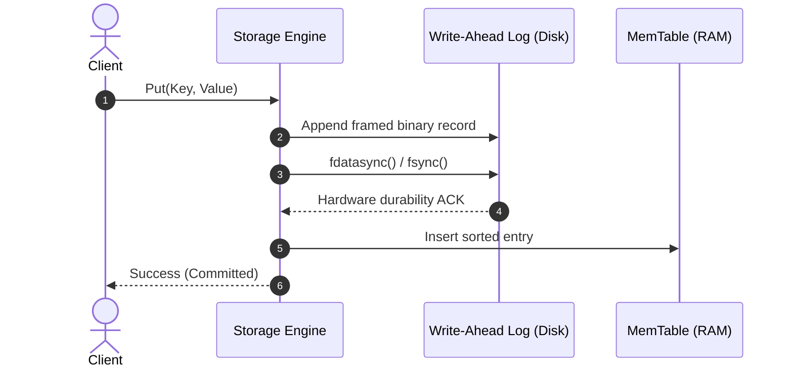
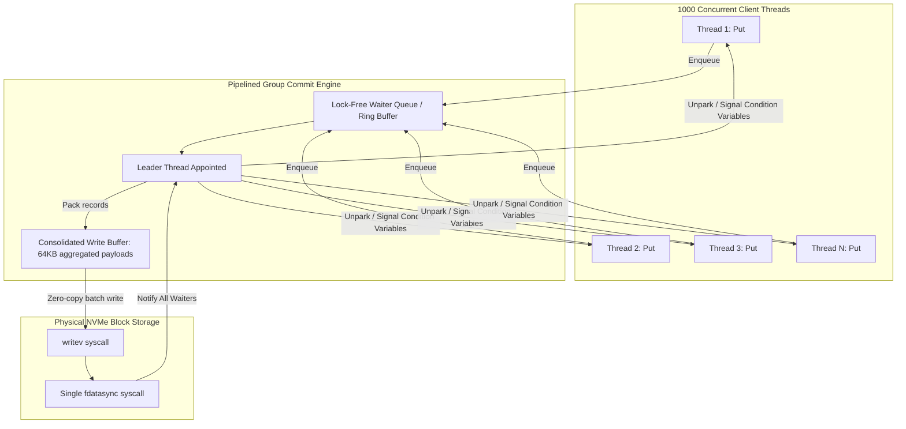
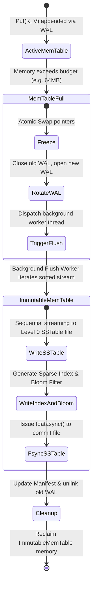

# Week 31: Storage Engines — Log-Structured Merge-Trees (LSM) & Write-Ahead Logs (WAL)

## Why This Week Matters for Your Career Transition

As a senior .NET engineer, you have spent years building mission-critical business platforms on top of relational engines like Microsoft SQL Server, PostgreSQL, or Oracle. In that world, storage durability and indexing are frequently treated as black boxes encapsulated by Object-Relational Mappers like Entity Framework Core or micro-ORMs like Dapper. You understand execution plans, clustered index seeks, locking tiers, and isolation levels. However, if asked how a database physically commits a transaction to non-volatile storage without succumbing to the latency cliffs of mechanical platters or NAND flash erase cycles, the typical answer rarely ventures deeper than "it writes to an 8KB B-Tree page."

As you transition to systems engineering in Go and Rust, that abstraction barrier dissolves. Modern infrastructure—distributed streaming engines (Apache Kafka, Redpanda), distributed document and wide-column databases (Cassandra, ScyllaDB), modern transactional key-value backends (RocksDB, CockroachDB, TiKV), and embedded telemetry stores—does not rely on classical B-Trees for ingestion. They rely on **Log-Structured Merge-Trees (LSM-Trees)** paired with **Write-Ahead Logs (WAL)**. 

By the end of this week, you will understand:
1. The mechanical physics and kernel syscalls governing the chasm between sequential and random disk I/O.
2. How to design a crash-resilient Write-Ahead Log utilizing binary framing, CRC32 verification, and POSIX synchronization primitives (`fsync` vs `fdatasync`).
3. The internal mechanics of sorted in-memory buffers (MemTables) and atomic immutable transitions.
4. The physical layout of immutable SSTables on disk, including sparse indexing, block compression restart intervals, and Bloom filter mathematics.
5. The mathematical trade-offs of Size-Tiered versus Leveled Compaction under the RUM Conjecture.
6. How to implement these primitives natively across C#, Go, and Rust, accounting for garbage collection pauses, zero-copy slicing, and hardware-level memory safety.

## 1. Storage Engine Taxonomy: In-Place Updates vs. Append-Only Logs

The fundamental design of any database storage engine is dictated by how it reconciles volatile CPU/RAM hierarchy speeds with non-volatile block storage persistence. Historically, storage engines bifurcated into two foundational paradigms: **In-Place Update Engines** and **Append-Only Engines**.

```
+---------------------------------------------------------------------------------------------------+
|                                     STORAGE ENGINE TAXONOMY                                       |
+---------------------------------------------------+-----------------------------------------------+
| In-Place Update (B-Tree / B+ Tree)                | Append-Only (Log-Structured Merge-Tree / LSM) |
+---------------------------------------------------+-----------------------------------------------+
| Primary Architecture: Microsoft SQL Server,       | Primary Architecture: RocksDB, LevelDB,       |
| PostgreSQL, MySQL (InnoDB), Oracle                | Cassandra, ScyllaDB, CockroachDB (Pebble)     |
| Disk Mutation: Overwrites fixed-size pages        | Disk Mutation: Strictly sequential appends    |
| (4KB, 8KB, 16KB) in-place on block storage        | to active log/SSTable; immutability on disk   |
| I/O Pattern: Random I/O during dirty page flush   | I/O Pattern: 100% Sequential I/O on writes    |
| Read Optimization: O(log_B N) single point lookup | Read Optimization: Requires multi-file scan   |
| Write Cost: High (Write Amplification, Latches)   | Write Cost: Minimal amortized ingest cost     |
| Space Overhead: Low (minimal fragmentation)       | Space Overhead: High (superseded versions)    |
+---------------------------------------------------+-----------------------------------------------+
```

### The B-Tree Baseline: The .NET / CLR Mental Model
In a classic relational engine like SQL Server, data is structured in fixed-size blocks called **Pages** (8,192 bytes in SQL Server; 4,096 or 8,192 bytes in POSIX engines). The B+ Tree maintains non-leaf routing pages containing key boundaries and child page pointers, while leaf pages contain either the clustered row data or pointers to heap storage.

When a C# application issues an update:

```csharp
// Entity Framework Core in-place mutation abstraction
var account = await dbContext.Accounts.SingleAsync(a => a.Id == accountId);
account.Balance += depositAmount;
await dbContext.SaveChangesAsync();
```

Under the hood, the engine cannot write arbitrary single bytes to disk. Block storage devices (NVMe SSDs, SAS arrays) address physical storage in 512-byte or 4,096-byte sectors. Consequently, the relational engine executes an **in-place update workflow**:

1. **Buffer Pool Pinning**: The engine locates the 8KB page containing the target row in its RAM Buffer Pool. If absent, it issues a synchronous or asynchronous read to fetch the 8KB block from disk.
2. **Page Latching**: A thread-level synchronization latch (exclusive latch) is acquired on the physical in-memory page frame to prevent concurrent access while bytes are shifted.
3. **Dirty Page Generation**: The specific bytes within the 8KB page are altered. The page is now marked as *dirty*.
4. **Dirty Page Flush**: Periodically, or during a database `CHECKPOINT`, the dirty page is written back to its *exact physical sector offset* on disk, overwriting the old page.

#### The Random I/O Penalty and Hardware Sympathy
This in-place update strategy creates an immediate bottleneck: **Random I/O**. 

On rotational Hard Disk Drives (HDDs), random I/O requires physical actuation of the mechanical drive arm (seek latency: 4–10ms) and rotational delay (2–4ms). A drive capable of streaming sequential bytes at 200 MB/s will collapse to less than 1.5 MB/s when subjected to random 4KB writes, bottlenecked at 150–200 IOPS.

On modern NVMe Solid State Drives (SSDs), mechanical seeks do not exist, but the physical characteristics of NAND flash memory impose a different penalty:
- **NAND Flash Physics**: Solid-state memory is organized into **Pages** (typically 4KB to 16KB) and **Erase Blocks** (typically 128 to 512 pages, totaling 2MB to 8MB).
- **The Erase-Before-Write Constraint**: NAND flash allows writing (programming) individual pages from state `1` to `0`. However, returning a bit from `0` to `1` requires erasing the *entire Erase Block* with a high-voltage electrical pulse.
- **Flash Translation Layer (FTL) and Garbage Collection**: When a database performs an in-place overwrite of a 4KB logical block, the SSD controller cannot physically overwrite the NAND cells. The FTL marks the old physical page as *stale*, allocates a clean physical page elsewhere, writes the new 4KB payload, and updates its internal logical-to-physical (L2P) mapping table.
- **Write Amplification Factor (WAF)**: When the SSD runs low on clean blocks, the internal controller initiates NAND garbage collection. It reads an entire erase block into internal controller RAM, copies the valid pages to a new block, and erases the old block. Overwriting a single 4KB block can cause the SSD to read and rewrite megabytes of background data. 

In high-throughput write workloads (e.g., millions of events per second from financial feeds or IoT sensors), B-Tree in-place updates burn through SSD write endurance (Program/Erase or P/E cycles) and saturate the storage bus with random controller operations.

### The LSM Paradigm: Sequential Appends Only
Log-Structured Merge-Trees, originally formulated by Patrick O'Neil, Edward O'Neil, and Gerhard Weikum in 1996, eliminate in-place mutations entirely. An LSM-Tree converts **all database modifications (inserts, updates, and deletes) into strictly sequential, append-only disk operations**.

In an LSM engine:
- An `INSERT` appends the new key-value pair.
- An `UPDATE` appends the identical key with a newer sequence number and value.
- A `DELETE` appends a specialized marker known as a **Tombstone**.

Existing files stored on non-volatile media are **100% immutable**. Once written, an SSTable is never modified, locked with write latches, or updated in-place. If an SSTable is no longer needed, it is deleted in its entirety by unlinking its inode from the filesystem.

Because modern PCI Express Gen 4/5 NVMe SSDs achieve sequential write speeds exceeding 7,000 to 14,000 MB/s, append-only storage engines saturate the hardware's theoretical maximum throughput, minimizing internal SSD garbage collection and maximizing write longevity.

## 2. Write-Ahead Log (WAL) Internals & Durability Guarantees

In an LSM-Tree, writes are buffered in high-speed RAM (the **MemTable**) so that incoming keys can be sorted before hitting disk. However, volatile RAM loses its state if the operating system crashes, the process receives an unhandled `SIGKILL`, or the host server suffers power loss.

To uphold the **Durability** property of ACID, the engine must commit the write to non-volatile storage *before* acknowledging success to the client. This is the sole responsibility of the **Write-Ahead Log (WAL)**.



### The Linux Kernel I/O Path: Page Cache, `fsync`, and `fdatasync`
When a C#, Go, or Rust program writes data to a file descriptor using standard library methods (`FileStream.Write`, `os.File.Write`, `File::write`), the bytes **do not go directly to the physical storage device**. 

```
+-----------------------------------------------------------------------------------+
| APPLICATION SPACE                                                                 |
|   C# FileStream.Write()  |  Go file.Write()  |  Rust file.write()                 |
+-----------------------------------------------------------------------------------+
        | (write syscall)
        v
+-----------------------------------------------------------------------------------+
| KERNEL SPACE                                                                      |
|   Virtual Filesystem Switch (VFS)                                                 |
|        |                                                                          |
|   Linux Page Cache (Dirty Pages marked in OS kernel memory)                       |
+-----------------------------------------------------------------------------------+
        | (Dirty page writeback daemon: pdflush / flusher threads, or explicit sync)
        v
+-----------------------------------------------------------------------------------+
| BLOCK DEVICE DRIVER LAYER & I/O SCHEDULER (mq-deadline / none)                    |
+-----------------------------------------------------------------------------------+
        | (PCIe / NVMe commands)
        v
+-----------------------------------------------------------------------------------+
| PHYSICAL NVMe / SSD HARDWARE                                                      |
|   Device DRAM / Controller Cache (Volatile, unless Battery-Backed PLP)            |
|        | (Internal controller commit)                                             |
|   Non-Volatile NAND Flash Cells (Persistent Media)                                |
+-----------------------------------------------------------------------------------+
```

1. **System Call (`write(2)`)**: The CPU transitions from User Mode to Kernel Mode via a syscall. The kernel copies bytes from the user-space memory buffer into the **Linux Page Cache**. The call returns immediately. To the application, the write appears complete in sub-microsecond time.
2. **The Vulnerability Window**: If the system experiences catastrophic power failure while data resides solely in the Page Cache, that data is permanently lost.
3. **Flushing to Hardware**: To guarantee physical persistence, the engine must invoke explicit synchronization syscalls:
   - `fsync(int fd)`: Flushes all modified dirty pages belonging to the file descriptor to non-volatile storage. Crucially, `fsync` flushes **both the file data and the filesystem inode metadata** (file size, access timestamps, modification timestamps, directory entry pointers). If the file size did not change, `fsync` still triggers two distinct physical I/O writes: one to the storage data blocks, and one to the filesystem journal (e.g., ext4 journal).
   - `fdatasync(int fd)`: Flushes the file's modified dirty data pages to storage, but **skips flushing inode metadata** unless the metadata change is required to properly retrieve the data (e.g., file size expansion). For an append-only WAL pre-allocated or incrementally written, `fdatasync` avoids the metadata journal commit, reducing disk head seek latency and controller queue overhead.

#### Systems Language Equivalents:
- **C# (.NET)**: `FileStream.Flush(flushToDisk: true)` executes `fsync(fd)` on Linux and `FlushFileBuffers(HANDLE)` on Windows.
- **Go**: `file.Sync()` issues an `fsync(fd)` syscall via runtime assembly.
- **Rust**: `std::fs::File::sync_all()` invokes `fsync(fd)`; `std::fs::File::sync_data()` invokes `fdatasync(fd)`.

### Direct I/O (`O_DIRECT`)
Ultra-low-latency engines like ScyllaDB or custom database engines bypass the Linux Page Cache entirely by opening files with the POSIX `O_DIRECT` flag. 

When `O_DIRECT` is asserted:
- The kernel does not copy data into the Page Cache.
- The user-space buffer must be strictly aligned to the physical sector size of the underlying block device (typically 4,096 bytes on Advanced Format drives) using memory allocation primitives like `posix_memalign` (or `std::alloc::alloc_zeroed` with an alignment of 4096 in Rust).
- Memory transfers occur directly between application user-space memory and the NVMe controller via Direct Memory Access (DMA).

### WAL Binary Framing & Torn-Write Protection
A bare stream of key-value bytes cannot survive real-world crashes. If a server suffers power failure while the NVMe controller is halfway through writing an 8KB burst, the disk will contain a **torn write** (half-written corrupt bytes). 

To detect and discard corrupted entries during crash recovery, WAL engines frame every record with strict binary layouts and 32-bit Cyclic Redundancy Checks (CRC32).

#### The Production WAL Frame Layout:
```
 0                   1                   2                   3
 0 1 2 3 4 5 6 7 8 9 0 1 2 3 4 5 6 7 8 9 0 1 2 3 4 5 6 7 8 9 0 1
+-+-+-+-+-+-+-+-+-+-+-+-+-+-+-+-+-+-+-+-+-+-+-+-+-+-+-+-+-+-+-+-+
|                       CRC-32-IEEE Checksum                    | (4 Bytes)
+-+-+-+-+-+-+-+-+-+-+-+-+-+-+-+-+-+-+-+-+-+-+-+-+-+-+-+-+-+-+-+-+
|                                                               |
|                 Sequence Number / LSN (uint64)                | (8 Bytes)
|                                                               |
+-+-+-+-+-+-+-+-+-+-+-+-+-+-+-+-+-+-+-+-+-+-+-+-+-+-+-+-+-+-+-+-+
|  Record Type  |                   Reserved                    | (4 Bytes)
+-+-+-+-+-+-+-+-+-+-+-+-+-+-+-+-+-+-+-+-+-+-+-+-+-+-+-+-+-+-+-+-+
|                       Key Length (uint32)                     | (4 Bytes)
+-+-+-+-+-+-+-+-+-+-+-+-+-+-+-+-+-+-+-+-+-+-+-+-+-+-+-+-+-+-+-+-+
|                      Value Length (uint32)                    | (4 Bytes)
+-+-+-+-+-+-+-+-+-+-+-+-+-+-+-+-+-+-+-+-+-+-+-+-+-+-+-+-+-+-+-+-+
|                                                               |
|                        Key Bytes (Variable)                   |
|                                                               |
+-+-+-+-+-+-+-+-+-+-+-+-+-+-+-+-+-+-+-+-+-+-+-+-+-+-+-+-+-+-+-+-+
|                                                               |
|                       Value Bytes (Variable)                  |
|                                                               |
+-+-+-+-+-+-+-+-+-+-+-+-+-+-+-+-+-+-+-+-+-+-+-+-+-+-+-+-+-+-+-+-+
```

1. **CRC32 Checksum (4 bytes)**: Calculated over all subsequent bytes in the frame (`Sequence Number` through the last byte of `Value`). On startup, the recovery engine recalculates the CRC32. If a torn write occurred, the checksum fails, signaling the exact boundary where uncommitted or corrupt data begins.
2. **Sequence Number (8 bytes)**: A globally monotonic 64-bit integer representing the Log Sequence Number (LSN). Used during recovery to preserve causality and resolve conflicting versions across multiple SSTable levels.
3. **Record Type (1 byte)**: Flags the operational semantics:
   - `0x01`: `PUT` (Key-Value insertion or update).
   - `0x02`: `DELETE` (Tombstone insertion).
   - `0x03`: `BATCH_COMMIT` (Multi-operation transaction barrier).
4. **Lengths & Payloads**: 32-bit unsigned integers defining the explicit byte lengths of the variable-length key and value, preventing buffer overruns.

### Group Commit Algorithms
A physical NVMe SSD, even with Battery-Backed Power Loss Protection (PLP), requires roughly 20 to 50 microseconds to execute and acknowledge a physical `fdatasync`. 

$$\text{Max Single-Threaded Throughput} = \frac{1 \text{ second}}{50 \ \mu\text{s}} \approx 20,000 \text{ IOPS}$$

If 1,000 concurrent client threads each issue an independent `Put` request requiring an individual `fdatasync`, the engine will grind to a halt under lock contention and storage bus queuing.

High-throughput engines employ **Group Commit**:



1. **Queueing**: Concurrent client threads register their framed WAL entries into an atomic, lock-free wait queue (e.g., MPSC ring buffer).
2. **Leader Election**: The first thread to enter the queue becomes the **Leader**. Subsequent threads become **Followers** and park their threads (e.g., via `std::sync::Condvar` in Rust, `sync.WaitGroup` in Go, or `Monitor.Wait` in C#).
3. **Consolidation**: The Leader collects all pending records currently in the queue, packs them into a single contiguous memory buffer, and issues a single vectored write (`writev(2)`) to the WAL.
4. **Single Sync**: The Leader issues **one single `fdatasync(2)`** call on behalf of the entire group.
5. **Awakening**: Once the hardware acknowledges the sync, the Leader signals all Followers and marks their operations committed. 

Through Group Commit, an LSM-tree can sustain 500,000+ durable writes per second on hardware that physically maxes out at 20,000 single syncs per second.

## 3. MemTable Mechanics: Sorted In-Memory State & Atomic Freezing

Once a write is guaranteed persistent in the WAL, it is inserted into the **MemTable**. The MemTable serves as the write cache and primary read index for the newest data.

### Why Must the MemTable Be Sorted?
If we merely wanted an in-memory key-value cache, an $O(1)$ Hash Map (`Dictionary<K, V>` in C#, `map[K]V` in Go, `HashMap<K, V>` in Rust) would provide faster point lookups. 

However, an LSM-Tree fundamentally relies on **writing sorted files (SSTables) to disk**. When the MemTable fills up, it must be flushed to disk as an SSTable. If the MemTable is already sorted in memory:
- Flushing to disk requires a single, continuous, linear scan of the data structure.
- Disk writes remain 100% sequential.
- Range queries (`Scan("account:100", "account:200")`) can seamlessly merge active in-memory iterators with on-disk SSTable iterators using a multi-way merge algorithm.

### Data Structure Selection: SkipList vs. Red-Black Tree
| Feature | Red-Black Tree (`std::collections::BTreeMap`) | SkipList (LevelDB / RocksDB Standard) |
| :--- | :--- | :--- |
| **Search Time** | $O(\log N)$ deterministic | $O(\log N)$ probabilistic |
| **Insert Time** | $O(\log N)$ deterministic | $O(\log N)$ probabilistic |
| **Structural Rebalancing** | Requires node rotations (exclusive lock) | Zero rotations; insert modifies only pointers |
| **Concurrent Mutation** | Requires coarse-grained `RwLock` | Enables lock-free concurrent writes via atomic CAS |
| **Memory Locality** | Poor to moderate (pointer chasing) | Moderate (forward pointer arrays) |
| **Implementation Complexity**| Moderate (provided by standard libraries)| High (requires atomic multi-level pointer updates)|

```
+-----------------------------------------------------------------------------------+
| PROBABILISTIC SKIPLIST ARCHITECTURE                                              |
+-----------------------------------------------------------------------------------+
Level 3:  [Head] ---------------------------------------------> [Key: 70] -> [NIL]
             |                                                      |
Level 2:  [Head] ------------------------> [Key: 30] ---------> [Key: 70] -> [NIL]
             |                               |                      |
Level 1:  [Head] ----------> [Key: 15] --> [Key: 30] ---------> [Key: 70] -> [NIL]
             |                 |             |                      |
Level 0:  [Head] -> [Key: 5]-> [Key: 15]-> [Key: 30]-> [Key: 42]-> [Key: 70]->[NIL]
+-----------------------------------------------------------------------------------+
```

RocksDB and LevelDB utilize a **Concurrent SkipList**. A SkipList builds a hierarchy of linked lists. The bottom layer (Level 0) contains every element in sorted order. Each higher level acts as an "express lane" containing a geometrically diminishing subset of keys (determined by a pseudo-random coin flip with probability $p = 1/4$ or $1/2$).

Because inserting into a SkipList does not require tree rotations (which cascade changes across multiple parent and sibling nodes), concurrent threads can insert keys simultaneously using atomic Compare-And-Swap (`atomic.CompareAndSwapPointer` in Go, `AtomicPtr::compare_exchange` in Rust) on the forward pointers.

### Memory Budgeting & Arena Allocators
In managed languages like C# and Go, allocating millions of tiny string or byte-array objects inside a MemTable creates severe **Garbage Collection (GC) latency spikes**. Every key-value pair allocates a node, pointer references, and string buffers, forcing the GC collector to trace millions of object graphs.

Production LSM-trees solve this by pairing the MemTable with an **Arena Allocator** (or Region Allocator):
- A contiguous block of raw memory (e.g., 64MB) is pre-allocated on the heap or off-heap.
- When a new key-value pair is inserted into the SkipList, the node bytes are simply bumped into the arena via a single atomic pointer increment (`fetch_add`).
- When the MemTable is flushed to disk, the **entire 64MB arena is recycled or freed in a single operation**, completely bypassing object-by-object deallocation and preventing heap fragmentation.

### Atomic MemTable Freezing & Background Flush
To maintain write availability, an LSM engine cannot block incoming writes while a 64MB MemTable is serialized and flushed to disk. 

The engine maintains two pointers:
1. `active_memtable`: Accepts all new incoming writes.
2. `immutable_memtable`: Holds an immutable snapshot currently being flushed to disk.



1. **Threshold Breach**: The active MemTable size reaches the configured limit (e.g., 64MB).
2. **Atomic Pointer Swap**: Under a brief mutex lock (or using an atomic pointer swap), the engine:
   - Sets `immutable_memtable = active_memtable`.
   - Instantiates a fresh, empty MemTable for `active_memtable`.
   - Rotates the Write-Ahead Log: closes the current WAL file handle and initializes a new WAL for the active MemTable.
3. **Non-Blocking Write Resumption**: The atomic swap completes in single-digit microseconds. Client writes immediately resume against the fresh `active_memtable` and new WAL.
4. **Background Flush Execution**: A background worker thread iterates through the sorted `immutable_memtable`, formats the keys into SSTable data blocks, appends sparse index entries, writes a Bloom filter, and invokes `fdatasync` on the new SSTable.
5. **Garbage Collection of Log**: Once the SSTable is physically synchronized to disk, the old WAL file is safely unlinked from the filesystem, and the `immutable_memtable` is freed.

## 4. SSTables (Sorted String Tables) on Disk

An **SSTable** (Sorted String Table) is an immutable, sorted, on-disk file format. It is the fundamental persistence block of Google Bigtable, LevelDB, RocksDB, Cassandra, and ScyllaDB.

### Physical Disk Layout
To enable rapid binary searching without loading gigabytes of data into RAM, an SSTable is structured into distinct functional blocks:

```
+-----------------------------------------------------------------------------------+
|                              SSTABLE PHYSICAL LAYOUT                              |
+-----------------------------------------------------------------------------------+
|  DATA BLOCK 0: [K/V 1][K/V 2] ... [K/V N] [Restart Array] [Restart Array Length]  |
+-----------------------------------------------------------------------------------+
|  DATA BLOCK 1: [K/V N+1] ... [K/V 2N]     [Restart Array] [Restart Array Length]  |
+-----------------------------------------------------------------------------------+
|  DATA BLOCK 2: [K/V 2N+1] ... [K/V 3N]    [Restart Array] [Restart Array Length]  |
+-----------------------------------------------------------------------------------+
|  ...                                                                              |
+-----------------------------------------------------------------------------------+
|  FILTER BLOCK: Serialized Bloom Filter Bit Vector                                 |
+-----------------------------------------------------------------------------------+
|  METADATA BLOCK: Column family, creation time, tombstone counts                   |
+-----------------------------------------------------------------------------------+
|  INDEX BLOCK (Sparse Index):                                                      |
|    Entry 0: Key: "account:00100" | Offset: 0       | Size: 4096                   |
|    Entry 1: Key: "account:00200" | Offset: 4096    | Size: 4096                   |
|    Entry 2: Key: "account:00300" | Offset: 8192    | Size: 4096                   |
+-----------------------------------------------------------------------------------+
|  FOOTER (Fixed 48 Bytes):                                                         |
|    Filter Block Handle:  [Offset: uint64, Size: uint64]                           |
|    Index Block Handle:   [Offset: uint64, Size: uint64]                           |
|    Magic Number:         0xDB4775248b80fb57 (uint64)                              |
+-----------------------------------------------------------------------------------+
```

### Data Blocks, Restart Points, and Prefix Compression
Keys in real-world databases exhibit massive shared prefixes (e.g., `user:usr_948194:profile`, `user:usr_948194:settings`). Storing repeated prefix bytes consumes unnecessary disk bandwidth and memory.

SSTables use **Delta / Prefix Compression**:
- An entry records only the length of the shared prefix with the preceding key, the length of the unshared key suffix, the length of the value, and the raw payload bytes.

However, prefix compression introduces a challenge: to look up a key in the middle of a block, you would theoretically have to decode every key starting from the very first record.

To resolve this, SSTable blocks introduce **Restart Points**:
- Every $K$ keys (typically $K = 16$), prefix compression is reset. The 16th key is written in its full, non-compressed form.
- The byte offset of this uncompressed key is appended to a **Restart Array** at the end of the 4KB data block.
- To search within a 4KB data block, the engine executes a binary search over the Restart Array, jumps directly to the closest restart point, and scans forward at most 16 keys.

### The Sparse Index Block
In a B-Tree, every single key has a direct pointer representation in an index. In an LSM-Tree, having an index entry for every single key would demand excessive RAM.

Instead, an SSTable uses a **Sparse Index**:
- The index contains exactly one entry per **Data Block** (typically every 4KB of data).
- The index key represents the **highest key** (or shortest separator key) contained within that Data Block, accompanied by the block's 64-bit byte offset and length in the SSTable file.
- When an application executes `Get("account:00142")`:
  1. The engine binary-searches the in-memory Sparse Index to locate which Data Block can potentially hold the key.
  2. It reads only that single 4KB block from disk (or OS page cache).
  3. It scans the 4KB block using the block's internal restart points.

### The Bloom Filter: Bypassing Disk I/O
As SSTables accumulate on disk, a point lookup for a non-existent key would normally force the engine to check every single SSTable file, binary-searching their sparse indexes, and loading blocks from disk. This is the **Read Amplification** curse of LSM-Trees.

To eliminate disk seeks on missing keys, every SSTable includes a **Bloom Filter**.

A Bloom filter is a space-efficient, probabilistic data structure. It answers two questions:
- *"Is this key definitely NOT in this SSTable?"* -> **100% Guaranteed Correct (No False Negatives)**.
- *"Is this key in this SSTable?"* -> **Probably Yes (Small False Positive Probability $p$)**.

If the Bloom filter returns `false`, the engine skips reading the SSTable entirely.

#### The Mathematics of Bloom Filters
Given:
- $n$: Number of keys inserted into the filter.
- $m$: Size of the bit array in bits.
- $k$: Number of independent hash functions.

When a key is added, $k$ distinct hash functions generate array indices from $0$ to $m - 1$, and those bits are set to `1`.

The probability that a specific bit is still `0` after all $n$ keys are inserted with $k$ hash functions is:

$$P(\text{bit is } 0) = \left(1 - \frac{1}{m}\right)^{kn} \approx e^{-\frac{kn}{m}}$$

Therefore, the probability that a bit is `1` is $1 - e^{-\frac{kn}{m}}$.

When querying a key that was **not** inserted, the probability that all $k$ bit positions are found to be `1` (a **False Positive**) is:

$$p \approx \left(1 - e^{-\frac{kn}{m}}\right)^k$$

To minimize the false positive probability $p$ for a given ratio of bits per key ($\frac{m}{n}$), we differentiate with respect to $k$:

$$k_{\text{optimal}} = \frac{m}{n} \ln 2 \approx 0.693 \times \frac{m}{n}$$

Substituting $k_{\text{optimal}}$ back into the probability formula:

$$p = \left(1 - e^{-\ln 2}\right)^{\frac{m}{n} \ln 2} = \left(\frac{1}{2}\right)^{\frac{m}{n} \ln 2} \approx (0.6185)^{\frac{m}{n}}$$

#### Production Tuning:
In production engines (RocksDB, CockroachDB):
- We typically allocate **10 bits per key** ($m/n = 10$).
- $k_{\text{optimal}} = 10 \times 0.693 \approx 7$ hash functions.
- False positive probability: $p \approx (0.5)^7 \approx 0.008$ (~**0.8% false positive rate**).
- With just 10 bits per key stored in RAM, **99.2% of unnecessary disk reads for missing keys are completely eliminated**.

## 5. Compaction Strategies & The RUM Conjecture

Because SSTables are immutable, updates and deletes merely append newer entries. Over time, three severe problems emerge:
1. **Read Amplification**: A read must check the active MemTable, immutable MemTable, and dozens of SSTable files.
2. **Space Amplification**: Stale overwritten values and deleted tombstones consume gigabytes of dead disk space.
3. **Tombstone Overhead**: Deletes do not reclaim space until merged.

**Compaction** is the background engine process that reconciles these issues. It reads multiple sorted SSTable files concurrently, performs a streaming **K-way merge** (identical to the merge phase of MergeSort), retains only the newest version of each key, discards tombstones, writes out new consolidated SSTables, and unlinks the old files.

### The RUM Conjecture
Formulated by Manos Athanassoulis and Stratos Idreos at Harvard, the **RUM Conjecture** states that storage engines can optimize for two of three dimensions, but must trade off the third:

```
                          Read Overhead (R)
                                 /\
                                /  \
                               /    \
                              /      \
                             /  RUM   \
                            /          \
                           /   SPACE    \
                          /              \
                         /________________\
           Update Overhead (U)         Memory / Space Overhead (M)
```

1. **Read Amplification ($RA$)**: Bytes read physically from disk divided by logical bytes requested by the client.
2. **Write Amplification ($WA$)**: Bytes written physically to non-volatile storage divided by logical bytes submitted by the client.
3. **Space Amplification ($SA$)**: Physical disk space occupied by the database divided by the actual size of uncompressed, unique valid data.

B-Trees optimize for Read Overhead ($RA \approx 1$ to $3$) and Space Overhead ($SA \approx 1.33$), but suffer terrible Write Overhead ($WA \approx 10$ to $50+$).

LSM-Trees optimize for Write Overhead ($WA \approx 2$ to $10$ on ingest), but must balance Read Overhead and Space Overhead through their **Compaction Strategy**.

### Size-Tiered Compaction Strategy (STCS)
Popularized by Apache Cassandra and ScyllaDB, **Size-Tiered Compaction** groups SSTables into tiers based on file size.

```
Incoming MemTable Flushes:
[File 1: 10MB] [File 2: 10MB] [File 3: 10MB] [File 4: 10MB]
                       |
                       v (4 files of similar size trigger Compaction)
             +--------------------+
             | Streaming K-Way    |
             | Merge Worker       |
             +--------------------+
                       |
                       v
         [New Consolidated File: 40MB]
```

#### Operational Mechanics:
- When a threshold of files with similar size exists (e.g., 4 files at 10MB), they are merged into a single 40MB file.
- When 4 files of 40MB accumulate, they are merged into a 160MB file.
- Keys overlap across files within the same tier.

#### Trade-Off Analysis:
- **Write Amplification**: Relatively low ($WA \approx 4 - 8$). Excellent for pure time-series write ingest.
- **Space Amplification**: **Disastrous ($SA \ge 2.0$)**. To compact a 500GB file with three other 500GB files, the engine must write a 2TB file. During the merge, both the old 2TB of files and the new 2TB file exist simultaneously on disk. A database using STCS can run out of disk space if it exceeds 50% capacity!
- **Read Amplification**: High. Because keys overlap across all files, a point query must check every single file in every tier unless filtered out by Bloom filters.

### Leveled Compaction Strategy (LCS)
Popularized by Google LevelDB and Meta's RocksDB, **Leveled Compaction** structures files into discrete, geometrically growing levels ($L_0, L_1, L_2, \dots, L_k$).

```
Level 0 (Flushed from RAM): 
  [SSTable 0A (Keys: B - M)]  [SSTable 0B (Keys: A - Z)]  <-- Overlapping Key Ranges!
-------------------------------------------------------------------------------------
Level 1 (Target: 10 MB, Non-Overlapping):
  [SST 1A: (A - D)]  [SST 1B: (E - K)]  [SST 1C: (L - R)]  [SST 1D: (S - Z)]
-------------------------------------------------------------------------------------
Level 2 (Target: 100 MB, 10x Growth, Non-Overlapping):
  [SST 2A: (A - C)]  [SST 2B: (D - F)]  [SST 2C: (G - J)] ... [SST 2Z: (W - Z)]
```

#### Structural Invariants:
1. **Level 0 ($L_0$)**: Contains SSTables flushed directly from the MemTable. Keys **can and do overlap** between files.
2. **Levels $L_1$ to $L_k$**: Each level has a fixed total capacity (e.g., $L_1 = 10\text{MB}, L_2 = 100\text{MB}, L_3 = 1\text{GB}, L_4 = 10\text{GB}$).
3. **The Non-Overlapping Invariant**: Within $L_1$ and higher, **no two SSTable files ever contain overlapping key ranges**. The keys are partitioned cleanly across files.

#### Compaction Mechanics:
When Level $L_i$ exceeds its target byte size:
1. The engine selects one file from $L_i$.
2. It identifies all files in $L_{i+1}$ whose key ranges overlap with the selected $L_i$ file.
3. It performs a streaming multi-way merge of the $L_i$ file and the overlapping $L_{i+1}$ files.
4. It writes out new, disjoint SSTables strictly at Level $L_{i+1}$.
5. The old input files are atomically deleted.

#### Trade-Off Analysis:
- **Space Amplification**: Low ($SA \approx 1.1 - 1.2$). Space overhead is bounded because obsolete versions are purged swiftly as data moves down levels. Only ~10% temporary disk headroom is required during compaction.
- **Read Amplification**: Extremely Low. Because $L_1+$ levels have non-overlapping ranges, a point lookup checks **at most one SSTable per level**. For a 5-level database, point lookup reads at most $L_0 \text{ files} + 4 \text{ files}$.
- **Write Amplification**: High ($WA \approx 15 - 30$). Every byte of data is rewritten repeatedly as it trickles down through the levels.

## 6. Language Implementation Mechanics

Building high-throughput storage engines exposes profound philosophical and mechanical differences between C#, Go, and Rust.

### C# / .NET 8 Mechanics
In .NET, developing storage engines historically hit performance barriers due to the garbage collector and object heap overhead. However, modern .NET provides low-level systems primitives:
- `Span<T>` and `ReadOnlySpan<T>`: Provide zero-allocation contiguous memory slicing over managed arrays, stack-allocated buffers (`stackalloc`), or unmanaged native pointers.
- `MemoryMarshal` and `BinaryPrimitives`: Permit zero-copy parsing of integers and floating-point structures directly from byte slices without endianness bugs (`BinaryPrimitives.ReadUInt32LittleEndian`).
- `FileStream` and `FileOptions.WriteThrough`: `FileOptions.WriteThrough` instructs Windows to bypass internal software caches and write directly to disk, equivalent to `O_SYNC`. However, on Linux under .NET Core, `FileOptions.WriteThrough` maps to `open` flags that may trigger full metadata synchronization.
- **The .NET Pitfall**: The GC is the primary adversary. When maintaining high-throughput MemTables, allocating thousands of small managed objects (e.g., node objects in a tree) leads to Generation 2 collections and Large Object Heap (LOH) fragmentation. Senior .NET systems engineers must leverage unmanaged memory pools (`NativeMemory.Alloc`) or value-type structs backed by `ArrayPool<byte>.Shared`.

### Go Mechanics
Go is widely used for distributed storage engines (CockroachDB's Pebble, HashiCorp Nomad/Consul, BadgerDB, Dgraph):
- **Concurrency Simplicity**: Flushing a MemTable to an SSTable or executing background compaction maps elegantly to goroutines and channels (`go engine.compactLevel(level)`).
- **Zero-Copy Slicing**: Slices (`[]byte`) provide lightweight window views over contiguous blocks without data copying.
- **The Go Pitfall**: Like C#, Go utilizes a concurrent garbage collector. Long-lived objects stored in a large MemTable will be scanned during GC mark phases, introducing CPU churn and tail-latency jitter. High-performance engines like BadgerDB allocate large arena buffers off-heap using CGO or direct `syscall.Mmap` allocations, bypassing the Go runtime GC collector entirely. Furthermore, Goroutine stack expansion checks add minor instruction overhead in ultra-tight inner loops.

### Rust Mechanics
Rust has emerged as the premier language for next-generation storage engines (TiKV, ScyllaDB's Seastar-Rust components, SurrealDB, DataFusion):
- **Zero-Cost RAII & Resource Determinism**: File handles, lock guards, memory arenas, and mmap regions are deterministically closed and freed the instant they go out of scope. No finalizers, no garbage collectors, no stop-the-world pauses.
- **Compile-Time Thread Safety**: The `Send` and `Sync` traits guarantee that MemTables, SSTable readers, and WAL pointers cannot suffer data races or dangling pointer corruptions across threads.
- **Explicit Lifecycle via Ownership**: Moving an active MemTable into an immutable flush queue transfers ownership cleanly. The compiler statically enforces that the active writer cannot mutate the frozen table while the background thread is streaming it to disk:

```rust
// Rust ownership statically prevents data races on frozen MemTables
fn freeze_and_flush(active: &mut MemTable) {
    let immutable = std::mem::replace(active, MemTable::new(ARENA_SIZE));
    std::thread::spawn(move || {
        // 'immutable' is moved into the thread. 
        // Nobody else holds a reference. Zero locks required during flush!
        sstable_writer::flush_to_disk(immutable).expect("Flush failed");
    });
}
```

## 7. Common Misconceptions to Unlearn

### Misconception 1: "The WAL is queried during normal read operations"
**Reality**: The WAL is an append-only, sequential durability mechanism **strictly used for crash recovery**. Reads NEVER touch the WAL. All reads hit the MemTable or SSTables. When an SSTable flush completes, the corresponding WAL file is truncated and deleted. Treating the WAL as an indexable data source violates separation of concerns.

### Misconception 2: "Calling File.Flush() or FileStream.Flush() guarantees persistence"
**Reality**: In most runtimes, `file.Flush()` merely flushes user-space runtime buffers (like C#'s internal `BufferedStream` or Go's `bufio.Writer`) into the **OS kernel Page Cache**. If power is severed a millisecond later, the data is lost. Durability requires an explicit `Flush(flushToDisk: true)` in C#, `file.Sync()` in Go, or `file.sync_data()` / `file.sync_all()` in Rust to invoke the hardware disk sync.

### Misconception 3: "A Delete operation reclaims disk space immediately"
**Reality**: In an LSM-Tree, a delete is literally an append operation. Writing a tombstone actually **increases** disk usage initially. Physical space is only reclaimed later when a background compaction worker merges the tombstone with the older SSTable containing the original key, eliminating both.

### Misconception 4: "SkipLists are slower than Red-Black Trees because of pointer overhead"
**Reality**: In single-threaded CPU benchmarks, balanced trees often outperform SkipLists due to smaller per-node overhead. However, under high-throughput concurrent writes, a Red-Black Tree requires locking major subtrees to perform node rotations. A concurrent SkipList allows lock-free atomic pointer CAS updates, providing vastly superior multi-threaded scaling.

### Misconception 5: "LSM-Trees are always superior to B-Trees on modern NVMe drives"
**Reality**: LSM-Trees optimize writes at the expense of reads and compaction overhead. If your workload is 95% reads with sporadic in-place updates (classic OLTP banking or ERP systems), a B+ Tree with an optimized buffer pool will deliver lower read latency and zero compaction CPU churn compared to an LSM-tree.

## 8. Summary Comparison: Storage Mechanics

| Architectural Property | B+ Tree (SQL Server / Postgres) | LSM: Size-Tiered (Cassandra) | LSM: Leveled (RocksDB / LevelDB) |
| :--- | :--- | :--- | :--- |
| **Write Pattern** | In-place random page updates | Sequential append-only | Sequential append-only |
| **Write Amplification** | Very High ($10 - 50+$) | Low ($4 - 8$) | Moderate to High ($10 - 30$) |
| **Read Amplification** | Minimal ($1 - 3$ block reads) | High (checks all files/tiers) | Low ($1$ file per level) |
| **Space Amplification**| Low ($1.2 - 1.4$) | Extremely High ($\ge 2.0$) | Minimal ($1.1 - 1.25$) |
| **Durability Anchor** | WAL / Write-Ahead Log | WAL / CommitLog | WAL / CommitLog |
| **In-Memory Write Buffer**| Buffer Pool (Dirty Pages) | MemTable (SkipList/Tree) | MemTable (SkipList/Tree) |
| **Immutability on Disk** | Mutable pages | 100% Immutable SSTables | 100% Immutable SSTables |
| **Missing Key Filtering**| None (relies on B-Tree index)| Bloom Filters per SSTable | Bloom Filters per SSTable |
| **Compaction CPU Overhead**| None (background page writer)| Periodic heavy I/O spikes | Continuous streaming I/O |
| **Ideal Workload** | High-concurrency point reads | High-velocity time-series ingest| Mixed read/write Key-Value storage |
