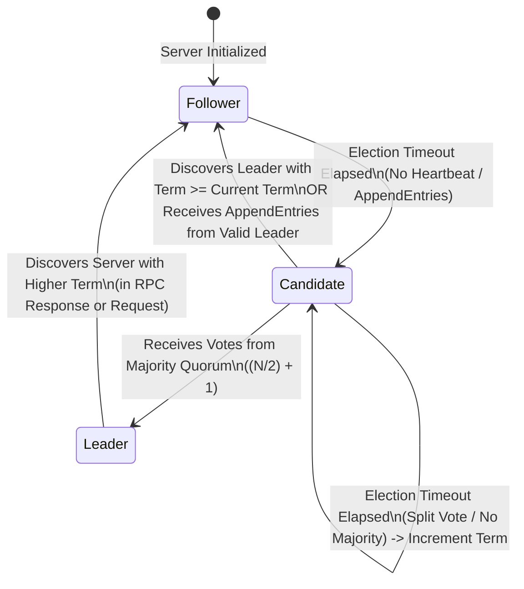
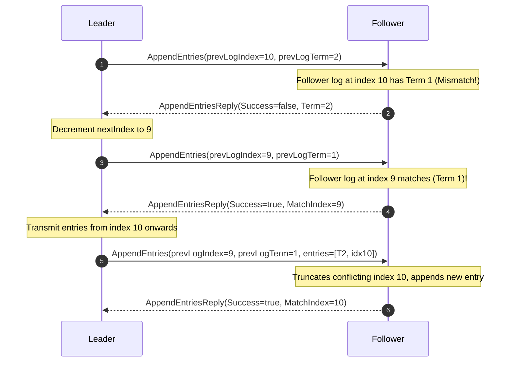

# Week 32: Distributed Consensus and the Raft Protocol

## Why This Week Matters for Your Career Transition

In the enterprise .NET ecosystem, high availability, fault tolerance, and data durability are frequently treated as operational infrastructure rather than core software engineering concerns. A senior C# developer builds distributed applications on top of platforms that abstract consensus entirely: SQL Server AlwaysOn Availability Groups handle database failovers through Windows Server Failover Clustering (WSFC); Azure Cosmos DB transparently replicates documents across fault domains using an internal Paxos variant; RabbitMQ and Apache Kafka manage partition leadership and consumer group rebalances; and Microsoft Orleans orchestrates virtual actors using cluster membership tables backed by Azure Table Storage or ZooKeeper. In these environments, when a primary node fails, the CLR runtime simply surfaces a transient network exception, a Polly retry policy executes, and the underlying infrastructure "magically" routes the request to a newly promoted primary.

As you transition into senior Go and Rust systems engineering, that abstraction boundary completely evaporates. Go is the linguistic foundation of modern cloud infrastructure—Kubernetes, `etcd`, HashiCorp Consul, CockroachDB, and Vitess are all authored in Go. Rust powers next-generation, high-performance distributed databases, streaming brokers, and storage engines like TiKV, Redpanda, and Apache Arrow DataFusion. In these systems, you are no longer a passive consumer of consensus—you are tasked with designing, implementing, debugging, and tuning it.

To operate at this level, you must understand the exact mechanics of State Machine Replication (SMR): how independent physical machines agree on an identical execution log across an unreliable network prone to packet loss, arbitrary latency spikes, and network partitions. You will learn why quorums require strict majorities, how Lamport terms prevent stale leaders from corrupting state, why randomized election timers prevent split-vote deadlocks without deterministic clocks, and how Raft guarantees the Leader Completeness property. By the end of this week, you will possess the mental models and code literacy required to implement, debug, and reason about distributed consensus engines in Go and Rust.

---

## Theoretical Foundations of Distributed Consensus

Before analyzing Raft's protocol mechanics, we must establish the formal theoretical constraints governing distributed systems. Every line of code in Raft exists to navigate fundamental mathematical theorems discovered between 1978 and 2002.

```
+-------------------------------------------------------------------------------+
|                        Theoretical Foundations Hierarchy                      |
|                                                                               |
|   [FLP Impossibility (1985)] ---------> Consensus impossible deterministically|
|              |                          in purely asynchronous networks.      |
|              v                                                                |
|   [Partial Synchrony Model] ----------> Assume upper bound on latency (Delta) |
|              |                          after Global Stabilization Time (GST).|
|              v                                                                |
|   [CAP Theorem (2002)] ---------------> Under Partition (P), choose between   |
|              |                          Consistency (C) or Availability (A).  |
|              v                                                                |
|   [Crash Fault Tolerance (CFT)] ------> Nodes fail by stopping (no Byzantine  |
|              |                          forgeries, authenticated channels).   |
|              v                                                                |
|   [State Machine Replication (SMR)] --> Replicate deterministic input log;    |
|                                         identical inputs => identical states. |
+-------------------------------------------------------------------------------+
```

### State Machine Replication (SMR)

The foundational architecture of distributed consensus is **State Machine Replication**, formalized by Fred Schneider in his seminal 1990 paper. A deterministic state machine consists of:
1. A set of internal states $S$.
2. An initial state $S_0$.
3. An input alphabet of commands $C$.
4. A deterministic state transition function $f: S \times C \rightarrow S \times R$, producing a new state $S'$ and an output response $R$.

Because $f$ is strictly deterministic, if multiple independent servers begin at the exact same initial state $S_0$ and apply the exact same sequence of commands $[C_1, C_2, C_3, \dots, C_n]$ in the exact same order, they are mathematically guaranteed to reach the exact same terminal state $S_n$ and produce identical outputs $R$.

Therefore, the distributed consensus problem is **not** about synchronizing complex application state directly across the network. It is entirely reduced to **replicated log order consensus**: ensuring that every non-faulty node appends the exact same commands at the exact same log indices. Once the log order is globally agreed upon, each node executes the commands locally through its deterministic state machine.

### The CAP Theorem

Formulated as a conjecture by Eric Brewer in 2000 and formally proven by Seth Gilbert and Nancy Lynch in 2002, the CAP theorem states that a distributed data store can simultaneously provide at most two of the following three guarantees:
- **Consistency ($C$)**: Every read receives the most recent write or an error (formalized specifically as single-copy linearizability).
- **Availability ($A$)**: Every non-failing node returns a non-error response for every received request (though not guaranteed to be the most recent write).
- **Partition Tolerance ($P$)**: The system continues to operate despite an arbitrary number of messages being dropped or delayed by the network between nodes.

In physical networks, network partitions are an unavoidable physical reality—switches reboot, fiber optic lines suffer physical damage, and OS kernel packet buffers overflow. Therefore, $P$ is non-negotiable: a distributed system must tolerate partitions. System designers are fundamentally restricted to choosing between **CP** (Consistency under Partitions) and **AP** (Availability under Partitions).

**Raft is strictly a CP system.** If a 5-node cluster is partitioned into a 2-node minority and a 3-node majority:
- The 3-node majority continues to accept writes because it forms a quorum ($\lfloor 5/2 \rfloor + 1 = 3$).
- The 2-node minority rejects or stalls writes because it cannot obtain a quorum. It sacrifices availability to prevent split-brain and preserve linearizable consistency.

### The FLP Impossibility Theorem

Published in 1985 by Fischer, Lynch, and Paterson, the FLP impossibility theorem is one of the most consequential results in theoretical computer science:
> *In a purely asynchronous network, no deterministic consensus protocol can guarantee liveness (termination) in the presence of even a single unannounced crash failure.*

In a purely asynchronous model, there is no upper bound on message delivery latency. If node $A$ does not hear from node $B$, $A$ cannot determine whether node $B$ has crashed or if the network packet is merely delayed. If the consensus algorithm waits indefinitely, it loses liveness (deadlock). If it proceeds without $B$, it risks violating safety (split-brain).

Raft bypasses FLP impossibility by departing from pure asynchrony in two fundamental ways:
1. **Partial Synchrony**: It assumes that while the network may experience arbitrary delays intermittently, there exists an upper bound on latency ($\Delta$) over prolonged operational windows (after a Global Stabilization Time).
2. **Probabilistic Liveness via Randomized Timeouts**: By randomizing election timeouts, Raft breaks symmetry among competing nodes. With probability approaching 1, a single candidate acquires a majority vote before any other candidate times out, preventing deterministic livelocks.

### Fault Models: Crash-Fault Tolerance (CFT) vs. Byzantine Fault Tolerance (BFT)

Consensus algorithms are strictly classified by their assumed failure model:
- **Crash-Fault-Tolerant (CFT)**: Nodes execute code faithfully according to the protocol specification. Nodes fail only by stopping (crash-stop) or crashing and subsequently recovering with persistent storage intact (crash-recovery). Messages may be delayed, duplicated, reordered, or dropped, but never forged or corrupted. Raft, Paxos, and Zab (ZooKeeper) are CFT algorithms. To tolerate $F$ crashed nodes, a CFT cluster requires a minimum of $2F + 1$ total nodes.
- **Byzantine Fault Tolerant (BFT)**: Nodes may exhibit arbitrary, malicious, or adversarial behavior (forging messages, sending conflicting proposals to different peers, or lying about log contents). Protocols like PBFT, Raft-BFT variants, and blockchain consensus (Tendermint, Nakamoto Proof-of-Work) operate in this space. To tolerate $F$ Byzantine nodes, traditional state-machine protocols require a minimum of $3F + 1$ total nodes.

Raft was explicitly designed for enterprise infrastructure environments (private data centers, Kubernetes control planes, cloud VPCs) where mutual TLS (mTLS) and cryptographically authenticated RPC channels eliminate message forgery, making CFT the optimal performance tradeoff.

---

## Raft Protocol Core Dissected

Raft achieves consensus by decomposing the problem into three cleanly separated sub-problems:
1. **Leader Election**: Electing exactly one leader per term.
2. **Log Replication**: The leader accepting commands, distributing them across followers, and maintaining identical logs.
3. **Safety**: Enforcing that if any server applies a log entry at a given index, no other server will ever apply a different log entry for that index.

### Node States and Transitions

Every node in a Raft cluster exists at any given moment in one of three distinct states:
- **Follower**: The baseline passive state. Followers respond to incoming RPCs from leaders and candidates. They never initiate RPCs independently. If a follower receives no communication within its election timeout, it assumes the leader is dead and transitions to Candidate.
- **Candidate**: An active election state. The candidate increments the current term, votes for itself, and broadcasts `RequestVote` RPCs to all peers.
- **Leader**: The coordinating authority. Handles all client reads and writes, drives log replication, and broadcasts periodic `AppendEntries` heartbeats to suppress new elections.



### Logical Clocks and Monotonic Terms

Physical wall clocks (e.g., `DateTime.UtcNow` in .NET or `std::time::SystemTime` in Rust) cannot be relied upon to order events across distributed nodes due to clock skew, drift, and unpredictable NTP leap seconds. Raft employs **Terms**, which act as Leslie Lamport's logical clocks.

1. Terms are monotonically increasing integers ($1, 2, 3, \dots$).
2. Terms divide time into distinct logical epochs of arbitrary physical duration.
3. Each term begins with an election. If an election results in a split vote, that term ends with no leader, and a new term begins immediately.
4. Terms act as **fencing tokens**: every RPC request and response carries the sender's term.
   - If node $A$ receives a message from node $B$ with term $T_B < T_A$, node $A$ immediately rejects the request with its higher term $T_A$.
   - If node $A$ receives a message from node $B$ with term $T_B > T_A$, node $A$ immediately updates its own term to $T_B$ and reverts to Follower state (stepping down immediately if it was Leader or Candidate).

### Randomized Election Timeouts: Avoiding Split-Vote Livelocks

If all followers timed out simultaneously upon a leader crash, they would all transition to Candidate at the exact same millisecond, vote for themselves, and request votes from peers. In a 3-node cluster, each candidate would obtain exactly 1 vote (its own). No candidate would achieve a majority ($\lfloor 3/2 \rfloor + 1 = 2$). The election would time out, and all nodes would repeat the cycle indefinitely—a livelock known as a **split-vote deadlock**.

Raft eliminates this deadlock by selecting election timeouts pseudo-randomly from a configured interval, typically **150ms to 300ms**:

$$\text{Timeout}_i \sim \mathcal{U}(T_{\min}, T_{\max})$$

Because $T_{\max} - T_{\min} \gg \text{network RTT}$, one node will almost always time out before its peers. That node transitions to Candidate, votes for itself, and broadcasts `RequestVote` RPCs. By the time its peers' timers expire, they receive the candidate's `RequestVote` (or subsequent `AppendEntries` heartbeat) and grant their votes, suppressing their own candidacy.

### The RequestVote RPC and the Log Completeness Invariant

When a Candidate initiates an election, it sends a `RequestVoteArgs` message to every peer in the cluster:

```
RequestVoteArgs:
  term:          Candidate's current term
  candidateId:   Candidate's unique node ID
  lastLogIndex:  Index of candidate's last log entry
  lastLogTerm:   Term of candidate's last log entry
```

A receiver node $i$ processes `RequestVoteArgs` according to three strict rules:
1. **Term Check**: If $\text{term} < \text{currentTerm}_i$, reply `false`. If $\text{term} > \text{currentTerm}_i$, set $\text{currentTerm}_i = \text{term}$ and transition to Follower.
2. **Vote Exclusivity**: Node $i$ can grant at most one vote per term. It can only grant its vote if $\text{votedFor}_i \in \{\text{null}, \text{candidateId}\}$.
3. **Log Completeness (Up-to-Date Rule)**: A voter **must deny** its vote if its own log is more up-to-date than the candidate's log.

#### Lexicographical Log Comparison Rule
To determine which log is more up-to-date, Raft compares the term and index of the last entry in each log:
1. If the two logs end with entries having different terms, then the log with the **higher term** is more up-to-date.
2. If the two logs end with entries having the same term, then whichever log is **longer** (higher `lastLogIndex`) is more up-to-date.

$$\text{Candidate is at least as up-to-date} \iff (Term_{\text{cand}} > Term_{\text{local}}) \lor \Big(Term_{\text{cand}} == Term_{\text{local}} \land Index_{\text{cand}} \ge Index_{\text{local}}\Big)$$

This rule guarantees the **Leader Completeness Property**: any candidate that secures votes from a majority of nodes is mathematically guaranteed to contain every single log entry committed in all previous terms.

```
Node 1 (Term 2): [T1, idx1] [T1, idx2] [T2, idx3]  <-- Most up-to-date (Term 2)
Node 2 (Term 1): [T1, idx1] [T1, idx2] [T1, idx3] [T1, idx4]  <-- Denied! Term 1 < Term 2
Node 3 (Term 2): [T1, idx1] [T1, idx2]  <-- Denied! Same term, but Index 2 < Index 3
```

### The AppendEntries RPC and the Log Matching Invariant

Once a leader is elected, it establishes its authority by sending empty `AppendEntries` RPCs (heartbeats) to all followers. When client writes arrive, `AppendEntries` carries the actual log entries:

```
AppendEntriesArgs:
  term:          Leader's current term
  leaderId:      Leader ID so followers can redirect clients
  prevLogIndex:  Index of log entry immediately preceding new ones
  prevLogTerm:   Term of prevLogIndex entry
  entries[]:     Array of log entries to store (empty for heartbeats)
  leaderCommit:  Leader's commitIndex
```

#### The Log Matching Invariant
Raft maintains the **Log Matching Invariant** across all nodes at all times:
- If two entries in different logs have the same index and term, they store the identical command.
- If two entries in different logs have the same index and term, then their logs are identical in all preceding entries ($1 \dots \text{index} - 1$).

#### Consistency Check Execution
When a follower receives `AppendEntriesArgs`:
1. It verifies that $\text{term} \ge \text{currentTerm}$. If not, it rejects the RPC.
2. **Consistency Check**: It checks if its own log contains an entry at $\text{prevLogIndex}$ with term $\text{prevLogTerm}$. If there is a mismatch (or no entry at that index), **it rejects the RPC with `Success = false`**.
3. If the follower rejects, the leader decrements `nextIndex` for that follower and re-sends `AppendEntries`. The leader continues decrementing `nextIndex` until a point of agreement is reached.
4. Once agreement is reached, the follower deletes all subsequent conflicting uncommitted entries and appends the leader's entries.



### Commit Index, Match Index, and Quorum Dynamics

The leader tracks two critical arrays for cluster replication:
- `nextIndex[peer]`: The index of the next log entry the leader will send to that peer (initialized to $\text{leader's lastLogIndex} + 1$).
- `matchIndex[peer]`: The highest log entry known to be replicated on that peer (initialized to 0, monotonically increasing).

#### Quorum Calculation
An entry is considered safely replicated when it is present on a strict majority of nodes:

$$\text{Quorum Size} = \left\lfloor \frac{N}{2} \right\rfloor + 1$$

- For $N = 3$, Quorum $= 2$. Tolerates 1 failure.
- For $N = 5$, Quorum $= 3$. Tolerates 2 failures.
- For $N = 4$, Quorum $= 3$. Tolerates 1 failure! (Even numbers provide no additional fault tolerance over $N-1$, while increasing network overhead).

#### Ongaro's Tricky Rule: Committing Entries from Prior Terms (The Figure 8 Edge Case)

A common bug when implementing Raft is assuming that if an entry from an older term is replicated on a majority of nodes, the leader can immediately advance its `commitIndex`. **Raft strictly forbids this.**

```
Log Index:      1     2     3     4
Node S1:       [T1]  [T2]  [T4]  (Leader for Term 4)
Node S2:       [T1]  [T2]
Node S3:       [T1]  [T2]
Node S4:       [T1]
Node S5:       [T1]
```

In the scenario above (detailed in Figure 8 of the original Raft paper):
1. In Term 2, $S_1$ is leader and partially replicates entry at index 2 (Term 2) to $S_2$.
2. $S_1$ crashes. In Term 3, $S_5$ is elected leader with votes from $S_3, S_4, S_5$, and appends a different entry at index 2 (Term 3).
3. $S_5$ crashes. In Term 4, $S_1$ restarts, is elected leader with votes from $S_1, S_2, S_3, S_4$, and continues replicating its old entry from Term 2 to $S_3$.
4. At this point, the entry at index 2 (Term 2) is replicated on a majority ($S_1, S_2, S_3$).
5. **If $S_1$ commits this entry based solely on majority count**, and then crashes, $S_5$ could be re-elected leader (with votes from $S_2, S_3, S_4$ because $S_5$'s last log term 3 is higher than their term 2 entries if $S_1$ crashed before committing Term 4), and $S_5$ would **overwrite index 2 on all nodes**!

To eliminate this hazard, Raft dictates:
> *A leader never commits an entry from a prior term simply by counting replicas. The leader commits entries from its current term by counting replicas, and by the Log Matching Property, committing a current-term entry indirectly commits all preceding prior-term entries.*

### Network Partitions, Split-Brain Prevention, and Healing

Consider a 5-node cluster: $\{N_1, N_2, N_3, N_4, N_5\}$. $N_1$ is the leader in Term 1. A network partition isolates $\{N_1, N_2\}$ from $\{N_3, N_4, N_5\}$.

```
+-------------------+        NETWORK PARTITION        +-----------------------+
|  Minority Island  |               ><                |    Majority Island    |
|                   |               ><                |                       |
|   Node 1 (Leader) |               ><                |   Node 3 (Follower)   |
|   Node 2 (Follower)|               ><                |   Node 4 (Follower)   |
|                   |               ><                |   Node 5 (Follower)   |
+-------------------+                                 +-----------------------+
```

1. **Client writes to Minority ($N_1$)**: Client sends `SET x=10`. $N_1$ appends the entry to its local log. It attempts `AppendEntries` to $N_2$ (succeeds) and $N_3, N_4, N_5$ (fails/times out). Total matching nodes $= 2$. Because $2 < 3$, $N_1$ cannot achieve a quorum. The entry is **never committed**. The client request hangs or times out.
2. **Majority Island Elects New Leader**: $N_3, N_4, N_5$ stop receiving heartbeats from $N_1$. Their randomized election timeouts elapse. $N_3$ times out first, increments term to 2, transitions to Candidate, and solicits votes. $N_4$ and $N_5$ grant their votes. $N_3$ collects 3 votes out of 5 ($\ge 3$), and becomes the legitimate leader for Term 2.
3. **Client writes to Majority ($N_3$)**: Client sends `SET x=20`. $N_3$ appends the entry, replicates it to $N_4$ and $N_5$. Match count $= 3 \ge 3$. $N_3$ commits the entry, applies `x=20` to its state machine, and replies success to the client.
4. **Partition Heals**: The network link is restored.
   - $N_1$ attempts to send a heartbeat or receive an RPC from $N_3$.
   - $N_1$ observes Term 2 in $N_3$'s message. Because $2 > 1$, $N_1$ immediately abdicates leadership, resets its state to Follower, and updates its term to 2.
   - $N_3$ sends `AppendEntries` to $N_1$ and $N_2$.
   - $N_1$'s uncommitted entry `x=10` from Term 1 conflicts with $N_3$'s committed entry `x=20` from Term 2.
   - $N_1$'s consistency check fails. $N_3$ decrements `nextIndex` for $N_1$, overwrites $N_1$'s uncommitted entry with `x=20`, bringing the cluster into unified, linearizable consistency without data loss.

---

## Production Extensions to Core Raft

Real-world production implementations (such as `etcd` and TiKV) extend the basic Raft specification to solve critical operational and latency bottlenecks.

### 1. The Pre-Vote Protocol

In standard Raft, when a node is isolated in a network partition, its election timer repeatedly expires. It increments its term to Term 3, Term 4, Term 5... up to Term 100, while unable to contact any peers. When the partition heals, the partitioned node rejoins the cluster and broadcasts a `RequestVote` with Term 100. 

Because Term 100 is strictly higher than the healthy leader's term (e.g., Term 2), the healthy leader is **forced to immediately step down and revert to Follower**. Even though the rejoining node cannot win the election (its log is stale), it causes an unnecessary, disruptive election cycle across the entire cluster.

**The Solution: Pre-Vote Phase**:
Before actually incrementing its term and transitioning to Candidate, a follower enters a **Pre-Candidate** state. It sends a speculative `PreVote` RPC to all peers with term $T + 1$. 
- Peers only grant a `PreVote` if they also believe an election is warranted (i.e., their own election timers have expired because they have lost heartbeats from the leader).
- If the rest of the cluster is happily communicating with an active leader, they reject the `PreVote`.
- The partitioned node never increments its term, preserving cluster stability when the partition heals.

### 2. Linearizable Reads: ReadIndex and LeaseRead

Standard Raft requires every write to pass through the log and quorum commit. If a client issues a read request (`GET x`), sending that read through the Write-Ahead Log incurs significant disk I/O and replication overhead. However, simply reading the leader's local state machine risks reading stale data if the leader has been partitioned away.

To achieve high-throughput **linearizable reads** without writing to the log:
1. **ReadIndex Protocol**:
   - The leader records its current `commitIndex` as `readIndex`.
   - The leader broadcasts a minimal heartbeat (empty `AppendEntries`) to a majority of nodes to confirm it is still the authoritative leader.
   - Once a quorum responds, the leader waits until its state machine has applied entries up to `readIndex`, and then executes the read against its local state machine.
2. **LeaseRead Protocol**:
   - The leader obtains a bounded time-based lease from followers during heartbeats.
   - For the duration of the lease (e.g., 100ms), followers guarantee they will not initiate elections.
   - The leader can serve reads locally without any network RPC round-trips, provided physical clock drift is strictly bounded (often using hardware PTP clocks or GPS sync, as in CockroachDB).

### 3. Log Compaction and Snapshotting

A Write-Ahead Log cannot grow indefinitely; it would exhaust disk space and cause server restart times to explode as millions of historical commands are replayed.
- Nodes periodically take a state machine **Snapshot** up to a specific log index (`lastIncludedIndex`) and term (`lastIncludedTerm`).
- Once a snapshot is safely written to disk, all preceding log entries are discarded.
- If a slow follower or a new node joins the cluster and its `nextIndex` has already been discarded by the leader, the leader sends an `InstallSnapshot` RPC instead of `AppendEntries`, streaming the snapshot chunk-by-chunk to fast-forward the follower.

---

## Systems Runtime Mechanics: .NET vs. Go vs. Rust

The theoretical state machine of Raft is elegant, but its practical implementation is heavily constrained by OS runtime mechanics, garbage collection, and memory architectures.

```
+-----------------------------------------------------------------------------------------+
|                               Runtime Architecture Comparison                           |
+-------------------+--------------------------------+------------------+-----------------+
| Dimension         | C# / .NET 8                    | Go (1.21+)       | Rust (Tokio)    |
+-------------------+--------------------------------+------------------+-----------------+
| GC Pause Impact   | Generational Stop-The-World    | Concurrent GC    | Zero GC         |
|                   | (STW can exceed heartbeat RTT) | (<1ms STW max)   | (No GC jitter)  |
+-------------------+--------------------------------+------------------+-----------------+
| Concurrency Model | Async/Await + ThreadPool       | Goroutines + M:N | Async Tasks     |
|                   | (Starvation risks delay ticks) | Netpoller engine | (Deterministic) |
+-------------------+--------------------------------+------------------+-----------------+
| Concurrency Guard | Monitor (`lock`), ReaderWriter | Channels or      | Mutex, Arc,     |
|                   | Mutex, SemaphoreSlim           | sync.Mutex       | Channel Actors  |
+-------------------+--------------------------------+------------------+-----------------+
| State Ownership   | Reference Types (Heap Objects) | Pointer Sharing  | Strict Single   |
|                   | Multiple references to state   | (GC manages life)| Ownership/Borrow|
+-----------------------------------------------------------------------------------------+
```

### C# / .NET Baseline: The Perils of Managed Runtimes in Consensus

When building a consensus engine on .NET, the primary hazard is **latency jitter induced by the CLR execution engine**:
1. **Garbage Collection (GC) Pauses**: In .NET, a Gen 2 full collection triggers a Stop-The-World (STW) phase. If your application handles high throughput, allocating memory for serialization buffers and RPC payloads, a Gen 2 collection can freeze execution for 50ms to 500ms. If an election timeout is configured at 200ms, a GC pause causes a healthy leader to stop emitting heartbeats. Followers time out, initiate an election, bump the term, and depose the healthy leader—a phenomenon called **phantom elections** or **spurious failovers**.
2. **ThreadPool Starvation**: .NET's `Task.Delay` and async RPC continuations rely on the global CLR ThreadPool. If CPU-bound tasks or blocking synchronous calls (`.Result`, `.Wait()`) starve the ThreadPool worker threads, timer callbacks cannot execute on time, compounding heartbeat jitter.
3. **Memory Layout**: C# reference types introduce object header overhead (16-24 bytes per reference) and pointer indirection. A Raft log containing 10,000,000 uncompacted entries represented as `List<LogEntry>` creates significant heap pressure and cache line thrashing.

### Go: The Engine of Cloud-Native Consensus

Go was chosen for `etcd` and HashiCorp Consul due to specific architectural decisions made in the Go runtime:
1. **Low-Latency Concurrent Garbage Collector**: Go's GC prioritizes ultra-low STW pause times (<1ms, typically under 100 microseconds) by executing mark-and-sweep phases concurrently with application goroutines. This almost completely eliminates GC-induced phantom elections.
2. **The M:N Runtime Scheduler and Netpoller**: Go maps $M$ green goroutines onto $N$ OS threads. When an RPC socket blocks on network I/O, the goroutine is descheduled into an OS-level epoll/kqueue netpoller, freeing the OS thread to immediately process timer ticks or heartbeats.
3. **CSP Concurrency via Channels**: In Go, a Raft node can be structured as an isolated actor loop reading from an event channel via `select`:

```go
select {
case <-ticker.C:
    n.handleElectionTimeout()
case msg := <-n.rpcCh:
    n.handleRPC(msg)
case clientReq := <-n.clientCh:
    n.handleClientWrite(clientReq)
}
```

This single-threaded actor model eliminates lock contention entirely for the state machine.

### Rust: Determinism, Zero-Cost Safety, and TiKV Architecture

Rust represents the cutting edge of consensus engineering (exemplified by PingCAP's TiKV and `raft-rs`):
1. **Absolute Absence of Garbage Collection**: Rust has no GC. Memory is reclaimed deterministically at compile-time designated scopes via the `Drop` trait (RAII). Heartbeat emissions and election timer evaluations run with sub-millisecond, deterministic precision. Spurious elections caused by runtime pauses are physically impossible.
2. **The Borrow Checker Enforces Consensus Invariants**: The Raft paper dictates that a leader cannot have multiple threads concurrently mutating log state. In C# or Go, a subtle race condition where two routines append to the log slice requires careful manual locking (`lock (_lock)` or `mu.Lock()`). In Rust, the compiler enforces the **Aliasing XOR Mutability** rule: you may have multiple immutable references (`&T`) or exactly one mutable reference (`&mut T`), but never both.
3. **Cache-Conscious Memory Layout**: In Rust, a log entry struct is stored inline in contiguous memory within `Vec<LogEntry>`:

```rust
pub struct LogEntry {
    pub term: u64,       // 8 bytes
    pub index: u64,      // 8 bytes
    pub data: Vec<u8>,   // 24 bytes (pointer, capacity, length)
}
```

There are no per-object CLR headers, no pointer dereferencing across memory fragments, and vector traversal maximizes L1/L2 cache hit rates.

---

## Common Misconceptions to Unlearn

### Misconception 1: "Quorum means waiting for unanimous agreement from all nodes."
**Reality**: A quorum is strictly a minimal majority: $\lfloor N/2 \rfloor + 1$. In a 5-node cluster, a quorum is 3. The leader does not wait for nodes 4 and 5; it commits the write as soon as 3 nodes acknowledge receipt. Requiring unanimity would reduce cluster availability to that of its single slowest or dead node.

### Misconception 2: "The Leader sends snapshots of the database state to followers on write."
**Reality**: Raft replicates **commands to the Write-Ahead Log**, not the state database. The state machine is a black box that executes deterministic log commands sequentially. Full database state snapshots are only generated and transmitted (via `InstallSnapshot` RPC) when a follower falls so far behind that the leader has already truncated and compacted the requisite WAL entries from disk.

### Misconception 3: "A cluster of 4 nodes is more fault-tolerant than a cluster of 3 nodes."
**Reality**: Both a 3-node and a 4-node cluster can tolerate **exactly 1 failure**:
- 3 nodes: Quorum $= \lfloor 3/2 \rfloor + 1 = 2$. Can lose 1 node ($3 - 1 = 2 \ge 2$).
- 4 nodes: Quorum $= \lfloor 4/2 \rfloor + 1 = 3$. Can lose 1 node ($4 - 1 = 3 \ge 3$). If 2 nodes fail in a 4-node cluster, only 2 remain, which is strictly less than the required quorum of 3.
Adding the 4th node adds network serialization and RPC overhead without increasing fault tolerance. Production clusters always deploy odd numbers of nodes ($2F + 1$).

### Misconception 4: "Read requests do not require consensus and can be served immediately by the leader."
**Reality**: Serving local reads directly from the leader without consensus violates linearizability. If a leader has been isolated into a minority partition by a network failure, it does not yet know it has been deposed. If it serves client reads from its local state, it will return stale data while the new leader in the majority partition commits new writes. To guarantee linearizable reads, the leader must either confirm its leadership with a majority quorum before responding (**ReadIndex** protocol) or rely on synchronized hardware clocks with bounded drift (**LeaseRead**).

### Misconception 5: "A node with the highest term will always win the election."
**Reality**: Having a higher term is a necessary condition, but not a sufficient one. Even if a candidate has a higher term, followers will deny their votes if the candidate's log fails the **Log Completeness check** (its last entry has an older term or lower index than the voter's log).

---

## Cross-Language Systems Comparison Summary

| Dimension | C# (.NET 8) | Go (1.21+) | Rust (Tokio) |
| :--- | :--- | :--- | :--- |
| **Primary Systems Consensus Ecosystem** | Orleans (Virtual Actors), DotNext.Net.Cluster | `etcd`, HashiCorp Consul, CockroachDB | TiKV (`raft-rs`), Redpanda, OpenRaft |
| **Execution Model** | CLR Bytecode (JIT compiled) | Native machine binary (Go compiler) | Native machine binary (LLVM optimized) |
| **GC Impact on Heartbeat & Leases** | STW pauses can trigger spurious election timeouts | Concurrent GC pauses (<1ms) rarely interfere with timers | Zero GC. Complete temporal determinism |
| **Concurrency Primitive** | `Task`, `ValueTask`, `ThreadPool`, `lock` | Goroutines, Channels, `sync.Mutex` | `async`/`await`, `tokio::select!`, `Arc<Mutex<T>>` |
| **Memory Footprint per Node** | ~30MB - 100MB baseline | ~10MB - 20MB baseline | ~2MB - 8MB baseline |
| **Log Storage Layout** | Array of reference pointers (heap fragmented) | Slices of structs (contiguous backing buffer) | `Vec<LogEntry>` (zero-overhead contiguous memory) |
| **Timer Mechanism** | `Task.Delay`, `System.Threading.Timer` (ThreadPool) | `time.NewTicker`, `time.After` (Runtime timer wheel) | `tokio::time::interval`, `sleep` (Timer driver wheel) |
| **Compile-Time Safety Guarantees** | Type safety, Nullable reference checks | Type safety, race detector tool (`-race`) | Strict Borrow Checker, Data-Race Freedom (`Send`/`Sync`) |
| **Network Layer** | `System.Net.Sockets`, `Grpc.Net.Client` | `net/http`, `net.Conn`, `google.golang.org/grpc` | `tokio::net::TcpStream`, `tonic` (gRPC) |

### 4. Dynamic Cluster Membership Changes

In production clusters, nodes fail permanently, hardware is decommissioned, or capacity must expand. Updating cluster configuration from an old set of nodes $C_{\text{old}}$ to a new set $C_{\text{new}}$ cannot be done by simply updating a configuration file on all servers simultaneously: in an asynchronous network, servers switch configurations at different times. If $C_{\text{old}}$ is $\{N_1, N_2, N_3\}$ and $C_{\text{new}}$ is $\{N_1, N_2, N_3, N_4, N_5\}$, it is mathematically possible for $N_1, N_2$ to form a majority under $C_{\text{old}}$ while $N_3, N_4, N_5$ form an independent majority under $C_{\text{new}}$, electing two distinct leaders simultaneously.

Raft addresses this via two distinct mechanisms:
1. **Joint Consensus ($C_{\text{old,new}}$)**:
   - The leader proposes a special transition entry $C_{\text{old,new}}$ in its log.
   - Once $C_{\text{old,new}}$ is written, any decision (elections, commits) requires **two independent majorities**: a majority from $C_{\text{old}}$ AND a majority from $C_{\text{new}}$.
   - Once $C_{\text{old,new}}$ is committed, the leader writes a final entry $C_{\text{new}}$. When $C_{\text{new}}$ is committed, $C_{\text{old}}$ servers can be safely shut down.
2. **Single-Server Membership Changes**:
   - Alternatively, membership can be changed by adding or removing exactly one server at a time ($N \rightarrow N+1$ or $N \rightarrow N-1$).
   - Because overlapping majorities are mathematically preserved when only a single node is added or removed, no two disjoint majorities can form, eliminating the complexity of joint consensus phases.

### 5. Disk Persistence, fsync Semantics, and Crash Recovery

Raft is a Crash-Recovery protocol. If a server experiences a sudden kernel panic, power loss, or process kill (`kill -9`), it must recover with its critical consensus invariants uncorrupted.

Raft partitions its state into two categories:
- **Volatile State** (recomputed on restart):
  - `commitIndex` (starts at 0, updated via leader heartbeats).
  - `lastApplied` (starts at 0, advanced as state machine replays committed entries).
  - `nextIndex[]` and `matchIndex[]` (re-initialized by a newly elected leader).
- **Persistent State** (must survive crashes without corruption):
  - `currentTerm`: The latest term server has seen.
  - `votedFor`: Candidate ID that received vote in current term.
  - `log[]`: Replicated log entries.

```
CRITICAL SAFETY INVARIANT:
Persistent state MUST be flushed to disk via fsync(2) or fdatasync(2) 
BEFORE the server sends an RPC reply over the network.
```

**The Fatal Consequence of Skipping `fsync`**:
Suppose Node 2 votes for Node 1 in Term 3. Node 2 records `currentTerm = 3, votedFor = 1` in memory, sends `VoteGranted = true` over TCP, and immediately crashes before persisting to disk.
Upon reboot, Node 2 reads its stale disk state: `currentTerm = 2, votedFor = null`.
Node 3 initiates an election for Term 3. Node 2 receives Node 3's `RequestVote`, observes its vote is null for Term 3, and grants its vote to Node 3!
Now, both Node 1 and Node 3 have received majority quorums in Term 3, electing two concurrent leaders and causing an immediate, catastrophic **split-brain partition**.

In high-performance systems (TiKV in Rust, etcd in Go), disk `fsync` overhead (1ms - 10ms per rotation/NVMe flush) is the primary throughput bottleneck. These engines employ **Group Commits**: batching hundreds of concurrent client commands into a single contiguous WAL append followed by a single coordinated `fdatasync()` call.

---

## Pedagogical Assessment & Mental Sandbox

To test your conceptual comprehension before writing code, answer these diagnostic questions:
1. *Why does Raft require candidates to include `lastLogTerm` and `lastLogIndex` in `RequestVoteArgs`, instead of just `lastLogIndex`?*
   - **Answer**: A candidate might have accumulated a high index of uncommitted entries from an obsolete term while partitioned. Another node may have fewer entries, but from a newer term that were successfully committed. The higher term always indicates fresher, authoritative history.
2. *If Node A has Term 5 and Node B has Term 4, under what exact circumstance will Node B reject Node A's `AppendEntries` RPC?*
   - **Answer**: When Node B's local log at `prevLogIndex` does not match `prevLogTerm` sent by Node A, indicating their histories have diverged prior to that index.
3. *Why can a candidate not step down when it receives a `RequestVote` RPC from another candidate with the same term?*
   - **Answer**: Because both are candidates competing for the same term. Stepping down would cause candidates to cancel each other out unnecessarily. A candidate only steps down if it discovers a *leader* for that term (via `AppendEntries`) or a peer with a *strictly higher* term.
4. *What prevents a partitioned node with an old uncommitted write from overwriting a committed write when the partition heals?*
   - **Answer**: The healthy majority advanced its term and committed entries. When the partition heals, the partitioned leader sees the higher term, steps down to Follower, and when the new leader issues `AppendEntries`, the consistency check fails on the uncommitted entry. The leader decrements `nextIndex` until the divergence point, truncating the uncommitted entry and overwriting it with the committed log.

