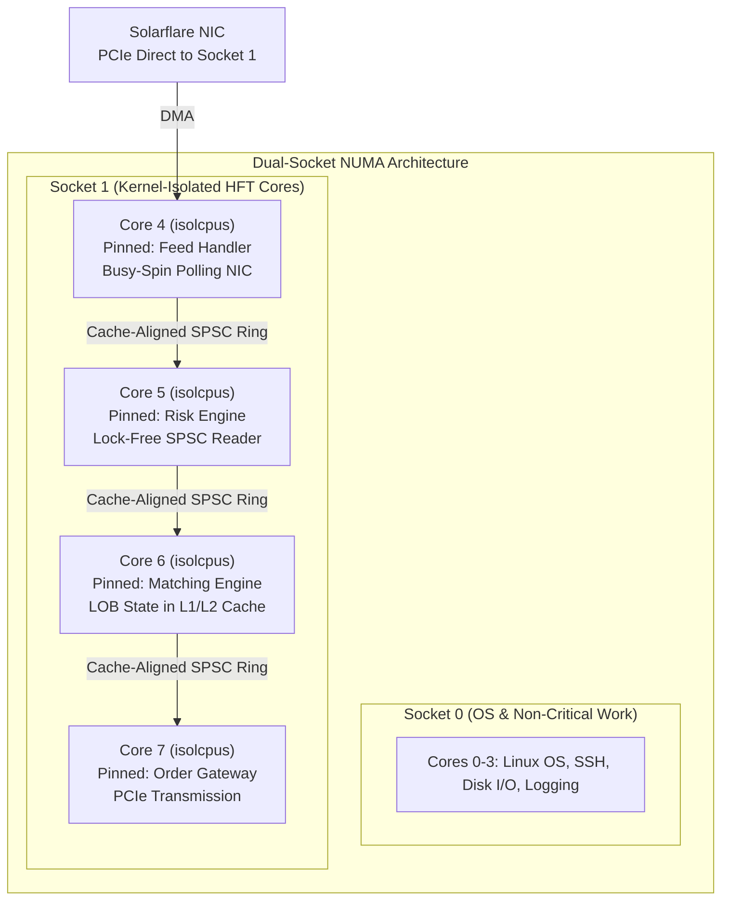
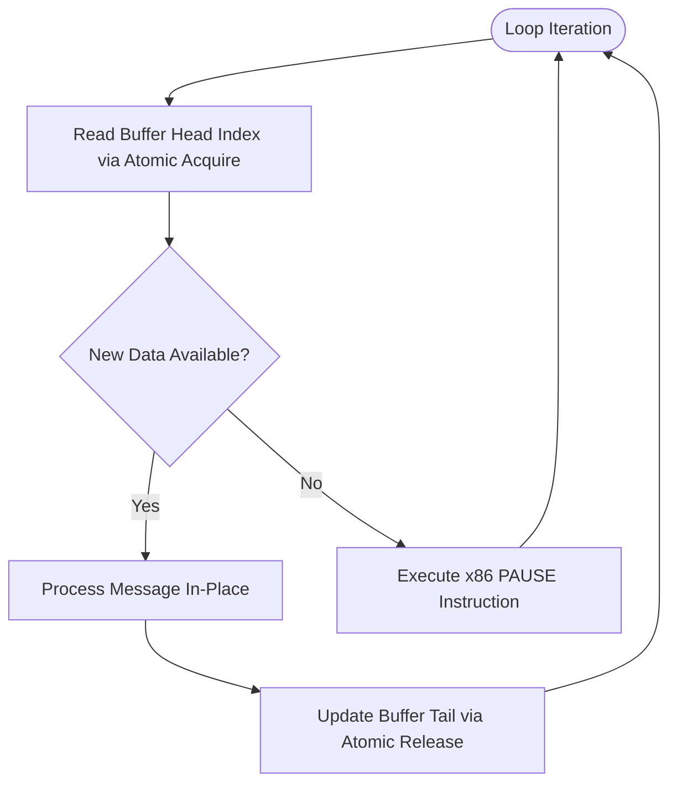

# Week 33: Low-Latency FinTech Systems Engineering

## 1. Why This Week Matters for Your Career Transition

As a senior C# (.NET) engineer, you have spent years mastering high-throughput enterprise architectures. You understand how the CLR ThreadPool schedules work across I/O completion ports, how `ValueTask` minimizes allocation overhead in asynchronous pipelines, and how the generational Garbage Collector (GC) optimizes memory throughput by compacting short-lived Generation 0 objects. In standard cloud-native and enterprise distributed systems, a service responding in 15 milliseconds is considered blazing fast.

The world of electronic trading and high-frequency financial engineering operates in an entirely different universe. In high-frequency trading (HFT), market making, and direct market access (DMA) gateways, the benchmark is not milliseconds—it is single-digit microseconds and hundreds of nanoseconds. At this scale, the abstractions provided by managed runtimes cease to be protective shields; they become erratic sources of latency jitter. A single Gen 2 garbage collection pause of 2 milliseconds is not a minor delay; it is an eternity during which thousands of market updates pass, arbitrage opportunities vanish, and resting orders are adversely selected, resulting in hundreds of thousands of dollars in trading losses. A kernel context switch costing 1.5 microseconds can throw your execution behind competing co-located algorithms.

To step into high-performance systems engineering, you must unlearn the habit of trusting runtime abstractions. You must develop **Mechanical Sympathy**—a profound, instinctual alignment with the underlying physical hardware: CPU caches, translation lookaside buffers (TLBs), store buffers, memory controllers, and OS scheduler internals. This week, you will explore how ultra-low latency trading engines eliminate heap allocations, pin threads to isolated CPU cores, replace blocking primitives with lock-free busy-spin loops, and structure memory to match the exact 64-byte boundaries of CPU cache lines. You will see how C# can be stripped of its idiomatic managed conveniences and pushed to unmanaged bare metal, how Go's concurrent runtime model presents subtle latency hurdles, and why Rust has emerged as the definitive language for modern, deterministic, zero-overhead trading systems.

---

## 2. Microsecond and Nanosecond Latency Budgets in Electronic Trading

### 2.1 The Architecture of a High-Frequency Trading (HFT) Pipeline

In modern electronic financial markets, speed is measured through the **Tick-to-Trade** metric: the precise elapsed time from the arrival of the first byte of a market data packet at the Network Interface Card (NIC) to the transmission of the first byte of an outbound order execution onto the physical network wire.

```mermaid
flowchart LR
    subgraph Inbound["Physical Network (Fiber / Solarflare NIC)"]
        MD["Market Data UDP Packet\n(Multicast ITCH/CME MDP 3.0)"]
    end

    subgraph UserSpacePipeline["User-Space Kernel-Bypass Pipeline (Pinned Cores)"]
        FH["Feed Handler\n(EF_VI / Solarflare Onload)\n[~150 ns]"]
        PARSE["Zero-Copy Parser\n(Simple Binary Encoding - SBE)\n[~80 ns]"]
        RISK["Pre-Trade Risk Engine\n(Credit, Notional, Fat-Finger)\n[~120 ns]"]
        LOB["Limit Order Book (LOB)\nMatching Engine (FIFO / L3)\n[~250 ns]"]
        SERIAL["Order Serialization\n(FIX/SBE Binary Framing)\n[~100 ns]"]
    end

    subgraph Outbound["Network Wire"]
        NIC["Outbound NIC Transmission\n(Kernel-Bypass PCIe Ring)\n[~150 ns]"]
    end

    MD -->|Kernel-Bypass DMA| FH
    FH -->|Memory-Mapped Ring Buffer| PARSE
    PARSE -->|Direct In-Register Pass| RISK
    RISK -->|Zero-Copy Struct Reference| LOB
    LOB -->|Match Output Event| SERIAL
    SERIAL -->|PCIe TX Doorbell| NIC
```



To maintain profitability, proprietary trading desks and market makers operate under a rigorous sub-microsecond latency budget. Consider a typical **850-nanosecond budget** allocated across the critical path:

1. **Kernel-Bypass Ingress (150 ns):** The physical Ethernet frame arrives via optical fiber. Instead of triggering a hardware interrupt and transitioning into the Linux kernel network stack (`sock_queue_rcv_skb`), a specialized NIC (such as Solarflare using OpenOnload or EF_VI API) executes a Direct Memory Access (DMA) transfer directly into a pre-allocated user-space ring buffer.
2. **Zero-Copy Parsing (80 ns):** The raw network payload is cast directly into a structured memory view using fixed-offset binary schemas (e.g., Simple Binary Encoding or NASDAQ ITCH 5.0). No strings are allocated; no field-by-field deserializers are invoked.
3. **Pre-Trade Risk Verification (120 ns):** Firm-wide risk rules (maximum order size, credit limits, price collar boundaries, and fat-finger checks) are evaluated against state held directly in L1/L2 data cache.
4. **Order Book Processing & Matching (250 ns):** The parsed order is processed against the internal Limit Order Book (LOB). Price levels are adjusted, queues are modified, or matches are crossed in deterministic, zero-allocation memory arrays.
5. **Outbound Framing & PCIe Doorbell (250 ns):** The outbound order message (e.g., FIX binary or OUCH protocol) is written into an outbound ring buffer, and the NIC PCIe doorbell register is rung to dispatch the packet.

### 2.2 Kernel Bypass Networking: Why the OS Network Stack Fails

In traditional Linux network programming, reading a packet from a network socket involves an elaborate series of kernel operations:
1. The NIC receives the Ethernet frame into its physical RX FIFO buffer.
2. The NIC initiates a DMA transfer into a kernel memory buffer (`sk_buff`).
3. The NIC asserts a hardware interrupt (Hard IRQ) on the CPU.
4. The CPU pauses current execution, runs the interrupt service routine, and schedules a SoftIRQ (`ksoftirqd` running NAPI polling).
5. The kernel network stack parses Ethernet, IP, and UDP headers, performing firewall checks (`iptables`/`nftables`) and routing table lookups.
6. The packet payload is placed onto the socket's receive queue.
7. The application thread waiting in `recv()` or `Socket.ReceiveAsync()` is woken up by the scheduler, incurring a full context switch.
8. The kernel copies the packet bytes across the user-space/kernel-space boundary into the application's memory buffer.

This standard pipeline consumes **10 to 25 microseconds** under ideal conditions, with tail latency spikes exceeding 100 microseconds during packet bursts. 

```
Standard Kernel Network Path (~10,000 - 25,000 ns):
[Wire] -> [NIC RX FIFO] -> [PCIe DMA] -> [Kernel sk_buff] -> [Hard IRQ] 
       -> [SoftIRQ / NAPI] -> [Netfilter] -> [Socket Queue] -> [Context Switch] 
       -> [Kernel-to-User Copy] -> [User Buffer]

Kernel-Bypass Path (Solarflare EF_VI / DPDK) (~100 - 200 ns):
[Wire] -> [NIC RX FIFO] -> [PCIe DMA Direct to Mapped User Buffer] 
       -> [User Thread Busy-Spin Polls Ring Descriptor] -> [Direct Processing]
```

To eliminate this massive overhead, financial trading systems deploy **Kernel-Bypass Networking** using frameworks such as Solarflare EF_VI (EtherFabric Virtual Interface), OpenOnload, or Intel DPDK (Data Plane Development Kit). The kernel is completely removed from the data path. Memory regions allocated by the user-space application are registered directly with the physical NIC via PCIe Base Address Registers (BARs). When packets arrive, the NIC DMAs them directly into user-space virtual addresses. A dedicated application thread spins continuously on the RX ring descriptor, detecting new packets within **100 to 150 nanoseconds** of their arrival on the physical wire.

### 2.3 The Anatomy of a Latency Spike: Microsecond Killers

In high-frequency trading, median latency ($P_{50}$) is vanity; tail latency ($P_{99}$, $P_{99.9}$, $P_{99.99}$, and Maximum) is reality. An engine with a 300 ns $P_{50}$ that experiences occasional 200 $\mu$s spikes will consistently lose money to a competitor whose latency is a flat, deterministic 600 ns. Understanding what causes tail latency spikes requires dissecting the interaction between software runtimes, operating systems, and CPU silicon.

```
+-------------------------------------------------------------------------------+
|                        ANATOMY OF A LATENCY SPIKE                             |
+-------------------------------------------------------------------------------+
| Event Cause                       | Typical Latency Cost | Mitigation Strategy|
+-----------------------------------+----------------------+--------------------+
| L1d Cache Hit                     | ~0.5 - 1.0 ns        | Cache-line packing |
| L2 Cache Hit                      | ~3.0 - 4.0 ns        | Keep working set <1MB|
| L3 Cache Hit (Shared LLC)         | ~12.0 - 20.0 ns      | NUMA socket local  |
| Main Memory Access (DRAM)         | ~60.0 - 90.0 ns      | Pre-alloc flat arrs|
| TLB Miss (Page Table Walk)        | ~30.0 - 150.0 ns     | 1GB HugePages      |
| Cache Line Bouncing (False Share) | ~40.0 - 100.0 ns     | 64-byte alignment  |
| OS Context Switch (CFS scheduler) | ~1,500 - 3,000 ns    | isolcpus, pinning  |
| Minor Page Fault (Zero-Fill)      | ~2,000 - 8,000 ns    | mlockall, prefault |
| CPU C-State Wakeup (C1E to C0)    | ~10,000 - 30,000 ns  | intel_idle.max_cst=0|
| .NET / Go GC Stop-The-World Pause | ~500,000 - 5,000,000ns| Zero-alloc runtime |
+-------------------------------------------------------------------------------+
```

#### OS Thread Scheduling & Context Switches
When the Linux Completely Fair Scheduler (CFS) determines that a thread's time slice has expired, or when a thread yields execution by waiting on an OS primitive (such as `Monitor.Wait` in C#, a channel read in Go, or `pthread_mutex_lock`), the kernel performs a context switch. This involves:
- Saving CPU register states (RIP, RSP, general-purpose registers, AVX-512 vector registers) to the thread stack.
- Switching virtual memory page tables by reloading the CR3 register.
- Invalidating the processor's Translation Lookaside Buffer (TLB).
- Flushing CPU instruction pipelines.

A standard Linux context switch costs between **1,500 and 3,000 nanoseconds**. Even worse, when the trading thread is rescheduled, its warm L1 and L2 caches have been evicted by the interrupting process, resulting in a flurry of cache misses that slow down execution for subsequent tens of microseconds.

#### Translation Lookaside Buffer (TLB) Misses
Modern x86-64 CPUs translate 48-bit virtual addresses into physical RAM addresses using hierarchical page tables (PML4 -> PDPT -> Page Directory -> Page Table). To avoid a 4-level memory walk on every pointer dereference, the CPU caches recent translations in the TLB (typically 64 entries in L1 DTLB, 1,536 entries in L2 STLB).
When using standard 4 KB OS pages, a 64 MB order book spans 16,384 virtual pages. Random access across this address space causes continuous TLB misses. Each TLB miss requires walking the 4-level page hierarchy in DRAM, adding **30 to 150 nanoseconds** per lookup. Trading systems eliminate this jitter by configuring **HugePages** (2 MB or 1 GB pages via `hugetlbfs`), reducing the entire working set to a handful of TLB entries that never leave the hardware cache.

#### Cache Line Bouncing & MESI Coherence Invalidation
Multicore processors maintain cache coherency via variants of the MESI (Modified, Exclusive, Shared, Invalid) protocol. Coherency operates strictly at the granularity of a **64-byte cache line**. If Core 2 writes to variable `A`, and Core 4 reads variable `B`, but both `A` and `B` reside on the same 64-byte memory slice, Core 2's write broadcasts an Invalidate signal across the interconnect bus. Core 4's L1 cache line is forcefully invalidated. When Core 4 subsequently accesses `B`, it stalls waiting for the modified cache line to be flushed across the interconnect, introducing a **40 to 100 ns** latency penalty. This phenomenon, known as **False Sharing**, destroys parallel throughput and introduces unpredictable latency jitter.

#### Page Faults: Minor and Major
In managed runtimes and typical Linux applications, virtual memory allocation (`malloc`, `mmap`, or .NET heap expansion) is lazy. The kernel returns a virtual address pointer without allocating physical DRAM. When your code first reads or writes that memory address, the CPU triggers a **Page Fault** interrupt (Vector 14).
- A **Minor Page Fault** occurs when physical RAM is available: the kernel allocates a 4KB physical frame, zero-fills it, updates the page table, and resumes execution. This adds **2,000 to 8,000 nanoseconds** per fault.
- A **Major Page Fault** occurs if memory must be read from disk swap, taking **5 to 15 milliseconds**.

In HFT systems, dynamic memory expansion is prohibited. All process memory is pre-allocated at startup and locked into physical RAM using `mlockall(MCL_CURRENT | MCL_FUTURE)`. Furthermore, the application loops through every allocated page at startup, writing a dummy byte to every 4KB block (page prefaulting) to force the kernel to populate physical page tables before any market data packet is processed.

#### CPU Frequency Scaling and C-States
Modern Intel and AMD processors feature advanced power-saving states (C-states from C0 active to C6 deep power down) and frequency scaling governors (P-states / Intel SpeedStep / AMD Cool'n'Quiet). If a core becomes idle for even a fraction of a millisecond, the CPU drops voltage and shuts down internal clock generators. When a new market data tick arrives, transitioning from C6 back to C0 takes **20 to 50 microseconds**. In an HFT engine, CPU power-saving features are completely disabled at the BIOS and kernel levels (`idle=poll`, `intel_idle.max_cstate=0`, `processor.max_cstate=0`). Cores must run at maximum base frequency 100% of the time.

---

## 3. Mechanical Sympathy & Hardware Architecture

### 3.1 Core Pinning & Processor Affinity

To achieve zero jitter, a low-latency process must establish exclusive ownership of physical execution cores. In standard enterprise systems, the OS scheduler moves threads dynamically between cores to balance thermal load and throughput. In trading engines, dynamic scheduling is catastrophic because it repeatedly flushes the CPU's L1/L2 caches.



#### Kernel Configuration: `isolcpus` and `nohz_full`
High-performance Linux tuning isolates specific cores during boot via kernel command-line arguments in `/etc/default/grub`:
```bash
isolcpus=4-7 nohz_full=4-7 rcu_nocbs=4-7 intel_pstate=disable processor.max_cstate=0 idle=poll
```
- `isolcpus=4-7`: Tells the Linux CFS scheduler to completely remove physical cores 4, 5, 6, and 7 from its scheduling domains. The kernel will never assign any user-space process to these cores unless explicitly instructed.
- `nohz_full=4-7`: Enables "adaptive ticks". When a single pinned thread is executing on an isolated core, the kernel stops the periodic timer interrupt (normally 250 Hz or 1000 Hz), eliminating timer interrupt jitter entirely.
- `rcu_nocbs=4-7`: Offloads Read-Copy-Update (RCU) callback processing from these cores to house-keeping cores (0-3).

#### NUMA Architecture: Why Socket Locality Matters
In multi-socket servers, Non-Uniform Memory Access (NUMA) dictates memory access performance. Each CPU socket has its own integrated memory controller and directly attached DRAM channels. When Core 6 (on Socket 1) accesses memory attached to Socket 1, access latency is ~60 ns. If Core 6 accesses memory attached to Socket 0, the memory request must traverse the inter-socket interconnect (Intel Ultra Path Interconnect - UPI, or AMD Infinity Fabric). This cross-socket hop adds **40 to 80 nanoseconds** to every memory request.
Trading processes must be strictly pinned to the NUMA node directly connected to the PCIe root complex of the trading NIC. Memory allocations must be enforced using `numactl --cpunodebind=1 --membind=1` or `set_mempolicy(MPOL_BIND, ...)`.

#### How the Three Languages Approach Affinity
- **C# (.NET):** Pinning is achieved through the process subsystem:
  ```csharp
  Process.GetCurrentProcess().ProcessorAffinity = new IntPtr(1 << targetCoreId);
  Thread.BeginThreadAffinity(); // Advises CLR runtime not to migrate OS thread
  ```
  While functional, the CLR runtime threads (Finalizer thread, GC background server threads) still run within the process and can occasionally contend unless carefully configured via `serverGarbageCollection=false` or custom CPU masks in `runtimeconfig.json`.
- **Go:** Go provides `runtime.LockOSThread()`. This wires the calling goroutine to its current underlying OS thread ($M$). However, Go does not natively provide thread affinity to a specific CPU core; engineers must invoke the Linux `sched_setaffinity` syscall via `golang.org/x/sys/unix`. Furthermore, Go's background monitoring thread (`sysmon`) and GC worker threads do not respect this lock, and Go's runtime continues trying to schedule other goroutines unless strictly controlled.
- **Rust:** Rust has no runtime layer between the code and the OS. Pinning a thread via the `core_affinity` crate or direct `libc::pthread_setaffinity_np` binds the thread at the hardware level with zero interference. There are no background threads, no runtime monitors, and no surprise preemptions.

### 3.2 Busy-Spin Polling vs. Kernel Context Switching

Traditional multithreaded programming relies on synchronization primitives: locks, semaphores, condition variables, and monitor constructs (`lock(obj)` in C#, `sync.Mutex` in Go, `std::sync::Mutex` in Rust). 

All of these primitives rely on the underlying OS **futex** (Fast Userspace Mutex) facility. While an uncontended futex operates in user space via an atomic CAS (`Compare-And-Swap`), any contention immediately transitions execution into the Linux kernel via `sys_futex`, putting the contending thread to sleep. When the lock is released, the kernel must wake the thread, triggering the full 2,000+ nanosecond context switch penalty.

In ultra-low latency design, **blocking is banned**. Threads never sleep. Instead, threads communicate via lock-free Single-Producer Single-Consumer (SPSC) ring buffers and execute tight **busy-spin polling loops**.



#### The Role of the `PAUSE` Instruction
When a CPU executes an empty spin loop (`while (!condition) {}`), two severe microarchitectural penalties occur:
1. **Pipeline Flush on Loop Exit:** The processor's speculative execution engine fills the instruction pipeline with hundreds of speculative loop iterations. When the memory condition finally changes, the processor detects a memory order violation and must violently flush its entire out-of-order execution pipeline, stalling execution for 30 to 40 CPU cycles.
2. **Resource Starvation on Hyperthreads:** If two logical threads share one physical core (SMU/Hyperthreading), a tight spin loop monopolizes the execution units (ALUs), starving the co-located thread.

The x86 `PAUSE` instruction (emitted as `rep nop`, opcode `F3 90`) provides a hardware hint to the CPU:
- It introduces a tiny delay (typically ~12-140 cycles depending on Skylake vs Cascade Lake vs Zen4 architectures).
- It prevents memory order violations, guaranteeing a clean pipeline exit when the polled variable changes.
- It dramatically lowers CPU power consumption and thermal throttling.

How the languages emit `PAUSE`:
- **C#:** `Thread.SpinWait(1)` emits the `pause` instruction directly in JIT-compiled assembly.
- **Go:** `runtime.Gosched()` yields the goroutine to the scheduler (which is slow). In raw busy loops, Go engineers often use an empty loop or invoke assembly routines since Go does not expose a native `pause` intrinsic in standard library user code.
- **Rust:** `std::hint::spin_loop()` emits the exact machine-level `pause` instruction on x86, or `yield` on ARM, with zero overhead.

### 3.3 Hardware Memory Ordering: Store Buffers and Acquire-Release Semantics

Under the x86-64 microarchitecture, memory follows the **Total Store Order (TSO)** model:
- Loads are not reordered with other loads (`LoadLoad` barrier is a no-op).
- Stores are not reordered with older stores (`StoreStore` barrier is a no-op).
- Stores are not reordered with older loads (`LoadStore` barrier is a no-op).
- The *only* reordering that hardware permits is that a Store followed by a Load may be reordered (`StoreLoad`), because modern cores utilize an internal asynchronous **Store Buffer**.

```
[Core Execution Engine]
          |
     (Store Data)
          v
   [ Store Buffer ]  ---------> [ L1 Data Cache (MESI Protocol) ]
          |                               ^
     (Speculative)                        |
          v                          (Load Data)
    [ Read Bypassing ]                    |
          +-------------------------------+
```

When a thread writes to memory, the write enters the core's private Store Buffer immediately so execution does not stall waiting for cache line ownership. A subsequent load to a different address can execute out of order before the store is drained to L1 cache.

In a Single-Producer Single-Consumer (SPSC) lock-free ring buffer:
- The Producer writes an order message into slot $N$, then updates the `tail` index using **Release semantics**.
- The Consumer reads the `tail` index using **Acquire semantics**, then reads the order message from slot $N$.

On x86-64, an atomic write with `Release` is just a standard `mov` instruction (since stores are never reordered with older stores). An atomic read with `Acquire` is just a standard `mov` instruction (since loads are never reordered with newer loads). There is **zero instruction overhead**—no expensive `lock cmpxchg` or `MFENCE` instructions are emitted! On ARM64, the hardware emits lightweight `ldar` (Load-Acquire) and `stlr` (Store-Release) instructions.

### 3.4 Cache-Friendly Data Structures: Memory Layouts and Alignment

To understand cache-friendly design, consider the memory latency hierarchy of a modern trading server:

```
[Registers: 0.5 ns, 64-128 bytes]
       |
[L1 Data Cache: ~1.0 ns, 32-48 KB per core]
       |
[L2 Cache: ~3.5 ns, 512 KB - 1.25 MB per core]
       |
[L3 Cache (LLC): ~15 ns, 16 - 64 MB shared across socket]
       |
[DRAM (DDR5): ~60-80 ns, 64-512 GB]
```

Every access that misses the L1/L2 caches and falls through to DRAM costs the equivalent of **hundreds of CPU cycles**. Writing low-latency software requires designing data structures that fit entirely within L1/L2 caches and align to physical 64-byte cache lines.

#### Array of Structures (AoS) vs. Structure of Arrays (SoA)
In traditional object-oriented C#, order books are modeled as collections of objects:
```csharp
// Array of References (Typical C#) -> Catastrophic Cache Locality
public class Order {
    public long Id;
    public long Price;
    public int Quantity;
    public string ClientId; // Pointer to heap
    public DateTime Timestamp;
}
Order[] orders; // Array of 64-bit pointers scattered across the GC heap!
```
Iterating over `orders` requires chasing pointers to random addresses across the 64-bit virtual memory space. Every access results in a cache miss.

In contrast, systems engineering uses flat contiguous layouts:
```
Array of Structures (AoS) in Contiguous Memory:
+-------------------------------------------------------+
| Order 0 (32B)           | Order 1 (32B)               |  <- Fits in ONE 64-byte cache line
| [ID, Price, Qty, Side]  | [ID, Price, Qty, Side]      |
+-------------------------------------------------------+
```

When an algorithm searches for matching price levels, it only needs the `Price` and `Quantity` fields. In an AoS layout, scanning through prices still pulls unused metadata into cache lines. Structure of Arrays (SoA) separates hot fields into dedicated flat arrays:

```
Structure of Arrays (SoA):
Prices:     [ 100.50 | 100.50 | 100.25 | 100.00 | ... ]  <- 8 prices per 64-byte line
Quantities: [   100  |   500  |   200  |  1500  | ... ]  <- 16 quantities per 64-byte line
OrderIds:   [   101  |   102  |   103  |   104  | ... ]  <- Packed separately
```
SoA enables the hardware prefetcher to stream data effortlessly, and allows SIMD (AVX-512) vector instructions to compare 8 or 16 price levels in a single clock cycle.

#### Cache Line Alignment & False Sharing Prevention
To prevent multiple threads from invalidating each other's L1 cache lines, shared data structures (such as ring buffer cursors) must be explicitly aligned and padded to 64 bytes (or 128 bytes on processors with adjacent-line prefetchers).

In C#:
```csharp
[StructLayout(LayoutKind.Explicit, Size = 64)]
public struct PaddedHead {
    [FieldOffset(0)] public long Value;
}
```

In Go:
```go
type PaddedHead struct {
    Value uint64
    _     [56]byte // Manual padding to fill 64-byte cache line
}
```

In Rust:
```rust
#[repr(align(64))]
pub struct PaddedHead {
    pub value: std::sync::atomic::AtomicU64,
}
```
Rust's `#[repr(align(64))]` instructs the compiler to guarantee that every instance of this struct begins on a 64-byte aligned memory boundary, completely preventing false sharing without relying on manual dummy padding bytes.

### 3.5 Eliminating All Allocations from the Critical Path

A critical path in an electronic trading engine is strictly **zero-allocation**. Not a single byte of memory may be requested from the OS or runtime allocator (`malloc`, `new`, `make()`, or `Box::new`) after the engine's initialization sequence completes.

#### Pre-Allocated Object Arenas and Free-Lists
Instead of allocating and freeing orders dynamically as trades enter and leave the market, engines pre-allocate fixed-size arenas at startup. Orders within price levels are linked using integer array indices (`u32`) rather than memory pointers (`*mut Order` or object references).

```
Pre-Allocated Static Order Pool (Contiguous Buffer):
+-------------------------------------------------------------------------+
| Index 0   | Index 1   | Index 2   | Index 3   | Index 4   | Index N...  |
| OrderSlot | OrderSlot | OrderSlot | OrderSlot | OrderSlot | OrderSlot   |
+-------------------------------------------------------------------------+
     ^                       |
     |                       +--> Next Free Slot (Linked via Free-List Index)
     +-- Head of Bid Level (Doubly-linked via PrevIndex / NextIndex)
```

Using 32-bit integer indices instead of 64-bit pointers achieves two massive benefits:
1. **Memory Compression:** Pointer fields take 4 bytes instead of 8 bytes, cutting linked-list overhead in half and doubling cache line density.
2. **Zero GC Tracking:** In C# and Go, flat arrays of primitive structs containing integers are seen by the GC as inert memory blocks. The GC does not trace inside them, completely removing scanning overhead.

#### Limit Order Book Internal Topologies: Flat Indexing vs. Balanced Trees
Typical textbook data structures suggest using a Red-Black Tree (such as `std::map` in C++, `SortedDictionary` in C#, or an AVL tree) to maintain price levels sorted by price. In an HFT matching engine, **tree structures are strictly avoided**:
- Node balancing and rotations chase pointers across random memory allocations.
- Tree depth means every order lookup requires multiple cache misses ($\log_2 N$).
- Tree nodes incur high metadata overhead (parent, left, right pointers, color flags).

Instead, high-performance engines use **Flat Price Index Arrays** or **Radix Trees**. In liquid markets (e.g., CME Eurodollar or S&P 500 futures), price ticks fall within a bounded range around the current market price. By mapping the price directly to an array offset (`price_index = (price - min_price) / tick_size`), price level lookup is a single $O(1)$ memory dereference with perfect cache spatial locality.

#### Zero-Allocation Serialization: SBE vs. Protobuf vs. FlatBuffers

In enterprise systems, Protocol Buffers (Protobuf) or JSON are common choices for serialization. In HFT, Protobuf is rejected because:
- It uses variable-length integer encoding (varints), requiring CPU-intensive bit shifting and branching during deserialization.
- It serializes fields out of order, requiring a decoding step that allocates intermediate objects.

Low-latency trading relies on **Simple Binary Encoding (SBE)**, the standard binary format of the FIX Trading Community.

```
SBE Binary Message Frame (Fixed Offsets, Zero-Copy):
 0                   1                   2                   3
 0 1 2 3 4 5 6 7 8 9 0 1 2 3 4 5 6 7 8 9 0 1 2 3 4 5 6 7 8 9 0 1
+-+-+-+-+-+-+-+-+-+-+-+-+-+-+-+-+-+-+-+-+-+-+-+-+-+-+-+-+-+-+-+-+
|          BlockLength          |           TemplateID          |  <- Header (8 Bytes)
+-+-+-+-+-+-+-+-+-+-+-+-+-+-+-+-+-+-+-+-+-+-+-+-+-+-+-+-+-+-+-+-+
|            SchemaID           |            Version            |
+-+-+-+-+-+-+-+-+-+-+-+-+-+-+-+-+-+-+-+-+-+-+-+-+-+-+-+-+-+-+-+-+
|                          OrderID (int64)                      |  <- Fixed Field: Offset 8
|                                                               |
+-+-+-+-+-+-+-+-+-+-+-+-+-+-+-+-+-+-+-+-+-+-+-+-+-+-+-+-+-+-+-+-+
|                          Price (int64)                        |  <- Fixed Field: Offset 16
|                                                               |
+-+-+-+-+-+-+-+-+-+-+-+-+-+-+-+-+-+-+-+-+-+-+-+-+-+-+-+-+-+-+-+-+
|          Quantity (uint32)    |  Side (uint8) |  Padding (3B) |  <- Fixed Field: Offset 24
+-+-+-+-+-+-+-+-+-+-+-+-+-+-+-+-+-+-+-+-+-+-+-+-+-+-+-+-+-+-+-+-+
```

With SBE:
- Every field sits at a known, fixed byte offset within the message.
- "Parsing" consists solely of taking the raw pointer from the network DMA buffer and casting it directly into a typed struct reference (`(OrderMessage*)(buffer + offset)`).
- Deserialization cost is **0 nanoseconds**. The CPU reads fields directly from the network buffer into registers using standard displacement addressing (`mov rax, [rsi + 16]`).

---

## 4. The Runtime Battle: CLR vs. Go vs. Rust

### 4.1 The C# (.NET 8/9) Baseline: Pushing Managed Code to its Bare-Metal Limit

Modern C# has introduced remarkable high-performance primitives:
- `Span<T>` and `ReadOnlySpan<T>` allow safe, bounds-controlled views of arbitrary contiguous memory (stack, native heap, or pinned managed heap) without allocations.
- `ref struct` ensures types reside strictly on the execution stack, completely preventing escape to the heap.
- `NativeMemory.Alloc()` and unmanaged function pointers (`delegate*<void>`) allow developers to bypass the CLR heap entirely.
- Dynamic PGO (Profile Guided Optimization) and RyuJIT produce competitive assembly for hot numerical loops.

However, C# engineers building sub-microsecond systems face insurmountable architectural boundaries imposed by the CLR:
1. **GC Safepoint Polling:** The JIT compiler injects safepoint checks into compiled code. Even if you manage to allocate 0 bytes in your hot path, if any background thread or secondary component triggers a collection, your pinned execution thread will be forced to pause at its next safepoint poll (`test [rcx], eax` or runtime polling helper).
2. **Write Barriers:** If you write references to managed objects, RyuJIT must emit JIT write barriers (`CORINFO_HELP_ASSIGN_REF`) to track generational cross-references in the card table, consuming memory bandwidth and CPU cycles.
3. **JIT Warmup & Tiering Jitter:** RyuJIT uses tiered compilation (Tier 0 interpret/quick-JIT, Tier 1 optimized PGO). During initial market open, code paths may suddenly trigger dynamic recompilation, introducing massive multi-millisecond tail latency spikes precisely when market volume is highest.

### 4.2 Go: Developer Velocity vs. Runtime Latency Jitter

Go is widely praised for its concurrency model and high-performance network servers. In crypto exchanges, web gateways, and order routers, Go is a ubiquitous powerhouse. 

However, in ultra-low latency cores (matching engines, hardware feed handlers), Go presents structural friction:
1. **The M:N Cooperative Scheduler:** Go multiplexes $G$ goroutines across $M$ OS threads using $P$ logical processors. The Go runtime prioritizes system throughput over thread determinism. Even if you invoke `runtime.LockOSThread()`, Go's scheduler continues running background bookkeeping tasks.
2. **Asynchronous Preemption via OS Signals:** Since Go 1.14, the runtime uses OS signals (`SIGURG`) to preempt tight loops that do not contain function calls. A signal handler interrupt in Linux costs thousands of CPU cycles, creating immediate microsecond-level latency jitter.
3. **Non-Tunable GC Safepoints & Concurrent Mark Assists:** Although Go's concurrent collector achieves pauses under 1 millisecond, it achieves this by forcing user goroutines that allocate memory to perform **GC Mark Assist**. If an allocation occurs while the GC is actively marking, the mutator thread is hijacked to do GC work, spiking latency from 500 ns to 250 $\mu$s. While disabling GC (`GOGC=off` or `debug.SetGCPercent(-1)`) is possible, the Go compiler lacks zero-overhead unmanaged memory abstractions, making manual memory management clunky and error-prone.

### 4.3 Rust: Bare Metal Determinism

Rust was designed from its inception without a runtime and without a garbage collector. It represents the pinnacle of modern low-latency systems engineering:
1. **Zero-Cost Abstractions:** High-level constructs (iterators, closures, pattern matching, RAII smart pointers) compile down to machine code identical to hand-optimized C or assembly.
2. **Explicit Memory Layout:** Attributes like `#[repr(C)]`, `#[repr(packed)]`, and `#[repr(align(64))]` give the engineer exact byte-level control over memory layout, ensuring deterministic cache utilization.
3. **Lifetimes and Compile-Time Verification:** Rust enforces thread safety and data-race freedom at compile time without requiring runtime synchronization or locks. Borrow semantics guarantee that shared memory structures (like SPSC ring buffers) are accessed safely without runtime checks.
4. **No Safepoint Checks, No Hidden Allocations:** When a Rust function compiles, the generated assembly contains only the instructions written by the programmer. There are no injected runtime polls, no background scheduler threads, and no surprises.

---

## 5. Common Misconceptions to Unlearn for Senior C# Engineers

### Misconception 1: "Async/await reduces latency because it is asynchronous."
**The Reality:** In web services, `async`/`await` increases *throughput* by freeing OS threads while waiting for slow network or database I/O. But `async`/`await` inherently increases *latency*. When an asynchronous method yields:
- A state machine struct or class is updated.
- An I/O Completion Port (IOCP) queues a continuation.
- The CLR ThreadPool schedules a worker thread.
- An OS context switch occurs.

In a low-latency trading engine, there is no waiting for I/O. The thread sits in a pinned, non-yielding busy-spin loop. Using `async`/`await` in an HFT critical path introduces allocation overhead, queueing delay, and scheduler latency that destroys nanosecond execution.

### Misconception 2: "Go channels are the ideal data structure for high-throughput inter-thread communication."
**The Reality:** Go channels are designed for safety, orchestration, and developer ergonomics. Internally, a channel is a heap-allocated `hchan` struct protected by a `sync.mutex`. Sending or receiving on a channel involves:
- Acquiring the internal lock.
- Copying memory across goroutine stacks.
- Potentially waking sleeping goroutines via the Go runtime scheduler.

In HFT, channels are an order of magnitude too slow. Communication between pinned threads is conducted strictly through cache-aligned, lock-free SPSC ring buffers that rely on atomic CPU instructions (`load acquire` / `store release`) with zero locking and zero runtime calls.

### Misconception 3: "Using `struct` instead of `class` in C# eliminates all memory performance issues."
**The Reality:** While `struct` allocates memory inline (on the stack or inside containing arrays), large structs in C# present severe hidden performance traps. If a 128-byte `struct` is passed by value to a method, the CLR must emit `memcpy` operations to copy the entire 128 bytes onto the call stack, trashing L1 cache. C# developers must remember to use `in`, `ref readonly`, or `ref struct` modifiers. Furthermore, boxing a struct into an `object` or interface (e.g., `IComparable<T>`) causes an immediate heap allocation.

### Misconception 4: "`GC.TryStartNoGCRegion()` makes C# equivalent to Rust for low-latency execution."
**The Reality:** .NET provides `GC.TryStartNoGCRegion()`, which promises to prevent garbage collection until a specified amount of memory is allocated. However, this is a fragile stopgap. If the application exceeds the pre-committed budget by a single byte, the runtime triggers a full, blocking Generation 2 compaction, causing an enormous multi-millisecond pause. More importantly, it does not remove the JIT compiler's safepoint polling instructions or provide control over cache-line alignment.

### Misconception 5: "Rust requires extensive use of `unsafe` to achieve high performance."
**The Reality:** A common myth among managed-code developers is that Rust can only match C speed by bypassing its borrow checker with `unsafe`. In truth, idiomatic safe Rust matches C performance in the vast majority of systems programming tasks. Rust's borrow checker works at compile time and imposes exactly zero runtime overhead. `unsafe` is reserved strictly for narrow primitives, such as reading unaligned raw hardware buffers or bypassing redundant bounds checks in loops where the invariant has already been proven.

---

## 6. Comparative Architecture & Runtime Mechanics Matrix

| Architectural Feature | C# (.NET 8/9 Native / CoreCLR) | Go (1.22+) | Rust (1.75+) |
| :--- | :--- | :--- | :--- |
| **Runtime Overhead** | Medium-High (CLR, JIT, Safepoints) | Medium (M:N Scheduler, GC, Sysmon) | **Absolute Zero** (No runtime, no GC) |
| **Execution Model** | JIT / ReadyToRun / Native AOT | Ahead-of-Time (AOT) Compiled | **AOT Compiled (LLVM backend)** |
| **Memory Management** | Generational Tracing GC (Gen 0, 1, 2) | Concurrent Mark-Sweep Tri-color GC | **Compile-time RAII & Lifetimes** |
| **Tail Latency ($P_{99.9}$)** | Highly variable unless fully unmanaged | Periodic spikes from GC/preemption | **Completely deterministic** |
| **Hot-Path Allocations** | Possible 0-alloc via `Span`/`NativeMemory` | Difficult (escape analysis quirks) | **Strictly 0-alloc enforced by types** |
| **Thread Pinning** | `ProcessorAffinity` + CLR hints | `LockOSThread()` (still fights sysmon) | **Direct OS syscall (`core_affinity`)** |
| **Spin-Wait Assembly** | `Thread.SpinWait` emits x86 `PAUSE` | Requires raw assembly or busy loop | `std::hint::spin_loop` emits `PAUSE` |
| **Cache Line Alignment** | `[StructLayout(LayoutKind.Explicit)]` | Manual dummy padding byte arrays | `#[repr(align(64))]` native directive |
| **Data Layout Control** | Sequential, Explicit, Value Types | Structs are contiguous; no unions | Full C ABI control (`#[repr(C)]`) |
| **SIMD Vectorization** | `System.Runtime.Intrinsics.X86` | Limited internal compiler intrinsics | Direct portable SIMD & LLVM auto-vec |
| **Suitability for Sub-$\mu$s HFT** | Niche (specialized unmanaged engines) | Gateway/routing layer, rarely matching | **Industry standard for modern HFT** |

---

*Continue to `02_CODE_COMPARISON_ROSETTA.md` to study complete, compilable, zero-allocation matching engines implemented in all three languages.*
