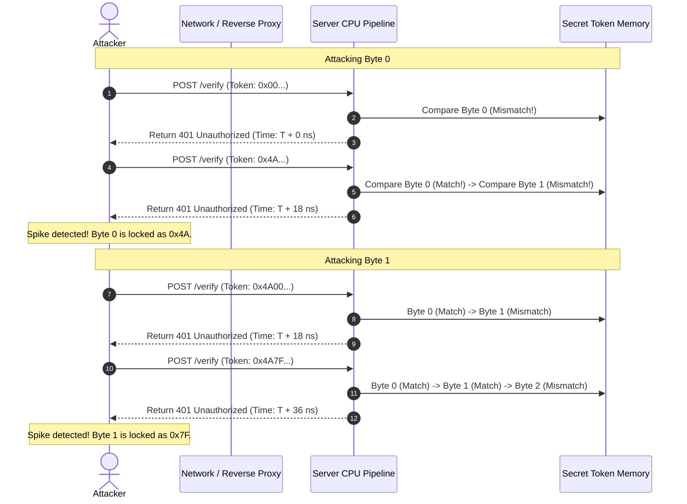
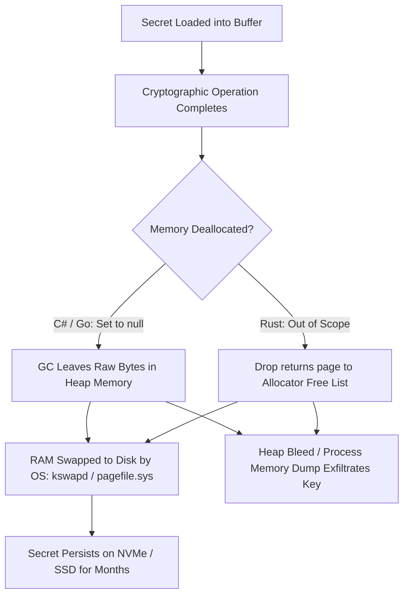
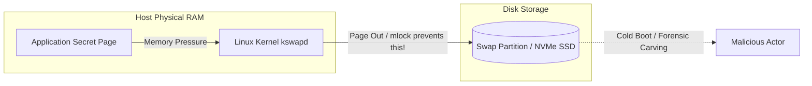
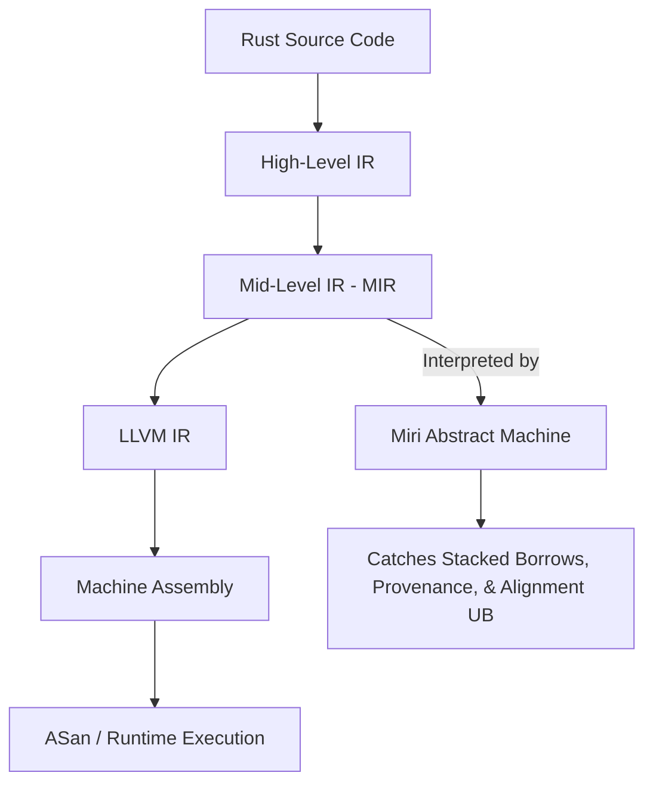

# Week 34: Security Hardening & Memory Forensics

## Why This Week Matters for Your Career Transition
As a senior .NET engineer, you have spent years operating inside the protective envelope of the Common Language Runtime (CLR). The runtime guarantees type safety, manages object lifetimes through generational garbage collection, prevents buffer overruns through bounds checking, and abstracts cryptographic operations behind high-level managed wrappers in `System.Security.Cryptography`. When transitioning to systems programming in Go and Rust, this protective envelope disappears or changes fundamental assumptions. In high-performance backend infrastructure, financial engines, security perimeters, and cloud runtimes, security is not an administrative layer configured via identity providers or transport-layer TLS certificates. Security is a physical property of silicon, cache hierarchies, branch prediction units, virtual memory page tables, and optimizing compiler passes. 

A simple expression such as `if (providedToken == secretToken)` can introduce a catastrophic remote exploit that allows an attacker across the internet to extract 256-bit cryptographic keys byte-by-byte through nanosecond-scale side-channel timing leaks. Setting an object reference to `null` does not delete the secret; it leaves plaintext cryptographic keys residing in RAM indefinitely, ready to be exfiltrated via heap bleed vulnerabilities, cold boot attacks, or flushed to persistent NVMe swap space by the operating system kernel. Worse, naive attempts to wipe memory using `memset` or a `for` loop will be silently and ruthlessly eliminated by optimizing compilers (LLVM, GCC, and Roslyn) under Dead Store Elimination (DSE) rules. By the end of this week, you will understand the microarchitectural mechanics of constant-time algorithms, how to guarantee physical memory destruction against optimizing compilers, how to pin physical RAM frames against operating system swapping, and how to harness dynamic memory sanitizers (ASan, MSan, UBSan) and the Rust Miri abstract machine to prove the absence of undefined behavior and pointer provenance violations.

---

## 1. Cryptographic Timing Attacks and Constant-Time Execution

### 1.1 Microarchitecture and Early-Exit Comparison Mechanics
In enterprise software development, equality comparison is optimized for the common case: inequality. Standard implementations of memory and string comparison—whether `memcmp` in the C runtime, `string.Equals()` or `SequenceEqual()` in .NET Core, or `bytes.Equal()` in Go—are designed to terminate execution at the earliest possible microsecond.

Consider the x86-64 assembly instructions generated for a standard short-circuiting byte array comparison:

```text
; Typical early-exit loop generated by non-cryptographic comparisons
.L_compare_loop:
    movzx   eax, byte ptr [rdi + rcx]   ; Load candidate byte from memory
    movzx   edx, byte ptr [rsi + rcx]   ; Load secret byte from memory
    cmp     al, dl                      ; Compare the two bytes
    jne     .L_mismatch                 ; BRANCH: Early exit on first mismatched byte!
    inc     rcx                         ; Increment index
    cmp     rcx, r8                     ; Compare index against length
    jne     .L_compare_loop
    mov     eax, 1                      ; All bytes matched
    ret
.L_mismatch:
    xor     eax, eax                    ; Return false (0)
    ret
```

When comparing two 32-byte authentication tokens (such as an HMAC-SHA256 signature), the latency of this function is directly proportional to the number of consecutive matching bytes starting from index 0:

- **0 Matching Bytes:** The CPU loads byte 0, executes `cmp al, dl`, evaluates `jne` as true, and returns `false` within ~2 to 4 CPU clock cycles.
- **1 Matching Byte:** The CPU processes byte 0 (match), increments index, loads byte 1, evaluates `jne` as true, and returns `false` within ~6 to 8 clock cycles.
- **16 Matching Bytes:** The CPU completes 16 loop iterations, traversing cache lines and executing pipeline operations, taking ~40 to 60 clock cycles before returning `false`.



At the microarchitectural layer, the early exit triggers more than just fewer executed instructions. It exercises the CPU Branch Prediction Unit (BPU) and instruction decoding pipeline:
1. **Branch Predictor Training:** As the loop runs, the CPU's branch target buffer (BTB) records branch history. When a mismatch finally terminates the loop, the branch predictor mispredicts, causing a pipeline flush costing 15–20 clock cycles on modern x86-64 (Intel Golden Cove / AMD Zen 4) architectures.
2. **Instruction Cache & Execution Units:** Each additional loop iteration requires instruction fetch, decode, dispatch to ALU execution ports, and retirement.
3. **Data Cache Hit / Miss Latency:** If the secret token spans a 64-byte L1 cache line boundary, evaluating further bytes may require reading an additional cache line, introducing measurable L1/L2 access deltas.

### 1.2 The Anatomy of a Remote Timing Attack
A common misconception among application engineers is that network jitter (ranging from hundreds of microseconds to tens of milliseconds) masks nanosecond-scale microarchitectural differences, rendering remote timing attacks theoretical. 

This assumption is mathematically and empirically false. In classical signal-to-noise ratio (SNR) theory, independent random noise (such as network latency, kernel context switches, and interrupt handling) follows a distribution whose standard error of the mean decreases with the square root of the sample size:

$$\sigma_{\bar{x}} = \frac{\sigma}{\sqrt{N}}$$

Where $\sigma$ is the standard deviation of network latency and $N$ is the number of probe measurements. If a single byte match adds $\Delta t = 20\text{ ns}$ to the execution path, an attacker can extract that signal from Gaussian network noise with $\sigma = 2\text{ ms}$ by simply increasing the sample count $N$:

$$N \approx \left(\frac{Z \cdot \sigma}{\Delta t}\right)^2$$

In modern cloud environments:
- **Colocated / VPC Attacks:** Attackers running inside the same AWS region, Kubernetes cluster, or datacenter experience sub-millisecond baseline ping times ($\sigma \approx 50\text{--}100\ \mu\text{s}$). In this scenario, $N = 5,000$ requests per guess is often sufficient to recover a byte with statistical confidence exceeding $99.9\%$.
- **Statistical Filtering:** Sophisticated attackers do not use the arithmetic mean. Network latency distributions are right-skewed due to packet queuing and scheduling hiccups. Attackers use median filtering ($P_{50}$) or lowest-percentile filtering ($P_{1\text{--}5}$), which isolates the raw execution time on unloaded server cores.
- **Complexity Reduction:** A 32-byte secret has a brute-force search space of $256^{32} = 2^{256} \approx 1.15 \times 10^{77}$ combinations—computationally impossible. Under a byte-by-byte timing side-channel attack, the search space collapses from exponential multiplication to linear addition:

$$\text{Search Space} = 32 \times 256 = 8,192\text{ candidate probes}$$

Even at 10,000 samples per candidate byte, the total number of HTTP requests required to extract the entire 256-bit private key is:

$$8,192 \times 10,000 = 8.192 \times 10^7\text{ requests}$$

Against an internal microservice processing 5,000 requests per second, a cryptographic key can be extracted in under 5 hours.

### 1.3 Algorithmic Invariants for Constant-Time Code
To make an algorithm constant-time (or strictly *data-independent in execution time*), the code must uphold three iron rules of hardware execution:
1. **No Secret-Dependent Branches:** The instruction stream (control flow) must be identical regardless of whether 0, 1, or all bits match. No `if`, `else`, `switch`, ternary `?:`, or short-circuiting logical operators (`&&`, `||`) may depend on secret data.
2. **No Secret-Dependent Memory Lookups:** The memory access addresses must be identical regardless of secret values. Lookups such as `table[secret_byte]` cause secret-dependent cache hits/misses (the exact vulnerability that broke early AES software implementations via cache timing attacks).
3. **No Secret-Dependent Instruction Latency:** Variable-latency instructions must be avoided on secret operands. On older x86 and many ARM Cortex cores, 64-bit hardware division (`div`, `idiv`) and bit shifts can take a variable number of cycles depending on the leading zeroes of the operands.

The foundational primitive of constant-time byte array equality is the **Bitwise XOR Accumulator**:

$$\text{accumulator} = \bigvee_{i=0}^{L-1} (A[i] \oplus B[i])$$

```csharp
// The fundamental constant-time equality primitive
int result = 0;
for (int i = 0; i < length; i++)
{
    // XOR produces 0x00 if bytes are equal; non-zero if different.
    // Bitwise OR accumulates any non-zero bit into the result register.
    result |= (a[i] ^ b[i]);
}
// Return true (1) if and only if result is 0
return result == 0;
```

#### Truth Table and Algebraic Proof
- If $a[i] == b[i]$, then $a[i] \oplus b[i] = 00000000_2$.
- If $a[i] \neq b[i]$, then $a[i] \oplus b[i] = K$, where $K \neq 0$.
- Because bitwise OR ($|$) is monotonic with respect to set bits, once any bit in `result` is set to 1, it can never be cleared back to 0.
- Therefore, `result == 0` if and only if every single byte in the buffer matched identically.
- Critically, the CPU executes the exact same operations (`LOAD`, `XOR`, `OR`, `INC`, `CMP length`) across every iteration of the loop, retiring instructions unconditionally.

### 1.4 How C#, Go, and Rust Implement Constant-Time Comparison
Each language runtime addresses constant-time comparison differently, balancing compiler optimization against hardware predictability.

#### C# (.NET Core / .NET 8+)
Historically, .NET developers wrote custom XOR loops, but the Just-In-Time (JIT) compiler could vectorize or unroll these loops in unpredictable ways. Starting in .NET Core 2.1, Microsoft introduced `CryptographicOperations.FixedTimeEquals`:

```csharp
namespace System.Security.Cryptography
{
    public static class CryptographicOperations
    {
        [MethodImpl(MethodImplOptions.NoInlining | MethodImplOptions.NoOptimization)]
        public static bool FixedTimeEquals(ReadOnlySpan<byte> left, ReadOnlySpan<byte> right)
        {
            // Note: If lengths differ, it short-circuits, leaking LENGTH, not content!
            if (left.Length != right.Length)
            {
                return false;
            }

            int length = left.Length;
            int accum = 0;

            for (int i = 0; i < length; i++)
            {
                accum |= left[i] ^ right[i];
            }

            return accum == 0;
        }
    }
}
```

> [!WARNING]
> Notice that `FixedTimeEquals` compares `left.Length != right.Length` upfront. This deliberately leaks the **length** of the secret, but protects the **contents**. In almost all cryptographic systems (e.g., HMAC-SHA256, AES-GCM tags), key lengths are fixed public parameters (e.g., 32 bytes). If your secret has variable length, you must pad both inputs to a fixed maximum length before comparison.

#### Go (`crypto/subtle`)
Go provides `crypto/subtle.ConstantTimeCompare`:

```go
package subtle

func ConstantTimeCompare(x, y []byte) int {
    if len(x) != len(y) {
        return 0
    }

    var v byte
    for i := 0; i < len(x); i++ {
        v |= x[i] ^ y[i]
    }

    return ConstantTimeByteEq(v, 0)
}

func ConstantTimeByteEq(x, y uint8) int {
    return int((uint32(x^y) - 1) >> 31)
}
```
Notice that Go returns an integer `1` or `0`, rather than a Go `bool`. Why? Converting an integer result to a `bool` in Go could tempt the compiler to introduce a conditional branch instruction (`TEST` followed by `JNZ`) in the caller's scope before returning. Furthermore, Go computes equality via the bit-shift expression `(uint32(x^y) - 1) >> 31`. If $x == y$, $x \oplus y = 0$, so $0 - 1 = \text{0xFFFFFFFF}$. Shifting right by 31 yields `1`. If $x \neq y$, the subtraction does not borrow from bit 31, yielding `0`. This is branchless bit manipulation at the systems level.

#### Rust (`subtle` crate)
In Rust, the compiler backend is LLVM. LLVM is an aggressive optimizing engine that constantly searches for loop idiom patterns. If LLVM recognizes that a loop calculates whether two buffers are equal, it can legally rewrite the loop into vector instructions with early termination flags, completely destroying your timing security!

To prevent this, the Rust ecosystem uses the `subtle` crate, which provides the `ConstantTimeEq` trait and the `Choice` type:

```rust
use subtle::{Choice, ConstantTimeEq};

pub fn secure_compare(a: &[u8], b: &[u8]) -> bool {
    // ct_eq returns a Choice (a constant-time wrapper around a u8)
    let choice: Choice = a.ct_eq(b);
    // Unwrap the Choice into a boolean only at the final boundary
    choice.into()
}
```
Under the hood, `subtle` uses inline assembly or compiler black-box barriers (`core::hint::black_box` or volatile memory reads) to ensure LLVM cannot optimize the XOR accumulation loop into a short-circuiting branch.

---

## 2. Memory Hygiene, Secret Retention, and Physical Erasure

### 2.1 The Lifespan of Secrets in Virtual Memory
What happens when a cryptographic key, authentication token, or decrypted password finishes its lifecycle in your application?



In managed languages like C#, engineers are trained to write:
```csharp
byte[] masterKey = DecryptKeyFromKms();
UseKey(masterKey);
masterKey = null; // Illusion of cleanup
```
This is a critical security vulnerability:
1. **Uncollected Heap Residue:** Setting `masterKey = null;` merely removes the reference from the stack frame. The underlying `byte[]` object remains on the Gen 0, Gen 1, or Gen 2 garbage collection heap. The actual plaintext bytes remain completely intact until the GC runs a collection cycle *and* a subsequent allocation overwrites those exact bytes.
2. **GC Heap Relocation ("Ghost Copies"):** During a Garbage Collection compaction phase (e.g., mark-sweep-compact), the CLR moves active objects to consolidate fragmented heap space. When the GC moves an object, it performs a byte copy to a new address. It **does not zero out the old memory address**. As a result, long-running .NET processes often have 3 to 5 duplicate "ghost copies" of cryptographic keys scattered across dead segments of the virtual heap.
3. **Core Dumps and Crash Reports:** If an unhandled exception or crash occurs, modern cloud monitoring tools generate minidumps or full core dumps and upload them to monitoring buckets (e.g., S3, Datadog). Plaintext keys lingering in heap memory are written directly into those dump files.

### 2.2 Dead Store Elimination (DSE) and the Optimizing Compiler
When systems engineers recognize that memory must be wiped, their first instinct is to write a manual clearing loop:

```c
// C or C++ naive wipe
void clear_secret(uint8_t *key, size_t len) {
    for (size_t i = 0; i < len; i++) {
        key[i] = 0; // Naive zeroing
    }
}
```
Or in Rust:
```rust
fn naive_wipe(key: &mut [u8]) {
    for b in key.iter_mut() {
        *b = 0;
    }
}
```

Every modern optimizing compiler (LLVM for Rust/Clang, GCC, and Roslyn/RyuJIT for .NET) contains an optimization pass called **Dead Store Elimination (DSE)**.

#### The Mechanics of Dead Store Elimination
Under the C, C++, and Rust language specifications, the compiler evaluates code against an **Abstract Machine**. The compiler's mandate is to emit assembly that matches the *observable behavior* of the abstract machine. Observable behavior is strictly defined as:
1. Reads and writes to `volatile` data.
2. Calls to I/O operations (network, disk, console).
3. Program termination.

Writes to local variables or heap memory that will never be read again before the memory is deallocated or the function returns are classified as **Dead Stores**. The compiler's Data Flow Analysis engine reasons:
> *"The function writes `0` into buffer `key`. Immediately after this loop, `key` is deallocated or goes out of scope. No conforming program can ever read the zeroes written to `key`. Therefore, this entire loop produces no observable side effects. Action: Eliminate the loop completely."*

Look at the generated assembly when compiled with optimization flags (`-O3` or `--release`):

```text
; Naive wipe function compiled with optimizations:
naive_wipe:
    ret     ; The compiler completely eliminated the loop! The memory is NEVER cleared!
```

The memory is **never** wiped. The plaintext secret remains in RAM. This exact bug has caused critical CVEs in production cryptographic software, including OpenSSL and Linux kernel drivers.

### 2.3 Mechanisms for Guaranteed Memory Zeroization
To defeat Dead Store Elimination, the programmer must force the compiler to treat the memory wipe as an observable side effect.

#### C# (.NET Core 3.0+)
In modern .NET, you must avoid managed arrays for secrets whenever possible, and use `CryptographicOperations.ZeroMemory`:

```csharp
using System.Security.Cryptography;

Span<byte> secretSpan = stackalloc byte[32];
// ... populate and use secret ...

// Defeats RyuJIT Dead Store Elimination:
CryptographicOperations.ZeroMemory(secretSpan);
```
Under the hood, `CryptographicOperations.ZeroMemory` is implemented via internal runtime intrinsics that map directly to `volatile` pointer writes or unmanaged OS zeroing primitives (such as `SecureZeroMemory` on Windows or `explicit_bzero` on Linux).

#### Go
Go does not provide a public `volatile` keyword. In Go, zeroing a slice before it escapes can be eliminated by the compiler's escape analysis and optimization passes. The standard library uses internal assembly functions such as `runtime.memclrNoHeapPointers`. In user code, developers must use `crypto/subtle` or compiler-opaque black boxes:

```go
package vault

import (
    "runtime"
)

func WipeSlice(buf []byte) {
    for i := range buf {
        buf[i] = 0
    }
    // runtime.KeepAlive forces the compiler to treat 'buf' as reachable
    // and live up to this point, hindering aggressive dead-store deletion.
    runtime.KeepAlive(buf)
}
```

#### Rust (`zeroize` Crate)
Rust handles zeroization through the `zeroize` crate, which is the industry standard across high-assurance Rust cryptography (used by `ring`, `dalek`, and `RustCrypto`).

```rust
use zeroize::{Zeroize, ZeroizeOnDrop};

#[derive(Zeroize, ZeroizeOnDrop)]
pub struct MasterKey {
    secret: [u8; 32],
}
```
How does `zeroize` defeat LLVM's Dead Store Elimination? It uses **volatile memory writes** combined with an **atomic compiler fence**:

```rust
// Core mechanism inside zeroize::Zeroize for [u8]
pub fn secure_zero(buf: &mut [u8]) {
    for byte in buf.iter_mut() {
        // Volatile write tells LLVM: "Hardware is observing this memory address.
        // You are forbidden from optimizing this write away!"
        unsafe {
            core::ptr::write_volatile(byte, 0);
        }
    }
    // Compiler fence ensures no subsequent instructions are reordered before the wipe
    core::sync::atomic::compiler_fence(core::sync::atomic::Ordering::SeqCst);
}
```
A `write_volatile` instruction informs the code generator that the memory write has external hardware implications (such as memory-mapped device I/O registers). The LLVM optimizer is legally forbidden from removing or reordering a volatile write.

### 2.4 Paged Memory, Core Dumps, and OS Swapping
Even if you guarantee volatile zeroization upon struct destruction, your secret is still exposed to the host operating system kernel's virtual memory subsystem.



1. **Kernel Page Swapping:** Under memory pressure, the Linux kernel's paging daemon (`kswapd`) evicts anonymous physical memory pages to the swap partition or swapfile on disk. If a page containing your master encryption key is swapped out, the plaintext key is written to persistent NVMe/SSD storage. Because modern flash controllers use wear leveling, deleting the swap file does not erase the physical NAND flash cells; the key remains recoverable via forensic NAND carving.
2. **Core Dumps:** If the application encounters an unhandled signal (`SIGSEGV`, `SIGABRT`), the kernel writes the process's entire virtual address space to a `core` dump file on disk.

#### Systems Defenses: `mlock` and `MADV_DONTDUMP`
Systems engineers use POSIX system calls to lock memory pages into physical RAM:
- **`mlock(ptr, len)` / `mlock2(..., MLOCK_ONFAULT)`:** Disables page swapping for the specified memory range. Guarantees the page will remain pinned in physical RAM and will never be written to swap space.
- **`madvise(ptr, len, MADV_DONTDUMP)`:** Instructs the Linux kernel to exclude this memory range from core dumps if the process crashes.
- **Windows Equivalent:** `VirtualLock(ptr, len)`.

In Rust, this is managed via RAII memory wrappers using `libc`:
```rust
// Locking a buffer into physical RAM and excluding from core dumps
unsafe {
    // Lock page in RAM (prevent swap)
    if libc::mlock(buf.as_ptr() as *const libc::c_void, buf.len()) != 0 {
        panic!("mlock failed: check RLIMIT_MEMLOCK");
    }
    // Exclude page from core dumps
    libc::madvise(
        buf.as_ptr() as *mut libc::c_void,
        buf.len(),
        libc::MADV_DONTDUMP,
    );
}
```

---

## 3. Dynamic Analysis & Memory Sanitizers

When writing systems code in Go and Rust (especially when utilizing Rust's `unsafe` blocks for FFI or SIMD vectorization), logical correctness does not equal memory correctness. Systems engineers rely on dynamic analysis sanitizers built into modern compilers (LLVM and GCC).

### 3.1 AddressSanitizer (ASan) Architecture and Mechanics
AddressSanitizer (ASan) detects memory errors at runtime: out-of-bounds heap/stack access, use-after-free, double-free, and use-after-scope. It achieves this with an average runtime slowdown of only ~2x and memory overhead of ~2x to 4x.

#### Shadow Memory Architecture
ASan partitions the entire virtual address space into two disjoint regions:
1. **Application Memory:** Normal virtual memory used by the application code.
2. **Shadow Memory:** A dedicated range of memory that records the validity of application memory.

In a 64-bit architecture, every 8 bytes of application memory are mapped to exactly **1 byte** of shadow memory using a simple shift-and-add mapping:

$$\text{ShadowAddress} = (\text{AppAddress} \gg 3) + \text{Offset}$$

```text
Application Memory (8 Bytes)          Shadow Memory (1 Byte)
[ 0x1000 ... 0x1007 ] ---------->     [ Shadow(0x1000) ] = 0x00 (All 8 bytes addressable)
[ 0x1008 ... 0x100F ] ---------->     [ Shadow(0x1008) ] = 0x04 (First 4 bytes addressable)
[ 0x1010 ... 0x1017 ] ---------->     [ Shadow(0x1010) ] = 0xFD (Poisoned: Heap freed / UAF)
```

The value of the shadow byte encodes the state of the corresponding 8 application bytes:
- `0x00`: All 8 bytes are valid and unpoisoned.
- `0x01` through `0x07`: The first $k$ bytes are addressable; the remaining $(8-k)$ bytes are poisoned.
- Negative values (high bit set): The entire 8-byte block is poisoned with a specific diagnostic tag:
  - `0xFA`: Heap Left Redzone
  - `0xFB`: Heap Right Redzone
  - `0xFD`: Freed Memory (Heap Use-After-Free)
  - `0xF1`: Stack Left Redzone
  - `0xF2`: Stack Mid Redzone
  - `0xF3`: Stack Right Redzone
  - `0xF8`: Stack Use-After-Scope

#### Redzones and Interceptors
When an allocation occurs (e.g., `malloc(32)` or an unsafe Rust buffer allocation), ASan's custom allocator allocates the requested 32 bytes **surrounded by poisoned redzones**:

```text
[ Redzone (16B) ] [ User Allocation (32B) ] [ Redzone (16B) ]
  (POISONED: FA)      (VALID: 00 00 00 00)       (POISONED: FB)
```

ASan instruments every memory load and store in your program:

```c
// Original memory access:
*address = 42;

// ASan instrumented assembly equivalent:
char *shadow = (address >> 3) + ShadowOffset;
if (*shadow != 0 && *shadow <= (address & 7)) {
    __asan_report_store(address); // Immediate crash with full stack trace!
}
*address = 42;
```
If an array write overshoots by a single byte into the right redzone, the shadow byte contains `0xFB`, the check fails, and ASan immediately aborts the process with an informative diagnostic report showing the exact allocation stack trace, free stack trace, and thread ID.

### 3.2 MemorySanitizer (MSan) and UndefinedBehaviorSanitizer (UBSan)
- **MemorySanitizer (MSan):** Tracks bit-level initialization of memory. When a variable is allocated on the stack or heap, its shadow bits are marked as uninitialized. If application code branches (`if (uninit_var)`) or performs arithmetic on uninitialized memory, MSan halts the program. In C#, the runtime guarantees zero-initialization of all class fields and stack allocations (unless `SkipLocalsInit` is used). In Rust `unsafe` and C/C++, reading uninitialized memory (`MaybeUninit<T>`) is instant undefined behavior.
- **UndefinedBehaviorSanitizer (UBSan):** Injects checks for non-memory undefined behaviors: signed integer overflow (which LLVM assumes never happens and optimizes out), invalid bit shifts (`x << 64` on a 64-bit integer), misaligned pointer dereferences, and loading invalid enum discriminants.

### 3.3 Rust Miri: Mid-level Intermediate Representation Interpreter
While ASan and MSan run on compiled native machine binaries, **Miri** operates at a completely different abstraction layer: the Rust compiler's internal **Mid-level Intermediate Representation (MIR)**.



Miri is not an emulator like QEMU or Valgrind; it is an abstract machine interpreter for Rust semantics. It strictly executes tests against the formal Rust Memory Model:

#### What Miri Catches That ASan Cannot
1. **Pointer Provenance Violations (Stacked Borrows & Tree Borrows):**
   In Rust, pointers are not just raw integers representing memory addresses. Pointers carry **provenance**—the compiler's knowledge of what allocation the pointer is allowed to access and what borrow permissions it holds.
   If you have a shared reference `&T` and you cast it to a raw pointer `*mut T` and mutate the memory, ASan will **not** detect this because the physical memory allocation is valid. Miri will detect this immediately as a violation of the Stacked Borrows model, because creating a shared reference asserts immutability for the duration of that borrow.
2. **Unaligned Pointer Dereferences:**
   On x86-64 CPUs, unaligned memory reads (e.g., reading a `u64` from an odd address like `0x1001`) work transparently in hardware, albeit with a slight performance penalty. However, unaligned dereferences are **instant undefined behavior** in Rust's abstract machine. On ARM64 or RISC-V, it can cause hard hardware faults. ASan on x86 will let this pass; Miri will instantly flag the unaligned read during `cargo test`.
3. **Use-After-Scope of Stack Variables:**
   Tracking the exact lexical scope of stack references and invalidating pointer tags when the stack frame unwinds.

---

## Common Misconceptions to Unlearn

### Misconception 1: "Managed memory (GC) protects applications from cryptographic memory exposure."
**Reality:** Garbage collection makes memory hygiene significantly *harder*, not easier. In C# and Go, the runtime does not provide zero-on-free semantics. Dead objects retain plaintext keys in RAM until swept and overwritten. During compaction, the .NET GC duplicates memory chunks, leaving ghost copies across unmanaged page segments. True memory hygiene in high-security applications requires bypassing the managed heap entirely and allocating unmanaged, pinned, non-swappable physical pages.

### Misconception 2: "HTTPS and TLS encryption make timing attacks irrelevant."
**Reality:** TLS protects data in transit between client and server against eavesdropping and tampering. A cryptographic timing attack operates on the *internal application processing time* after TLS termination has already occurred at the reverse proxy or API gateway. The network packets carrying the responses leak the internal processing time through arrival timestamps.

### Misconception 3: "A manual for-loop zeroing an array guarantees the memory is wiped."
**Reality:** If the buffer is not read again after the loop, modern optimizing compilers (LLVM, GCC, Roslyn) will classify the loop as a dead store and completely delete it from the compiled machine code. You must use volatile memory writes (`write_volatile`, `CryptographicOperations.ZeroMemory`) or explicit OS primitives (`explicit_bzero`).

### Misconception 4: "Safe Rust guarantees that sensitive memory will not be leaked or exposed."
**Reality:** Rust's borrow checker guarantees *memory safety* (no use-after-free, no data races, no dangling pointers). It does not guarantee *memory security*. When a struct containing a key goes out of scope, standard Rust merely deallocates the vector or array buffer back to the memory allocator. The allocator does not zero the buffer. The plaintext data remains in physical RAM until reallocated. You must explicitly implement the `Zeroize` and `ZeroizeOnDrop` traits.

### Misconception 5: "AddressSanitizer and Miri perform identical validation."
**Reality:** AddressSanitizer compiles your code to native machine code with redzone instrumentation; it catches physical boundary violations (heap/stack overflow, use-after-free). Miri interprets Rust MIR in a virtual abstract machine; it validates Rust's formal semantic rules (aliasing rules, pointer provenance, stacked borrows, validity invariants) even when the compiled native machine code would appear to run without error on x86-64.

---

## Summary Comparison Table

| Feature / Dimension | C# (.NET 8 / 9) | Go (1.21+) | Rust (1.75+) |
| :--- | :--- | :--- | :--- |
| **Constant-Time Comparison** | `CryptographicOperations.FixedTimeEquals` | `crypto/subtle.ConstantTimeCompare` | `subtle::ConstantTimeEq` (`ct_eq`) |
| **Return Type of Comparison** | `bool` | `int` (1 or 0 to discourage branch jumps) | `subtle::Choice` (wrapped `u8`) |
| **Memory Zeroing Primitive** | `CryptographicOperations.ZeroMemory(Span)` | Custom loop + `runtime.KeepAlive` / assembly | `zeroize::Zeroize` (`write_volatile`) |
| **Defense Against DSE** | Internal compiler intrinsic / JIT suppression | Assembly / `KeepAlive` barrier | Volatile writes + `atomic::compiler_fence` |
| **Heap Compaction Risk** | High: GC moves objects, leaving ghost copies | Low: Mark-sweep GC does not compact | None: Explicit allocation, stable addresses |
| **Pinned / Locked Memory** | `NativeMemory.Alloc` + P/Invoke `mlock` | `syscall.Mlock` on raw byte slice | `libc::mlock` + `libc::madvise(MADV_DONTDUMP)` |
| **Automatic Cleanup Pattern** | `IDisposable` + Finalizer (`~ClassName`) | Explicit `Close()` / `runtime.SetFinalizer` | Deterministic RAII via `Drop` trait |
| **Dynamic Sanitizers** | Native AOT supports ASan; none for JIT | `-race` built-in; ASan via CGo (`-asan`) | Full LLVM suite: ASan, MSan, UBSan, TSan |
| **Semantic UB Verification** | Runtime exception model | None (Static type checking + race detector) | **Miri** (MIR interpretation of Stacked Borrows) |
