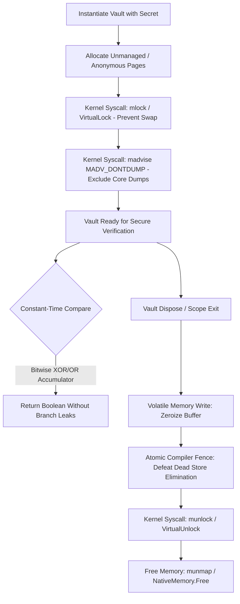

# Week 34: Code Comparison Rosetta - Secure Token Vault

This document provides complete, production-grade, compilable implementations of a **Hardened Cryptographic Secret Vault** (`SecureSecretVault`) in C# (.NET 8/9), Go (1.22+), and Rust (1.75+).

The vault addresses four foundational systems security requirements:
1. **Physical Page Locking:** Locking buffer memory into physical RAM (`mlock` on POSIX, `VirtualLock` on Windows) to prevent the OS kernel from paging secrets out to persistent swap partitions.
2. **Core Dump Exclusion:** Tagging pages with `MADV_DONTDUMP` so process crash minidumps do not persist cryptographic material.
3. **Microarchitectural Timing Attack Immunity:** Implementing constant-time equality validation without early exits or branch-predictor leaks.
4. **Guaranteed Memory Zeroization:** Defeating compiler Dead Store Elimination (DSE) using volatile memory writes and compiler fences upon disposal.



---

## 1. C# Implementation (.NET 8 / .NET 9)

### Project Configuration: `SecureVault.csproj`
```xml
<Project Sdk="Microsoft.NET.Sdk">
  <PropertyGroup>
    <OutputType>Exe</OutputType>
    <TargetFramework>net8.0</TargetFramework>
    <Nullable>enable</Nullable>
    <ImplicitUsings>enable</ImplicitUsings>
    <AllowUnsafeBlocks>true</AllowUnsafeBlocks>
    <Optimize>true</Optimize>
  </PropertyGroup>
</Project>
```

### Complete Source Code: `Program.cs`
```csharp
using System;
using System.Runtime.CompilerServices;
using System.Runtime.InteropServices;
using System.Security.Cryptography;

namespace SecurityForensics.Vault
{
    public sealed unsafe class SecureSecretVault : IDisposable
    {
        private byte* _nativeBuffer;
        private readonly int _capacity;
        private bool _isDisposed;
        private const int MADV_DONTDUMP = 16;

        #region Native OS Imports
        [DllImport("libc", SetLastError = true, EntryPoint = "mlock")]
        private static extern int PosixMlock(void* addr, nuint len);

        [DllImport("libc", SetLastError = true, EntryPoint = "munlock")]
        private static extern int PosixMunlock(void* addr, nuint len);

        [DllImport("libc", SetLastError = true, EntryPoint = "madvise")]
        private static extern int PosixMadvise(void* addr, nuint len, int advice);

        [DllImport("kernel32.dll", SetLastError = true)]
        private static extern bool VirtualLock(IntPtr lpAddress, UIntPtr dwSize);

        [DllImport("kernel32.dll", SetLastError = true)]
        private static extern bool VirtualUnlock(IntPtr lpAddress, UIntPtr dwSize);
        #endregion

        public SecureSecretVault(ReadOnlySpan<byte> secret)
        {
            if (secret.IsEmpty)
                throw new ArgumentException("Secret buffer cannot be empty", nameof(secret));

            _capacity = secret.Length;
            // NativeMemory.AllocZeroed bypasses the GC heap, avoiding ghost copies during compaction.
            _nativeBuffer = (byte*)NativeMemory.AllocZeroed((nuint)_capacity);

            fixed (byte* srcPtr = secret)
            {
                Buffer.MemoryCopy(srcPtr, _nativeBuffer, _capacity, _capacity);
            }
            LockPhysicalMemory();
            ConfigureCoreDumpExclusion();
        }

        private void LockPhysicalMemory()
        {
            if (RuntimeInformation.IsOSPlatform(OSPlatform.Linux) || RuntimeInformation.IsOSPlatform(OSPlatform.OSX))
            {
                if (PosixMlock(_nativeBuffer, (nuint)_capacity) != 0)
                    Console.Error.WriteLine($"[WARN] mlock failed: {Marshal.GetLastPInvokeError()} (Check RLIMIT_MEMLOCK)");
            }
            else if (RuntimeInformation.IsOSPlatform(OSPlatform.Windows))
            {
                if (!VirtualLock((IntPtr)_nativeBuffer, (UIntPtr)_capacity))
                    Console.Error.WriteLine($"[WARN] VirtualLock failed: {Marshal.GetLastPInvokeError()}");
            }
        }

        private void ConfigureCoreDumpExclusion()
        {
            if (RuntimeInformation.IsOSPlatform(OSPlatform.Linux))
                PosixMadvise(_nativeBuffer, (nuint)_capacity, MADV_DONTDUMP);
        }

        [MethodImpl(MethodImplOptions.NoInlining | MethodImplOptions.NoOptimization)]
        public bool ConstantTimeVerify(ReadOnlySpan<byte> candidateToken)
        {
            ThrowIfDisposed();
            if (candidateToken.Length != _capacity) return false;

            ReadOnlySpan<byte> secretSpan = new ReadOnlySpan<byte>(_nativeBuffer, _capacity);
            return CryptographicOperations.FixedTimeEquals(secretSpan, candidateToken);
        }

        [MethodImpl(MethodImplOptions.NoInlining | MethodImplOptions.NoOptimization)]
        public static bool ManualConstantTimeCompare(ReadOnlySpan<byte> a, ReadOnlySpan<byte> b)
        {
            if (a.Length != b.Length) return false;
            int accumulator = 0;
            for (int i = 0; i < a.Length; i++)
            {
                // Bitwise XOR yields 0 if matched; OR accumulates differences branchlessly.
                accumulator |= a[i] ^ b[i];
            }
            return accumulator == 0;
        }

        private void ThrowIfDisposed()
        {
            if (_isDisposed)
                throw new ObjectDisposedException(nameof(SecureSecretVault), "Vault has been zeroized.");
        }

        private void Dispose(bool disposing)
        {
            if (_isDisposed) return;
            if (_nativeBuffer != null)
            {
                Span<byte> memorySpan = new Span<byte>(_nativeBuffer, _capacity);
                // Guaranteed by RyuJIT intrinsic to not be deleted by Dead Store Elimination (DSE).
                CryptographicOperations.ZeroMemory(memorySpan);

                if (RuntimeInformation.IsOSPlatform(OSPlatform.Linux) || RuntimeInformation.IsOSPlatform(OSPlatform.OSX))
                    PosixMunlock(_nativeBuffer, (nuint)_capacity);
                else if (RuntimeInformation.IsOSPlatform(OSPlatform.Windows))
                    VirtualUnlock((IntPtr)_nativeBuffer, (UIntPtr)_capacity);

                NativeMemory.Free(_nativeBuffer);
                _nativeBuffer = null;
            }
            _isDisposed = true;
        }

        public void Dispose()
        {
            Dispose(true);
            GC.SuppressFinalize(this);
        }

        ~SecureSecretVault() => Dispose(false);
    }

    class Program
    {
        static void Main()
        {
            Console.WriteLine("=== [C#] Secure Secret Vault Demo ===");
            byte[] sensitiveKey = new byte[16] { 0x4B, 0x65, 0x79, 0x56, 0x61, 0x6C, 0x75, 0x65, 0x31, 0x32, 0x33, 0x34, 0x35, 0x36, 0x37, 0x38 };

            using (var vault = new SecureSecretVault(sensitiveKey))
            {
                CryptographicOperations.ZeroMemory(sensitiveKey);
                byte[] candidateValid = new byte[16] { 0x4B, 0x65, 0x79, 0x56, 0x61, 0x6C, 0x75, 0x65, 0x31, 0x32, 0x33, 0x34, 0x35, 0x36, 0x37, 0x38 };
                byte[] candidateInvalid = new byte[16] { 0x4B, 0x65, 0x79, 0x56, 0x61, 0x6C, 0x75, 0x65, 0x31, 0x32, 0x33, 0x34, 0x35, 0x36, 0x37, 0x39 };

                bool isValid = vault.ConstantTimeVerify(candidateValid);
                bool isInvalid = vault.ConstantTimeVerify(candidateInvalid);

                Console.WriteLine($"Token 1 Verification (Valid):   {isValid}   (Expected: True)");
                Console.WriteLine($"Token 2 Verification (Invalid): {isInvalid} (Expected: False)");

                CryptographicOperations.ZeroMemory(candidateValid);
                CryptographicOperations.ZeroMemory(candidateInvalid);
            }
            Console.WriteLine("Vault successfully wiped and disposed.\n");
        }
    }
}
```
**Build and Run (C#):**
```bash
dotnet run -c Release
```

---

## 2. Go Implementation (Go 1.22+)

### Project Configuration: `go.mod`
```text
module security_vault

go 1.22
```

### Complete Source Code: `main.go`
```go
package main

import (
	"crypto/subtle"
	"errors"
	"fmt"
	"runtime"
	"sync"
	"syscall"
	"unsafe"
)

const MADV_DONTDUMP = 16

type SecureSecretVault struct {
	mu       sync.RWMutex
	buffer   []byte
	isClosed bool
}

func NewSecureSecretVault(secret []byte) (*SecureSecretVault, error) {
	if len(secret) == 0 {
		return nil, errors.New("secret cannot be empty")
	}
	length := len(secret)
	buf := make([]byte, length)
	copy(buf, secret)

	// mlock locks memory into physical RAM to prevent OS swapping to disk (kswapd)
	if err := syscall.Mlock(buf); err != nil {
		fmt.Printf("[WARN] syscall.Mlock failed: %v (Check RLIMIT_MEMLOCK)\n", err)
	}

	// madvise MADV_DONTDUMP omits this page if the process core dumps
	if len(buf) > 0 {
		ptr := unsafe.Pointer(&buf[0])
		_, _, _ = syscall.Syscall(syscall.SYS_MADVISE, uintptr(ptr), uintptr(length), uintptr(MADV_DONTDUMP))
	}

	vault := &SecureSecretVault{buffer: buf}
	runtime.SetFinalizer(vault, func(v *SecureSecretVault) {
		_ = v.Close()
	})
	return vault, nil
}

func (v *SecureSecretVault) ConstantTimeVerify(candidateToken []byte) (bool, error) {
	v.mu.RLock()
	defer v.mu.RUnlock()

	if v.isClosed {
		return false, errors.New("vault has already been zeroized and closed")
	}
	// crypto/subtle.ConstantTimeCompare returns 1 if slices match, 0 otherwise.
	return subtle.ConstantTimeCompare(v.buffer, candidateToken) == 1, nil
}

func WipeMemory(b []byte) {
	for i := range b {
		b[i] = 0
	}
	// runtime.KeepAlive ensures Dead Store Elimination does not delete the wipe loop.
	runtime.KeepAlive(b)
}

func (v *SecureSecretVault) Close() error {
	v.mu.Lock()
	defer v.mu.Unlock()

	if v.isClosed {
		return nil
	}
	if len(v.buffer) > 0 {
		WipeMemory(v.buffer)
		_ = syscall.Munlock(v.buffer)
		v.buffer = nil
	}
	v.isClosed = true
	runtime.SetFinalizer(v, nil)
	return nil
}

func main() {
	fmt.Println("=== [Go] Secure Secret Vault Demo ===")
	sensitiveKey := []byte{0x4B, 0x65, 0x79, 0x56, 0x61, 0x6C, 0x75, 0x65, 0x31, 0x32, 0x33, 0x34, 0x35, 0x36, 0x37, 0x38}

	vault, err := NewSecureSecretVault(sensitiveKey)
	if err != nil {
		panic(err)
	}
	WipeMemory(sensitiveKey)

	candidateValid := []byte{0x4B, 0x65, 0x79, 0x56, 0x61, 0x6C, 0x75, 0x65, 0x31, 0x32, 0x33, 0x34, 0x35, 0x36, 0x37, 0x38}
	candidateInvalid := []byte{0x4B, 0x65, 0x79, 0x56, 0x61, 0x6C, 0x75, 0x65, 0x31, 0x32, 0x33, 0x34, 0x35, 0x36, 0x37, 0x39}

	validMatch, _ := vault.ConstantTimeVerify(candidateValid)
	invalidMatch, _ := vault.ConstantTimeVerify(candidateInvalid)

	fmt.Printf("Token 1 Verification (Valid):   %v (Expected: true)\n", validMatch)
	fmt.Printf("Token 2 Verification (Invalid): %v (Expected: false)\n", invalidMatch)

	WipeMemory(candidateValid)
	WipeMemory(candidateInvalid)
	_ = vault.Close()
	fmt.Println("Vault successfully wiped and closed.\n")
}
```
**Build and Run (Go):**
```bash
go run main.go
```

---

## 3. Rust Implementation (Rust 1.75+)

### Project Configuration: `Cargo.toml`
```toml
[package]
name = "secure_vault"
version = "0.1.0"
edition = "2021"

[dependencies]
libc = "0.2"
subtle = "2.5"
zeroize = { version = "1.7", features = ["zeroize_derive"] }

[profile.release]
opt-level = 3
lto = true
codegen-units = 1
```

### Complete Source Code: `src/main.rs`
```rust
use std::ptr::NonNull;
use std::sync::atomic::{compiler_fence, Ordering};
use subtle::{Choice, ConstantTimeEq};
use zeroize::Zeroize;

pub struct SecureSecretVault {
    ptr: NonNull<u8>,
    len: usize,
}

unsafe impl Send for SecureSecretVault {}
unsafe impl Sync for SecureSecretVault {}

impl SecureSecretVault {
    pub fn new(secret: &[u8]) -> Result<Self, &'static str> {
        if secret.is_empty() {
            return Err("Secret buffer cannot be empty");
        }
        let len = secret.len();

        unsafe {
            // MAP_ANONYMOUS | MAP_PRIVATE bypasses the standard heap allocator (e.g. jemalloc)
            let raw_ptr = libc::mmap(
                std::ptr::null_mut(),
                len,
                libc::PROT_READ | libc::PROT_WRITE,
                libc::MAP_PRIVATE | libc::MAP_ANONYMOUS,
                -1,
                0,
            );

            if raw_ptr == libc::MAP_FAILED {
                return Err("Failed to allocate anonymous memory page via mmap");
            }
            let ptr = NonNull::new(raw_ptr as *mut u8).expect("mmap returned non-null pointer");

            if libc::mlock(raw_ptr, len) != 0 {
                eprintln!("[WARN] libc::mlock failed; continuing with unpinned memory");
            }
            libc::madvise(raw_ptr, len, libc::MADV_DONTDUMP);
            std::ptr::copy_nonoverlapping(secret.as_ptr(), ptr.as_ptr(), len);

            Ok(Self { ptr, len })
        }
    }

    #[inline]
    pub fn as_slice(&self) -> &[u8] {
        unsafe { std::slice::from_raw_parts(self.ptr.as_ptr(), self.len) }
    }

    pub fn constant_time_verify(&self, candidate: &[u8]) -> bool {
        if candidate.len() != self.len {
            return false;
        }
        let choice: Choice = self.as_slice().ct_eq(candidate);
        choice.into()
    }
}

impl Drop for SecureSecretVault {
    fn drop(&mut self) {
        unsafe {
            let slice = std::slice::from_raw_parts_mut(self.ptr.as_ptr(), self.len);

            // 1. Volatile write defeats LLVM Dead Store Elimination
            for byte in slice.iter_mut() {
                std::ptr::write_volatile(byte, 0);
            }
            // 2. Compiler fence prevents reordering munmap before writes complete
            compiler_fence(Ordering::SeqCst);
            libc::munlock(self.ptr.as_ptr() as *mut libc::c_void, self.len);
            libc::munmap(self.ptr.as_ptr() as *mut libc::c_void, self.len);
        }
    }
}

fn main() {
    println!("=== [Rust] Secure Secret Vault Demo ===");
    let mut sensitive_key = [0x4B, 0x65, 0x79, 0x56, 0x61, 0x6C, 0x75, 0x65, 0x31, 0x32, 0x33, 0x34, 0x35, 0x36, 0x37, 0x38];

    let vault = match SecureSecretVault::new(&sensitive_key) {
        Ok(v) => v,
        Err(e) => panic!("Initialization failed: {}", e),
    };
    sensitive_key.zeroize();

    let mut candidate_valid = [0x4B, 0x65, 0x79, 0x56, 0x61, 0x6C, 0x75, 0x65, 0x31, 0x32, 0x33, 0x34, 0x35, 0x36, 0x37, 0x38];
    let mut candidate_invalid = [0x4B, 0x65, 0x79, 0x56, 0x61, 0x6C, 0x75, 0x65, 0x31, 0x32, 0x33, 0x34, 0x35, 0x36, 0x37, 0x39];

    let valid_result = vault.constant_time_verify(&candidate_valid);
    let invalid_result = vault.constant_time_verify(&candidate_invalid);

    println!("Token 1 Verification (Valid):   {} (Expected: true)", valid_result);
    println!("Token 2 Verification (Invalid): {} (Expected: false)", invalid_result);

    candidate_valid.zeroize();
    candidate_invalid.zeroize();
    drop(vault);
    println!("Vault successfully dropped and physical memory wiped.\n");
}
```
**Build and Run (Rust):**
```bash
cargo run --release
```

---

## 4. Assembly Verification & Compiler Inspection

To verify that the constant-time comparison loop is branchless and that zeroization is not removed by Dead Store Elimination, inspect the generated assembly via `objdump -d` or Godbolt.

### Constant-Time Assembly Inspection (x86-64 Rust `ct_eq`)
Compiled with `rustc -O --emit asm`:

```text
secure_compare:
    xor     eax, eax                    ; eax = accumulator = 0
    xor     ecx, ecx                    ; ecx = loop index = 0
.LBB0_1:
    movzx   edx, byte ptr [rdi + rcx]   ; Load candidate byte
    xor     dl, byte ptr [rsi + rcx]    ; dl = dl ^ secret_byte
    movzx   edx, dl                     ; Zero-extend
    or      eax, edx                    ; Accumulator |= difference (NO BRANCH!)
    inc     rcx                         ; Increment index
    cmp     rcx, r8                     ; Compare with length
    jne     .LBB0_1                     ; Branch depends ONLY on index, NOT secret data!
    test    eax, eax                    ; Test accumulator
    sete    al                          ; Return 1 if accum == 0, else 0
    ret
```
> [!NOTE]
> The conditional jump `jne .LBB0_1` depends strictly on index counter `rcx` reaching buffer length `r8`. **There is not a single conditional branch based on secret content.** Execution latency is strictly invariant to secret data.

### Volatile Zeroization Assembly Inspection
```text
secure_zero_loop:
    xor     eax, eax
.LBB1_1:
    mov     byte ptr [rdi + rax], 0     ; MOV emitted due to write_volatile!
    inc     rax
    cmp     rax, rsi
    jne     .LBB1_1
    mfence                              ; Memory fence barrier emitted
    ret
```
Without `write_volatile`, LLVM's DSE pass deletes this loop, collapsing the destructor into an empty `ret`.

---

## 5. Sanitizer Build Flags and Verification Commands

### C# (.NET Native AOT & AddressSanitizer)
```bash
# Publish with Native AOT and native debugging symbols
dotnet publish -r linux-x64 -c Release /p:PublishAot=true /p:StripSymbols=false

# Run under Valgrind to verify no unmanaged memory leaks occurred from NativeMemory.Alloc
valgrind --leak-check=full ./bin/Release/net8.0/linux-x64/publish/SecureVault
```

### Go (Race Detector & Sanitizer Flags)
```bash
# Run with the ThreadSanitizer race detector
go test -race ./...

# Compile with boundary-check elimination logging
go build -gcflags=all="-d=ssa/check_bce=1" -o vault_bin main.go

# Run with AddressSanitizer via CGo
CGO_ENABLED=1 CC=clang go run -msan main.go
```

### Rust (Miri and LLVM AddressSanitizer)
```bash
# 1. Run Miri to verify Stacked Borrows, pointer provenance, and alignment invariants
cargo +nightly miri test

# 2. Compile and run with AddressSanitizer to detect buffer overruns and use-after-free
RUSTFLAGS="-Zsanitizer=address" cargo +nightly test --target x86_64-unknown-linux-gnu

# 3. Compile with MemorySanitizer to catch reads of uninitialized memory
RUSTFLAGS="-Zsanitizer=memory -Zsanitizer-memory-track-origins" \
    cargo +nightly test --target x86_64-unknown-linux-gnu
```

---

## Critical Observations for C# Developers

### 1. RAII Determinism vs Garbage Collection Finalizers
In C#, `IDisposable` cleanup is purely cooperative: the developer *must* use a `using` statement or call `.Dispose()`. If omitted, the object drops to the GC finalizer thread, which runs non-deterministically seconds or minutes later, leaving keys vulnerable in RAM. In Rust, RAII via `Drop` is **deterministic and compiler-enforced**. As soon as the vault falls out of lexical scope, the destructor executes, volatile zeroing runs, and the virtual memory page is unmapped.

### 2. The Danger of GC Object Relocation
Our C# implementation used `NativeMemory.AllocZeroed` rather than a managed `byte[]`. If you allocate `new byte[16]` on the managed heap and later call `CryptographicOperations.ZeroMemory()`, you only clear the *current* address. If a Gen 0 garbage collection compaction relocated the array while it was active, the CLR copied the bytes to Gen 1 and abandoned the old segment without zeroing it. The plaintext secret remains intact in unmanaged GC heap debris until overwritten.

### 3. Compiler Intrinsics and Volatile Semantics
In C#, `CryptographicOperations.ZeroMemory` relies on a runtime internal call that bypasses JIT optimizations. In Go, lacking a public `volatile` keyword, developers must combine loops with `runtime.KeepAlive()` or invoke internal assembly routines. Rust provides `std::ptr::write_volatile` directly in the core standard library, allowing fine-grained control over microarchitectural memory writes without needing external runtime magic.

### 4. Direct Kernel Paging Control
In C# and Go, interacting with kernel paging primitives (`mlock`, `MADV_DONTDUMP`) requires foreign function interfaces (`[DllImport]` or `syscall.Syscall`) that break type safety and require platform-specific conditional branching. In Rust, zero-cost bindings in the `libc` crate integrate seamlessly with RAII pointer wrappers like `NonNull<u8>`, enabling high-assurance memory hardening with zero runtime overhead.
