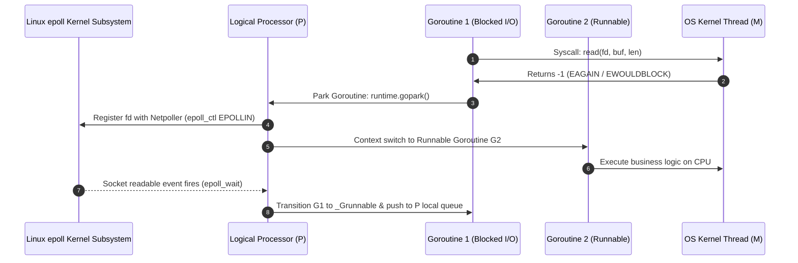
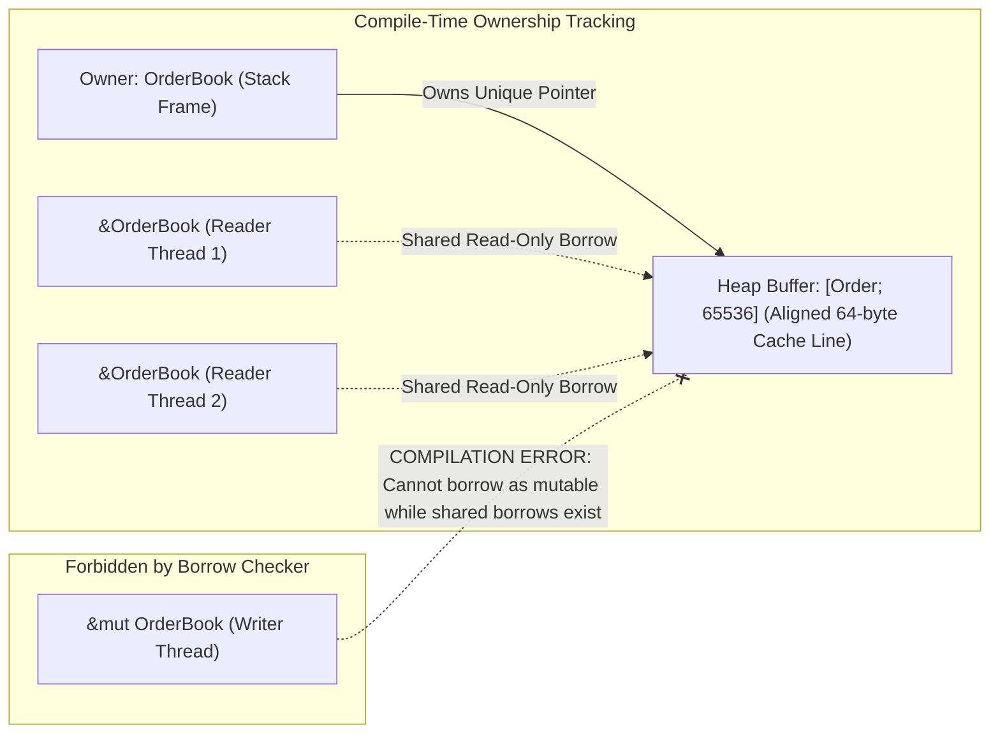
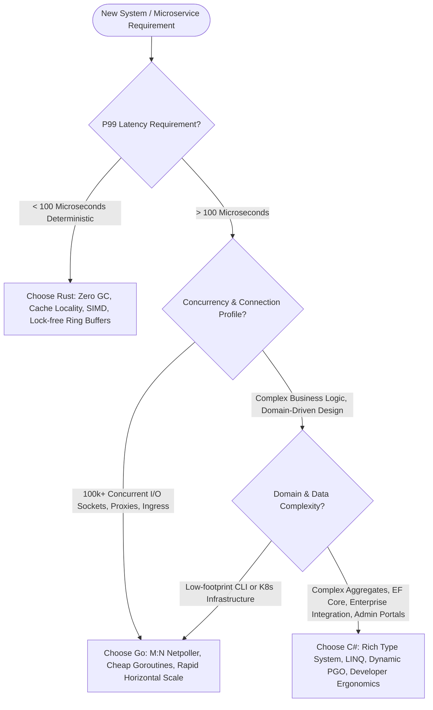
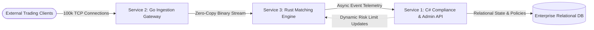

# Week 35: The Grand Polyglot Architecture & Systems Synthesis

## Why This Week Matters for Your Career Transition
For the past 34 weeks, you have systematically deconstructed the computing stack: from CPU cache hierarchies and low-level Linux syscalls to lock-free ring buffers, custom arena allocators, cryptographic forensics, and async state machine internals. You have dismantled the convenient abstractions of the .NET Common Language Runtime (CLR), peeled back Go’s runtime scheduler, and submitted your design patterns to the uncompromising scrutiny of Rust’s affine type system. 

Now you stand at the pivotal transition point of your career: crossing the chasm from a Senior C# (.NET) Engineer into a **Principal Polyglot Systems Architect**. 

At this executive engineering tier, success is no longer measured by how quickly you can scaffold a CRUD controller or configure an ORM. It is defined by your capacity to make rigorous, irreversible architectural decisions that determine whether an enterprise platform scales deterministically to millions of transactions per second or collapses under unpredictable tail latency and operational cost. If you advocate for Rust across an entire enterprise estate, you will drown your engineering organization in compile-time borrow-checker battles and cripple feature velocity. If you build ultra-low-latency financial matching engines in Go or C#, you will battle non-deterministic garbage collection pauses that violate client Service Level Agreements (SLAs). If you relegate C# exclusively to legacy internal tools, you ignore the extraordinary throughput of modern .NET 8/9 Dynamic PGO, NativeAOT, and unmanaged memory intrinsics.

By the end of this week, you will possess a battle-tested **Polyglot Systems Synthesis Framework**. You will understand precisely how the runtime engines of C#, Go, and Rust execute instructions against hardware, how their memory allocators interact with the OS virtual memory subsystem, and how to compose them into a unified, high-performance distributed microservices ecosystem.

---

## 1. Deep Runtime Mechanics: C# as the Architectural Baseline

To choose when to deviate from the CLR, you must first master the exact mechanical cost of what .NET does on your behalf.

```mermaid
flowchart TD
    subgraph CLR_Runtime [C# .NET 8/9 CoreCLR Architecture]
        IL[CIL Bytecode] --> JIT[Tiered JIT: Tier 0 / Tier 1 / Dynamic PGO]
        JIT --> MachineCode[Native x86_64 / ARM64 Machine Code]
        MachineCode --> AppExec[Application Execution Hot Path]
        AppExec --> GenGC[Generational Tracing GC: Gen 0, Gen 1, Gen 2]
        AppExec --> LOH_POH[Large Object Heap >= 85KB / Pinned Object Heap]
        AppExec --> TP[ThreadPool: Global Queue + Per-Core Work-Stealing Queues]
    end

    subgraph Go_Runtime [Go 1.22+ Runtime Architecture]
        GoSource[Go Source Code] --> GoComp[Compiler & Escape Analysis Pass]
        GoComp --> GoBin[Statically Linked ELF Binary]
        GoBin --> M_N[M:N Scheduler: G, M, P Work-Stealing]
        M_N --> TriColorGC[Concurrent Mark-Sweep: TCMalloc-style Arenas]
        TriColorGC --> NetPoller[OS epoll / kqueue Netpoller Integration]
    end

    subgraph Rust_Runtime [Rust 1.78+ Zero-Cost Abstractions]
        RustSource[Rust Source Code] --> BorrowCheck[Affine Type System & Lifetime Analysis]
        BorrowCheck --> LLVM[LLVM Optimization & Monomorphization]
        LLVM --> BareMetal[Bare Metal Machine Code: Zero Runtime / Zero GC]
        BareMetal --> ManualAlloc[Global / Custom Allocator: jemalloc, mimalloc]
        BareMetal --> TokioEngine[Optional Cooperative Polling Async: Tokio / io_uring]
    end
```



### The C# (.NET CoreCLR) Execution Mechanics
In .NET 8 and 9, C# compiles to Common Intermediate Language (CIL). At runtime, CoreCLR employs a sophisticated **Tiered Compilation** pipeline:
1. **Tier 0 (Quick JIT):** Code is compiled with minimal optimization to minimize startup time and warm-up latency. Instrumentation stubs are inserted to record execution counts and branch profiles.
2. **Tier 1 (Optimized JIT):** Once a method passes an execution threshold (typically 30 invocations), the JIT compiler re-analyzes the method, performing loop unrolling, devirtualization, and dead-code elimination.
3. **Dynamic PGO (Profile-Guided Optimization):** The runtime monitors the actual concrete types flowing through interface dispatch calls. If an interface `ITradeProcessor` is resolved to `HighFrequencyTradeProcessor` 99.8% of the time, the JIT inlines the concrete call site with a single guarded type check, completely eliminating virtual method table (`vtable`) dereferencing overhead.

#### Memory Management: The Generational Compacting Collector
CoreCLR utilizes a tracing, generational, compacting garbage collector:
- **Generation 0 (Gen 0):** Ephemeral allocations allocated via a Thread Allocation Context (TAC) bump pointer. Short-lived objects (e.g., DTOs, temporary strings) are collected in sub-millisecond sweeps.
- **Generation 1 (Gen 1):** Acts as an aging buffer between ephemeral objects and long-lived objects.
- **Generation 2 (Gen 2):** Long-lived allocations (caches, static singletons, active database connections).
- **Large Object Heap (LOH):** Objects exceeding 85,000 bytes bypass Gen 0 and land directly here to prevent high-cost memory moves. LOH is rarely compacted by default, leading to virtual address space fragmentation unless explicitly swept or configured.
- **Pinned Object Heap (POH):** Dedicated heap introduced to isolate pinned memory (e.g., byte buffers passed to OS native sockets), eliminating fragmentation in Gen 0/1/2.

#### CoreCLR Internal Data Structures: Card Tables and Brick Tables
To collect Gen 0 and Gen 1 without scanning the entire Gen 2 heap, the CLR maintains a **Card Table**. The card table is a bit array where each byte represents a 512-byte region of the managed heap. Whenever a reference inside an older generation object is updated to point to a younger object (e.g., `gen2Object.Child = new Gen0Object()`), the JIT injects a write barrier:
```asm
; CoreCLR Card Table Write Barrier (x86_64)
mov [rax], rdx          ; Store object reference into gen2 field
shr rax, 9              ; Divide target address by 512 to find card index
mov r8, g_card_table    ; Load base address of card table
mov byte ptr [r8+rax], 0xFF ; Mark card byte as dirty
```
During a Gen 0/1 collection, the GC scans only dirty cards to discover cross-generational roots. However, during Gen 2 collections, the engine must perform a full sweep. If compaction occurs, **Brick Tables** (which map 2KB heap segments to the lowest object in the segment) are consulted to compute target relocation addresses, and every pointer in the application is updated while managed threads remain stopped.

#### The ThreadPool Hill-Climbing Algorithm
The .NET ThreadPool manages concurrency using a global FIFO queue and per-core work-stealing local LIFO queues. To determine the optimal number of OS threads, the CLR uses a mathematical **Hill-Climbing Algorithm**. Every 500 milliseconds, it measures task completion throughput versus thread count. If injecting a thread increases throughput, it adds another; if throughput drops due to context switching overhead, it terminates threads.
*The Critical Failure Mode:* If application code executes blocking synchronous calls (`.Result`, `.Wait()`, or blocking I/O) on ThreadPool worker threads, the Hill-Climbing algorithm reacts sluggishly—injecting only 1–2 threads per second. This triggers **ThreadPool Starvation**, causing catastrophic request queuing and multi-second P99 latency spikes.

---

## 2. The Go Approach: Massive Concurrency and Low-Latency Mark-Sweep

Go explicitly rejects the generational hypothesis, card tables, and memory compaction in favor of predictable, bounded pause times and massive I/O multiplexing.

### The M:N Work-Stealing Scheduler Internals
The Go runtime manages concurrency through three foundational abstractions:
- **G (Goroutine):** A lightweight execution context with a dynamically resizing stack (starting at 2 KB, expanding contiguously up to 1 GB on 64-bit systems).
- **M (Machine):** An operating system thread created and managed by the OS kernel.
- **P (Processor):** A logical context representing the resource required to execute Go code (defaulting to `GOMAXPROCS`).

Each `P` owns a 256-element lock-free circular runqueue. When a goroutine creates another (`go func()`), the new `G` is placed into the local runqueue of the current `P`. If the local queue is full, half of its goroutines are offloaded to a global runqueue guarded by a mutex.



#### Preemption and the Sysmon Thread
Prior to Go 1.14, Go relied on cooperative preemption: a goroutine could only be preempted at function prologues where stack-split checks (`runtime.morestack`) occurred. A tight loop like `for {}` without function calls would lock the `P` indefinitely.
In modern Go (1.14+), the background **`sysmon`** (system monitor) thread runs without an assigned `P`. If `sysmon` detects that a goroutine has been running uninterrupted on a `P` for more than 10 milliseconds, it injects an asynchronous POSIX OS signal: **`SIGURG`**. The signal handler intercepts the instruction pointer of the executing thread and forces a context switch to `runtime.asyncPreempt`, saving CPU registers and returning the goroutine to the runqueue.

### The TCMalloc-Style Allocator and Tri-Color Collector
Go’s memory allocator is modeled after Google’s TCMalloc:
- Memory is organized into 67 distinct **Size Classes** (ranging from 8 bytes to 32 KB).
- Each `P` owns an **`mcache`**, an un-synchronized local arena of allocation spans (`mspan`). Small allocations bump-allocate directly within the `mcache` without locks.
- When an `mspan` is exhausted, the `P` fetches a new span from the global **`mcentral`** (protected by fine-grained per-size-class spinlocks). Large allocations (>32 KB) bypass size classes and allocate directly from **`mheap`**.

#### Non-Generational Concurrent Mark-Sweep with Hybrid Write Barrier
Go does **not** compact memory. It uses a **Concurrent Tri-Color Mark-Sweep** algorithm:
1. **White:** Unvisited objects (candidates for reclamation).
2. **Grey:** Objects visited, but whose child references have not yet been scanned.
3. **Black:** Objects visited whose child references are guaranteed to be scanned.

Go enforces the **Hybrid Write Barrier** (Dijkstra + Steele):
```go
// Conceptual runtime representation of Go's Hybrid Write Barrier
func writeBarrier(slot *unsafe.Pointer, ptr unsafe.Pointer) {
    shade(*slot) // Shade the old object being overwritten to grey
    shade(ptr)   // Shade the new object being stored to grey
    *slot = ptr  // Execute actual memory write
}
```
Because the write barrier guarantees that no white object can be referenced by a black object without passing through grey, Go avoids generational card tables entirely. As a result, Stop-The-World (STW) pauses are restricted to two micro-phases:
- **Sweep Termination STW:** Acknowledges the end of the previous cycle (< 20 microseconds).
- **Mark Termination STW:** Flushes remaining processor work buffers (< 80 microseconds).

*The Trade-off:* Because Go does not compact memory, long-lived server heaps experience spatial fragmentation. Furthermore, because every living object on the heap must be traced during every collection cycle, Go expends **20% to 25% of continuous background CPU overhead** solely to keep GC pause times below 1 millisecond.

---

## 3. The Rust Approach: Zero-Cost Abstractions and Compile-Time Affine Types

Rust abandons managed runtimes, background threads, and garbage collection entirely.

### The Affine Type System and Ownership Invariants
Rust enforces memory safety through mathematical rules verified entirely at compile time:
1. **Each value in Rust has an owner.**
2. **There can only be one owner at a time.**
3. **When the owner goes out of scope, the value is dropped.**

Borrowing is governed by the fundamental **Aliasing XOR Mutability** invariant:
$$\text{Safety} \iff (\&T \times N) \lor (\&mut\ T \times 1)$$
You may have an arbitrary number of immutable references (`&T`) to a memory location, **OR** you may have exactly one mutable reference (`&mut T`), but never both simultaneously within the same lifetime scope. This single invariant mathematically eradicates:
- Data races at compile time.
- Iterator invalidation bugs.
- Use-after-free conditions.
- Double-free conditions.



### Deterministic Destruction (RAII) and Drop Flags
In C# and Go, resource cleanup relies on finalizers, `IDisposable`, or `defer`. If a developer forgets to invoke `Dispose()`, unmanaged resources linger until the garbage collector discovers them.

In Rust, cleanup is immediate, deterministic, and structural through the `Drop` trait. When a variable exits its lexical scope, the compiler emits a direct invocation of `Drop::drop()`. Stack memory is popped in a single CPU instruction (subtraction of the stack pointer register `rsp`). Heap memory allocated via `Box<T>`, `Vec<T>`, or custom arena allocators is deallocated the instant ownership terminates.

If a type implements `Drop` and is moved conditionally inside branches, the Rust compiler injects a 1-byte **Drop Flag** on the stack frame to track whether the value was moved, ensuring the destructor is called exactly once without requiring any runtime metadata.

### The Tokio Cooperative Polling Async Engine
Unlike C# (where tasks are scheduled onto a runtime ThreadPool immediately upon creation) and Go (where goroutines are preempted by OS signals), Rust’s async model is **completely lazy and zero-allocation**:
- A Rust `async fn` compiles into an anonymous `enum` state machine implementing `Future<Output = T>`.
- The future performs **no work** until explicitly polled via `poll(Pin<&mut Self>, &mut Context<'_>) -> Poll<T>`.
- When an asynchronous I/O operation returns `Pending`, Tokio registers the file descriptor with Linux `epoll` and registers a **`Waker`**.
- When `epoll_wait` notifies Tokio that data is ready, the waker pushes the specific task ID into Tokio’s lock-free local work-stealing queue.
- To prevent tasks from starving others, Tokio enforces a **Cooperative Task Budget**: after 128 poll iterations, a task is forcibly yielded, allowing fair execution across all concurrent tasks.

---

## 4. Assembly & Compilation Forensics: Under the Hood of Code Generation

A systems architect must be able to look through source code to the generated assembly. Consider a hot loop calculating a checksum across an array of financial prices:

```
; -------------------------------------------------------------
; Rust (LLVM -O3) Output: Full AVX2 Vectorization
; -------------------------------------------------------------
.LBB0_4:
    vmovdqu ymm1, ymmword ptr [rdi + 4*rax]
    vpaddd  ymm0, ymm1, ymm0          ; 8 operations per single CPU cycle!
    add     rax, 8
    cmp     rdx, rax
    jne     .LBB0_4
    vzeroupper
    ret

; -------------------------------------------------------------
; C# RyuJIT Output: Unrolled Scalar Loop + Bounds Check Elimination
; -------------------------------------------------------------
M00_L01:
    add     eax, dword ptr [rcx+rdx*4+10h] ; Explicit offset for CoreCLR array header
    inc     edx
    cmp     edx, r8d
    jl      short M00_L01

; -------------------------------------------------------------
; Go 6g Output: Conservative Bounds Checks Injected
; -------------------------------------------------------------
loop:
    cmp     rax, rbx
    jae     panic_index_out_of_bounds      ; Runtime safety check per element
    movsxd  rcx, dword ptr [rsi+rax*4]
    add     rdx, rcx
    inc     rax
    cmp     rax, rbx
    jl      loop
```

- **Rust (LLVM):** Applies aggressive loop vectorization via AVX2/AVX-512, processing 8 or 16 integers simultaneously with zero runtime bounds checks because slice bounds are proven by the compiler.
- **C# (RyuJIT Tier 1):** Eliminates bounds checks when loop invariants match `array.Length`, but vectorization requires explicit `Vector256<int>` hardware intrinsics unless auto-vectorizer heuristics trigger. Object reference headers (16 bytes) introduce offset arithmetic (`[rcx+rdx*4+10h]`).
- **Go (gc compiler):** Favors fast compilation speed over peak optimization. It frequently retains branch checks inside loops unless bounds-check elimination (`BCE`) can trivially prove non-overflow. Vectorization is largely omitted unless manually authored in assembly (`.s` files).

---

## 5. Foreign Function Interface (FFI) and System Interoperability

When building polyglot architectures, crossing language boundaries introduces measurable latency:

```mermaid
flowchart LR
    subgraph CSharp_Interop [C# P/Invoke Boundary]
        CS[Managed C# App] -->|UnmanagedCallersOnly| CS_Pin[Pin Managed Buffers / Stack Alloc]
        CS_Pin -->|P/Invoke Transition: ~10ns| NativeC[C-ABI Native DLL]
    end

    subgraph Go_Cgo_Boundary [Go Cgo Boundary]
        Goroutine[Goroutine Stack: 2KB] -->|runtime.cgocall: ~120ns| CgoSwitch[Switch to 2MB OS Thread Stack]
        CgoSwitch --> NativeLib[Native C Dynamic Library]
        NativeLib -->|runtime.cgocallback| Goroutine
    end

    subgraph Rust_FFI [Rust FFI Boundary]
        RustApp[Rust Application Code] -->|extern "C": 0ns Overhead| CLib[Native C Shared Object]
    end
```

### The Cgo Context-Switch Tax
In Go, calling a C function via Cgo is **not** a direct jump instruction. Because goroutines operate on dynamically resizing 2 KB stacks, Go must:
1. Allocate or locate an operating system thread with a standard 2 MB stack.
2. Execute `runtime.cgocall`, copying arguments, updating goroutine status from `_Grunning` to `_Gsyscall`.
3. Transfer execution to the native library.
4. Execute `runtime.cgocallback` upon completion to re-enter the Go M:N scheduler.
*The Consequence:* A Cgo invocation costs **100 to 200 nanoseconds**. If executed in a loop processing 1,000,000 packets per second, Cgo overhead alone consumes 150 milliseconds of pure CPU overhead.

### C# P/Invoke and Function Pointers
In modern .NET 8/9, P/Invoke has evolved:
- Using `[LibraryImport]` (source-generated P/Invoke) eliminates runtime IL stub generation.
- Blittable types (types with identical memory representation in managed and unmanaged memory, e.g., `int`, `byte`, fixed structs) can be passed directly via managed pointers (`Span<T>`).
- Function pointers (`delegate* unmanaged[Cdecl]<int, void>`) execute near-native transitions with only ~5 to 10 nanoseconds of overhead.

### Rust: Pure Zero-Cost C-ABI
Rust shares the standard platform Application Binary Interface (System V AMD64 ABI on Linux). An `extern "C"` call in Rust compiles down to a single x86_64 `call` instruction. The overhead is **strictly 0 nanoseconds** beyond the hardware cost of the branch itself.

---

## 6. The Systems Philosophy of the Polyglot Architect

### Mechanical Sympathy: Designing for the Micro-Architecture
The term **Mechanical Sympathy**—coined by racing driver Jackie Stewart and applied to software engineering by Martin Thompson—states that software executes with maximum efficiency when it aligns with the underlying physical hardware.

```
+---------------------------------------------------------------+
|                      CPU Core (x86_64)                        |
|  +--------------------+  +---------------------------------+  |
|  | L1 Instruction     |  | L1 Data Cache (32KB, 64B lines) |  |
|  | Cache (32KB)       |  | Access: ~1.0 ns (4-5 cycles)    |  |
|  +--------------------+  +---------------------------------+  |
|                                                               |
|  +---------------------------------------------------------+  |
|  | L2 Unified Cache (512KB - 1MB, 64-byte cache lines)     |  |
|  | Access: ~3.5 ns (14 cycles)                             |  |
|  +---------------------------------------------------------+  |
+---------------------------------------------------------------+
                               |
+---------------------------------------------------------------+
| Shared L3 Cache (16MB - 64MB) - Access: ~12 ns (40-50 cycles) |
+---------------------------------------------------------------+
                               |
+---------------------------------------------------------------+
| Main Memory (DDR4/DDR5 RAM) - Access: ~60-80 ns (200+ cycles) |
+---------------------------------------------------------------+
```

| Hardware Subsystem | Hardware Characteristic | C# Architectural Impact | Go Architectural Impact | Rust Architectural Impact |
| :--- | :--- | :--- | :--- | :--- |
| **CPU L1 Data Cache** | 32–64 KB per core, 4–5 cycle latency (~1 ns) | Must use `struct` and `Memory<T>`/`Span<T>` to avoid pointer indirection. | Must avoid heap escape (`*T`) in hot loops to maintain stack allocation. | Default behavior. Pure value types laid out contiguously with `#[repr(C)]`. |
| **CPU Cache Line** | 64 bytes wide. Fetching 1 byte loads all 64 bytes. | False sharing occurs on adjacent fields in classes. Requires `[StructLayout(LayoutKind.Explicit)]`. | False sharing occurs in shared structs. Requires manual byte padding `_ [56]byte`. | Precise control via `#[repr(align(64))]` guarantees zero false sharing between cores. |
| **Instruction Cache & Branch Predictor** | 32 KB L1i. Mispredicted branch costs 15–20 CPU cycles. | Dynamic PGO converts virtual calls to guarded branches and inlines hot paths. | Interface method calls require two pointer dereferences via `itab`; hard to inline. | Static dispatch (`impl Trait`) monomorphizes at compile time; zero branches, zero runtime dereferences. |
| **Translation Lookaside Buffer (TLB)** | Caches Virtual-to-Physical page translations (4KB / 2MB HugePages). | Managed heap can span gigabytes; high TLB thrashing under heavy GC fragmentation. | Fixed arena blocks reduce TLB misses, but lack of compaction can dilute page density. | Custom allocators (e.g., `jemalloc` configured with Transparent Huge Pages) minimize TLB misses. |

### Failure Domain Isolation
A master architect never designs a system assuming components will not fail. You design systems where the **failure blast radius** is physically constrained:
1. **The Panic / Exception Boundary:** In C#, an unhandled exception crashes the entire `AppDomain` unless trapped by middleware. In Go, an unrecovered `panic` in any spun-off goroutine terminates the entire OS process. In Rust, a `panic!` unwinds only the offending thread (or halts via `panic=abort`), allowing supervisor threads to isolate and reboot the failed component cleanly.
2. **Resource Exhaustion Under Backpressure:** When an upstream client floods your gateway with 500,000 requests/sec:
   - C# ThreadPool can inject hundreds of threads trying to cope, causing catastrophic context-switch thrashing.
   - Go handles millions of goroutines gracefully, but unbounded channel buffers will rapidly trigger an Out-Of-Memory (OOM) `SIGKILL` by the Linux kernel.
   - Rust allows zero-allocation bounded ring buffers where incoming backpressure is enforced at the TCP window layer without allocating a single additional byte.

---

## 7. Architectural Decision Framework



### Strategic Placement Rules
1. **Choose C# (.NET 8/9) when:**
   - The domain complexity is high: Complex Domain-Driven Design (DDD), complex entity state transitions, extensive business validation rules.
   - Relational database integration is paramount: Entity Framework Core or advanced Dapper mapping is needed.
   - Developer velocity and onboarding speed are primary constraints: Enterprise teams need to ship high-quality business features rapidly without fighting memory lifecycles.
   - The platform serves administrative portals, GraphQL backends, internal billing engines, and enterprise web APIs where 10–50 millisecond response times are well within SLA limits.

2. **Choose Go (1.22+) when:**
   - The service is an Edge Ingress Gateway, API Gateway, Reverse Proxy, or WebSocket aggregation hub multiplexing 100,000+ simultaneous connections.
   - The application is a Kubernetes operator, distributed control plane, or cloud-native network utility.
   - The team requires rapid compilation, micro-sized Docker containers (15–25 MB scratch images), and instant cold-start times for horizontal auto-scaling.
   - The workload is heavily I/O-bound rather than compute-bound.

3. **Choose Rust (1.78+) when:**
   - The service is an Ultra-Low-Latency Core Engine (e.g., Financial Matching Engine, Order Book, Cryptographic Key Vault, Video Transcoding Pipeline).
   - Zero-allocation execution and deterministic P99.9 latency under 5 microseconds are contractual requirements.
   - The service processes untrusted binary inputs from public networks where memory corruption vulnerabilities (buffer overflows, use-after-free) would be catastrophic.
   - System resources are severely constrained (embedded systems, edge nodes, kernel bypass networking via `io_uring` or DPDK).

---

## 8. Common Misconceptions to Unlearn

### Misconception 1: "Go's GC is just like .NET's GC, only tuned for lower pause times."
**The Reality:** The architectural divergence is fundamental. .NET’s GC is **generational and compacting**. It assumes the *Generational Hypothesis* (most objects die young) and actively copies surviving objects to eliminate memory fragmentation and maintain dense cache locality. Go’s GC is **non-generational, non-compacting, concurrent mark-sweep**. Go deliberately trades away compaction to achieve <1ms STW times, paying a persistent 20% background CPU penalty on every core to continuously trace the entire uncompacted heap.

### Misconception 2: "Async/Await in C# and Rust work identically because they both use the same keywords."
**The Reality:** 
- In C#, `await` relies on the heap. When an uncompleted task is awaited, the CLR allocates an `IAsyncStateMachine` box on the managed heap (unless optimized via `ValueTask` or custom pooling) and schedules execution onto the global/local ThreadPool queues.
- In Rust, `async` blocks compile into a compiler-generated anonymous `enum` implementing the `Future` trait. The entire state machine is allocated **inline on the stack** or within the enclosing struct. Nothing hits the heap unless you explicitly wrap it in `Box::pin()`. Furthermore, Rust futures are **inert (lazy)**: they do not make progress unless explicitly polled via `poll()`, whereas C# `Task` objects are **active (hot)** the moment they are instantiated.

### Misconception 3: "Rust's borrow checker is just a compiler plugin that can be bypassed whenever inconvenient."
**The Reality:** The borrow checker enforces the aliasing model that LLVM relies on for code generation. When you write Rust, the compiler emits the LLVM `noalias` attribute on unique references (`&mut T`). If you bypass this invariant using `unsafe` and create overlapping mutable pointers, LLVM’s instruction reordering optimizations will silently generate corrupted machine code. `unsafe` in Rust does not disable the type system; it merely declares to the compiler that *you* guarantee the mathematical invariants it cannot prove.

### Misconception 4: "Value types (structs) behave identically across C#, Go, and Rust."
**The Reality:**
- In C#, assigning a struct to an interface (`IComparable c = myStruct;`) triggers **boxing**, allocating a 24-byte object header on the managed heap.
- In Go, putting a struct into an `interface{}` (or `any`) wraps it in an `eface` or `iface` struct containing an `itab` pointer and a pointer to the value. If the struct exceeds word size, the Go compiler’s escape analysis will force it onto the heap.
- In Rust, traits can be dispatched statically via generics (`impl Trait`) which monomorphizes into direct, inlined function calls with zero allocation and zero pointer indirection. Dynamic dispatch (`dyn Trait`) uses a fat pointer (data pointer + vtable pointer) directly on the stack without allocating on the heap.

### Misconception 5: "Static binaries mean there is no runtime."
**The Reality:** A statically compiled Go binary contains a substantial runtime (typically 2–3 MB of compiled machine code) that initializes the M:N scheduler, spins up the `sysmon` background monitoring thread, initializes the GC arenas, and intercepts system calls. A Rust static binary contains only what you explicitly link: with `std`, it contains basic allocation hooks and panic unwinding; with `#![no_std]`, it compiles down to bare-metal machine instructions with literally zero runtime overhead.

---

## 9. The 35-Criteria Polyglot Comparison Matrix

The following matrix provides the definitive systems-engineering comparison across C#, Go, and Rust.

| # | System Criterion | C# (.NET 8/9 CoreCLR) | Go (1.22+) | Rust (1.78+) |
| :--- | :--- | :--- | :--- | :--- |
| **1** | **Primary Paradigm** | Object-Oriented / Multi-Paradigm (Functional, Imperative) | Procedural / Structural Concurrency (CSP) | Multi-Paradigm Systems (Affine Types, Functional, RAII) |
| **2** | **Memory Model** | Managed Generational Heap (Gen 0/1/2/LOH/POH) + Stack | Managed Non-Generational Heap + Dynamic Segmented/Contiguous Stack | Compile-Time Ownership & Lifetimes (Stack default, explicit Heap) |
| **3** | **Allocation Costs** | TAC Bump Pointer (fast); periodic compaction overhead | Thread-local `mcache` size-class arena (fast); no compaction | Zero-cost Stack; Heap via explicit allocator (`jemalloc`, system) |
| **4** | **Garbage Collection** | Generational Tracing Mark-Sweep-Compact + Card Tables | Concurrent Tri-Color Mark-Sweep with Hybrid Write Barrier | **None** (Zero Runtime GC; deterministic RAII via `Drop`) |
| **5** | **Stop-The-World (STW)** | Milliseconds to Seconds (Gen 2 under high fragmentation) | Sub-millisecond (< 1 ms, typically < 100 μs) | **0 ns** (Guaranteed zero GC pauses) |
| **6** | **P99.9 Latency Profile** | Variable (Jitter from JIT compilation, GC sweeps, and de-opt) | Low but non-deterministic (Periodic GC mark-assist spikes) | **Strictly Deterministic** (Microsecond / Nanosecond bound) |
| **7** | **Memory Layout** | Managed object headers (16-24 bytes); auto struct padding | Aligned struct layout; 0-byte trailing fields padded | Precise control: `#[repr(C)]`, `#[repr(packed)]`, `#[repr(align(N))]` |
| **8** | **Concurrency Primitive** | OS Threads + ThreadPool + `Task` / `ValueTask` | Goroutines (2 KB initial stack) + Channels | OS Threads (1:1) or Cooperative Polling Tasks (`tokio`) |
| **9** | **Runtime Scheduler** | Work-Stealing Hill-Climbing ThreadPool (OS-thread bound) | M:N Cooperative/Preemptive Work-Stealing Scheduler | None in `std`; Third-party Work-Stealing Async Runtimes (`tokio`) |
| **10** | **Async Execution Model** | Compiler state machine; hot tasks allocate `Task` on heap | Goroutines block synchronously on netpoller; zero async keywords | Zero-allocation compiler state machines; inert/lazy polling |
| **11** | **Data Race Prevention** | Runtime locks (`Monitor`), `lock` keyword, thread primitives | Race detector tool (`-race`); no compile-time prevention | **Mathematically Proven at Compile Time** (`Send` / `Sync` traits) |
| **12** | **Type System** | Nominal Static Typing with Covariance/Contravariance | Structural Static Typing (Implicit interfaces via `itab`) | Nominal Static Typing with Trait Bounds & Affine Ownership |
| **13** | **Polymorphism Dispatch** | Virtual method tables (`vtable`), Dynamic PGO devirtualization | Interface fat pointers (`[2]uintptr`: `itab` + data pointer) | Static monomorphization (`impl Trait`) or Fat Pointer (`dyn Trait`) |
| **14** | **Generics Mechanics** | Reification: Shared code for references; specialized for structs | GCShape stubs with dictionary passing (Go 1.18+) | Full Monomorphization: Zero-cost compile-time specialization |
| **15** | **Null Safety** | Nullable Reference Types (NRT, compiler warnings only) | Pointers can be `nil` (Causes runtime `panic` on dereference) | `Option<T>` monad; absolute compile-time eradication of null |
| **16** | **Error Architecture** | Exceptions with stack unwinding (`try/catch/finally`) | Explicit error values (`val, err := func()`) checked manually | `Result<T, E>` monad with `?` early-return operator |
| **17** | **Compilation Model** | CIL Bytecode $\to$ JIT Compilation (or NativeAOT) | Direct to Native Machine Code (Single-pass fast compiler) | Direct to LLVM IR $\to$ Highly Optimized Native Machine Code |
| **18** | **JIT vs AOT Trade-off** | JIT enables dynamic PGO; NativeAOT restricts reflection | Pure AOT; instant compilation; minimal optimization passes | Pure AOT; intensive LLVM optimization passes; long build times |
| **19** | **Binary Footprint** | Large (Framework-dependent ~5MB; NativeAOT ~15-30MB) | Small (10–25 MB self-contained static executable) | **Minimal** (Sub-megabyte bare-metal or ~5-15 MB CLI binaries) |
| **20** | **Cold Start RSS** | Moderate to Heavy (30 MB – 150 MB baseline) | Minimal (10 MB – 30 MB baseline) | **Near Zero** (1 MB – 5 MB baseline) |
| **21** | **SIMD / Hardware Vector** | Hardware Intrinsics (`System.Runtime.Intrinsics.X86`) | Basic compiler autovectorization; manual assembly required | First-class portable SIMD (`std::simd`), AVX-512 intrinsics |
| **22** | **FFI / Native Interop** | P/Invoke, `DllImport`, Function Pointers, Blittable Types | Cgo (High context-switch overhead across stack split) | **Zero-Cost C-ABI Interop** (`extern "C"`, zero overhead) |
| **23** | **Linux System Interop** | POSIX bindings via unmanaged interop; io_uring experimental | Deep runtime integration: direct syscalls, epoll netpoller | Direct libc/kernel syscalls; native `io_uring` support |
| **24** | **Network I/O Subsystem** | SocketAsyncEventArgs, Kestrel Socket transport, Pipelines | Integrated Netpoller via `epoll`/`kqueue` | Tokio reactor / `mio` epoll / io_uring zero-copy drivers |
| **25** | **Connection Concurrency**| 50,000–100,000 connections with tuned Kestrel Pipelines | **1,000,000+ connections** multiplexed via Goroutines | **1,000,000+ connections** with minimal memory overhead |
| **26** | **Cold Start Time** | 100ms – 500ms (JIT); 10ms – 30ms (NativeAOT) | 5ms – 20ms | **1ms – 5ms** |
| **27** | **Metaprogramming** | System.Reflection, Emit, Source Generators (Roslyn) | Runtime Reflection (`reflect`), `go generate` AST parsing | Declarative & Procedural Macros (`macro_rules!`, `syn`/`quote`) |
| **28** | **Safety Guarantees** | Type-safe, Memory-safe within managed sandbox | Memory-safe (except data races and nil panics) | **Memory-safe + Data-race free + Thread-safe** |
| **29** | **Failure / Panic Mode** | Exception bubbles up stack; unhandled terminates process | `panic` unwinds goroutine; crashes process if unrecovered | `panic!` unwinds thread or aborts; `Result` isolates failures |
| **30** | **Observability** | OpenTelemetry, EventSource, dotnet-trace, dotnet-dump | pprof (CPU, Heap, Block, Mutex), execution tracer | `tracing` crate, `tokio-console`, eBPF, perf, valgrind |
| **31** | **Package Ecosystem** | NuGet (Centrally managed, signed packages) | Go Modules (Decentralized, proxy-cached, minimal versioning)| Cargo & Crates.io (Strict semver, lockfiles, cargo-audit) |
| **32** | **Build & CI Throughput**| Fast incremental builds; standard CI test pipelines | **Ultra-Fast** compilation; immediate CI test feedback | Slow compilation due to monomorphization & borrow graph |
| **33** | **Team Productivity** | High (Exceptional IDE tooling, rich standard library) | **Very High** (Simple syntax, standardized formatting) | Moderate (Steep learning curve, borrow checker friction) |
| **34** | **Enterprise Ecosystem** | Dominated by Enterprise LOB, Azure, Windows/Linux server | Cloud-Native, Kubernetes, Docker, Microservices, HashiCorp| Systems, FinTech HFT, Blockchain, Cryptography, Embedded |
| **35** | **Optimal Sweet Spot** | Enterprise Domain Logic, Admin Portals, CRUD APIs, ETL | High-Concurrency Gateways, Ingress Proxies, DevOps Tools | Deterministic Core Engines, Matching Engines, Cryptography |

---

## 10. Real-World Architectural Case Studies

### Case Study A: The Black Swan Trading Surge (1,000,000 Orders/Sec)
During an extreme market volatility event, order volume spikes by 25x in under 500 milliseconds. 
- **The Monolithic C# Failure Mode:** If the entire trading engine is written in C#, Gen 0 allocations from order DTOs spill into Gen 1 and Gen 2. The Server GC initiates background sweeps, stealing 8 CPU cores. Concurrently, inbound TCP sockets queue up in the ThreadPool. The Hill-Climbing algorithm cannot inject threads fast enough, causing socket buffers to overflow and TCP RST packets to be sent back to trading clients.
- **The Monolithic Go Failure Mode:** In a pure Go architecture, goroutines are created for each socket. The netpoller handles the connections, but channel queues between the parser and matching engine fill up. Memory consumption spikes from 500 MB to 12 GB in seconds. The Go GC triggers **Mark Assist**, forcing the executing ingestion goroutines to stop and help the garbage collector scan the heap. Ingestion throughput collapses.
- **The Polyglot Triad Solution:** The Go Ingestion Gateway receives connections using fixed worker pools and bounded ring buffers. It validates headers and immediately pipes raw 32-byte binary frames over a Unix Domain Socket to the Rust Matching Core. The Rust Core executes in dedicated memory without a GC, matching orders deterministically in 1.2 microseconds per order. It writes execution receipts to a memory-mapped file ring buffer which the C# Compliance API consumes asynchronously in batches of 10,000, updating the relational database via bulk inserts. Zero dropped connections, zero latency jitter.

### Case Study B: Zero-Day Memory Corruption in Untrusted Ingress
An external attacker sends malformed packet payloads with invalid length headers designed to trigger buffer over-reads or unaligned memory access:
- In C#, bounds-checked arrays throw `IndexOutOfRangeException`, preventing memory leaks but generating massive exception stack allocations that trigger GC pressure.
- In Go, slices panic on out-of-bounds access, terminating the goroutine or process if unhandled.
- In Rust, strict bounds checking on slices combined with algebraic decoding (`nom` or `zerocopy`) forces explicit error handling at the parsing boundary. Rust’s strict alignment rules ensure that casting bytes to structs never invokes undefined behavior, completely neutralizing remote code execution (RCE) vectors.

---

## Architectural Synthesis: The Unified Triad Pipeline

The ultimate realization of polyglot architecture is not dogmatic language isolation, but symphonic collaboration:



1. **The Edge (Go):** Multiplexes 100,000 incoming client sockets, terminates TLS, authenticates tokens, and streams verified fixed-size binary frames over a local Unix domain socket.
2. **The Core (Rust):** Pinning its thread to a dedicated physical CPU core, the Rust engine processes the binary stream into a lock-free order book, executing matches with sub-5-microsecond deterministic P99.9 latency and zero heap allocations.
3. **The Brain (C#):** Ingests compliance audit logs, manages user account balances via Entity Framework Core, exposes a rich administrative REST and GraphQL API, and pushes real-time dynamic risk parameter updates back to the core.

This is systems engineering at its highest echelon: every language deployed precisely where its physical characteristics deliver maximum mechanical advantage.
