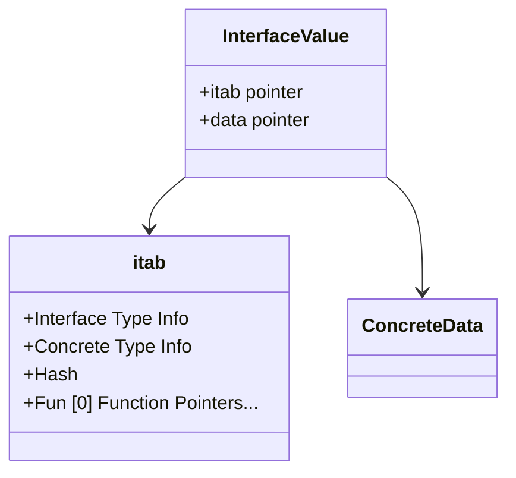

# Week 06: Polymorphism, Interfaces, and Traits - A Systems-Level Deep Dive

## Why This Week Matters for Your Career Transition

As a senior C# engineer, your intuition around polymorphism is fundamentally nominal and object-oriented. When you need to abstract behavior, you explicitly declare an `interface` and have classes `implement` it. The .NET runtime automatically handles the vtable (virtual method table) routing at execution time. This model is powerful, familiar, and highly optimized by the CoreCLR. But it also dictates a rigid, top-down architectural design. 

By the end of this week, you will deeply understand that C#'s approach is just one point on a complex trade-off matrix. You will see how Go flips this model entirely on its head with structural typing—allowing abstraction *after* the fact without the implementer ever knowing about the interface. You will dissect the exact memory layout of Go's `runtime.iface` and understand why putting a value type into an interface forces a heap allocation. 

More importantly, you will conquer Rust's dual-model approach. You will learn how Rust achieves zero-cost abstractions through *monomorphization* (static dispatch), duplicating code at compile-time to eliminate virtual call overhead completely. You will also master Rust's *Trait Objects* (dynamic dispatch), precisely understanding the strict "Object Safety" rules that dictate when dynamic dispatch is even theoretically possible. This knowledge elevates you from a developer who just writes code to an engineer who architects memory-efficient, CPU-cache-friendly, mechanically sympathetic systems.

---

## The Baseline: C# Nominal Polymorphism

In C#, polymorphism is strictly nominal. A type must explicitly state its intention to implement an interface (`class FileLogger : ILogger`). 

### The CoreCLR Mechanics

When you define an interface in C# and instantiate a class that implements it, the runtime creates a specific memory layout. Every reference type instance in .NET has an object header and a MethodTable pointer. The MethodTable contains the vtable—an array of function pointers.

When you cast an object to an interface and invoke a method:
```csharp
ILogger logger = new FileLogger();
logger.Log("System initialized");
```
The CoreCLR executes a virtual call (callvirt in IL):
1. It dereferences the `logger` pointer to find the object's MethodTable.
2. It looks up the interface dispatch map.
3. It resolves the specific slot for the `Log` method.
4. It jumps to the memory address of `FileLogger.Log`.

This indirection costs a few CPU cycles and can cause CPU pipeline stalls due to unpredictable branching, but it's universally applied.

### Covariance and Contravariance (in / out)

C# allows you to specify variance on interface type parameters:
*   `IEnumerable<out T>` (Covariant): You can use a more derived type. A sequence of `string` can be treated as a sequence of `object`.
*   `IComparer<in T>` (Contravariant): You can use a less derived type. A comparer of `object` can be used to compare `string`s.

This is fundamentally a type-system feature patched over the CLR. It ensures type safety at compile time but doesn't change the underlying vtable dispatch mechanism.

---

## Go: Structural Polymorphism (Duck Typing)

Go takes a radically different approach. Interfaces are satisfied implicitly. If a type implements all the methods defined in an interface, it implements the interface. There is no `implements` keyword.

### The 2-Word Fat Pointer: `runtime.iface` and `runtime.eface`

In Go, an interface value is not just a pointer to the object. It is a two-word (16 bytes on a 64-bit architecture) data structure known as a "fat pointer".



#### 1. `runtime.iface` (Interfaces with Methods)
When an interface has methods (e.g., `io.Reader`), Go uses the `iface` struct:
*   **Word 1: `itab` pointer:** Points to an Interface Table. The `itab` contains metadata about the interface type, the concrete type held inside, and an array of function pointers (the Go equivalent of a vtable) mapped specifically for this concrete type -> interface pairing.
*   **Word 2: `data` pointer:** Points to the actual data (the receiver).

#### 2. `runtime.eface` (The Empty Interface `any`)
When dealing with `interface{}` (or `any` in modern Go), there are no methods to dispatch. Go uses `eface`:
*   **Word 1: `_type` pointer:** Points to the exact type information of the stored value (no method routing needed).
*   **Word 2: `data` pointer:** Points to the actual data.

### Runtime `itab` Construction and Caching

Unlike C#, where vtables are built when the class is loaded, Go's `itab` for a specific interface/concrete type pair might not be known until runtime.
When you assign a concrete type `T` to interface `I`, the Go runtime checks if an `itab` for `(I, T)` exists in a global hash table. If not, it constructs it on the fly by finding the intersection of `I`'s methods and `T`'s methods, and then caches it. This makes the *first* assignment slightly slower, but subsequent assignments are O(1).

### The Allocation Trap

What happens when you put a value type (like an `int` or a custom `struct`) into an interface?
```go
type Counter int
func (c Counter) Increment() {}
var i MyInterface = Counter(5)
```
The `data` pointer in the interface *must* point to a memory location. If `Counter` was just on the stack or in a register, Go cannot simply point to it, because the interface value might escape or outlive the stack frame. 
**Rule:** Assigning a non-pointer value to an interface in Go almost always causes a heap allocation. The runtime allocates memory for a copy of the value and points the interface's `data` word to the heap.

---

## Rust Traits: Zero-Cost Abstractions vs. Trait Objects

Rust offers the absolute highest degree of control, splitting polymorphism into two distinct mechanisms: Static Dispatch and Dynamic Dispatch.

### 1. Monomorphization (Static Dispatch)

This is the default and preferred way to use polymorphism in Rust.

```rust
trait Notifier {
    fn notify(&self, msg: &str);
}

// Generics require the type to implement the Trait
fn send_alert<T: Notifier>(notifier: &T, msg: &str) {
    notifier.notify(msg);
}
```

When you call `send_alert` with an `EmailNotifier` and later with an `SmsNotifier`, the Rust compiler literally copies and pastes the `send_alert` function. It generates two completely separate binary functions: `send_alert_for_email` and `send_alert_for_sms`. 
*   **Pros:** Zero runtime overhead. The compiler knows the exact function being called, meaning it can heavily optimize and **inline** the method call. The CPU doesn't have to follow virtual pointers.
*   **Cons:** Binary bloat. If you call this function with 50 different types, you get 50 copies of the function in your compiled binary.

### 2. Trait Objects (Dynamic Dispatch)

Sometimes you *need* dynamic dispatch. For instance, you want a single `Vec` containing mixed notifier types.

```rust
fn broadcast(notifiers: &Vec<Box<dyn Notifier>>, msg: &str) {
    for n in notifiers {
        n.notify(msg); // Dynamic dispatch!
    }
}
```

The `dyn Trait` keyword opts into dynamic dispatch. Similar to Go, a `&dyn Trait` or `Box<dyn Trait>` is a **Fat Pointer**.
*   **Word 1:** Pointer to the data.
*   **Word 2:** Pointer to the vtable.

Notice the difference from Go: Go interfaces carry the vtable pointer *inside* the `itab`. Rust carries the vtable pointer directly on the fat pointer.

### Object Safety Rules: The Deep Dive

Not all traits can be turned into `dyn Trait` objects. A trait must be "Object Safe". If it violates these rules, the compiler halts.

**Rule 1: The trait cannot use `Self` as a return type (unless constrained).**
```rust
trait Clone {
    fn clone(&self) -> Self; // NOT object safe!
}
```
*Why?* If you have a `Box<dyn Clone>`, and you call `.clone()`, what is the size of the return value? The compiler *must* know the size of everything on the stack. `Self` could be 1 byte or 1000 bytes. With dynamic dispatch, the compiler doesn't know the concrete type at compile time, so it can't reserve stack space.

**Rule 2: The trait cannot have generic type parameters on its methods.**
```rust
trait Processor {
    fn process<T>(&self, data: T); // NOT object safe!
}
```
*Why?* Because generic methods use monomorphization. To build a vtable, the compiler needs a finite, known set of function pointers. A generic method implies an infinite number of possible functions depending on what `T` is used at call sites. You can't put infinity into a vtable.

### Blanket Implementations and The Orphan Rule

Rust traits allow for powerful meta-programming. 
*   **Blanket Impls:** You can implement a trait for *all* types that satisfy another trait.
    `impl<T: Read> MyTrait for T { ... }`
*   **The Orphan Rule:** You can only implement a trait for a type if either the trait OR the type is defined in your current crate. You cannot implement `std::fmt::Display` for `std::vec::Vec` in your own code. This prevents the ecosystem from collapsing due to conflicting trait implementations from different dependencies.

---

## Common Misconceptions to Unlearn

1.  **"Go interfaces are just like C# interfaces."** 
    *False.* Go interfaces are structural, resolved at runtime via `itab` construction, and they are fat pointers. C# interfaces are nominal, embedded in the CoreCLR class loader, and are single pointers.
2.  **"Rust Traits are just Interfaces."**
    *False.* Rust Traits map much closer to Haskell Typeclasses. They are primarily used for static monomorphization. Dynamic dispatch (`dyn`) is a secondary opt-in feature, strictly governed by object safety constraints.
3.  **"Dynamic dispatch is inherently evil/slow in Rust."**
    *False.* While monomorphization is preferred for tight loops, dynamic dispatch is highly optimized and often necessary for heterogeneous collections or deeply nested recursive structures where infinite type recursion would occur otherwise.
4.  **"Value types in Go don't allocate when used as interfaces."**
    *False.* Boxing a value type into an interface almost always forces a heap allocation in Go.

---

## Executive Summary Table

| Feature | C# | Go | Rust |
| :--- | :--- | :--- | :--- |
| **Typing Model** | Nominal (Explicit `implements`) | Structural (Implicit satisfaction) | Nominal (Explicit `impl Trait for Type`) |
| **Default Dispatch** | Dynamic (vtable via MethodTable) | Dynamic (itab construction/lookup) | Static (Monomorphization / Code duplication) |
| **Dynamic Dispatch Opt-in**| N/A (Default) | N/A (Default) | Explicit (`dyn Trait` fat pointers) |
| **Memory Layout** | Single pointer -> Object Header -> vtable | Fat pointer: [itab pointer, data pointer] | Fat pointer: [data pointer, vtable pointer] |
| **Value Type Boxing** | Yes, allocates on heap | Yes, allocates on heap | No boxing for static; `Box<dyn T>` allocates on heap for dynamic. |
| **Generic Method Support**| Yes | Yes (Since Go 1.18) | Yes (Static only), forbidden in `dyn Trait` |
| **Ecosystem Safety** | Handled by CLR namespaces | Handled by package paths | Handled by the strict Orphan Rule |

