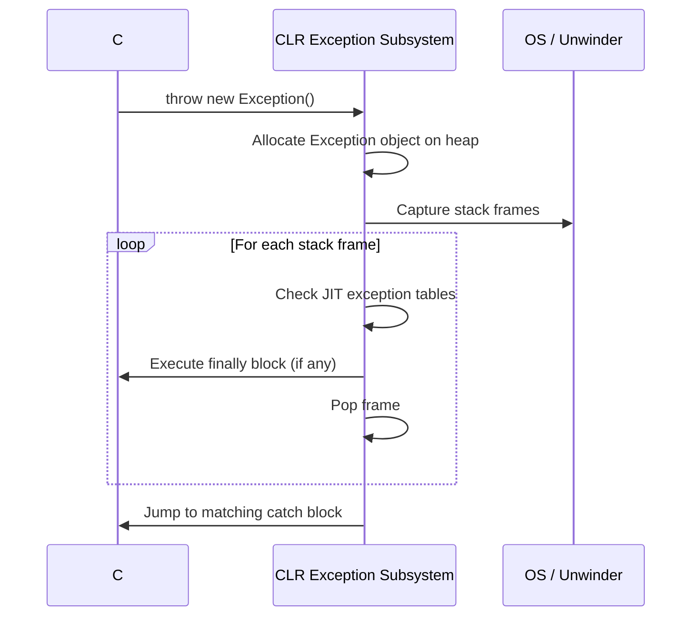

# Week 08: Error Architecture and Fault Tolerance Mechanisms

## Why This Week Matters for Your Career Transition

As a senior C# engineer, you are deeply accustomed to the implicit nature of exceptions. When a method fails in .NET, an exception is thrown, the CLR unwinds the call stack, and control jumps to the nearest matching `catch` block. This out-of-band error signaling has allowed you to write "happy path" code unencumbered by constant error checking. However, it fundamentally obscures the control flow of your application. You cannot tell by looking at a method signature whether it will throw, what it will throw, or if it will return successfully. By the end of this week, you will understand exactly why modern systems languages like Go and Rust abandoned this model in favor of explicit, type-checked errors. You will see how the OS-level mechanics of stack unwinding make exceptions heavily penalizing to performance when thrown, why Go forces you to treat errors as ordinary values, and how Rust achieves the best of both worlds with monadic `Result` types that enforce exhaustive handling at compile time without polluting the happy-path logic. Understanding these mechanical differences is the key to writing fault-tolerant systems in Go and Rust that do not crash unpredictably in production.

## The C# Baseline: Exceptions, Stack Unwinding, and the OS 

To understand why Go and Rust do what they do, we must first deeply understand what C# is doing.

### The Mechanics of Throwing

When you execute `throw new ArgumentException("Invalid");` in C#, it is not merely returning a value. It is initiating a complex runtime and operating system-level process. 

1. **Object Allocation:** The CLR must allocate an `Exception` object on the heap, which includes capturing the current execution context, thread ID, and initializing string properties.
2. **Stack Trace Capture:** The CLR captures the stack trace. It walks the call stack (using OS APIs or its own internal stack frame records) to build the `StackTrace` string, translating raw instruction pointers to method names and line numbers via PDB files. This is extremely expensive.
3. **Exception Table Lookup:** The runtime looks up the exception handling tables generated by the JIT compiler. Every method has metadata mapping instruction ranges to their corresponding `catch` and `finally` blocks.
4. **Stack Unwinding:** If the current method does not handle the exception, the runtime must "unwind" the stack. It executes any `finally` blocks in the current frame, pops the frame, restores the registers of the calling frame, and repeats the process until a matching `catch` block is found. In Windows, this is historically tied to SEH (Structured Exception Handling); in Linux/Unix, it often relies on DWARF exception frames.

### Performance: Zero-Cost Until Thrown

Modern exception handling (like in .NET) is designed to have "zero cost" when exceptions are *not* thrown. The compiler generates tables mapping IP (Instruction Pointer) ranges to handlers. Normal execution flows straight through without executing any special setup/teardown code for `try` blocks (unlike older setjmp/longjmp models). 

However, when an exception *is* thrown, the cost is devastating compared to normal control flow. Benchmarks consistently show that while returning an integer error code takes less than a nanosecond, throwing and catching an exception can take several microseconds (thousands of times slower). This is why using exceptions for control flow (e.g., throwing a `ValidationException` when user input is invalid) is a severe anti-pattern in high-throughput C# systems. 



## Go: Errors as Values

Go fundamentally rejects the concept of exceptions. Rob Pike, one of Go's creators, argued that exception handling encourages developers to ignore errors, pushing the responsibility up the stack until the application inevitably crashes. Go's philosophy is simple: **Errors are just values.**

### The `error` Interface

In Go, an error is any type that implements the built-in `error` interface:

```go
type error interface {
    Error() string
}
```

Because Go supports multiple return values, operations that can fail conventionally return the result and an `error`. 

### The Cost of Explicitness

This leads to the famous Go idiom that C# developers initially loathe:

```go
f, err := os.Open("file.txt")
if err != nil {
    return fmt.Errorf("failed to open file: %w", err)
}
```

Why force the developer to write this explicitly? Because it forces *local reasoning*. You can look at any Go function and know exactly where it can fail and what it does when it fails. The control flow is 100% visible in the code. There are no hidden GOTOs leaping up the call stack.

### Sentinel Errors vs. Custom Errors vs. Wrapping

Go has evolved its error handling mechanics:

1. **Sentinel Errors:** Package-level variables like `io.EOF` or `sql.ErrNoRows`. You check them using equality: `if err == sql.ErrNoRows`. This creates strong coupling to the specific implementation.
2. **Custom Error Structs:** Structs that implement `error` to carry extra data (e.g., a `os.PathError`). 
3. **Error Wrapping (Go 1.13+):** You can wrap an error with context using `fmt.Errorf("context: %w", err)`. This preserves the original error while adding a prefix. 

To unwrap and inspect these errors, Go provides `errors.Is` (for comparing against sentinel errors in a chain) and `errors.As` (for extracting a specific custom error type from the chain).

```go
// Checking if the error chain contains a specific sentinel error
if errors.Is(err, sql.ErrNoRows) {
    // handle not found
}

// Extracting a custom error struct to read its fields
var pathErr *fs.PathError
if errors.As(err, &pathErr) {
    fmt.Println("Failed path:", pathErr.Path)
}
```

The performance profile of Go errors is vastly different from C#. Creating an error is just allocating a small struct (often a single string pointer). Returning it is just pushing a pointer onto the stack. There is no stack unwinding, no reflection, and no heavy OS involvement. 

## Rust: Monadic Errors and Compile-Time Exhaustiveness

Rust takes the explicitness of Go and marries it to the strictness of ML-family type systems. Like Go, Rust rejects exceptions. Like Go, Rust returns errors as values. But unlike Go, Rust encodes the possibility of failure directly into the type signature using algebraic data types (Enums), specifically `Result<T, E>`.

### The `Result` Enum

In Rust, `Result` is defined as:

```rust
pub enum Result<T, E> {
    Ok(T),
    Err(E),
}
```

You cannot "forget" to check an error in Rust. Because a function returns a `Result<File, io::Error>`, you do not have a `File`. You have a wrapper that *might* contain a file or *might* contain an error. You must explicitly unwrap it (which the compiler forces you to do) before you can use the file.

### The `?` Operator: Ergonomics Meets Explicitness

To avoid the verbose `if err != nil` boilerplate of Go, Rust provides the `?` operator. 

```rust
let mut f = File::open("file.txt")?;
```

What does `?` actually do? It desugars at compile time into a `match` expression. If the result is `Ok(val)`, it unwraps `val` and assigns it. If it is `Err(e)`, it immediately returns from the current function with `Err(e.into())`. 

This is brilliant for several reasons:
1. It is extremely terse.
2. It explicitly marks failure points in the code (every `?` is a potential early return).
3. Under the hood, it compiles to a simple conditional jump in assembly. It is as fast as Go's `if err != nil`, with zero overhead compared to C# exceptions.

### `thiserror` vs `anyhow`

Rust's ecosystem has standardized on two primary error handling crates to solve different problems:

1. **`thiserror`:** Used for libraries and core domain logic. It provides macros to generate the necessary boilerplate to implement the standard `std::error::Error` trait for your custom enums. It allows you to define exact, strongly-typed variants for every possible failure.
2. **`anyhow`:** Used for applications and executables. It provides an `anyhow::Result<T>` that can hold *any* error type, and an `anyhow::Context` trait that allows you to easily attach string context to errors as they propagate up, similar to Go's `fmt.Errorf("%w")`.

### Railway-Oriented Programming (ROP)

Because `Result` and `Option` are monads, Rust supports functional chaining of operations. You can pipeline transformations using methods like `and_then`, `map`, `map_err`, and `or_else`.

```rust
// A chain of operations that short-circuits on the first error
let final_value = get_user(id)
    .and_then(|user| get_account(user.account_id))
    .and_then(|acc| acc.balance())
    .map_err(|e| CustomError::DatabaseFailure(e.to_string()))?;
```

This keeps the "happy path" highly readable, without relying on invisible stack unwinding.

## Common Misconceptions to Unlearn

### 1. "Go's error checking makes code unreadable."
**Reality:** You are used to reading vertically dense logic without interruptions. Go forces you to read the error paths as first-class citizens of the business logic. It feels verbose initially, but when debugging a production outage, you will be immensely grateful that the exact point of failure and its contextual data are explicitly mapped in the code.

### 2. "Rust's `panic!` is just an exception."
**Reality:** While `panic!` does unwind the stack (by default), it is strictly for *unrecoverable bugs* (e.g., out-of-bounds indexing, logic assertions), not expected operational errors. You cannot easily `catch` a panic in standard Rust flow (though `catch_unwind` exists, it is frowned upon). You must use `Result` for anything you expect to recover from or report to a user.

### 3. "Returning errors is slower than exceptions because you have to check them constantly."
**Reality:** CPU branch predictors are exceptionally good at predicting that the `if err != nil` or `Result::Ok` branch will be taken (the happy path). The cost of a predicted branch is practically zero (often less than a cycle). The cost of throwing an exception in .NET is thousands of cycles. 

## Summary Comparison

| Feature | C# (.NET) | Go | Rust |
| :--- | :--- | :--- | :--- |
| **Primary Error Model** | Exceptions (Out-of-band) | Multiple Return Values (`error`) | Algebraic Enums (`Result<T, E>`) |
| **Type Safety** | None (Any exception can be thrown anywhere, unchecked) | Convention-based (Type assertions needed to extract specific errors) | Strict Compile-Time (Error types are part of the function signature) |
| **Performance (Happy Path)** | Zero-cost (no instructions executed for try blocks) | Near-zero (Branch prediction handles the check) | Near-zero (Branch prediction handles the check) |
| **Performance (Error Path)** | Devastating (Microseconds: Heap allocation, stack walking, DWARF tables) | Extremely Fast (Nanoseconds: Returning a pointer) | Extremely Fast (Nanoseconds: Returning an enum variant) |
| **Control Flow Visibility** | Invisible (Functions can abort at any time) | Explicit (`if err != nil` everywhere) | Explicit (`?` operator marks early returns) |
| **Chaining & Context** | `InnerException`, `ExceptionDispatchInfo` | `fmt.Errorf("%w")`, `errors.Is`/`As` | `thiserror` (Enums), `anyhow` (Dynamic context) |

## Conclusion

Transitioning from C# to Go or Rust requires a fundamental shift in how you view failures. They are no longer catastrophic events that halt execution; they are expected data values returned by functions. By forcing you to handle errors explicitly, Go and Rust prevent the pervasive bugs that arise in C# when an unhandled exception unexpectedly rips through layers of application state, leaving data corrupted or locks held. Master these mechanics, and your system reliability will soar.
