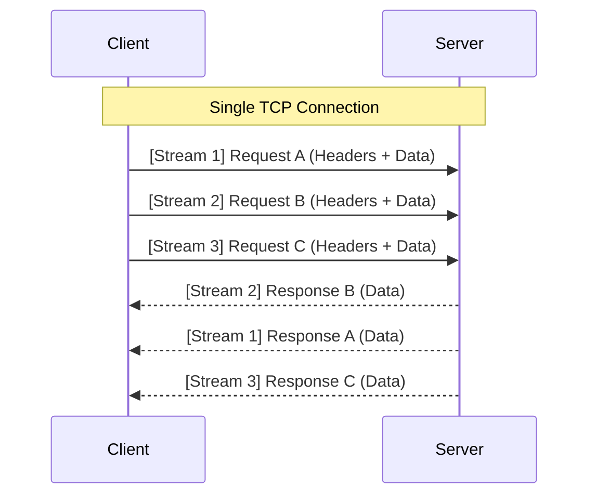

# Week 21: Conceptual Deep Dive - gRPC, Protobuf, and RPC

## Why This Week Matters for Your Career Transition
For a C# developer, building distributed systems usually means one of two things: REST (ASP.NET Core Web API over HTTP/1.1 with JSON) or Messaging (MassTransit/RabbitMQ). While HTTP+JSON is ubiquitous, it is incredibly inefficient. JSON is a text-based, schema-less format that requires string parsing on every hop. HTTP/1.1 requires head-of-line blocking. 
As you move into polyglot microservices (where Go and Rust thrive), you will encounter gRPC. By the end of this week, you will understand why gRPC over HTTP/2 with Protocol Buffers (Protobuf) is the industry standard for internal service-to-service communication. You will understand how Protobuf's binary varint encoding radically reduces payload size, how HTTP/2 multiplexing eliminates head-of-line blocking, and how to design APIs that maintain backward compatibility through strict field tagging.

## Protocol Buffers (Protobuf): The Wire Format

When you send JSON, you send keys and values: `{"user_id": 12345}`. This takes 18 bytes.
When you send Protobuf, you send tags and varints. 

### Varint Encoding and Field Tags
Protobuf uses a binary wire format based on *Base-128 Varints* (variable-length integers). Small numbers take 1 byte; large numbers take up to 10 bytes. 
Instead of sending the string key `"user_id"`, Protobuf relies on the `.proto` schema file shared by the client and server. The schema assigns a numeric tag to the field: `int32 user_id = 1;`.
On the wire, Protobuf sends the tag `1`, the wire type (indicating it's a varint), and the binary representation of `12345`. This takes roughly 2-3 bytes total. 

### Backward Compatibility Rules
Because there are no strings on the wire, you can rename fields freely in your `.proto` file without breaking clients! However, you must obey the golden rules of Protobuf evolution:
1. **Never change the numeric tag of an existing field.** The tag *is* the identity of the field on the wire.
2. **Never change the type of a field** (with a few exceptions like `int32` to `int64`).
3. **Never reuse a tag number.** If you delete a field, reserve its tag using the `reserved` keyword (`reserved 2, 3;`) so future developers don't accidentally reuse it, which would cause older clients to misinterpret the new data.

### Size Comparison: JSON vs Protobuf
Consider a standard e-commerce payload (User info, cart items, timestamps).
| Format | Payload Size | Serialization Time | Deserialization Time |
| :--- | :--- | :--- | :--- |
| JSON (Minified) | 1,450 bytes | ~120 µs | ~180 µs |
| Protobuf | 340 bytes (76% less) | ~15 µs (8x faster) | ~20 µs (9x faster) |
*(Metrics approximate, based on standard e-commerce benchmark)*

## HTTP/2 and Multiplexing

gRPC strictly requires HTTP/2. Why? 
In HTTP/1.1, if a client wants to send 5 requests, it must either open 5 TCP connections (expensive) or send them sequentially on one connection (head-of-line blocking—if request 1 is slow, requests 2-5 wait).

HTTP/2 solves this with **Streams and Multiplexing**.

Notice how the server responded to Stream 2 *before* Stream 1. This interleaving of binary frames on a single persistent TCP connection makes gRPC blazingly fast and extremely resource-efficient.

## The 4 gRPC RPC Types

Because gRPC is built on HTTP/2 streams, it supports four distinct communication patterns out of the box. You define these in your `.proto` file.

1. **Unary RPC:** The classic Request/Response. 
   * *Use case:* `GetProduct(ProductID) returns (Product)`. Standard database queries.
2. **Server Streaming RPC:** Client sends one request, Server sends multiple responses over time. 
   * *Use case:* `SubscribeToPrices(StockTicker) returns (stream PriceUpdate)`. Live price tickers.
3. **Client Streaming RPC:** Client sends multiple requests, Server responds once when the client is done. 
   * *Use case:* `UploadFile(stream FileChunk) returns (UploadSummary)`. Large file uploads.
4. **Bidirectional Streaming RPC:** Both sides send a stream of messages independently. 
   * *Use case:* `Chat(stream ChatMessage) returns (stream ChatMessage)`. Real-time multiplayer game state or chat apps.

## Service Reflection and Tooling

A major complaint about gRPC is "I can't just `curl` it or look at it in Postman like JSON." 
Actually, you can, using **gRPC Server Reflection**. By enabling reflection in your C#, Go, or Rust server, the server will expose its own `.proto` schema to tooling at runtime. Tools like `grpcurl` or Postman can then dynamically inspect the server and allow you to construct requests as if it were a JSON REST API.

## Summary

gRPC forces you into a contract-first mindset. You write the `.proto` file, and the build tools generate the C#, Go, and Rust models and network stubs for you. This eliminates entire classes of bugs (typos in JSON keys, type mismatches) and provides a vastly superior runtime performance profile.
